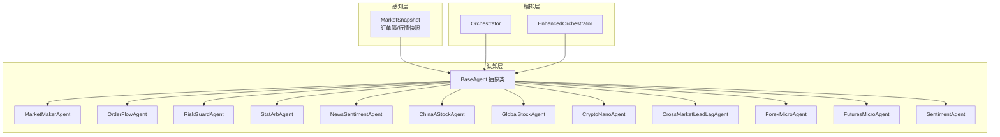
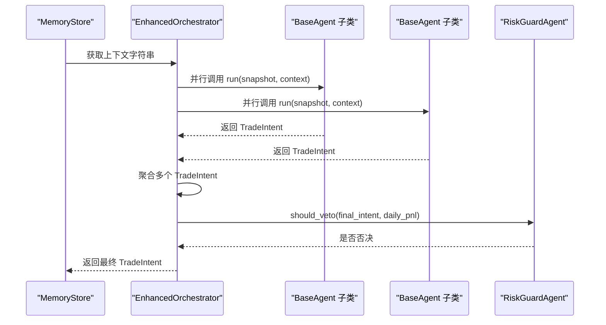
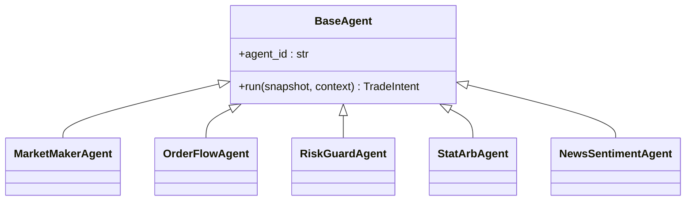
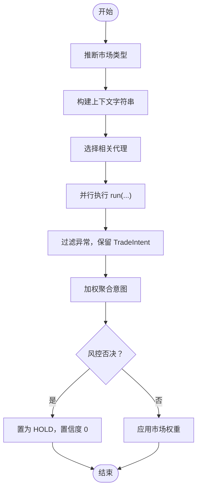
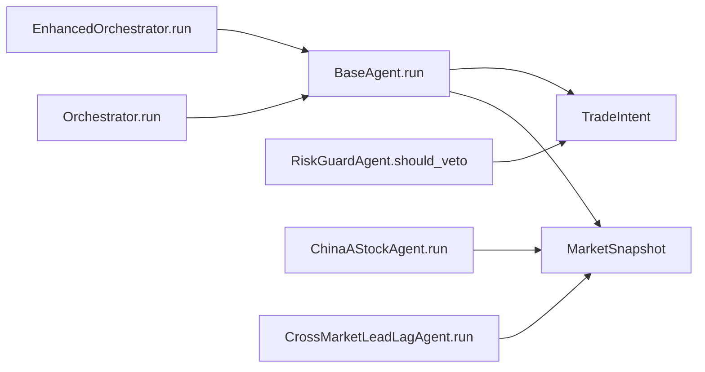

# 基础代理类

<cite>
**本文引用的文件列表**
- [agents.py](file://src/aetherlife/cognition/agents.py)
- [schemas.py](file://src/aetherlife/cognition/schemas.py)
- [models.py](file://src/aetherlife/perception/models.py)
- [orchestrator.py](file://src/aetherlife/cognition/orchestrator.py)
- [orchestrator_enhanced.py](file://src/aetherlife/cognition/orchestrator_enhanced.py)
- [agent_specialized.py](file://src/aetherlife/cognition/agent_specialized.py)
- [agent_cross_market.py](file://src/aetherlife/cognition/agent_cross_market.py)
- [cognition_multi_agent_demo.py](file://scripts/cognition_multi_agent_demo.py)
</cite>

## 目录
1. [简介](#简介)
2. [项目结构](#项目结构)
3. [核心组件](#核心组件)
4. [架构总览](#架构总览)
5. [详细组件分析](#详细组件分析)
6. [依赖关系分析](#依赖关系分析)
7. [性能考量](#性能考量)
8. [故障排查指南](#故障排查指南)
9. [结论](#结论)
10. [附录](#附录)

## 简介
本文围绕 BaseAgent 基础抽象类展开，系统阐述其设计理念、接口规范、继承模式与运行机制，并结合实际实现示例，帮助读者快速理解如何基于 BaseAgent 构建自定义代理。重点覆盖：
- run 方法的参数与返回值语义（MarketSnapshot 市场快照、context 上下文、TradeIntent 交易意图）
- 代理 ID 管理与多代理协同
- 异步调用模式与错误处理
- 多市场专业化代理的实现范式

## 项目结构
BaseAgent 位于认知层，是所有具体代理的抽象基类，配合感知层的数据模型与编排器进行多代理协作决策。

图表来源
- [agents.py](file://src/aetherlife/cognition/agents.py#L13-L22)
- [orchestrator.py](file://src/aetherlife/cognition/orchestrator.py#L16-L53)
- [orchestrator_enhanced.py](file://src/aetherlife/cognition/orchestrator_enhanced.py#L21-L83)

章节来源
- [agents.py](file://src/aetherlife/cognition/agents.py#L1-L109)
- [orchestrator.py](file://src/aetherlife/cognition/orchestrator.py#L1-L93)
- [orchestrator_enhanced.py](file://src/aetherlife/cognition/orchestrator_enhanced.py#L1-L323)

## 核心组件
- BaseAgent 抽象类：定义统一的异步 run 接口，要求子类实现“根据市场快照与上下文生成交易意图”的能力。
- TradeIntent 交易意图：标准化的输出结构，包含动作、市场、符号、仓位比例、置信度、风控参数、时效性与元数据等。
- MarketSnapshot 市场快照：感知层提供的统一数据载体，包含订单簿、最新价、K线等。
- 编排器 Orchestrator/EnhancedOrchestrator：负责并行调度多个 BaseAgent，聚合决策并应用风控否决。

章节来源
- [agents.py](file://src/aetherlife/cognition/agents.py#L13-L22)
- [schemas.py](file://src/aetherlife/cognition/schemas.py#L32-L58)
- [models.py](file://src/aetherlife/perception/models.py#L54-L64)
- [orchestrator.py](file://src/aetherlife/cognition/orchestrator.py#L38-L53)
- [orchestrator_enhanced.py](file://src/aetherlife/cognition/orchestrator_enhanced.py#L84-L151)

## 架构总览
BaseAgent 采用“抽象 + 多实现”的分层设计，通过 run 接口解耦策略实现与编排逻辑。编排器负责：
- 将 MemoryStore 的上下文字符串传入每个代理
- 并行执行多个代理的 run
- 聚合多个 TradeIntent，得到最终决策
- 应用风控否决与市场权重

图表来源
- [orchestrator_enhanced.py](file://src/aetherlife/cognition/orchestrator_enhanced.py#L117-L151)
- [orchestrator.py](file://src/aetherlife/cognition/orchestrator.py#L48-L53)

## 详细组件分析

### BaseAgent 抽象类
- 设计理念
  - 统一接口：所有代理共享相同的 run 签名，便于编排器并行调度与聚合。
  - 异步化：run 为异步方法，适配 IO 密集型（如网络请求、模型推理）。
  - 结构化输出：返回 TradeIntent，确保后续流程可解析、可观测、可审计。
- 接口规范
  - 方法签名：async run(snapshot: MarketSnapshot, context: str) -> TradeIntent
  - 参数语义
    - snapshot：市场快照，包含 symbol/exchange/orderbook/last_price 等字段
    - context：短期记忆/上下文字符串，承载外部信息（如情绪、新闻、风控状态等）
  - 返回值：TradeIntent，包含动作、市场、符号、仓位比例、置信度、风控参数、元数据等
- 继承模式
  - 子类需实现 run，通常基于 snapshot 的订单簿与 last_price，结合 context 的业务信息做出决策
  - 子类构造函数中设置 agent_id，作为唯一标识，用于权重管理与日志追踪

图表来源
- [agents.py](file://src/aetherlife/cognition/agents.py#L13-L109)

章节来源
- [agents.py](file://src/aetherlife/cognition/agents.py#L13-L22)

### MarketSnapshot 市场快照
- 字段要点
  - symbol/exchange：标的与交易所
  - orderbook：订单簿切片（包含 bids/asks/mid_price/spread_bps）
  - last_price：最新价格
  - ticker_24h：24小时统计（涨跌幅、成交量等）
  - candles_1m：近 K 线
  - timestamp：采集时间
- 用途
  - 作为 run 的输入，驱动代理的决策逻辑（如订单流、价差、趋势）

章节来源
- [models.py](file://src/aetherlife/perception/models.py#L54-L64)

### TradeIntent 交易意图
- 字段与约束
  - action：HOLD/BUY/SELL/CLOSE
  - market：CRYPTO/A_STOCK/US_STOCK/HK_STOCK/FOREX/FUTURES 等
  - symbol：交易标的
  - quantity_pct：仓位比例，范围 0~1
  - reason：决策理由
  - confidence：置信度，范围 0~1
  - stop_loss_pct/take_profit_pct：风控止盈止损
  - valid_until：有效期
  - order_type/limit_price：下单类型与限价
  - agent_id：来源代理 ID
  - timestamp/metadata：时间戳与附加元数据
- 作用
  - 统一编排器与执行层的输入格式
  - 便于审计与可视化

章节来源
- [schemas.py](file://src/aetherlife/cognition/schemas.py#L32-L58)

### 编排器与并行执行
- Orchestrator
  - 并行执行一组基础代理，聚合为最终 TradeIntent
  - 可选辩论模式（Bull/Bear/Judge），返回裁决
- EnhancedOrchestrator
  - 自动推断市场类型，按市场选择相关代理
  - 并行执行相关代理，过滤异常，聚合有效意图
  - 应用风控否决与市场权重，输出最终 TradeIntent
  - 支持动态调整代理权重与市场权重

图表来源
- [orchestrator_enhanced.py](file://src/aetherlife/cognition/orchestrator_enhanced.py#L84-L151)

章节来源
- [orchestrator.py](file://src/aetherlife/cognition/orchestrator.py#L38-L93)
- [orchestrator_enhanced.py](file://src/aetherlife/cognition/orchestrator_enhanced.py#L84-L151)

### 代理 ID 管理与权重
- 代理 ID
  - 子类在构造函数中设置 agent_id，如 "market_maker"、"order_flow"、"china_astock" 等
  - 编排器通过 agent_id 管理权重与日志
- 权重
  - 编排器维护 weights 与 market_weights，支持动态调整
  - 聚合时按权重加权 quantity_pct 与 confidence

章节来源
- [agents.py](file://src/aetherlife/cognition/agents.py#L25-L109)
- [orchestrator_enhanced.py](file://src/aetherlife/cognition/orchestrator_enhanced.py#L32-L83)
- [orchestrator_enhanced.py](file://src/aetherlife/cognition/orchestrator_enhanced.py#L314-L323)

### 异步调用模式与错误处理
- 异步调用
  - run 为异步方法，编排器使用 asyncio.gather 并行执行
  - 在 EnhancedOrchestrator 中，使用 return_exceptions=True，捕获异常并过滤
- 错误处理
  - 若所有代理执行失败，返回 HOLD 意图，reason 指明“所有 Agent 执行失败”
  - 风控否决：RiskGuardAgent.should_veto 决定是否将最终意图置为 HOLD

章节来源
- [orchestrator_enhanced.py](file://src/aetherlife/cognition/orchestrator_enhanced.py#L117-L134)
- [orchestrator_enhanced.py](file://src/aetherlife/cognition/orchestrator_enhanced.py#L138-L146)
- [agents.py](file://src/aetherlife/cognition/agents.py#L50-L68)

### 具体实现示例

#### 示例一：做市代理（MarketMakerAgent）
- 逻辑要点
  - 基于订单簿的中间价与价差（bps）判断流动性与方向
  - 价差过大则观望，否则根据买卖压力给出少量仓位
- 关键路径
  - run 方法读取 snapshot.orderbook，计算 mid_price 与 spread_bps
  - 返回 TradeIntent，包含 action、quantity_pct、reason、confidence

章节来源
- [agents.py](file://src/aetherlife/cognition/agents.py#L25-L47)

#### 示例二：A股专家代理（ChinaAStockAgent）
- 逻辑要点
  - 交易时段检查、涨跌停检测、北向额度监控
  - 考虑印花税成本对卖出信号的影响
- 关键路径
  - run 中调用内部工具方法，组合基础技术分析与特殊规则
  - 返回 TradeIntent，设置 market=A_STOCK

章节来源
- [agent_specialized.py](file://src/aetherlife/cognition/agent_specialized.py#L17-L83)

#### 示例三：跨市场套利代理（CrossMarketLeadLagAgent）
- 逻辑要点
  - 维护价格历史，检测 BTC 对 A股科技股的领先-滞后关系
  - 基于信号强度调整仓位与置信度
- 关键路径
  - run 中调用 _detect_lead_lag_signals，返回 TradeIntent

章节来源
- [agent_cross_market.py](file://src/aetherlife/cognition/agent_cross_market.py#L16-L65)

#### 示例四：演示脚本（多代理协作）
- 演示内容
  - 展示单个代理 run 的调用
  - 展示编排器并行执行多个代理并聚合
  - 展示动态调整权重后的效果
- 关键路径
  - 使用 asyncio.gather 并行执行
  - Orchestrator/EnhancedOrchestrator.run 聚合与风控

章节来源
- [cognition_multi_agent_demo.py](file://scripts/cognition_multi_agent_demo.py#L35-L118)
- [cognition_multi_agent_demo.py](file://scripts/cognition_multi_agent_demo.py#L120-L195)
- [cognition_multi_agent_demo.py](file://scripts/cognition_multi_agent_demo.py#L197-L236)

## 依赖关系分析

图表来源
- [agents.py](file://src/aetherlife/cognition/agents.py#L19-L22)
- [orchestrator.py](file://src/aetherlife/cognition/orchestrator.py#L38-L53)
- [orchestrator_enhanced.py](file://src/aetherlife/cognition/orchestrator_enhanced.py#L84-L151)
- [agent_specialized.py](file://src/aetherlife/cognition/agent_specialized.py#L36-L83)
- [agent_cross_market.py](file://src/aetherlife/cognition/agent_cross_market.py#L32-L65)

章节来源
- [agents.py](file://src/aetherlife/cognition/agents.py#L1-L109)
- [orchestrator.py](file://src/aetherlife/cognition/orchestrator.py#L1-L93)
- [orchestrator_enhanced.py](file://src/aetherlife/cognition/orchestrator_enhanced.py#L1-L323)
- [agent_specialized.py](file://src/aetherlife/cognition/agent_specialized.py#L1-L352)
- [agent_cross_market.py](file://src/aetherlife/cognition/agent_cross_market.py#L1-L405)

## 性能考量
- 并行执行
  - 编排器使用 asyncio.gather 并行调用多个代理的 run，显著降低端到端延迟
- 聚合算法
  - 加权聚合按 action 分组，加权平均 quantity_pct 与 confidence，避免单一代理主导
- 异常容错
  - return_exceptions=True 过滤异常，保障整体鲁棒性
- 风控前置
  - 风控否决在聚合之后、输出之前执行，避免无效执行

[本节为通用建议，无需列出具体文件来源]

## 故障排查指南
- run 返回异常
  - 现象：EnhancedOrchestrator 聚合阶段出现异常
  - 处理：确认代理内部异常已捕获并返回合法 TradeIntent；检查 snapshot/orderbook 是否为空
- 决策全为 HOLD
  - 现象：最终置为 HOLD，reason 指明“所有 Agent 执行失败”或“无有效决策”
  - 处理：检查代理实现是否正确返回 TradeIntent；确认编排器权重是否过低导致置信度被抑制
- 风控否决
  - 现象：最终置为 HOLD，reason 指明“风控否决”
  - 处理：检查 RiskGuardAgent.should_veto 的阈值与 daily_pnl；适当提高 confidence 或降低仓位
- 权重调整无效
  - 现象：update_agent_weights/update_market_weights 后无变化
  - 处理：确认权重更新发生在 run 之前；检查权重边界（0~2，0~1）

章节来源
- [orchestrator_enhanced.py](file://src/aetherlife/cognition/orchestrator_enhanced.py#L117-L151)
- [agents.py](file://src/aetherlife/cognition/agents.py#L50-L68)

## 结论
BaseAgent 通过统一的异步接口与结构化输出，实现了多代理协作的可扩展架构。结合感知层的 MarketSnapshot 与编排层的并行聚合、风控否决与权重管理，系统能够在多市场环境下稳定地生成可执行的交易意图。开发者只需遵循 run 接口规范，即可快速扩展新的专业化代理。

[本节为总结性内容，无需列出具体文件来源]

## 附录

### BaseAgent 继承最佳实践
- 代理 ID
  - 在构造函数中设置明确的 agent_id，便于日志与权重管理
- run 实现
  - 严格校验 snapshot/orderbook 的可用性，必要时返回 HOLD
  - 明确 reason 与 confidence 的来源与边界
  - 如涉及外部服务（API/模型），注意超时与重试
- 风控集成
  - 不直接发起交易，仅输出 HOLD 或维持原意，交由外部逻辑解释“是否否决”

章节来源
- [agents.py](file://src/aetherlife/cognition/agents.py#L13-L22)
- [agents.py](file://src/aetherlife/cognition/agents.py#L50-L68)