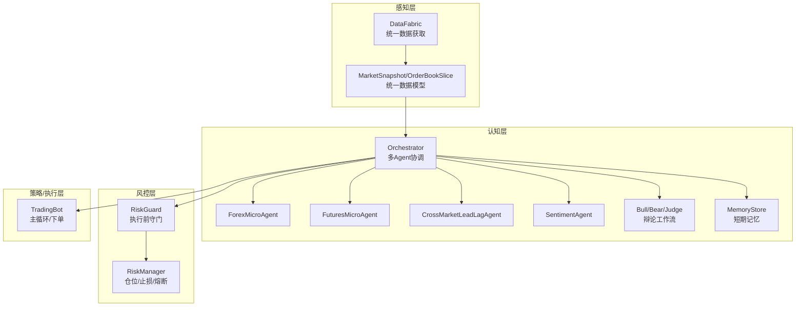
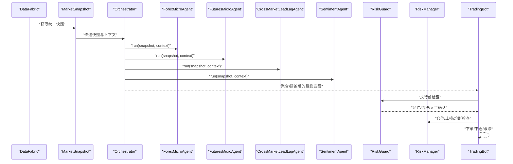
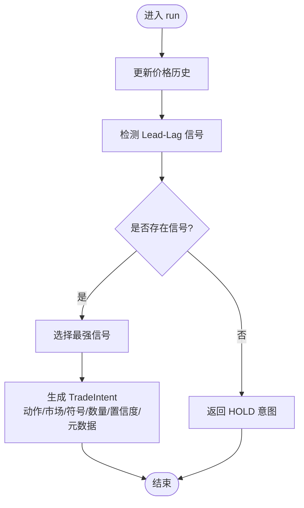
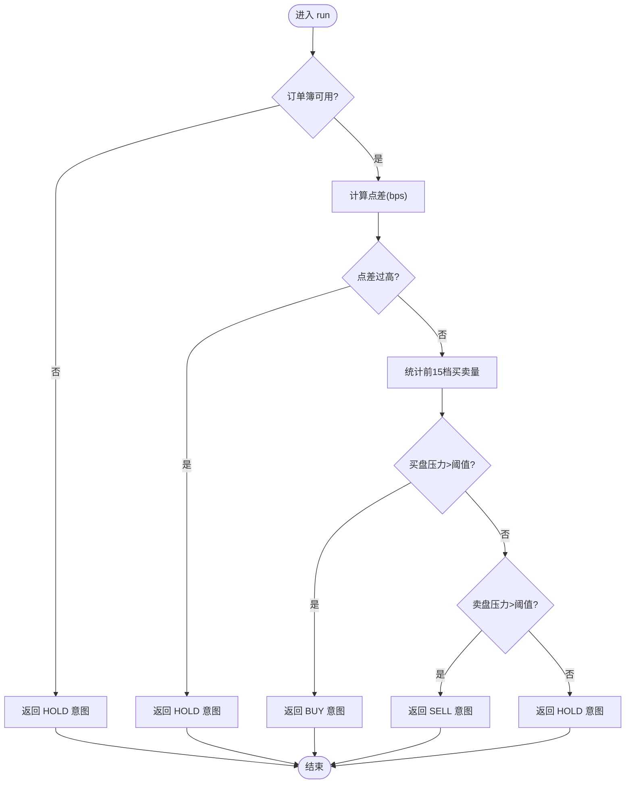
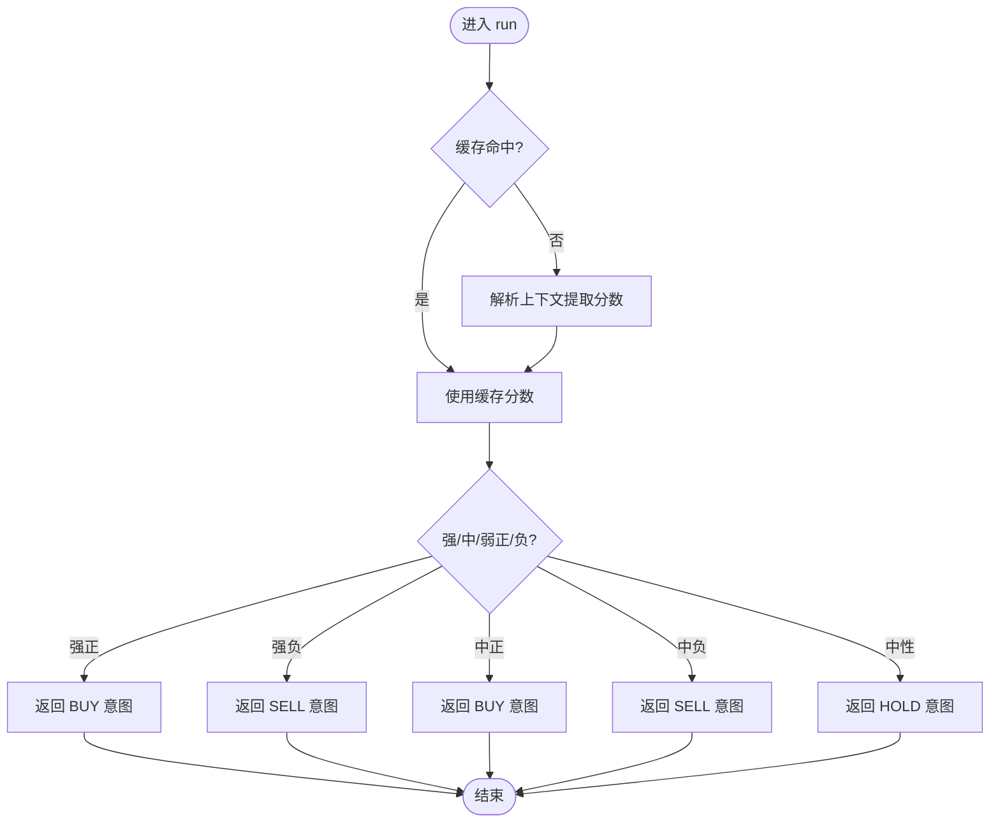
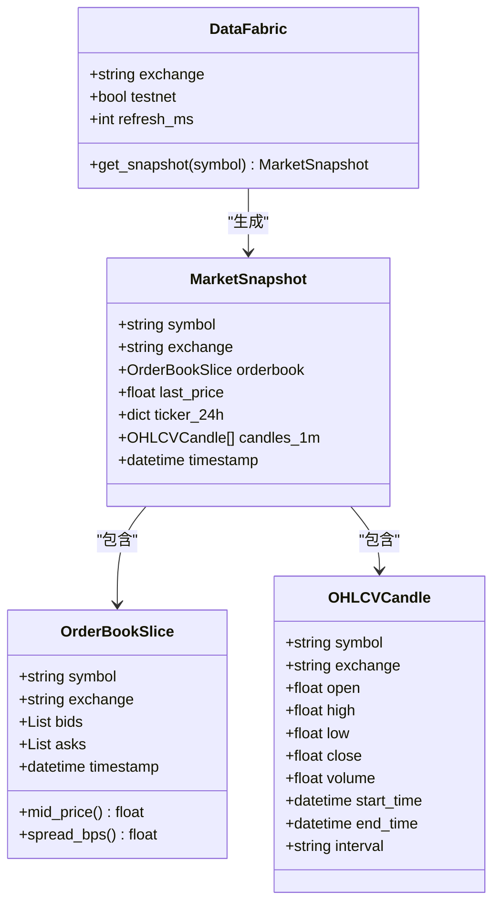
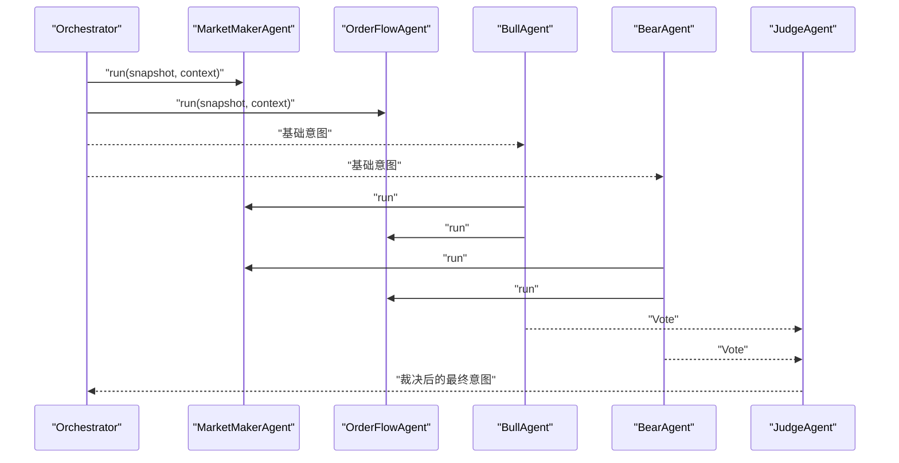
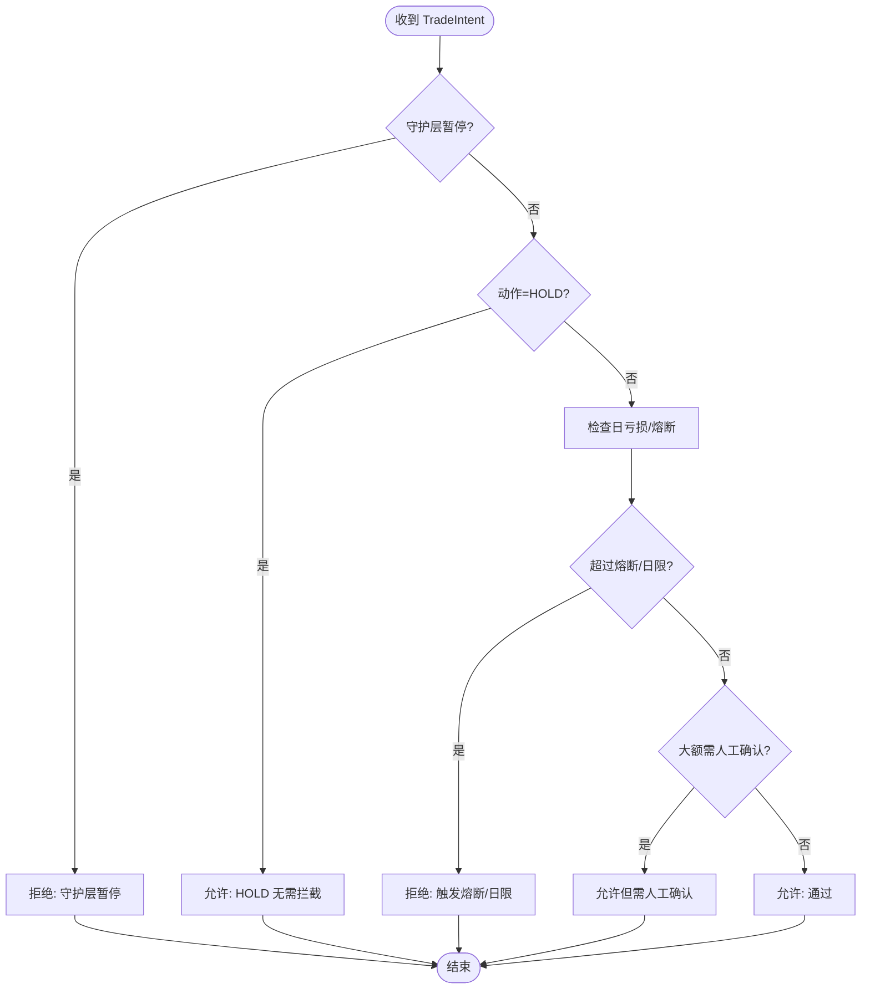
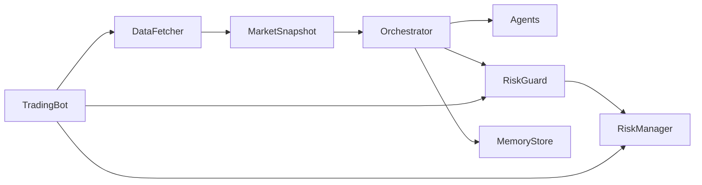

# 跨市场代理

<cite>
**本文引用的文件**
- [src/aetherlife/cognition/agent_cross_market.py](file://src/aetherlife/cognition/agent_cross_market.py)
- [src/aetherlife/cognition/agents.py](file://src/aetherlife/cognition/agents.py)
- [src/aetherlife/cognition/schemas.py](file://src/aetherlife/cognition/schemas.py)
- [src/aetherlife/perception/fabric.py](file://src/aetherlife/perception/fabric.py)
- [src/aetherlife/perception/models.py](file://src/aetherlife/perception/models.py)
- [src/aetherlife/guard/risk_guard.py](file://src/aetherlife/guard/risk_guard.py)
- [src/aetherlife/cognition/orchestrator.py](file://src/aetherlife/cognition/orchestrator.py)
- [src/aetherlife/cognition/debate.py](file://src/aetherlife/cognition/debate.py)
- [src/aetherlife/memory/store.py](file://src/aetherlife/memory/store.py)
- [src/data/data_fetcher.py](file://src/data/data_fetcher.py)
- [src/utils/risk_manager.py](file://src/utils/risk_manager.py)
- [configs/config.json](file://configs/config.json)
- [src/trading_bot.py](file://src/trading_bot.py)
</cite>

## 目录
1. [简介](#简介)
2. [项目结构](#项目结构)
3. [核心组件](#核心组件)
4. [架构总览](#架构总览)
5. [详细组件分析](#详细组件分析)
6. [依赖关系分析](#依赖关系分析)
7. [性能考量](#性能考量)
8. [故障排查指南](#故障排查指南)
9. [结论](#结论)
10. [附录](#附录)

## 简介
本技术文档围绕跨市场代理系统展开，重点解析 AgentCrossMarket 的设计与实现，涵盖多市场数据同步、价差分析算法与套利机会识别机制。文档详细说明 ForexMicroAgent 外汇微观代理、FuturesMicroAgent 期货微观代理与 CrossMarketLeadLagAgent 跨市场领先-滞后代理的具体实现，并阐述多市场数据整合策略、时钟同步机制、价差计算公式与风险对冲方法。最后提供实际套利案例分析与性能评估指标建议。

## 项目结构
系统采用分层架构：感知层负责统一多源数据，认知层负责多 Agent 决策与协调，风控层负责执行前守门与审计，策略与执行层负责下单与仓位管理。跨市场代理位于认知层，结合感知层提供的 MarketSnapshot，输出 TradeIntent。

图表来源
- [src/aetherlife/perception/fabric.py](file://src/aetherlife/perception/fabric.py#L13-L82)
- [src/aetherlife/perception/models.py](file://src/aetherlife/perception/models.py#L15-L64)
- [src/aetherlife/cognition/orchestrator.py](file://src/aetherlife/cognition/orchestrator.py#L16-L93)
- [src/aetherlife/cognition/agent_cross_market.py](file://src/aetherlife/cognition/agent_cross_market.py#L16-L285)
- [src/aetherlife/guard/risk_guard.py](file://src/aetherlife/guard/risk_guard.py#L23-L84)
- [src/utils/risk_manager.py](file://src/utils/risk_manager.py#L12-L388)
- [src/trading_bot.py](file://src/trading_bot.py#L27-L346)

章节来源
- [src/aetherlife/perception/fabric.py](file://src/aetherlife/perception/fabric.py#L13-L82)
- [src/aetherlife/perception/models.py](file://src/aetherlife/perception/models.py#L15-L64)
- [src/aetherlife/cognition/orchestrator.py](file://src/aetherlife/cognition/orchestrator.py#L16-L93)
- [src/aetherlife/cognition/agent_cross_market.py](file://src/aetherlife/cognition/agent_cross_market.py#L16-L285)
- [src/aetherlife/guard/risk_guard.py](file://src/aetherlife/guard/risk_guard.py#L23-L84)
- [src/utils/risk_manager.py](file://src/utils/risk_manager.py#L12-L388)
- [src/trading_bot.py](file://src/trading_bot.py#L27-L346)

## 核心组件
- 跨市场代理集合
  - ForexMicroAgent：基于外汇订单流与点差的微观代理，强调货币对相关性与日内波动捕捉。
  - FuturesMicroAgent：面向微盘合约（如 E-mini、nano），关注展期换月与基差分析。
  - CrossMarketLeadLagAgent：检测跨市场领先-滞后信号，基于历史价格变化与相关性。
  - SentimentAgent：基于文本情绪的宏观辅助决策。
- 统一数据模型
  - MarketSnapshot、OrderBookSlice、OHLCVCandle 提供跨市场的统一视图。
- 协调器与辩论
  - Orchestrator：聚合多个 Agent 决策，支持辩论（Bull/Bear/Judge）。
- 风控与审计
  - RiskGuard：执行前守门与审计日志。
  - RiskManager：仓位管理、止损止盈、熔断与日限。
- 数据获取
  - DataFetcher（Binance/OKX）：统一异步接口，支持轮询与 WebSocket。

章节来源
- [src/aetherlife/cognition/agent_cross_market.py](file://src/aetherlife/cognition/agent_cross_market.py#L16-L285)
- [src/aetherlife/cognition/schemas.py](file://src/aetherlife/cognition/schemas.py#L32-L219)
- [src/aetherlife/cognition/orchestrator.py](file://src/aetherlife/cognition/orchestrator.py#L16-L93)
- [src/aetherlife/cognition/debate.py](file://src/aetherlife/cognition/debate.py#L15-L100)
- [src/aetherlife/guard/risk_guard.py](file://src/aetherlife/guard/risk_guard.py#L23-L84)
- [src/utils/risk_manager.py](file://src/utils/risk_manager.py#L12-L388)
- [src/data/data_fetcher.py](file://src/data/data_fetcher.py#L17-L434)

## 架构总览
跨市场代理系统以“感知-认知-风控-执行”为主线，通过 DataFabric 将多交易所数据统一为 MarketSnapshot，交由 Orchestrator 协调多个 Agent（含跨市场专家）进行决策，RiskGuard 在执行前进行守门与审计，RiskManager 控制仓位与风控阈值，最终由 TradingBot 主循环驱动下单与平仓。

图表来源
- [src/aetherlife/perception/fabric.py](file://src/aetherlife/perception/fabric.py#L32-L82)
- [src/aetherlife/cognition/orchestrator.py](file://src/aetherlife/cognition/orchestrator.py#L38-L53)
- [src/aetherlife/cognition/agent_cross_market.py](file://src/aetherlife/cognition/agent_cross_market.py#L16-L285)
- [src/aetherlife/guard/risk_guard.py](file://src/aetherlife/guard/risk_guard.py#L48-L68)
- [src/utils/risk_manager.py](file://src/utils/risk_manager.py#L175-L194)
- [src/trading_bot.py](file://src/trading_bot.py#L115-L205)

## 详细组件分析

### 跨市场领先-滞后代理（CrossMarketLeadLagAgent）
- 设计目标：捕捉跨市场领先-滞后效应，如 BTC 先动对 A 股科技股的跟随。
- 关键实现
  - 价格历史缓存：维护每个符号的最近 N 个时间戳与价格，用于计算区间价格变化。
  - 信号检测：当 BTC 在 5 分钟内涨跌超过阈值（示例 2%）时，生成跨市场信号，建议方向与强度与涨跌幅成正比。
  - 信号强度归一化：将涨跌幅映射到 0~1，作为仓位比例与置信度的权重因子。
- 决策输出：返回 TradeIntent，包含建议动作、目标市场/符号、数量占比、原因与元数据（来源市场、滞后秒数、相关系数等）。

图表来源
- [src/aetherlife/cognition/agent_cross_market.py](file://src/aetherlife/cognition/agent_cross_market.py#L32-L65)
- [src/aetherlife/cognition/agent_cross_market.py](file://src/aetherlife/cognition/agent_cross_market.py#L67-L110)
- [src/aetherlife/cognition/agent_cross_market.py](file://src/aetherlife/cognition/agent_cross_market.py#L112-L144)

章节来源
- [src/aetherlife/cognition/agent_cross_market.py](file://src/aetherlife/cognition/agent_cross_market.py#L16-L144)

### 外汇微观代理（ForexMicroAgent）
- 设计目标：利用外汇订单流与极小点差的特性，捕捉日内压力与流动性变化。
- 关键实现
  - 订单簿可用性检查：若无订单簿或买卖盘不足，直接 HOLD。
  - 点差阈值控制：bps 超过阈值（示例 10 bps）则 HOLD，规避高摩擦。
  - 订单流压力：比较前 N 档买单/卖单量，若买盘显著大于卖盘或反之，则给出相应动作与固定仓位比例。
- 决策输出：返回 TradeIntent，包含动作、市场、符号、数量占比与原因。

图表来源
- [src/aetherlife/cognition/agent_cross_market.py](file://src/aetherlife/cognition/agent_cross_market.py#L160-L215)

章节来源
- [src/aetherlife/cognition/agent_cross_market.py](file://src/aetherlife/cognition/agent_cross_market.py#L147-L215)

### 期货微观代理（FuturesMicroAgent）
- 设计目标：面向微盘合约（如 E-mini、nano），关注流动性与点差，结合订单流压力给出动作。
- 关键实现
  - 点差阈值更高（示例 25 bps），反映期货市场更高的滑点与手续费。
  - 订单流分析范围更大（前 15 档），提升稳定性。
  - 动作与仓位比例与外汇代理类似，但阈值更严格。
- 决策输出：返回 TradeIntent，包含动作、市场、符号、数量占比与原因。

图表来源
- [src/aetherlife/cognition/agent_cross_market.py](file://src/aetherlife/cognition/agent_cross_market.py#L231-L285)

章节来源
- [src/aetherlife/cognition/agent_cross_market.py](file://src/aetherlife/cognition/agent_cross_market.py#L218-L285)

### 情绪分析代理（SentimentAgent）
- 设计目标：基于文本情绪（Twitter/新闻/社区平台）辅助决策，缓解噪声。
- 关键实现
  - 情绪分数缓存：按符号缓存最近分数，避免重复计算。
  - 解析上下文：从 context 中解析情绪分数（简化实现，实际应调用情绪分析 API）。
  - 决策规则：根据强/中度正/负情绪给出不同动作与数量占比。
- 决策输出：返回 TradeIntent，包含动作、市场、符号、数量占比、置信度与情绪元数据。

图表来源
- [src/aetherlife/cognition/agent_cross_market.py](file://src/aetherlife/cognition/agent_cross_market.py#L288-L374)
- [src/aetherlife/cognition/agent_cross_market.py](file://src/aetherlife/cognition/agent_cross_market.py#L376-L404)

章节来源
- [src/aetherlife/cognition/agent_cross_market.py](file://src/aetherlife/cognition/agent_cross_market.py#L288-L404)

### 统一数据模型与感知层
- 统一数据模型
  - OrderBookSlice：提供 mid_price 与 spread_bps 计算，便于跨市场比较。
  - MarketSnapshot：封装 symbol/exchange/orderbook/last_price/ticker_24h/candles_1m/timestamp。
- DataFabric：并行获取订单簿、ticker 与 K 线，统一为 MarketSnapshot，支持轮询与未来 WebSocket。

图表来源
- [src/aetherlife/perception/models.py](file://src/aetherlife/perception/models.py#L15-L64)
- [src/aetherlife/perception/fabric.py](file://src/aetherlife/perception/fabric.py#L32-L82)

章节来源
- [src/aetherlife/perception/models.py](file://src/aetherlife/perception/models.py#L15-L64)
- [src/aetherlife/perception/fabric.py](file://src/aetherlife/perception/fabric.py#L13-L82)

### 协调器与辩论（Orchestrator 与 Bull/Bear/Judge）
- Orchestrator：并行运行多个 Agent，聚合意图，支持辩论（Bull/Bear 并行，Judge 裁决）。
- Bull/Bear：分别从做多/做空视角解读同一快照，偏向对应方向。
- Judge：根据双方置信度与动作进行裁决，形成最终 TradeIntent。

图表来源
- [src/aetherlife/cognition/orchestrator.py](file://src/aetherlife/cognition/orchestrator.py#L38-L63)
- [src/aetherlife/cognition/debate.py](file://src/aetherlife/cognition/debate.py#L23-L99)

章节来源
- [src/aetherlife/cognition/orchestrator.py](file://src/aetherlife/cognition/orchestrator.py#L16-L93)
- [src/aetherlife/cognition/debate.py](file://src/aetherlife/cognition/debate.py#L15-L100)

### 风控与审计（RiskGuard 与 RiskManager）
- RiskGuard：执行前守门，支持熔断、日限与大额人工确认（HITL）。
- RiskManager：仓位管理、止损止盈、追踪止损、熔断冷却与日限统计。
- MemoryStore：短期记忆（TradeEvent/AgentDecision），提供 LLM 上下文与日盈亏统计。

图表来源
- [src/aetherlife/guard/risk_guard.py](file://src/aetherlife/guard/risk_guard.py#L48-L68)
- [src/utils/risk_manager.py](file://src/utils/risk_manager.py#L129-L153)

章节来源
- [src/aetherlife/guard/risk_guard.py](file://src/aetherlife/guard/risk_guard.py#L23-L84)
- [src/utils/risk_manager.py](file://src/utils/risk_manager.py#L12-L388)
- [src/aetherlife/memory/store.py](file://src/aetherlife/memory/store.py#L140-L145)

## 依赖关系分析
- 组件耦合
  - Agent 依赖感知层的 MarketSnapshot 与上下文字符串。
  - Orchestrator 聚合多个 Agent，RiskGuard 与 RiskManager 作为守门与风控。
  - DataFetcher 为感知层提供统一接口，支持 Binance/OKX。
- 外部依赖
  - 异步 HTTP 会话与 WebSocket（aiohttp）。
  - 可选 Redis（内存持久化短期记忆）。
- 潜在环路
  - 代码层面未见直接循环导入；感知层与认知层通过接口解耦。

图表来源
- [src/data/data_fetcher.py](file://src/data/data_fetcher.py#L17-L71)
- [src/aetherlife/perception/fabric.py](file://src/aetherlife/perception/fabric.py#L23-L27)
- [src/aetherlife/cognition/orchestrator.py](file://src/aetherlife/cognition/orchestrator.py#L19-L36)
- [src/aetherlife/guard/risk_guard.py](file://src/aetherlife/guard/risk_guard.py#L26-L42)
- [src/utils/risk_manager.py](file://src/utils/risk_manager.py#L15-L51)
- [src/trading_bot.py](file://src/trading_bot.py#L63-L91)

章节来源
- [src/data/data_fetcher.py](file://src/data/data_fetcher.py#L17-L71)
- [src/aetherlife/perception/fabric.py](file://src/aetherlife/perception/fabric.py#L13-L82)
- [src/aetherlife/cognition/orchestrator.py](file://src/aetherlife/cognition/orchestrator.py#L16-L93)
- [src/aetherlife/guard/risk_guard.py](file://src/aetherlife/guard/risk_guard.py#L23-L84)
- [src/utils/risk_manager.py](file://src/utils/risk_manager.py#L12-L388)
- [src/trading_bot.py](file://src/trading_bot.py#L27-L91)

## 性能考量
- 数据获取
  - 并行获取订单簿、ticker 与 K 线，降低等待时间。
  - 支持 WebSocket（Binance/OKX）以减少轮询开销。
- 决策聚合
  - 并行运行多个 Agent，缩短决策延迟。
  - 聚合策略可按动作加权平均 quantity_pct 与 confidence。
- 风控前置
  - RiskGuard 在执行前快速过滤高风险意图，避免无效下单。
- 存储与日志
  - MemoryStore 使用双端队列与可选 Redis，兼顾内存速度与持久化需求。
  - RiskGuard 审计日志支持文件与回调，便于离线分析。

## 故障排查指南
- 数据获取异常
  - 检查 DataFetcher 的 API 返回与错误码，确认网络与凭据配置。
  - 若 WebSocket 断开，确认心跳与重连逻辑。
- 订单簿缺失或点差异常
  - 外汇/期货代理对点差敏感，需确认市场流动性与交易所状态。
- 决策被风控否决
  - 检查 RiskGuard 的熔断/日限与 HITL 阈值，必要时临时放宽或人工确认。
- 仓位与止盈止损
  - 使用 RiskManager 的检查函数验证是否触发止损/止盈，核对入场/出场价格与方向。
- 记忆与上下文
  - 检查 MemoryStore 的短期记忆内容，确认 LLM 上下文是否包含关键事件。

章节来源
- [src/data/data_fetcher.py](file://src/data/data_fetcher.py#L95-L100)
- [src/aetherlife/guard/risk_guard.py](file://src/aetherlife/guard/risk_guard.py#L54-L68)
- [src/utils/risk_manager.py](file://src/utils/risk_manager.py#L73-L105)
- [src/aetherlife/memory/store.py](file://src/aetherlife/memory/store.py#L134-L145)

## 结论
跨市场代理系统通过统一的数据模型与多 Agent 决策框架，实现了对外汇、期货与跨市场领先-滞后信号的高效识别与响应。配合风控守门与审计机制，系统在追求收益的同时有效控制风险。未来可在以下方面持续优化：接入实时 WebSocket、引入更复杂的情绪与宏观信号、扩展跨市场价差对与统计套利策略，并完善性能监控与回测体系。

## 附录
- 实际套利案例分析（概念性）
  - BTC → A 股科技股：当 BTC 在 5 分钟内涨跌超过 2%，CrossMarketLeadLagAgent 生成跨市场信号，Forex/Futures Micro Agent 对应市场进行确认，最终由 Orchestrator 聚合决策并经 RiskGuard 审核后执行。
- 性能评估指标建议
  - 收益率与年化波动率、胜率与盈亏比、最大回撤与夏普比率、每笔交易平均持有时间、订单簿深度利用率、风控触发频率与平均延迟。