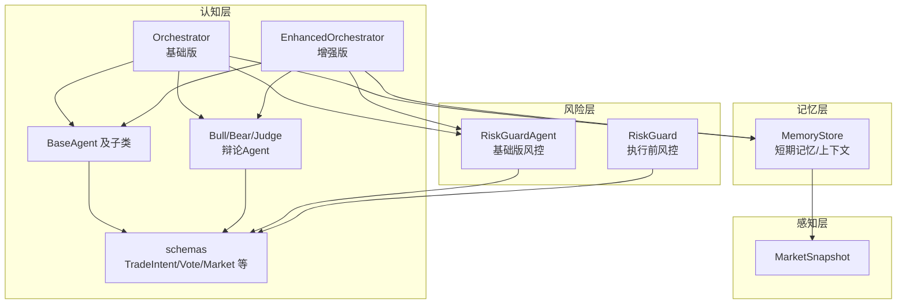
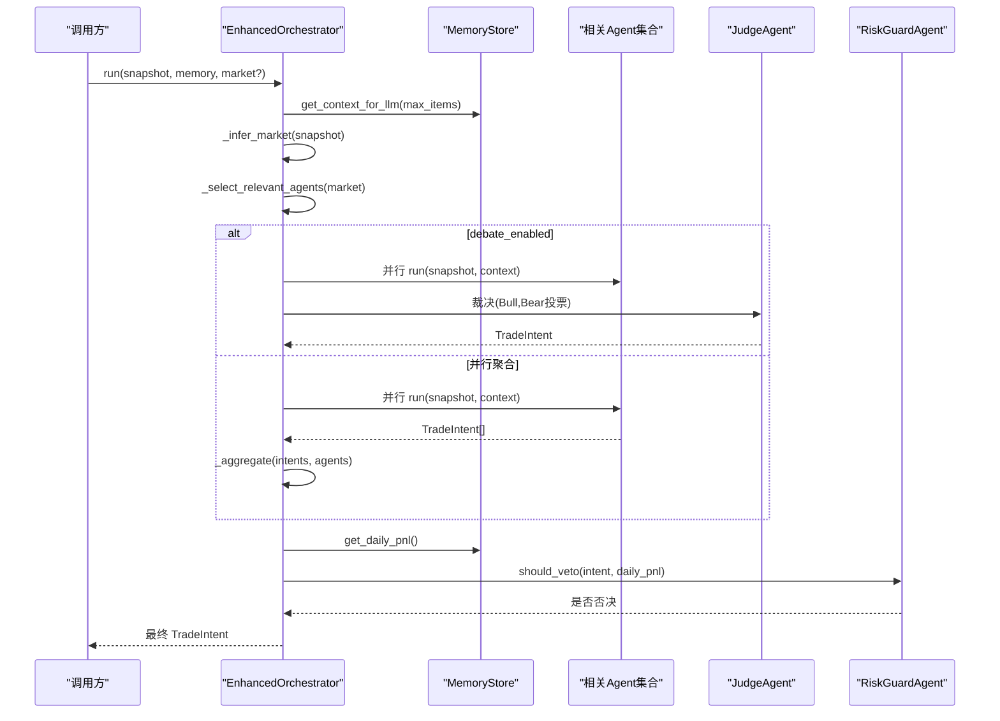
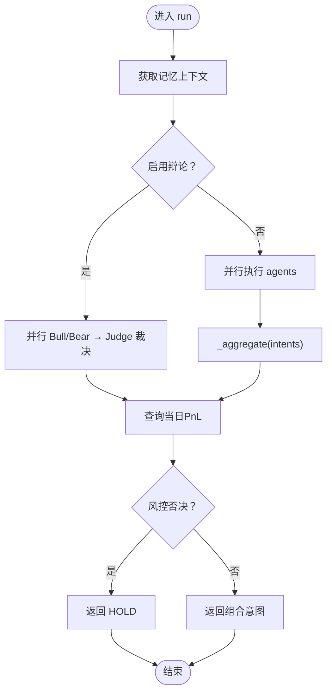
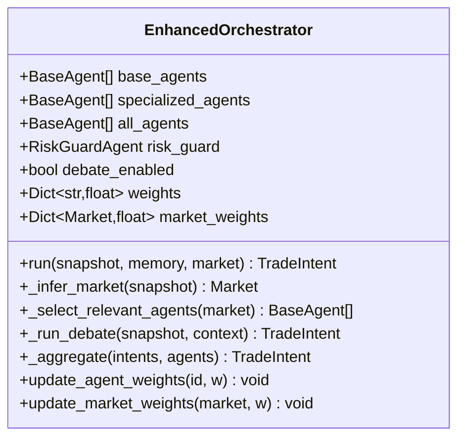
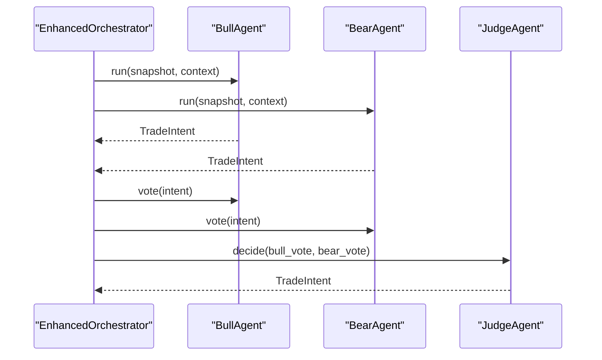
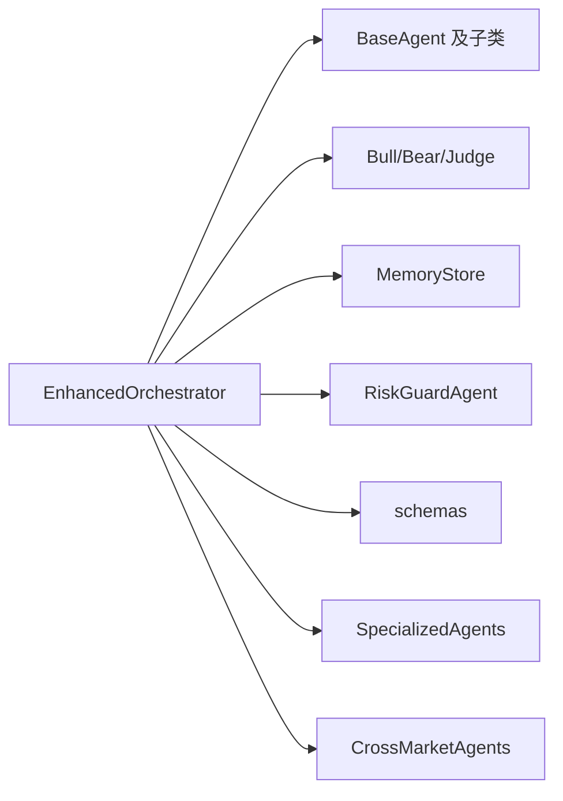

# 协调器 (Orchestrator)

<cite>
**本文引用的文件列表**
- [orchestrator.py](file://src/aetherlife/cognition/orchestrator.py)
- [orchestrator_enhanced.py](file://src/aetherlife/cognition/orchestrator_enhanced.py)
- [agents.py](file://src/aetherlife/cognition/agents.py)
- [debate.py](file://src/aetherlife/cognition/debate.py)
- [schemas.py](file://src/aetherlife/cognition/schemas.py)
- [agent_specialized.py](file://src/aetherlife/cognition/agent_specialized.py)
- [agent_cross_market.py](file://src/aetherlife/cognition/agent_cross_market.py)
- [store.py](file://src/aetherlife/memory/store.py)
- [risk_guard.py](file://src/aetherlife/guard/risk_guard.py)
- [aetherlife.json](file://configs/aetherlife.json)
- [run.py](file://src/aetherlife/run.py)
- [cognition_multi_agent_demo.py](file://scripts/cognition_multi_agent_demo.py)
</cite>

## 更新摘要
**变更内容**
- 新增权重投票机制的详细说明
- 完善辩论式决策过程的实现细节
- 更新增强协调器的功能特性
- 增加动态权重调整机制的文档
- 补充多市场专业化Agent的支持说明

## 目录
1. [简介](#简介)
2. [项目结构](#项目结构)
3. [核心组件](#核心组件)
4. [架构总览](#架构总览)
5. [详细组件分析](#详细组件分析)
6. [依赖关系分析](#依赖关系分析)
7. [性能考量](#性能考量)
8. [故障排查指南](#故障排查指南)
9. [结论](#结论)
10. [附录](#附录)

## 简介
本文件面向AetherLife系统的"协调器"组件，系统性阐述Orchestrator多代理调度机制、决策聚合算法、辩论模式切换、初始化参数与权重配置、风险控制集成、异步执行流程、与记忆存储的交互方式，并给出最佳实践与性能优化建议。文档同时覆盖基础版本与增强版本的差异，帮助读者在不同阶段选择合适的实现。

**更新** 本次更新重点反映了协调器系统增强，支持权重投票机制和辩论式决策过程的核心功能。

## 项目结构
协调器位于认知层，负责组织多个专业Agent进行并行推理，聚合其输出为统一的交易意图，并在必要时启用"多方/空方/法官"辩论模式，最后经风控Agent否决后形成最终决策。记忆存储为Agent提供短期上下文，风险控制贯穿决策链路。

**图表来源**
- [orchestrator.py](file://src/aetherlife/cognition/orchestrator.py#L16-L53)
- [orchestrator_enhanced.py](file://src/aetherlife/cognition/orchestrator_enhanced.py#L21-L151)
- [agents.py](file://src/aetherlife/cognition/agents.py#L13-L109)
- [debate.py](file://src/aetherlife/cognition/debate.py#L15-L100)
- [schemas.py](file://src/aetherlife/cognition/schemas.py#L32-L74)
- [store.py](file://src/aetherlife/memory/store.py#L43-L155)
- [risk_guard.py](file://src/aetherlife/guard/risk_guard.py#L23-L84)

## 核心组件
- **基础协调器**：支持顺序/并行聚合与可选辩论，内置简单加权聚合与风控否决。
- **增强协调器**：支持多市场专业化Agent、自动市场推断、并行执行与异常过滤、动态权重调整、市场权重应用。
- **Agent体系**：通用Agent（做市、订单流、统计套利、新闻情绪）与专业化Agent（A股、全球股票、加密货币nano、跨市场、外汇微、期货微、情绪）。
- **辩论机制**：Bull/Bear并行推理，Judge基于置信度裁决。
- **记忆存储**：短期上下文摘要与当日盈亏查询。
- **风控**：基础版风控否决与执行前风控（电路断路器/日最大亏损/HITL审计）。

**更新** 增强协调器现在支持权重投票机制，通过加权聚合算法实现更精细的决策控制。

## 架构总览
协调器的执行流程分为两条主线：
- **基础模式**：并行执行通用Agent → 加权聚合 → 风控否决。
- **增强模式**：自动推断市场类型 → 选择相关Agent → 并行执行（含异常过滤）→ 加权聚合 → 风控否决 → 市场权重修正。

**图表来源**
- [orchestrator_enhanced.py](file://src/aetherlife/cognition/orchestrator_enhanced.py#L84-L151)
- [debate.py](file://src/aetherlife/cognition/debate.py#L23-L63)
- [agents.py](file://src/aetherlife/cognition/agents.py#L50-L68)
- [store.py](file://src/aetherlife/memory/store.py#L140-L145)

## 详细组件分析

### 基础协调器（Orchestrator）
- **初始化参数**
  - agents：Agent列表，默认包含做市、订单流、统计套利、新闻情绪Agent。
  - debate_enabled：是否启用辩论模式。
  - weights：Agent权重字典，键为agent_id，值为权重。
- **执行流程**
  - 获取记忆上下文。
  - 若启用辩论：并行执行Bull/Bear，Judge基于置信度裁决。
  - 否则：并行执行所有Agent，调用内部聚合函数。
  - 查询当日累计盈亏，经风控Agent判断是否否决。
- **聚合算法**
  - 按动作分组，计算每个动作的加权得分（quantity_pct × confidence × weight），取最高者。
  - 若总分非正，返回持有；否则按最高动作输出，限制最大仓位与置信度上限。

**图表来源**
- [orchestrator.py](file://src/aetherlife/cognition/orchestrator.py#L38-L53)
- [orchestrator.py](file://src/aetherlife/cognition/orchestrator.py#L65-L92)

### 增强协调器（EnhancedOrchestrator）
- **初始化参数**
  - agents：基础Agent列表。
  - debate_enabled：是否启用辩论。
  - weights：所有Agent权重字典。
  - enable_specialized_agents：是否启用多市场专业化Agent。
- **市场推断与选择**
  - 自动推断市场类型（加密、A股、美股、外汇、期货等）。
  - 根据市场类型选择相关Agent集合（通用Agent + 专业化Agent）。
- **并行执行与异常处理**
  - 并行执行相关Agent，过滤异常结果，若全部失败返回持有。
- **聚合算法**
  - 按动作分组，加权平均quantity_pct与confidence，收集理由，限制最大仓位与置信度上限。
- **风控与市场权重**
  - 查询当日PnL，经风控Agent否决。
  - 应用市场权重修正最终置信度。
- **动态权重**
  - update_agent_weights：动态调整Agent权重。
  - update_market_weights：动态调整市场权重。

**图表来源**
- [orchestrator_enhanced.py](file://src/aetherlife/cognition/orchestrator_enhanced.py#L21-L83)
- [orchestrator_enhanced.py](file://src/aetherlife/cognition/orchestrator_enhanced.py#L84-L151)
- [orchestrator_enhanced.py](file://src/aetherlife/cognition/orchestrator_enhanced.py#L153-L187)
- [orchestrator_enhanced.py](file://src/aetherlife/cognition/orchestrator_enhanced.py#L189-L221)
- [orchestrator_enhanced.py](file://src/aetherlife/cognition/orchestrator_enhanced.py#L223-L233)
- [orchestrator_enhanced.py](file://src/aetherlife/cognition/orchestrator_enhanced.py#L235-L312)
- [orchestrator_enhanced.py](file://src/aetherlife/cognition/orchestrator_enhanced.py#L314-L322)

**更新** 增强协调器现在支持权重投票机制，通过加权聚合算法实现更精细的决策控制。

### 辩论模式（Bull/Bear/Judge）
- **Bull/Bear**：基于做市与订单流Agent的输出，偏向某一方向解读，提升相应动作的置信度与仓位。
- **Judge**：比较Bull/Bear的置信度，若显著领先且动作一致，则采纳；否则返回持有。

**图表来源**
- [debate.py](file://src/aetherlife/cognition/debate.py#L23-L63)
- [debate.py](file://src/aetherlife/cognition/debate.py#L77-L99)

**更新** 辩论模式现在采用投票机制，Judge根据两方投票的置信度进行裁决。

### Agent体系与专业化
- **通用Agent**：做市、订单流、统计套利、新闻情绪。
- **专业化Agent**：
  - A股：交易时段、涨跌停、北向额度、印花税等。
  - 全球股票：流动性与买卖压力。
  - 加密货币nano：高频、高灵敏度阈值。
  - 跨市场：Lead-Lag信号、相关性分析。
  - 外汇微：点差敏感、日内波动。
  - 期货微：价差与订单流。
  - 情绪：多源情绪分数。

**更新** 增强协调器现在支持多市场专业化Agent，能够根据市场类型自动选择相关Agent。

### 记忆存储与上下文
- MemoryStore提供短期上下文摘要（get_context_for_llm），用于Agent推理。
- 提供当日累计盈亏查询（get_daily_pnl），用于风控判断。
- 支持Redis持久化（可选）。

### 风险控制集成
- **基础版**：RiskGuardAgent.should_veto在协调器阶段直接否决。
- **执行前**：RiskGuard.check提供电路断路器、日最大亏损、HITL与审计能力。

## 依赖关系分析
- Orchestrator依赖Agent、辩论Agent、MemoryStore、RiskGuardAgent。
- EnhancedOrchestrator在上述基础上，还依赖多市场专业化Agent与更丰富的Market枚举。
- schemas定义了TradeIntent、Vote、Market等核心数据结构，贯穿Agent与协调器。

**图表来源**
- [orchestrator_enhanced.py](file://src/aetherlife/cognition/orchestrator_enhanced.py#L21-L83)
- [schemas.py](file://src/aetherlife/cognition/schemas.py#L32-L74)
- [agent_specialized.py](file://src/aetherlife/cognition/agent_specialized.py#L17-L352)
- [agent_cross_market.py](file://src/aetherlife/cognition/agent_cross_market.py#L16-L405)

## 性能考量
- **并行执行**：使用asyncio.gather并行执行Agent，显著降低延迟。
- **异常过滤**：增强版在并行执行后过滤异常，避免整体失败。
- **权重与限额**：聚合时限制最大仓位与置信度上限，防止过度集中。
- **市场权重**：按市场类型动态调整置信度，适配不同波动环境。
- **记忆上下文长度**：合理设置max_items，平衡上下文丰富度与LLM成本。

**更新** 增强协调器的权重投票机制需要考虑权重计算的性能开销，建议在大规模Agent集合中使用合理的权重缓存策略。

## 故障排查指南
- **所有Agent执行失败**
  - 现象：增强版返回持有，reason包含"所有 Agent 执行失败"。
  - 处理：检查Agent实现、网络与数据源可用性。
- **风控否决**
  - 现象：最终intent为持有，reason为"风控否决"，confidence为0。
  - 处理：检查当日PnL、置信度阈值与风控策略。
- **辩论分歧**
  - 现象：Judge返回持有，reason包含分歧与置信度对比。
  - 处理：调整Bull/Bear权重或阈值，或关闭辩论模式。
- **记忆上下文为空**
  - 现象：get_context_for_llm返回"(无近期事件)"。
  - 处理：确保MemoryStore正确记录事件与决策。

**更新** 如果出现权重投票异常，检查权重配置是否合理，以及Agent权重是否正确传递到聚合算法中。

## 结论
协调器通过"并行推理 + 加权聚合 + 风控否决"的闭环，实现了多Agent协作的稳健决策。增强版进一步引入市场推断、专业化Agent、动态权重与市场权重，提升了在复杂多市场环境下的适应性与鲁棒性。配合记忆存储与风险控制，协调器为AetherLife系统提供了可扩展的认知中枢。

**更新** 本次更新的权重投票机制和辩论式决策过程使协调器具备了更强的决策灵活性和鲁棒性，能够更好地处理复杂的多市场交易环境。

## 附录

### 配置与启动要点
- 配置文件示例展示了启用辩论模式与审计日志路径。
- 启动入口会加载配置并运行AetherLife主循环。

### 使用示例与最佳实践
- 多Agent演示脚本展示了如何实例化增强协调器、注入记忆存储、针对不同市场运行并观察最终决策。
- 权重动态调整演示展示了如何提高情绪分析Agent权重与降低加密货币市场权重，以观察对最终置信度的影响。

**更新** 在使用权重投票机制时，建议：
- 为关键Agent设置更高的权重值
- 根据市场波动性动态调整权重
- 定期监控各Agent的决策质量并相应调整权重
- 在辩论模式下，确保Bull/Bear Agent的权重设置合理，避免过度偏向某一方