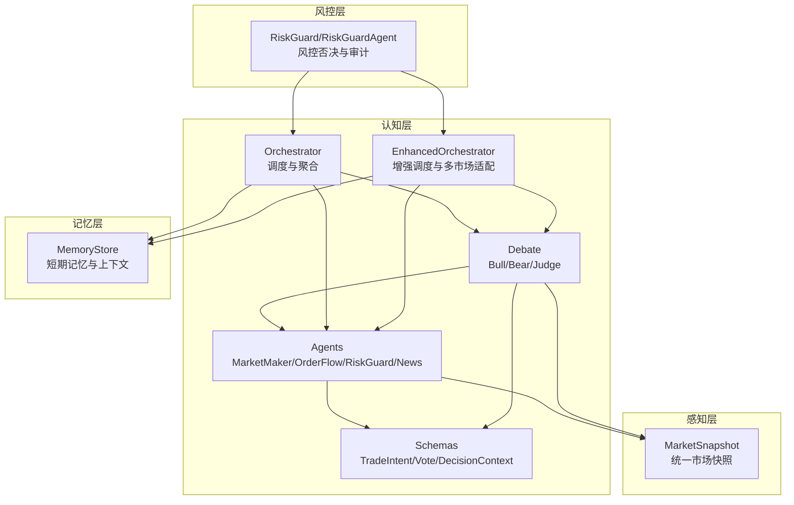
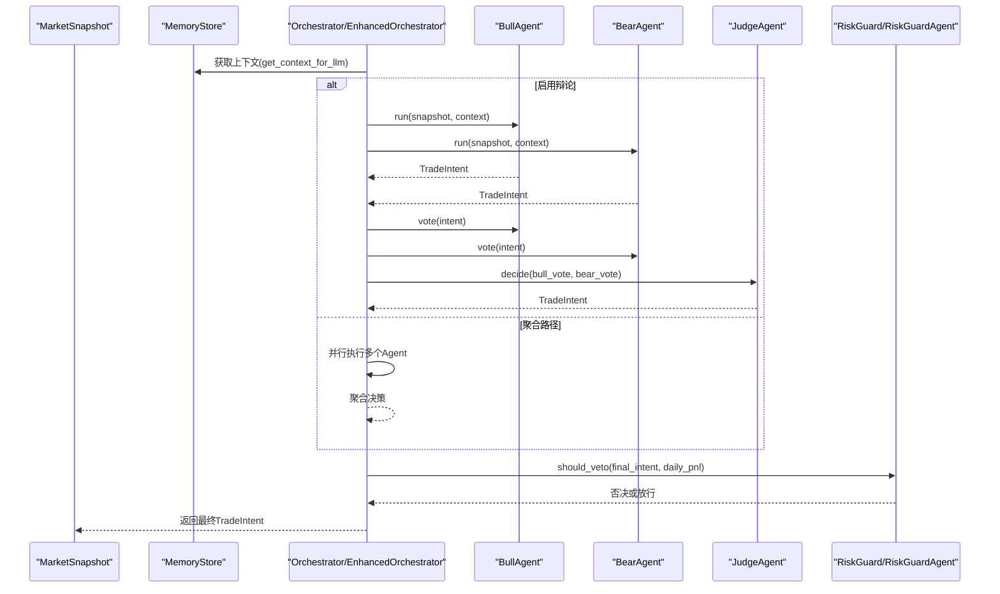
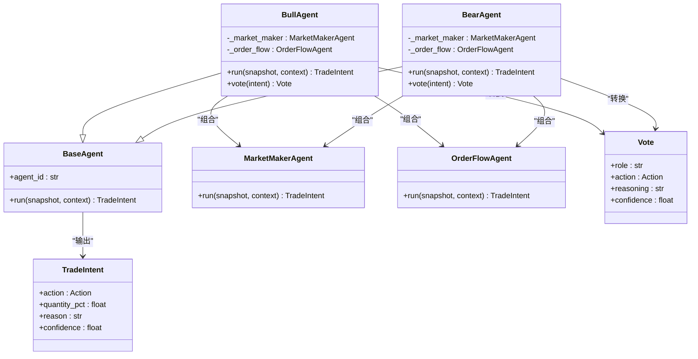
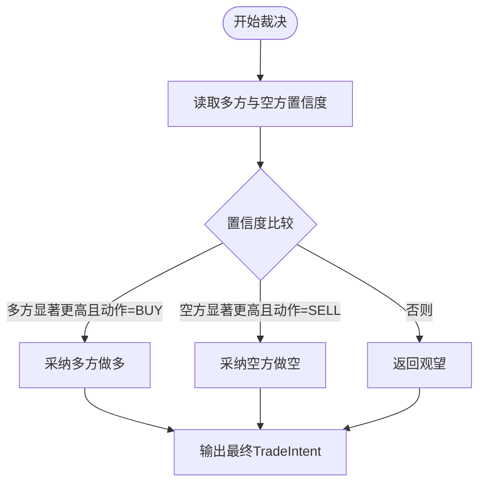
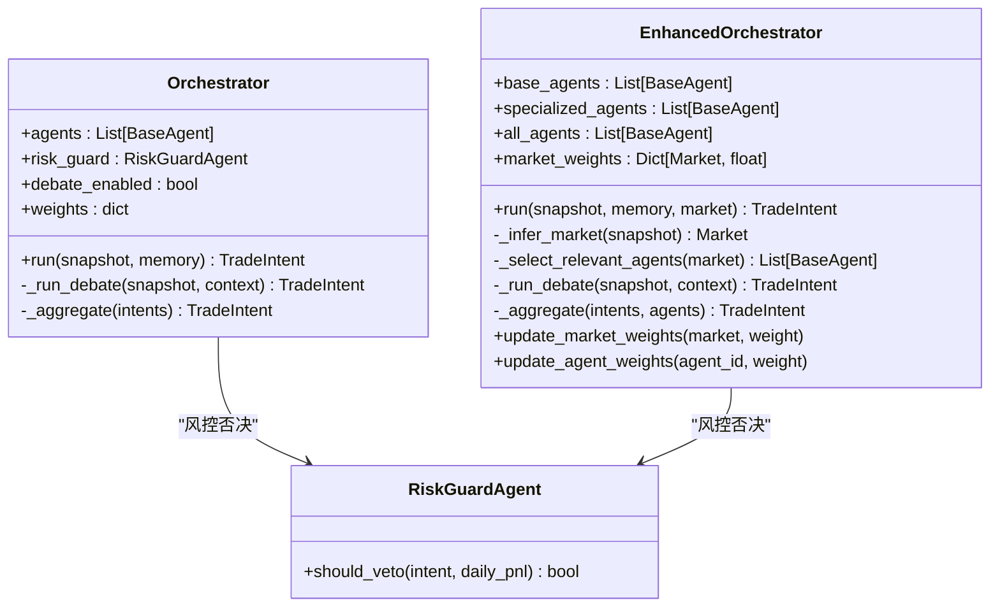
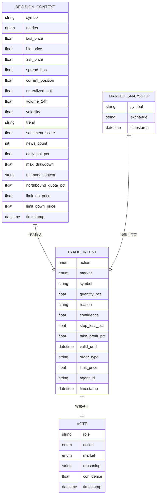
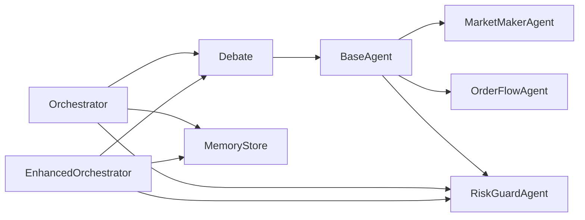

# 智能辩论系统

<cite>
**本文档引用的文件**
- [src/aetherlife/cognition/debate.py](file://src/aetherlife/cognition/debate.py)
- [src/aetherlife/cognition/agents.py](file://src/aetherlife/cognition/agents.py)
- [src/aetherlife/cognition/orchestrator.py](file://src/aetherlife/cognition/orchestrator.py)
- [src/aetherlife/cognition/orchestrator_enhanced.py](file://src/aetherlife/cognition/orchestrator_enhanced.py)
- [src/aetherlife/cognition/schemas.py](file://src/aetherlife/cognition/schemas.py)
- [src/aetherlife/memory/store.py](file://src/aetherlife/memory/store.py)
- [src/aetherlife/perception/models.py](file://src/aetherlife/perception/models.py)
- [src/aetherlife/guard/risk_guard.py](file://src/aetherlife/guard/risk_guard.py)
- [configs/aetherlife.json](file://configs/aetherlife.json)
- [src/utils/logger.py](file://src/utils/logger.py)
</cite>

## 目录
1. [引言](#引言)
2. [项目结构](#项目结构)
3. [核心组件](#核心组件)
4. [架构总览](#架构总览)
5. [详细组件分析](#详细组件分析)
6. [依赖关系分析](#依赖关系分析)
7. [性能考量](#性能考量)
8. [故障排除指南](#故障排除指南)
9. [结论](#结论)
10. [附录](#附录)

## 引言
本文件面向AetherLife系统的智能辩论组件，深入解析BullAgent多头代理、BearAgent空头代理与JudgeAgent法官代理的协作机制。文档覆盖辩论流程的设计理念（并行决策生成、投票机制、最终裁决算法）、多头空头观点的形成过程、冲突解决策略，以及法官代理如何基于投票结果做出最终决策。同时提供配置选项、性能调优建议与调试方法，帮助开发者与运维人员高效部署与维护该系统。

## 项目结构
辩论系统位于认知层（Cognition Layer），围绕以下关键模块组织：
- 议程与协调：Orchestrator/EnhancedOrchestrator负责调度与决策聚合
- 代理实现：基础与专业化Agent提供交易意图
- 辩论机制：Bull/Bear/Judge三者协作
- 数据模型：TradeIntent/Vote/DecisionContext等结构化输出
- 记忆与感知：MemoryStore/MemoryStore提供短期记忆，MarketSnapshot提供统一市场快照
- 风控：RiskGuard/RiskGuardAgent提供风控否决与审计

图表来源
- [src/aetherlife/cognition/orchestrator.py](file://src/aetherlife/cognition/orchestrator.py#L16-L53)
- [src/aetherlife/cognition/orchestrator_enhanced.py](file://src/aetherlife/cognition/orchestrator_enhanced.py#L21-L151)
- [src/aetherlife/cognition/debate.py](file://src/aetherlife/cognition/debate.py#L15-L99)
- [src/aetherlife/cognition/agents.py](file://src/aetherlife/cognition/agents.py#L13-L109)
- [src/aetherlife/cognition/schemas.py](file://src/aetherlife/cognition/schemas.py#L32-L74)
- [src/aetherlife/perception/models.py](file://src/aetherlife/perception/models.py#L54-L64)
- [src/aetherlife/memory/store.py](file://src/aetherlife/memory/store.py#L43-L146)
- [src/aetherlife/guard/risk_guard.py](file://src/aetherlife/guard/risk_guard.py#L23-L68)

章节来源
- [src/aetherlife/cognition/orchestrator.py](file://src/aetherlife/cognition/orchestrator.py#L16-L53)
- [src/aetherlife/cognition/orchestrator_enhanced.py](file://src/aetherlife/cognition/orchestrator_enhanced.py#L21-L151)
- [src/aetherlife/cognition/debate.py](file://src/aetherlife/cognition/debate.py#L15-L99)
- [src/aetherlife/cognition/agents.py](file://src/aetherlife/cognition/agents.py#L13-L109)
- [src/aetherlife/cognition/schemas.py](file://src/aetherlife/cognition/schemas.py#L32-L74)
- [src/aetherlife/perception/models.py](file://src/aetherlife/perception/models.py#L54-L64)
- [src/aetherlife/memory/store.py](file://src/aetherlife/memory/store.py#L43-L146)
- [src/aetherlife/guard/risk_guard.py](file://src/aetherlife/guard/risk_guard.py#L23-L68)

## 核心组件
- BullAgent：多方视角，偏向做多，从做多角度解读市场快照，结合做市与订单流Agent输出TradeIntent，并转换为Vote。
- BearAgent：空方视角，偏向做空，从做空角度解读市场快照，结合做市与订单流Agent输出TradeIntent，并转换为Vote。
- JudgeAgent：法官代理，接收Bull/Bear的Vote，基于置信度阈值与动作一致性进行裁决，输出最终TradeIntent。
- Orchestrator/EnhancedOrchestrator：协调器，支持并行执行多个Agent或启用辩论模式；聚合决策或由Judge裁决；最后经风控否决。
- 基础Agent：MarketMakerAgent、OrderFlowAgent、RiskGuardAgent、StatArbAgent、NewsSentimentAgent等，提供不同维度的交易意图。
- 数据模型：TradeIntent、Vote、DecisionContext等，确保输出结构化、可审计、可扩展。
- 记忆与感知：MemoryStore提供短期记忆上下文，MarketSnapshot提供统一的市场快照。

章节来源
- [src/aetherlife/cognition/debate.py](file://src/aetherlife/cognition/debate.py#L15-L99)
- [src/aetherlife/cognition/orchestrator.py](file://src/aetherlife/cognition/orchestrator.py#L16-L93)
- [src/aetherlife/cognition/orchestrator_enhanced.py](file://src/aetherlife/cognition/orchestrator_enhanced.py#L21-L323)
- [src/aetherlife/cognition/agents.py](file://src/aetherlife/cognition/agents.py#L13-L109)
- [src/aetherlife/cognition/schemas.py](file://src/aetherlife/cognition/schemas.py#L32-L74)
- [src/aetherlife/memory/store.py](file://src/aetherlife/memory/store.py#L43-L146)
- [src/aetherlife/perception/models.py](file://src/aetherlife/perception/models.py#L54-L64)

## 架构总览
辩论系统采用“并行决策 + 投票裁决”的双路径架构：
- 并行路径：多个Agent并行运行，各自输出TradeIntent，随后由Orchestrator聚合或由JudgeAgent裁决。
- 辩论路径：BullAgent与BearAgent并行生成各自的TradeIntent，转换为Vote后由JudgeAgent基于置信度与动作一致性进行裁决。
- 风控路径：无论何种路径，最终都会经过风控检查，必要时进行否决或人工确认。

图表来源
- [src/aetherlife/cognition/orchestrator.py](file://src/aetherlife/cognition/orchestrator.py#L38-L53)
- [src/aetherlife/cognition/orchestrator_enhanced.py](file://src/aetherlife/cognition/orchestrator_enhanced.py#L84-L151)
- [src/aetherlife/cognition/debate.py](file://src/aetherlife/cognition/debate.py#L55-L63)
- [src/aetherlife/guard/risk_guard.py](file://src/aetherlife/guard/risk_guard.py#L48-L68)

## 详细组件分析

### BullAgent与BearAgent：多头空头观点形成
- 观点形成机制：
  - 基于MarketMakerAgent与OrderFlowAgent的输出，分别进行“做多”或“做空”的偏向解读。
  - 当做市Agent给出相反动作时，会相应降低持有概率或提升做多/做空动作的概率与置信度。
  - 订单流支持做多/做空时，会提升对应动作的置信度与交易规模。
- TradeIntent到Vote的转换：
  - 将动作、原因与置信度封装为Vote，便于JudgeAgent进行裁决。

图表来源
- [src/aetherlife/cognition/debate.py](file://src/aetherlife/cognition/debate.py#L15-L65)
- [src/aetherlife/cognition/agents.py](file://src/aetherlife/cognition/agents.py#L25-L88)
- [src/aetherlife/cognition/schemas.py](file://src/aetherlife/cognition/schemas.py#L32-L74)

章节来源
- [src/aetherlife/cognition/debate.py](file://src/aetherlife/cognition/debate.py#L15-L65)
- [src/aetherlife/cognition/agents.py](file://src/aetherlife/cognition/agents.py#L25-L88)
- [src/aetherlife/cognition/schemas.py](file://src/aetherlife/cognition/schemas.py#L32-L74)

### JudgeAgent：投票裁决算法
- 裁决逻辑：
  - 若多方置信度高于空方置信度且动作一致，则采纳多方做多。
  - 若空方置信度高于多方置信度且动作一致，则采纳空方做空。
  - 否则返回观望，并记录分歧情况。
- 置信度阈值：
  - 采用0.15的置信度差异阈值，避免微弱优势导致错误决策。
- 输出：
  - 返回最终TradeIntent，包含动作、规模、原因与置信度。

图表来源
- [src/aetherlife/cognition/debate.py](file://src/aetherlife/cognition/debate.py#L77-L99)

章节来源
- [src/aetherlife/cognition/debate.py](file://src/aetherlife/cognition/debate.py#L77-L99)

### Orchestrator与EnhancedOrchestrator：调度与聚合
- 并行执行：
  - 使用asyncio.gather并行调用多个Agent，提高响应速度。
  - 在增强版本中，支持异常过滤与日志记录，提升鲁棒性。
- 决策路径选择：
  - debate_enabled为True时，走辩论路径；否则走聚合路径。
- 聚合算法：
  - 按动作分组，计算加权得分（quantity_pct × confidence × weight），选择最高得分动作。
  - 归一化后输出最终TradeIntent，限制最大仓位与置信度上限。
- 市场权重与专业化Agent：
  - 增强版本支持按市场类型动态调整权重，并根据市场类型选择相关专业化Agent。
- 风控集成：
  - 统一调用RiskGuard.should_veto进行风控否决或人工确认。

图表来源
- [src/aetherlife/cognition/orchestrator.py](file://src/aetherlife/cognition/orchestrator.py#L16-L93)
- [src/aetherlife/cognition/orchestrator_enhanced.py](file://src/aetherlife/cognition/orchestrator_enhanced.py#L21-L323)

章节来源
- [src/aetherlife/cognition/orchestrator.py](file://src/aetherlife/cognition/orchestrator.py#L16-L93)
- [src/aetherlife/cognition/orchestrator_enhanced.py](file://src/aetherlife/cognition/orchestrator_enhanced.py#L21-L323)

### 数据模型与上下文
- TradeIntent：标准化的交易意图输出，包含动作、市场、符号、仓位比例、原因、置信度、风控参数、时效性与元数据。
- Vote：辩论投票载体，包含角色、动作、市场、原因与置信度。
- DecisionContext：决策上下文，整合市场快照、持仓、情绪、风控状态与记忆上下文。
- MarketSnapshot：统一的市场快照，包含订单簿、最新价格、24小时指标、K线与时间戳。

图表来源
- [src/aetherlife/cognition/schemas.py](file://src/aetherlife/cognition/schemas.py#L32-L125)
- [src/aetherlife/perception/models.py](file://src/aetherlife/perception/models.py#L54-L64)

章节来源
- [src/aetherlife/cognition/schemas.py](file://src/aetherlife/cognition/schemas.py#L32-L125)
- [src/aetherlife/perception/models.py](file://src/aetherlife/perception/models.py#L54-L64)

### 风控与审计
- RiskGuard/RiskGuardAgent：
  - 提供风控否决逻辑，支持电路断路器、单日最大亏损限制与大额人工确认（HITL）。
  - 审计日志可写入文件或回调函数，便于合规与追踪。
- MemoryStore：
  - 提供短期记忆上下文，支持Redis持久化，便于回放与审计。

章节来源
- [src/aetherlife/guard/risk_guard.py](file://src/aetherlife/guard/risk_guard.py#L23-L84)
- [src/aetherlife/memory/store.py](file://src/aetherlife/memory/store.py#L43-L146)

## 依赖关系分析
- 组件耦合：
  - Orchestrator/EnhancedOrchestrator与Bull/Bear/Judge存在直接依赖，但通过抽象接口（BaseAgent）与数据模型（TradeIntent/Vote）保持松耦合。
  - 基础Agent与专业化Agent通过统一的BaseAgent接口与MarketSnapshot交互，便于扩展。
- 外部依赖：
  - asyncio用于并行执行；MemoryStore支持Redis可选持久化；日志系统统一管理。
- 循环依赖：
  - 代码结构清晰，未发现循环依赖。

图表来源
- [src/aetherlife/cognition/orchestrator.py](file://src/aetherlife/cognition/orchestrator.py#L16-L53)
- [src/aetherlife/cognition/orchestrator_enhanced.py](file://src/aetherlife/cognition/orchestrator_enhanced.py#L21-L151)
- [src/aetherlife/cognition/debate.py](file://src/aetherlife/cognition/debate.py#L15-L99)
- [src/aetherlife/cognition/agents.py](file://src/aetherlife/cognition/agents.py#L13-L109)
- [src/aetherlife/memory/store.py](file://src/aetherlife/memory/store.py#L43-L146)

章节来源
- [src/aetherlife/cognition/orchestrator.py](file://src/aetherlife/cognition/orchestrator.py#L16-L53)
- [src/aetherlife/cognition/orchestrator_enhanced.py](file://src/aetherlife/cognition/orchestrator_enhanced.py#L21-L151)
- [src/aetherlife/cognition/debate.py](file://src/aetherlife/cognition/debate.py#L15-L99)
- [src/aetherlife/cognition/agents.py](file://src/aetherlife/cognition/agents.py#L13-L109)
- [src/aetherlife/memory/store.py](file://src/aetherlife/memory/store.py#L43-L146)

## 性能考量
- 并行执行：
  - 使用asyncio.gather并行调用Agent，减少总延迟；在增强版本中加入异常过滤，避免单点失败拖累整体。
- 聚合与裁决：
  - 聚合算法按动作分组加权求和，复杂度O(n)，n为Agent数量；Judge裁决为常数时间。
- 内存与上下文：
  - MemoryStore限制短期记忆长度，避免内存膨胀；上下文截断至max_items，平衡信息量与性能。
- 市场权重与专业化Agent：
  - 增强版本按市场类型选择相关Agent，减少无关计算；动态权重调整可优化收益稳定性。
- I/O与持久化：
  - Redis持久化为可选，建议在高吞吐场景下开启以支持回放与监控。

[本节为通用性能指导，不直接分析具体文件]

## 故障排除指南
- 日志与审计：
  - 使用统一日志系统输出关键事件与异常；审计日志可落盘或回调，便于问题定位。
- 风控拦截：
  - 检查风控否决原因（电路断路器、单日最大亏损、HITL），必要时临时调整阈值。
- 记忆上下文：
  - 确认MemoryStore.get_context_for_llm返回的上下文包含近期事件摘要；若为空，检查短期记忆队列。
- 辩论路径：
  - 确保debate_enabled配置正确；检查Bull/Bear的TradeIntent与Vote是否正常生成。
- Agent异常：
  - 增强版本已过滤异常Agent，若全部失败，返回HOLD并记录原因；检查Agent实现与输入快照。

章节来源
- [src/utils/logger.py](file://src/utils/logger.py#L12-L33)
- [src/aetherlife/guard/risk_guard.py](file://src/aetherlife/guard/risk_guard.py#L48-L68)
- [src/aetherlife/memory/store.py](file://src/aetherlife/memory/store.py#L134-L146)
- [src/aetherlife/cognition/orchestrator_enhanced.py](file://src/aetherlife/cognition/orchestrator_enhanced.py#L117-L134)

## 结论
AetherLife的智能辩论系统通过BullAgent、BearAgent与JudgeAgent的协作，实现了“并行决策 + 投票裁决”的稳健机制。Orchestrator/EnhancedOrchestrator在保证高性能的同时，提供了灵活的配置与扩展能力。配合MemoryStore与风控体系，系统能够在复杂多变的市场环境中做出审慎、可审计的交易决策。建议在生产环境启用辩论模式与风控拦截，并根据市场表现动态调整权重与阈值。

[本节为总结性内容，不直接分析具体文件]

## 附录

### 配置选项
- aetherlife.json中的辩论开关：
  - debate_enabled：启用/禁用辩论模式。
- Orchestrator/EnhancedOrchestrator参数：
  - agents：Agent列表，默认包含做市、订单流、统计套利与新闻情绪Agent。
  - debate_enabled：是否启用辩论路径。
  - weights：Agent权重字典，影响聚合结果。
  - enable_specialized_agents：是否启用专业化Agent。
  - market_weights：按市场类型调整权重。
- RiskGuard配置：
  - circuit_breaker_pct：电路断路器阈值。
  - max_daily_loss_pct：单日最大亏损阈值。
  - hitl_enabled：是否启用人工确认。
  - audit_log_path：审计日志文件路径。

章节来源
- [configs/aetherlife.json](file://configs/aetherlife.json#L1-L17)
- [src/aetherlife/cognition/orchestrator.py](file://src/aetherlife/cognition/orchestrator.py#L19-L36)
- [src/aetherlife/cognition/orchestrator_enhanced.py](file://src/aetherlife/cognition/orchestrator_enhanced.py#L32-L83)
- [src/aetherlife/guard/risk_guard.py](file://src/aetherlife/guard/risk_guard.py#L26-L41)