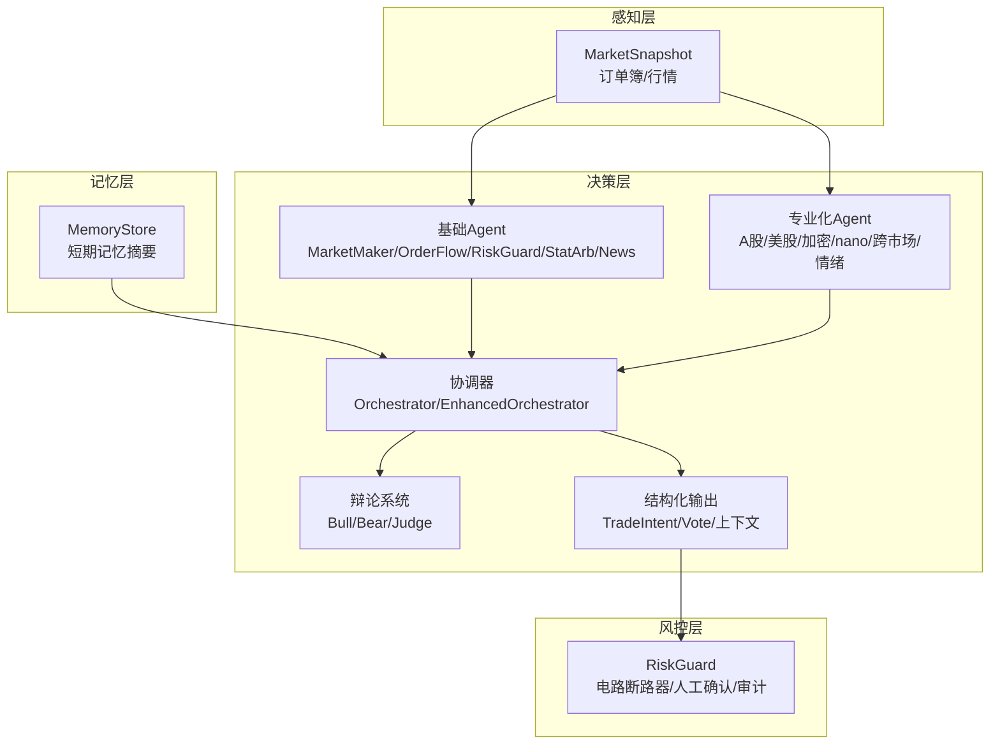
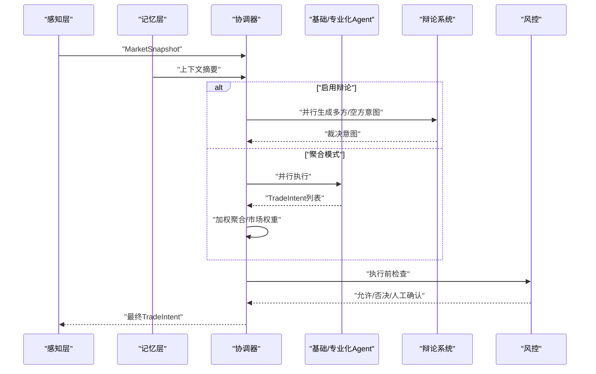
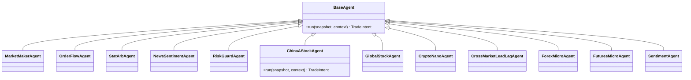
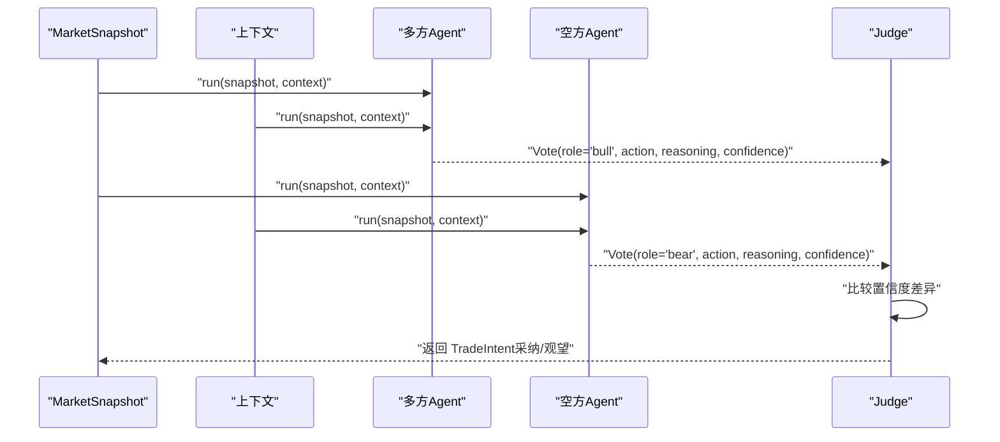
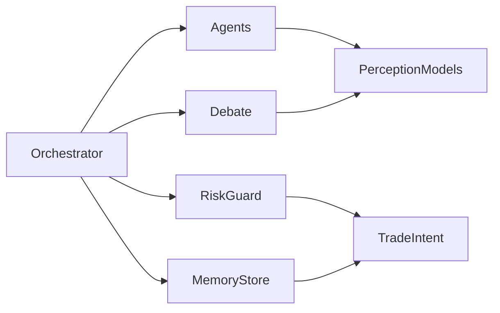

# 认知层

<cite>
**本文引用的文件**
- [orchestrator.py](file://src/aetherlife/cognition/orchestrator.py)
- [orchestrator_enhanced.py](file://src/aetherlife/cognition/orchestrator_enhanced.py)
- [agents.py](file://src/aetherlife/cognition/agents.py)
- [agent_cross_market.py](file://src/aetherlife/cognition/agent_cross_market.py)
- [agent_specialized.py](file://src/aetherlife/cognition/agent_specialized.py)
- [debate.py](file://src/aetherlife/cognition/debate.py)
- [schemas.py](file://src/aetherlife/cognition/schemas.py)
- [models.py](file://src/aetherlife/perception/models.py)
- [store.py](file://src/aetherlife/memory/store.py)
- [risk_guard.py](file://src/aetherlife/guard/risk_guard.py)
- [cognition_multi_agent_demo.py](file://scripts/cognition_multi_agent_demo.py)
- [run.py](file://src/aetherlife/run.py)
</cite>

## 目录
1. [引言](#引言)
2. [项目结构](#项目结构)
3. [核心组件](#核心组件)
4. [架构总览](#架构总览)
5. [详细组件分析](#详细组件分析)
6. [依赖关系分析](#依赖关系分析)
7. [性能考量](#性能考量)
8. [故障排查指南](#故障排查指南)
9. [结论](#结论)
10. [附录](#附录)

## 引言
本文件面向量化交易系统的认知层，系统性阐述多代理决策体系的设计理念与实现细节，覆盖协调器 Orchestrator、跨市场代理与专业代理、智能辩论系统 Debate、交易意图 TradeIntent 的生成流程，以及动作 Action 的定义。文档同时给出代理间通信协议、决策融合算法、冲突解决机制与性能调优策略，并提供多代理协作的实际案例与调试方法，帮助读者快速理解并高效迭代认知层。

## 项目结构
认知层位于 src/aetherlife/cognition 下，围绕“感知-记忆-决策-执行”闭环组织代码，采用分层与职责分离的设计：
- 感知层：统一市场快照与订单簿模型，供 Agent 一次性消费
- 记忆层：短期事件与决策摘要，为 LLM/风控提供上下文
- 决策层：基础 Agent、专业化 Agent、辩论系统、协调器与结构化输出
- 风控层：执行前的最终把关与审计

图表来源
- [models.py](file://src/aetherlife/perception/models.py#L54-L64)
- [store.py](file://src/aetherlife/memory/store.py#L43-L155)
- [agents.py](file://src/aetherlife/cognition/agents.py#L13-L109)
- [agent_specialized.py](file://src/aetherlife/cognition/agent_specialized.py#L17-L352)
- [agent_cross_market.py](file://src/aetherlife/cognition/agent_cross_market.py#L16-L405)
- [debate.py](file://src/aetherlife/cognition/debate.py#L15-L100)
- [orchestrator.py](file://src/aetherlife/cognition/orchestrator.py#L16-L93)
- [orchestrator_enhanced.py](file://src/aetherlife/cognition/orchestrator_enhanced.py#L21-L323)
- [schemas.py](file://src/aetherlife/cognition/schemas.py#L32-L219)
- [risk_guard.py](file://src/aetherlife/guard/risk_guard.py#L23-L84)

章节来源
- [models.py](file://src/aetherlife/perception/models.py#L1-L64)
- [store.py](file://src/aetherlife/memory/store.py#L1-L155)
- [schemas.py](file://src/aetherlife/cognition/schemas.py#L1-L219)

## 核心组件
- 协调器 Orchestrator/EnhancedOrchestrator：负责并行执行 Agent、聚合决策、可选辩论、风控否决与市场权重应用
- 基础 Agent：做市/订单流/统计套利/新闻情绪/风控守门人
- 专业化 Agent：A股、美股、加密/nano、跨市场 Lead-Lag、外汇/期货微结构、情绪分析
- 智能辩论系统 Debate：多方/空方视角解读与裁决
- 结构化输出 TradeIntent/Vote/上下文：统一动作、置信度、市场符号、元数据与风控参数
- 风控 RiskGuard：电路断路器、单日最大亏损、大额人工确认与审计

章节来源
- [orchestrator.py](file://src/aetherlife/cognition/orchestrator.py#L16-L93)
- [orchestrator_enhanced.py](file://src/aetherlife/cognition/orchestrator_enhanced.py#L21-L323)
- [agents.py](file://src/aetherlife/cognition/agents.py#L13-L109)
- [agent_specialized.py](file://src/aetherlife/cognition/agent_specialized.py#L17-L352)
- [agent_cross_market.py](file://src/aetherlife/cognition/agent_cross_market.py#L16-L405)
- [debate.py](file://src/aetherlife/cognition/debate.py#L15-L100)
- [schemas.py](file://src/aetherlife/cognition/schemas.py#L32-L219)
- [risk_guard.py](file://src/aetherlife/guard/risk_guard.py#L23-L84)

## 架构总览
认知层以“并行 Agent + 聚合/辩论 + 风控”的流水线为核心，结合记忆上下文与市场类型推断，形成可扩展、可演进的多代理系统。

图表来源
- [orchestrator.py](file://src/aetherlife/cognition/orchestrator.py#L38-L53)
- [orchestrator_enhanced.py](file://src/aetherlife/cognition/orchestrator_enhanced.py#L84-L151)
- [debate.py](file://src/aetherlife/cognition/debate.py#L23-L36)
- [agents.py](file://src/aetherlife/cognition/agents.py#L31-L47)
- [risk_guard.py](file://src/aetherlife/guard/risk_guard.py#L48-L68)

## 详细组件分析

### 协调器 Orchestrator 与 EnhancedOrchestrator
- 设计目标：统一管理 Agent 生命周期、并行执行、聚合/辩论、风控否决与市场权重
- 关键能力
  - 市场类型推断：基于交易所与符号自动识别市场类别
  - 相关 Agent 选择：按市场映射动态挑选专业化 Agent
  - 并行执行：异步 gather 执行，异常过滤与兜底
  - 决策融合：按动作分组加权平均数量占比与置信度
  - 辩论模式：多方/空方并行解读，Judge 基于置信度裁决
  - 风控否决：基于日收益与置信度阈值进行一票否决
  - 权重调优：支持动态调整 Agent 权重与市场权重

```mermaid
flowchart TD
Start(["开始 run"]) --> Infer["推断市场类型"]
Infer --> BuildCtx["构建上下文摘要"]
BuildCtx --> Select["选择相关 Agent"]
Select --> Debate{"启用辩论?"}
Debate --> |是| RunDebate["并行多方/空方 → Judge 裁决"]
Debate --> |否| Parallel["并行执行 Agent"]
Parallel --> Aggregate["加权聚合决策"]
RunDebate --> Combine["合并意图"]
Combine --> Risk["风控否决检查"]
Aggregate --> Risk
Risk --> ApplyMW["应用市场权重"]
ApplyMW --> End(["返回 TradeIntent"])
```

图表来源
- [orchestrator_enhanced.py](file://src/aetherlife/cognition/orchestrator_enhanced.py#L84-L151)
- [orchestrator_enhanced.py](file://src/aetherlife/cognition/orchestrator_enhanced.py#L189-L221)
- [orchestrator_enhanced.py](file://src/aetherlife/cognition/orchestrator_enhanced.py#L223-L234)
- [orchestrator_enhanced.py](file://src/aetherlife/cognition/orchestrator_enhanced.py#L235-L312)

章节来源
- [orchestrator.py](file://src/aetherlife/cognition/orchestrator.py#L16-L93)
- [orchestrator_enhanced.py](file://src/aetherlife/cognition/orchestrator_enhanced.py#L21-L323)

### 基础 Agent 与专业化 Agent
- 基础 Agent：做市/订单流/统计套利/新闻情绪/风控守门人，提供通用决策能力
- 专业化 Agent：
  - A股：交易时段、涨跌停、北向额度、印花税成本、T+1 规则
  - 全球股票：盘前盘后、Fractional shares、多市场时区
  - 加密/nano：高频、资金费率、极小价差阈值
  - 跨市场：Lead-Lag、相关性、情绪驱动
  - 外汇/期货微结构：订单流、价差、展期/基差

图表来源
- [agents.py](file://src/aetherlife/cognition/agents.py#L13-L109)
- [agent_specialized.py](file://src/aetherlife/cognition/agent_specialized.py#L17-L352)
- [agent_cross_market.py](file://src/aetherlife/cognition/agent_cross_market.py#L16-L405)

章节来源
- [agents.py](file://src/aetherlife/cognition/agents.py#L13-L109)
- [agent_specialized.py](file://src/aetherlife/cognition/agent_specialized.py#L17-L352)
- [agent_cross_market.py](file://src/aetherlife/cognition/agent_cross_market.py#L16-L405)

### 智能辩论系统 Debate
- 多方/空方 Agent：以 MarketMaker 与 OrderFlow 为基础，分别偏向做多/做空解读
- 裁决 Judge：比较双方置信度差异，决定采纳哪一方或观望
- 通信协议：TradeIntent → Vote（角色/动作/理由/置信度），Judge 统一裁决

图表来源
- [debate.py](file://src/aetherlife/cognition/debate.py#L23-L36)
- [debate.py](file://src/aetherlife/cognition/debate.py#L50-L62)
- [debate.py](file://src/aetherlife/cognition/debate.py#L77-L99)

章节来源
- [debate.py](file://src/aetherlife/cognition/debate.py#L15-L100)

### TradeIntent 与 Action 定义
- Action：HOLD、BUY、SELL、CLOSE
- TradeIntent：动作、市场、符号、数量占比、理由、置信度、风控参数（止盈止损）、时效性、执行参数、元数据、时间戳
- Vote：角色、动作、市场、理由、置信度、时间戳
- 决策上下文 DecisionContext：市场快照、订单簿、持仓、趋势/波动率、情绪、风控状态、记忆上下文、A股特有字段、时间戳
- LangGraphState：多 Agent/辩论/强化学习/最终决策/执行结果/错误信息/时间戳

章节来源
- [schemas.py](file://src/aetherlife/cognition/schemas.py#L12-L219)

### 记忆与上下文
- MemoryStore：短期事件与决策摘要，支持 Redis 持久化与加载
- get_context_for_llm：生成供 LLM 的上下文摘要
- get_daily_pnl：计算当日累计收益，用于风控否决

章节来源
- [store.py](file://src/aetherlife/memory/store.py#L43-L155)

### 风控与审计
- RiskGuard：电路断路器、单日最大亏损、大额人工确认（HITL）、审计回调与文件落盘
- 认知层内部风险守卫：基于日收益与置信度阈值的一票否决

章节来源
- [risk_guard.py](file://src/aetherlife/guard/risk_guard.py#L23-L84)
- [agents.py](file://src/aetherlife/cognition/agents.py#L60-L68)

## 依赖关系分析
- 协调器依赖：感知模型、记忆存储、Agent 集合、辩论系统、风控守卫
- Agent 依赖：感知模型、输出 TradeIntent
- 议题与上下文：TradeIntent/Vote/DecisionContext/LangGraphState
- 风控：TradeIntent、日收益、金额阈值

图表来源
- [orchestrator_enhanced.py](file://src/aetherlife/cognition/orchestrator_enhanced.py#L10-L16)
- [agents.py](file://src/aetherlife/cognition/agents.py#L9-L10)
- [debate.py](file://src/aetherlife/cognition/debate.py#L9-L12)
- [risk_guard.py](file://src/aetherlife/guard/risk_guard.py#L11-L11)
- [models.py](file://src/aetherlife/perception/models.py#L15-L64)
- [store.py](file://src/aetherlife/memory/store.py#L43-L155)

章节来源
- [orchestrator_enhanced.py](file://src/aetherlife/cognition/orchestrator_enhanced.py#L10-L16)
- [agents.py](file://src/aetherlife/cognition/agents.py#L9-L10)
- [debate.py](file://src/aetherlife/cognition/debate.py#L9-L12)
- [risk_guard.py](file://src/aetherlife/guard/risk_guard.py#L11-L11)
- [models.py](file://src/aetherlife/perception/models.py#L15-L64)
- [store.py](file://src/aetherlife/memory/store.py#L43-L155)

## 性能考量
- 并行执行：使用异步 gather 并行调用 Agent，减少端到端延迟
- 异常兜底：过滤异常结果，确保至少有一个有效决策
- 权重控制：限制最大仓位与置信度上限，避免过度集中
- 市场权重：针对不同市场动态调整权重，提升鲁棒性
- 记忆截断：上下文与短期记忆最大长度限制，避免 OOM
- Redis 可选持久化：在需要时启用，兼顾性能与可靠性

章节来源
- [orchestrator_enhanced.py](file://src/aetherlife/cognition/orchestrator_enhanced.py#L113-L134)
- [orchestrator_enhanced.py](file://src/aetherlife/cognition/orchestrator_enhanced.py#L314-L322)
- [store.py](file://src/aetherlife/memory/store.py#L50-L63)
- [store.py](file://src/aetherlife/memory/store.py#L134-L145)

## 故障排查指南
- 无有效决策：当所有 Agent 执行失败时，返回 HOLD 并记录原因
- 风控否决：日收益低于阈值或置信度过低触发 HOLD
- 大额人工确认：超过阈值的头寸进入 HITL 流程
- 审计日志：统一记录事件与负载，支持文件与回调
- 调试建议
  - 使用演示脚本验证单 Agent 与 Orchestrator 协作
  - 动态调整 Agent 权重与市场权重观察影响
  - 检查记忆上下文长度与内容质量
  - 关注价差阈值与订单流统计窗口

章节来源
- [orchestrator_enhanced.py](file://src/aetherlife/cognition/orchestrator_enhanced.py#L122-L134)
- [agents.py](file://src/aetherlife/cognition/agents.py#L60-L68)
- [risk_guard.py](file://src/aetherlife/guard/risk_guard.py#L48-L68)
- [cognition_multi_agent_demo.py](file://scripts/cognition_multi_agent_demo.py#L197-L236)

## 结论
认知层通过“并行 Agent + 聚合/辩论 + 风控”的组合，实现了对多市场、多资产的统一决策框架。结构化输出 TradeIntent 与 Vote 明确了代理间通信协议，而动态权重与市场权重提供了灵活的调优手段。配合记忆与风控，系统在可解释性、鲁棒性与可扩展性之间取得平衡，适合持续迭代与生产部署。

## 附录

### 多代理协作实际案例
- 单 Agent 演示：A股、加密、美股、情绪分析 Agent 的独立决策
- Orchestrator 协作：在加密与 A 股场景下，协调器选择相关 Agent 并聚合输出
- 权重动态调整：提高情绪分析权重或降低加密市场权重，观察置信度变化

章节来源
- [cognition_multi_agent_demo.py](file://scripts/cognition_multi_agent_demo.py#L35-L118)
- [cognition_multi_agent_demo.py](file://scripts/cognition_multi_agent_demo.py#L120-L195)
- [cognition_multi_agent_demo.py](file://scripts/cognition_multi_agent_demo.py#L197-L236)

### 入口与运行
- 入口脚本：加载环境变量、读取配置、启动 AetherLife 主循环

章节来源
- [run.py](file://src/aetherlife/run.py#L52-L71)