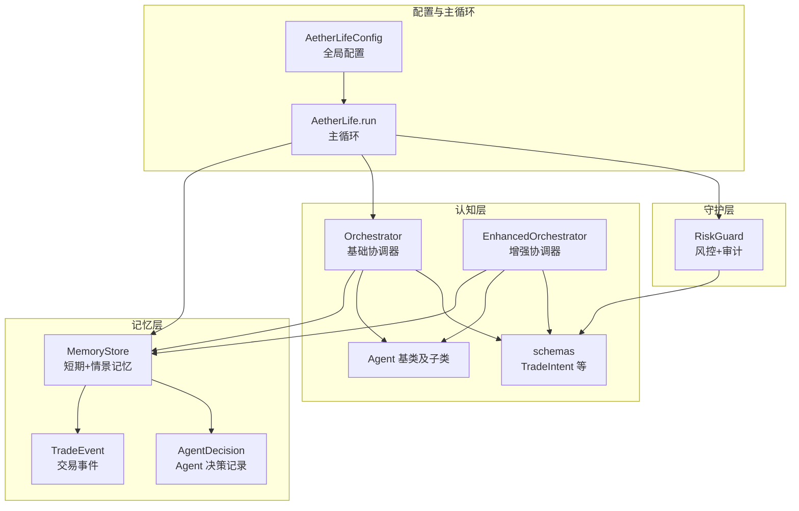
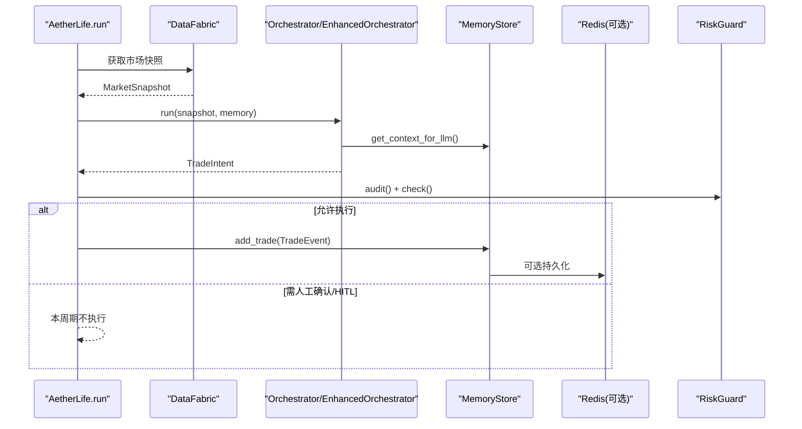
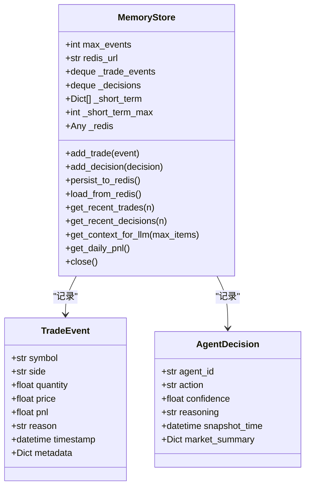
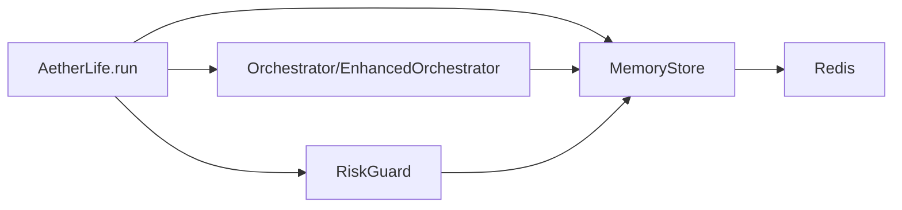

# 记忆层

<cite>
**本文引用的文件**
- [src/aetherlife/memory/store.py](file://src/aetherlife/memory/store.py)
- [src/aetherlife/memory/__init__.py](file://src/aetherlife/memory/__init__.py)
- [src/aetherlife/cognition/schemas.py](file://src/aetherlife/cognition/schemas.py)
- [src/aetherlife/cognition/agents.py](file://src/aetherlife/cognition/agents.py)
- [src/aetherlife/cognition/orchestrator.py](file://src/aetherlife/cognition/orchestrator.py)
- [src/aetherlife/cognition/orchestrator_enhanced.py](file://src/aetherlife/cognition/orchestrator_enhanced.py)
- [src/aetherlife/guard/risk_guard.py](file://src/aetherlife/guard/risk_guard.py)
- [src/aetherlife/config.py](file://src/aetherlife/config.py)
- [src/aetherlife/core/life.py](file://src/aetherlife/core/life.py)
- [src/aetherlife/run.py](file://src/aetherlife/run.py)
- [requirements.txt](file://requirements.txt)
</cite>

## 目录
1. [简介](#简介)
2. [项目结构](#项目结构)
3. [核心组件](#核心组件)
4. [架构总览](#架构总览)
5. [组件详解](#组件详解)
6. [依赖关系分析](#依赖关系分析)
7. [性能考量](#性能考量)
8. [故障排查指南](#故障排查指南)
9. [结论](#结论)
10. [附录](#附录)

## 简介
本文件面向量化交易系统的“记忆层”，聚焦 MemoryStore 存储引擎的设计与实现，系统性解析以下主题：
- 存储架构：内存优先 + 可选 Redis 持久化
- 事件存储机制：交易事件与 Agent 决策的历史记录
- 数据持久化策略：Redis 列表与短时上下文
- 核心数据模型：TradeEvent、AgentDecision 的定义与使用场景
- 记忆容量管理：双端队列与短时列表上限控制
- 查询接口：最近事件、上下文摘要、当日盈亏
- 事件回放机制：从 Redis 加载近期事件
- 内存优化策略：短时上下文截断、最大长度限制
- 实际存储操作示例：记录交易事件、查询决策历史、数据迁移（Redis ↔ 内存）

## 项目结构
记忆层位于 aetherlife/memory，核心为 MemoryStore 类及其数据模型 TradeEvent、AgentDecision；与认知层（Orchestrator/EnhancedOrchestrator）、守护层（RiskGuard）、配置（AetherLifeConfig）以及主循环（AetherLife.run）紧密协作。

图示来源
- [src/aetherlife/memory/store.py](file://src/aetherlife/memory/store.py#L43-L155)
- [src/aetherlife/cognition/orchestrator.py](file://src/aetherlife/cognition/orchestrator.py#L16-L93)
- [src/aetherlife/cognition/orchestrator_enhanced.py](file://src/aetherlife/cognition/orchestrator_enhanced.py#L21-L323)
- [src/aetherlife/guard/risk_guard.py](file://src/aetherlife/guard/risk_guard.py#L23-L84)
- [src/aetherlife/config.py](file://src/aetherlife/config.py#L98-L131)
- [src/aetherlife/core/life.py](file://src/aetherlife/core/life.py#L20-L169)

章节来源
- [src/aetherlife/memory/store.py](file://src/aetherlife/memory/store.py#L1-L155)
- [src/aetherlife/memory/__init__.py](file://src/aetherlife/memory/__init__.py#L1-L8)
- [src/aetherlife/cognition/schemas.py](file://src/aetherlife/cognition/schemas.py#L1-L219)
- [src/aetherlife/cognition/agents.py](file://src/aetherlife/cognition/agents.py#L1-L109)
- [src/aetherlife/cognition/orchestrator.py](file://src/aetherlife/cognition/orchestrator.py#L1-L93)
- [src/aetherlife/cognition/orchestrator_enhanced.py](file://src/aetherlife/cognition/orchestrator_enhanced.py#L1-L323)
- [src/aetherlife/guard/risk_guard.py](file://src/aetherlife/guard/risk_guard.py#L1-L84)
- [src/aetherlife/config.py](file://src/aetherlife/config.py#L1-L131)
- [src/aetherlife/core/life.py](file://src/aetherlife/core/life.py#L1-L169)
- [src/aetherlife/run.py](file://src/aetherlife/run.py#L1-L71)

## 核心组件
- MemoryStore：短期+情景记忆存储，支持内存与可选 Redis 持久化，提供事件追加、最近查询、上下文摘要、当日盈亏统计、Redis 导入导出与连接关闭。
- TradeEvent：单笔交易事件（情景记忆），包含标的、方向、数量、价格、盈亏、原因、时间戳与元数据。
- AgentDecision：单次 Agent 决策记录（审计+反思），包含 Agent 标识、动作、置信度、推理、快照时间与市场摘要。
- Orchestrator/EnhancedOrchestrator：多 Agent 协调器，读取 MemoryStore 的短期上下文，结合风控进行最终决策。
- RiskGuard：执行前最后一道关卡，负责电路断路器、日损限额、HITL 与审计。
- AetherLifeConfig：全局配置，包含记忆层 Redis 地址、上下文 token 上限、事件历史保留条数等。

章节来源
- [src/aetherlife/memory/store.py](file://src/aetherlife/memory/store.py#L19-L41)
- [src/aetherlife/memory/store.py](file://src/aetherlife/memory/store.py#L43-L155)
- [src/aetherlife/cognition/orchestrator.py](file://src/aetherlife/cognition/orchestrator.py#L16-L93)
- [src/aetherlife/cognition/orchestrator_enhanced.py](file://src/aetherlife/cognition/orchestrator_enhanced.py#L21-L323)
- [src/aetherlife/guard/risk_guard.py](file://src/aetherlife/guard/risk_guard.py#L23-L84)
- [src/aetherlife/config.py](file://src/aetherlife/config.py#L23-L33)

## 架构总览
记忆层在系统中的位置与交互如下：

图示来源
- [src/aetherlife/core/life.py](file://src/aetherlife/core/life.py#L59-L122)
- [src/aetherlife/cognition/orchestrator.py](file://src/aetherlife/cognition/orchestrator.py#L38-L53)
- [src/aetherlife/cognition/orchestrator_enhanced.py](file://src/aetherlife/cognition/orchestrator_enhanced.py#L84-L151)
- [src/aetherlife/memory/store.py](file://src/aetherlife/memory/store.py#L90-L127)
- [src/aetherlife/guard/risk_guard.py](file://src/aetherlife/guard/risk_guard.py#L48-L68)

## 组件详解

### MemoryStore 设计与实现
- 存储结构
  - _trade_events：双端队列，按最大事件数限制，实现固定窗口的记忆窗口。
  - _decisions：双端队列，记录 Agent 决策历史。
  - _short_term：列表，保存短期上下文项，上限由 _short_term_max 控制，用于 LLM 上下文摘要。
- Redis 集成
  - REDIS_KEY_TRADES、REDIS_KEY_SHORT_TERM：分别存储交易事件与短期上下文。
  - REDIS_MAX_LIST：Redis 列表最大长度，避免无限增长。
  - 初始化时尝试建立异步连接，失败则降级为纯内存模式。
- 事件持久化
  - persist_to_redis：将近期交易与短期上下文写入 Redis，并裁剪至最大长度。
  - load_from_redis：从 Redis 读取近期交易事件到内存，便于重启后恢复。
- 查询与摘要
  - get_recent_trades / get_recent_decisions：返回最近 N 条事件。
  - get_context_for_llm：拼接短期上下文字符串，供 LLM 使用。
  - get_daily_pnl：按 UTC 当日日期聚合累计盈亏。
- 生命周期
  - close：关闭 Redis 连接。

图示来源
- [src/aetherlife/memory/store.py](file://src/aetherlife/memory/store.py#L43-L155)

章节来源
- [src/aetherlife/memory/store.py](file://src/aetherlife/memory/store.py#L43-L155)

### 数据模型：TradeEvent 与 AgentDecision
- TradeEvent
  - 用途：记录单笔交易事件，作为情景记忆，支持 PnL 回填与原因标注。
  - 字段要点：symbol、side、quantity、price、pnl、reason、timestamp、metadata。
- AgentDecision
  - 用途：记录 Agent 的决策过程，便于审计与反思。
  - 字段要点：agent_id、action、confidence、reasoning、snapshot_time、market_summary。

章节来源
- [src/aetherlife/memory/store.py](file://src/aetherlife/memory/store.py#L19-L41)

### 记忆容量管理
- 内存容量
  - _trade_events/_decisions：通过 deque(maxlen=...) 实现固定窗口，超出即丢弃最旧项。
  - _short_term：当超过上限时，采用 pop(0) 截断，确保 LLM 上下文稳定。
- Redis 容量
  - ltrim 限制列表长度，避免无限增长。
- 配置容量
  - AetherLifeConfig.memory.episodic_max_events：影响 MemoryStore 的 max_events 初始化。

章节来源
- [src/aetherlife/memory/store.py](file://src/aetherlife/memory/store.py#L50-L58)
- [src/aetherlife/memory/store.py](file://src/aetherlife/memory/store.py#L90-L103)
- [src/aetherlife/config.py](file://src/aetherlife/config.py#L23-L33)

### 数据查询接口
- 最近交易与决策
  - get_recent_trades(n)、get_recent_decisions(n)：返回最近 N 条记录。
- LLM 上下文摘要
  - get_context_for_llm(max_items)：将短期上下文拼接为文本，供 LLM 使用。
- 当日盈亏
  - get_daily_pnl()：按 UTC 当日日期聚合累计 PnL。

章节来源
- [src/aetherlife/memory/store.py](file://src/aetherlife/memory/store.py#L128-L145)

### 事件回放机制
- 启动时回放
  - AetherLife.run 在启动时尝试从 Redis 加载近期交易事件到内存，提升连续性。
- 关闭时落盘
  - AetherLife.shutdown 在关闭时调用 persist_to_redis，确保近期事件持久化。

章节来源
- [src/aetherlife/core/life.py](file://src/aetherlife/core/life.py#L137-L141)
- [src/aetherlife/core/life.py](file://src/aetherlife/core/life.py#L163-L168)
- [src/aetherlife/memory/store.py](file://src/aetherlife/memory/store.py#L105-L126)
- [src/aetherlife/memory/store.py](file://src/aetherlife/memory/store.py#L90-L103)

### 内存优化策略
- 短期上下文截断：_short_term_max 控制短期上下文长度，避免 LLM 上下文过长。
- 固定窗口：deque 的 maxlen 保证内存占用稳定。
- Redis 裁剪：ltrim 限制 Redis 列表长度，避免无限增长。
- 可选降级：Redis 不可用时自动降级为纯内存模式。

章节来源
- [src/aetherlife/memory/store.py](file://src/aetherlife/memory/store.py#L50-L62)
- [src/aetherlife/memory/store.py](file://src/aetherlife/memory/store.py#L74-L76)
- [src/aetherlife/memory/store.py](file://src/aetherlife/memory/store.py#L98-L101)

### 实际存储操作示例
- 记录交易事件
  - 在执行阶段成功下单后，调用 MemoryStore.add_trade(TradeEvent(...))，同时会同步写入短期上下文。
  - 参考路径：[src/aetherlife/core/life.py](file://src/aetherlife/core/life.py#L113-L119)
- 查询决策历史
  - 使用 MemoryStore.get_recent_decisions(n) 获取最近 N 条决策记录。
  - 参考路径：[src/aetherlife/memory/store.py](file://src/aetherlife/memory/store.py#L131-L132)
- 数据迁移（Redis ↔ 内存）
  - 启动时：MemoryStore.load_from_redis() 从 Redis 加载近期事件到内存。
  - 关闭时：AetherLife.shutdown 调用 MemoryStore.persist_to_redis() 将内存中的近期事件写入 Redis。
  - 参考路径：
    - [src/aetherlife/core/life.py](file://src/aetherlife/core/life.py#L137-L141)
    - [src/aetherlife/core/life.py](file://src/aetherlife/core/life.py#L163-L168)
    - [src/aetherlife/memory/store.py](file://src/aetherlife/memory/store.py#L105-L126)
    - [src/aetherlife/memory/store.py](file://src/aetherlife/memory/store.py#L90-L103)

## 依赖关系分析
- 外部依赖
  - Redis：用于可选持久化，键空间包含交易事件与短期上下文。
  - 异步 Redis 客户端：redis.asyncio，初始化失败时降级为纯内存。
- 内部耦合
  - AetherLife.run 与 MemoryStore：启动加载、关闭落盘、执行后追加交易事件。
  - Orchestrator/EnhancedOrchestrator 与 MemoryStore：读取短期上下文用于决策。
  - RiskGuard 与 MemoryStore：读取当日 PnL 用于风控判断。

图示来源
- [src/aetherlife/core/life.py](file://src/aetherlife/core/life.py#L20-L169)
- [src/aetherlife/cognition/orchestrator.py](file://src/aetherlife/cognition/orchestrator.py#L16-L93)
- [src/aetherlife/cognition/orchestrator_enhanced.py](file://src/aetherlife/cognition/orchestrator_enhanced.py#L21-L323)
- [src/aetherlife/guard/risk_guard.py](file://src/aetherlife/guard/risk_guard.py#L23-L84)
- [src/aetherlife/memory/store.py](file://src/aetherlife/memory/store.py#L43-L155)

章节来源
- [requirements.txt](file://requirements.txt#L43-L44)
- [src/aetherlife/memory/store.py](file://src/aetherlife/memory/store.py#L12-L16)
- [src/aetherlife/core/life.py](file://src/aetherlife/core/life.py#L20-L169)

## 性能考量
- 内存占用
  - 双端队列与固定上限确保内存稳定，适合高频交易场景。
- I/O 开销
  - Redis 写入采用异步 rpush + ltrim，批量写入近期事件，降低网络开销。
- 上下文长度
  - 短期上下文截断与最大事件数限制，避免 LLM 上下文过长导致的性能下降。
- 降级策略
  - Redis 不可用时自动降级为纯内存模式，保证系统可用性。

## 故障排查指南
- Redis 连接失败
  - 现象：初始化 MemoryStore 时无法建立 Redis 连接。
  - 处理：检查 redis_url 配置与网络连通性；确认 Redis 服务可用；MemoryStore 将自动降级为纯内存。
  - 参考路径：[src/aetherlife/memory/store.py](file://src/aetherlife/memory/store.py#L58-L62)
- Redis 写入异常
  - 现象：persist_to_redis 抛出异常。
  - 处理：检查 Redis 权限与网络；确认键空间与列表长度限制；忽略异常不影响内存模式。
  - 参考路径：[src/aetherlife/memory/store.py](file://src/aetherlife/memory/store.py#L94-L103)
- 启动时加载失败
  - 现象：load_from_redis 抛出异常。
  - 处理：检查 Redis 中键是否存在；确认 JSON 解析格式；忽略异常不影响系统运行。
  - 参考路径：[src/aetherlife/memory/store.py](file://src/aetherlife/memory/store.py#L110-L126)
- 关闭时未落盘
  - 现象：shutdown 未调用 persist_to_redis。
  - 处理：确认 MemoryStore._redis 存在且可用；检查权限与网络。
  - 参考路径：[src/aetherlife/core/life.py](file://src/aetherlife/core/life.py#L163-L168)

章节来源
- [src/aetherlife/memory/store.py](file://src/aetherlife/memory/store.py#L58-L62)
- [src/aetherlife/memory/store.py](file://src/aetherlife/memory/store.py#L94-L103)
- [src/aetherlife/memory/store.py](file://src/aetherlife/memory/store.py#L110-L126)
- [src/aetherlife/core/life.py](file://src/aetherlife/core/life.py#L163-L168)

## 结论
MemoryStore 以“内存优先 + 可选 Redis 持久化”的策略，为量化交易系统提供了高效、稳定的短期与情景记忆能力。通过固定窗口与短时上下文截断，系统在高吞吐场景下仍能保持内存与上下文的可控性；通过 Redis 的异步持久化与 ltrim 裁剪，实现了事件的长期保留与回放。配合 Orchestrator 的上下文读取与 RiskGuard 的风控检查，记忆层成为系统决策与执行链路中不可或缺的一环。

## 附录
- 配置参考
  - AetherLifeConfig.memory.redis_url：Redis 连接地址。
  - AetherLifeConfig.memory.episodic_max_events：事件历史保留条数。
  - 参考路径：[src/aetherlife/config.py](file://src/aetherlife/config.py#L23-L33)
- 外部依赖
  - Redis 客户端：redis[hiredis]，用于异步连接与操作。
  - 参考路径：[requirements.txt](file://requirements.txt#L43-L44)