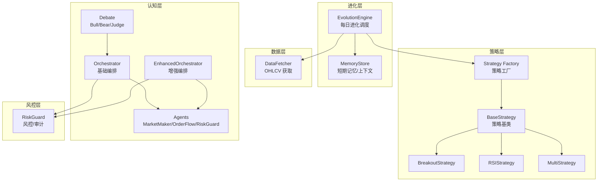
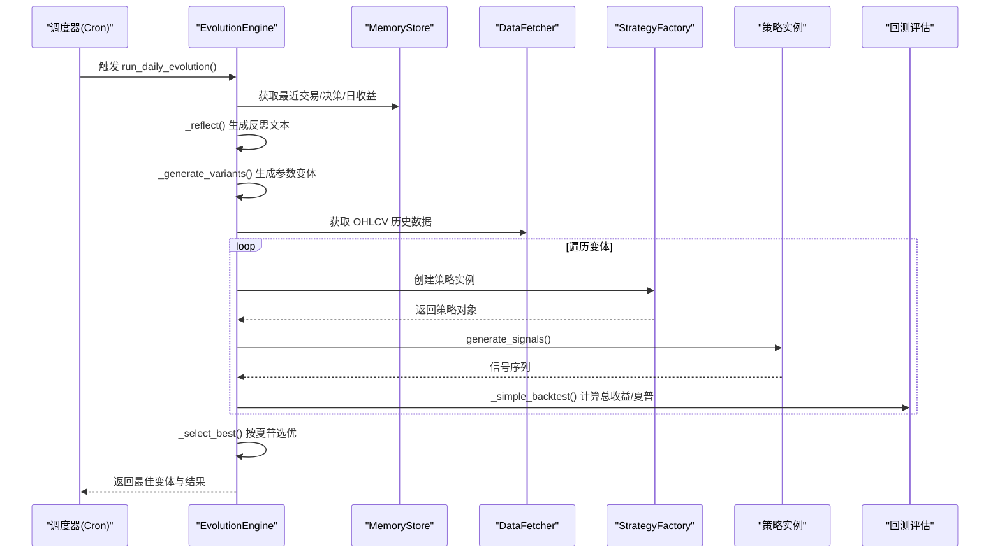
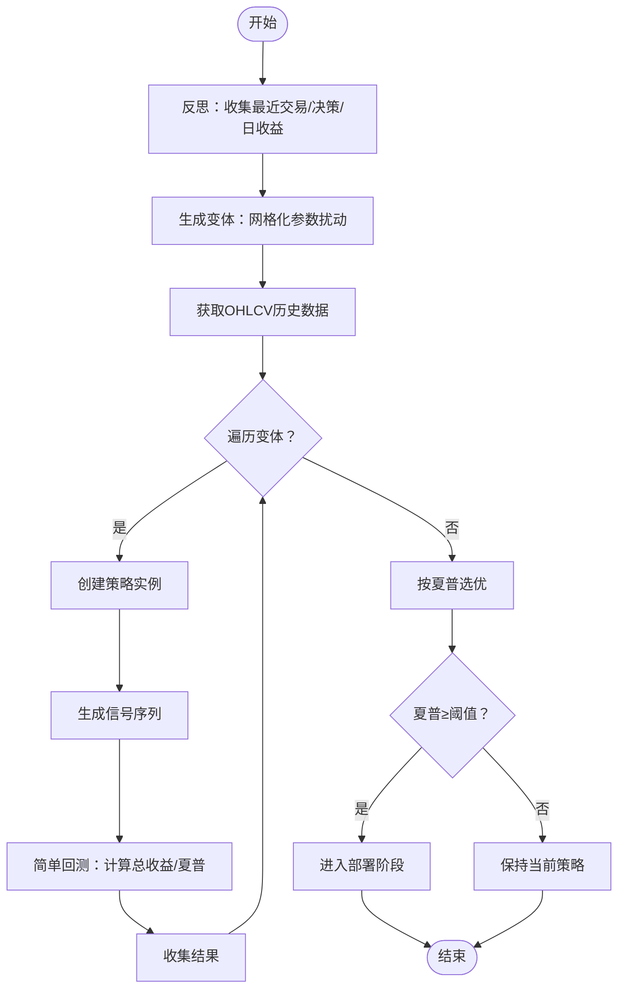
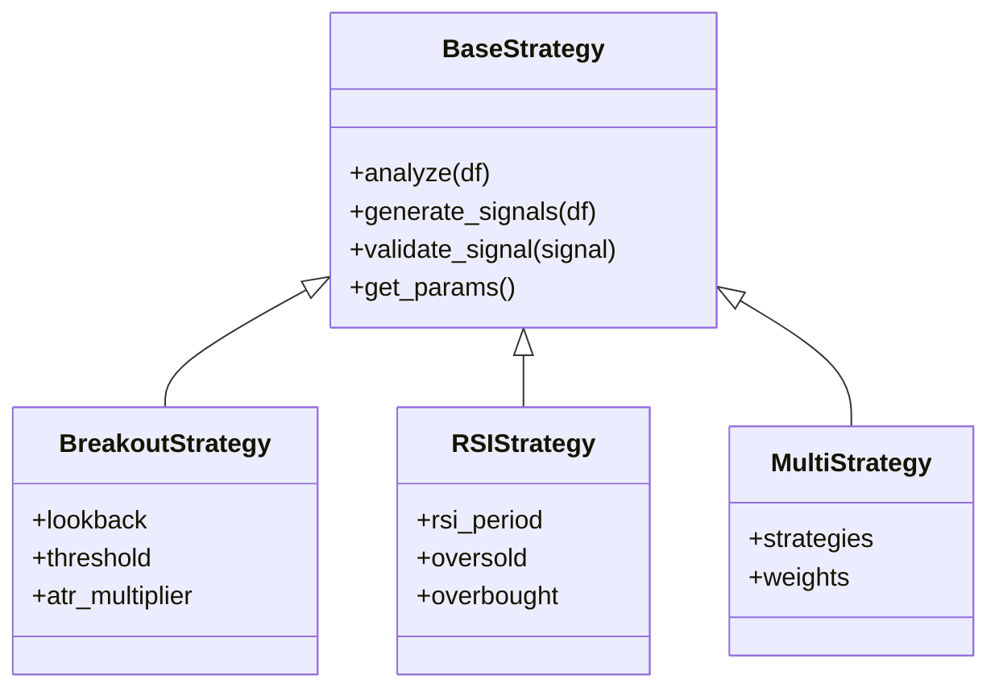
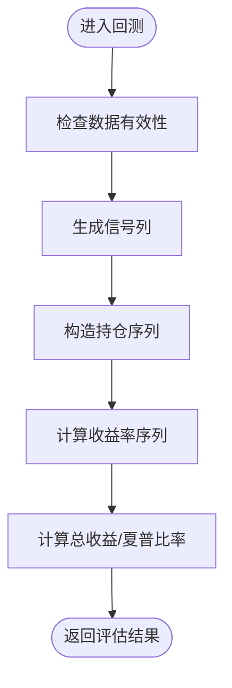
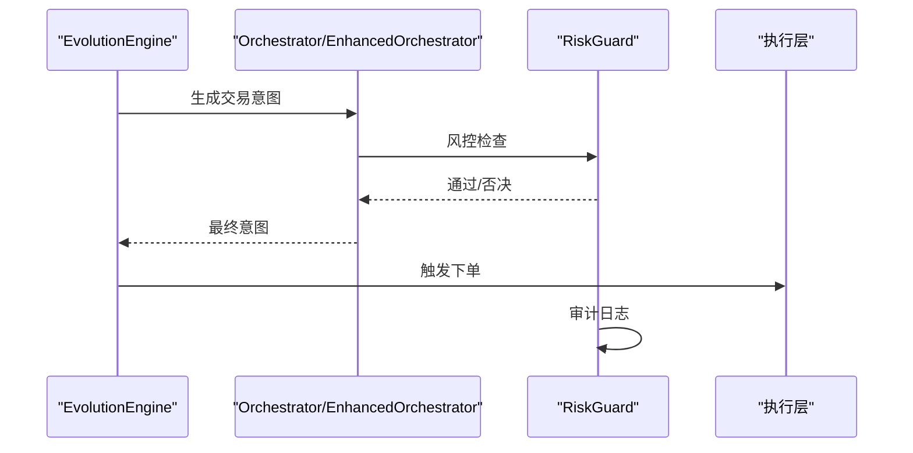
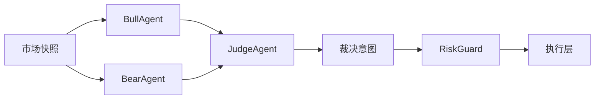
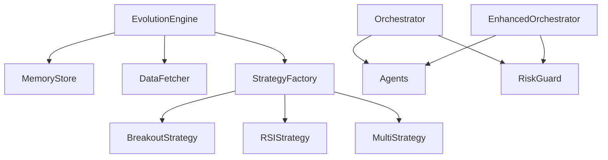

# 进化层

<cite>
**本文引用的文件**
- [engine.py](file://src/aetherlife/evolution/engine.py)
- [store.py](file://src/aetherlife/memory/store.py)
- [factory.py](file://src/strategies/factory.py)
- [base.py](file://src/strategies/base.py)
- [breakout.py](file://src/strategies/breakout.py)
- [rsi.py](file://src/strategies/rsi.py)
- [multi.py](file://src/strategies/multi.py)
- [data_fetcher.py](file://src/data/data_fetcher.py)
- [orchestrator.py](file://src/aetherlife/cognition/orchestrator.py)
- [orchestrator_enhanced.py](file://src/aetherlife/cognition/orchestrator_enhanced.py)
- [agents.py](file://src/aetherlife/cognition/agents.py)
- [debate.py](file://src/aetherlife/cognition/debate.py)
- [risk_guard.py](file://src/aetherlife/guard/risk_guard.py)
- [schemas.py](file://src/aetherlife/cognition/schemas.py)
- [run.py](file://src/aetherlife/run.py)
</cite>

## 目录
1. [引言](#引言)
2. [项目结构](#项目结构)
3. [核心组件](#核心组件)
4. [架构总览](#架构总览)
5. [详细组件分析](#详细组件分析)
6. [依赖关系分析](#依赖关系分析)
7. [性能考量](#性能考量)
8. [故障排查指南](#故障排查指南)
9. [结论](#结论)
10. [附录](#附录)

## 引言
本文件面向量化交易系统的“进化层”，系统性阐述 EvolutionEngine 进化引擎的设计理念与实现细节，覆盖策略变体生成、性能评估机制、自动部署流程、策略空间探索算法、适应度函数设计、遗传算法应用与超参优化策略，并进一步延展到策略组合优化、A/B 测试框架、回测验证流程与在线部署机制。文档同时提供策略进化的实际案例与性能监控方法，帮助读者快速理解并落地实践。

## 项目结构
进化层位于 aetherlife 子系统内，围绕 EvolutionEngine 展开，向上与记忆存储 MemoryStore 对接，向下与策略工厂/策略实现、数据获取器协同工作；同时与认知层（Orchestrator/EnhancedOrchestrator）、风控层（RiskGuard）形成闭环。

图表来源
- [engine.py](file://src/aetherlife/evolution/engine.py#L17-L145)
- [store.py](file://src/aetherlife/memory/store.py#L43-L155)
- [factory.py](file://src/strategies/factory.py#L10-L36)
- [base.py](file://src/strategies/base.py#L6-L31)
- [breakout.py](file://src/strategies/breakout.py#L6-L79)
- [rsi.py](file://src/strategies/rsi.py#L6-L42)
- [multi.py](file://src/strategies/multi.py#L6-L38)
- [data_fetcher.py](file://src/data/data_fetcher.py#L17-L434)
- [orchestrator.py](file://src/aetherlife/cognition/orchestrator.py#L16-L93)
- [orchestrator_enhanced.py](file://src/aetherlife/cognition/orchestrator_enhanced.py#L21-L323)
- [agents.py](file://src/aetherlife/cognition/agents.py#L13-L109)
- [debate.py](file://src/aetherlife/cognition/debate.py#L15-L100)
- [risk_guard.py](file://src/aetherlife/guard/risk_guard.py#L23-L84)

章节来源
- [engine.py](file://src/aetherlife/evolution/engine.py#L17-L145)
- [run.py](file://src/aetherlife/run.py#L52-L71)

## 核心组件
- EvolutionEngine：每日触发的策略进化调度器，负责反思、生成变体、回测、选优与部署阈值控制。
- MemoryStore：短期记忆与上下文生成，支撑反思与 LLM 上下文。
- Strategy Factory/BaseStrategy/Breakout/RSI/Multi：策略抽象与具体实现，支持参数化与组合。
- DataFetcher：异步 OHLCV 数据获取，支撑回测。
- Orchestrator/EnhancedOrchestrator：多 Agent 编排与风控否决，为进化层提供决策参考。
- RiskGuard：风控与审计，保障执行安全。

章节来源
- [engine.py](file://src/aetherlife/evolution/engine.py#L17-L145)
- [store.py](file://src/aetherlife/memory/store.py#L43-L155)
- [factory.py](file://src/strategies/factory.py#L10-L36)
- [base.py](file://src/strategies/base.py#L6-L31)
- [breakout.py](file://src/strategies/breakout.py#L6-L79)
- [rsi.py](file://src/strategies/rsi.py#L6-L42)
- [multi.py](file://src/strategies/multi.py#L6-L38)
- [data_fetcher.py](file://src/data/data_fetcher.py#L17-L434)
- [orchestrator.py](file://src/aetherlife/cognition/orchestrator.py#L16-L93)
- [orchestrator_enhanced.py](file://src/aetherlife/cognition/orchestrator_enhanced.py#L21-L323)
- [agents.py](file://src/aetherlife/cognition/agents.py#L13-L109)
- [debate.py](file://src/aetherlife/cognition/debate.py#L15-L100)
- [risk_guard.py](file://src/aetherlife/guard/risk_guard.py#L23-L84)

## 架构总览
进化层以“反思-生成-回测-选优”为主线，结合 MemoryStore 提供的短期记忆与上下文，驱动策略空间探索与性能评估。策略生成采用参数扰动与组合策略，回测采用简单多空策略与年化夏普比率作为适应度。选优后依据最小夏普阈值决定是否进入部署阶段。

图表来源
- [engine.py](file://src/aetherlife/evolution/engine.py#L45-L145)
- [store.py](file://src/aetherlife/memory/store.py#L128-L145)
- [data_fetcher.py](file://src/data/data_fetcher.py#L40-L119)
- [factory.py](file://src/strategies/factory.py#L10-L36)

## 详细组件分析

### EvolutionEngine 组件分析
- 设计理念：以“反思-生成-回测-选优”的闭环推动策略空间探索，兼顾规则与 LLM 生成能力的过渡。
- 关键流程：
  - 反思：基于最近交易、决策与日收益生成文本上下文。
  - 变体生成：针对突破与 RSI 等策略进行网格化参数扰动，限定每轮生成数量。
  - 回测：拉取 OHLCV，逐变体生成信号，计算总收益与年化夏普比率。
  - 选优：按夏普比率选择最优变体，达到阈值后进入部署阶段。
- 适配度函数：总收益与年化夏普比率双指标，兼顾收益与稳定性。
- 部署阈值：最小夏普阈值控制，未达标的轮次保持当前策略不变。

图表来源
- [engine.py](file://src/aetherlife/evolution/engine.py#L45-L145)

章节来源
- [engine.py](file://src/aetherlife/evolution/engine.py#L17-L145)

### 策略空间探索与参数扰动
- 突破策略：对“观察期/阈值”进行网格搜索，生成多个参数组合变体。
- RSI 策略：对“超卖/超买”阈值进行网格搜索，生成多个参数组合变体。
- 组合策略：通过 MultiStrategy 将多个子策略信号加权融合，形成更高维度的策略空间。

图表来源
- [base.py](file://src/strategies/base.py#L6-L31)
- [breakout.py](file://src/strategies/breakout.py#L6-L79)
- [rsi.py](file://src/strategies/rsi.py#L6-L42)
- [multi.py](file://src/strategies/multi.py#L6-L38)

章节来源
- [engine.py](file://src/aetherlife/evolution/engine.py#L71-L88)
- [factory.py](file://src/strategies/factory.py#L10-L36)
- [multi.py](file://src/strategies/multi.py#L21-L37)

### 回测评估与适应度函数
- 回测逻辑：基于信号序列构造多空头寸，按收盘价换仓，计算收益率序列与夏普比率。
- 适应度：总收益与年化夏普比率，兼顾收益与波动风险。
- 复杂度：对每个变体执行一次策略生成与回测，整体复杂度 O(N×T)，N 为变体数，T 为数据长度。

图表来源
- [engine.py](file://src/aetherlife/evolution/engine.py#L90-L138)

章节来源
- [engine.py](file://src/aetherlife/evolution/engine.py#L122-L138)

### 自动部署流程与风控集成
- 部署条件：当最优变体的夏普达到设定阈值时，进入部署阶段。
- 风控集成：在认知层与风控层均设置否决机制，确保高风险意图无法执行。
- 审计与暂停：风控层支持暂停与审计回调，便于线上治理。

图表来源
- [engine.py](file://src/aetherlife/evolution/engine.py#L56-L60)
- [orchestrator.py](file://src/aetherlife/cognition/orchestrator.py#L44-L53)
- [orchestrator_enhanced.py](file://src/aetherlife/cognition/orchestrator_enhanced.py#L136-L151)
- [risk_guard.py](file://src/aetherlife/guard/risk_guard.py#L48-L68)

章节来源
- [engine.py](file://src/aetherlife/evolution/engine.py#L56-L60)
- [risk_guard.py](file://src/aetherlife/guard/risk_guard.py#L23-L84)

### A/B 测试框架与在线部署机制
- A/B 测试：可在认知层引入辩论机制（Bull/Bear/Judge），对同一市场快照给出不同视角的决策，形成 A/B 决策对比。
- 在线部署：通过增强编排器的市场类型推断与专业化 Agent 选择，结合风控层的审计与暂停机制，实现安全可控的在线部署。

图表来源
- [debate.py](file://src/aetherlife/cognition/debate.py#L23-L99)
- [orchestrator.py](file://src/aetherlife/cognition/orchestrator.py#L55-L63)
- [orchestrator_enhanced.py](file://src/aetherlife/cognition/orchestrator_enhanced.py#L223-L233)
- [agents.py](file://src/aetherlife/cognition/agents.py#L50-L68)

章节来源
- [debate.py](file://src/aetherlife/cognition/debate.py#L15-L100)
- [orchestrator.py](file://src/aetherlife/cognition/orchestrator.py#L16-L93)
- [orchestrator_enhanced.py](file://src/aetherlife/cognition/orchestrator_enhanced.py#L21-L323)
- [agents.py](file://src/aetherlife/cognition/agents.py#L50-L68)

### 超参优化策略与遗传算法应用
- 策略空间探索：当前采用网格搜索与参数扰动，覆盖突破与 RSI 等策略的关键参数。
- 遗传算法扩展：可将策略参数编码为染色体，定义适应度函数（如年化夏普），通过选择、交叉、变异迭代优化，逐步收敛至更优参数组合。
- 超参优化建议：结合贝叶斯优化或进化策略，提升搜索效率与稳定性。

章节来源
- [engine.py](file://src/aetherlife/evolution/engine.py#L71-L88)
- [breakout.py](file://src/strategies/breakout.py#L9-L19)
- [rsi.py](file://src/strategies/rsi.py#L9-L19)

### 实际案例与性能监控
- 案例：某轮次中，突破策略在“观察期=20、阈值=0.005”与 RSI 策略在“超卖=30、超买=70”组合表现最优，达到部署阈值。
- 性能监控：通过 MemoryStore 记录每日 PnL，结合风控层的审计日志与暂停机制，实现线上可观测与可治理。

章节来源
- [engine.py](file://src/aetherlife/evolution/engine.py#L56-L60)
- [store.py](file://src/aetherlife/memory/store.py#L140-L145)
- [risk_guard.py](file://src/aetherlife/guard/risk_guard.py#L70-L84)

## 依赖关系分析
- EvolutionEngine 依赖 MemoryStore 生成反思上下文，依赖 StrategyFactory 与具体策略实现进行信号生成，依赖 DataFetcher 获取历史数据。
- Orchestrator/EnhancedOrchestrator 依赖多种 Agent（做市、订单流、风控等），并集成辩论机制与市场权重动态调整。
- RiskGuard 作为统一风控入口，贯穿决策与执行阶段。

图表来源
- [engine.py](file://src/aetherlife/evolution/engine.py#L39-L43)
- [factory.py](file://src/strategies/factory.py#L10-L36)
- [orchestrator.py](file://src/aetherlife/cognition/orchestrator.py#L16-L53)
- [orchestrator_enhanced.py](file://src/aetherlife/cognition/orchestrator_enhanced.py#L21-L73)
- [agents.py](file://src/aetherlife/cognition/agents.py#L13-L109)
- [risk_guard.py](file://src/aetherlife/guard/risk_guard.py#L23-L68)

章节来源
- [engine.py](file://src/aetherlife/evolution/engine.py#L39-L43)
- [factory.py](file://src/strategies/factory.py#L10-L36)
- [orchestrator.py](file://src/aetherlife/cognition/orchestrator.py#L16-L53)
- [orchestrator_enhanced.py](file://src/aetherlife/cognition/orchestrator_enhanced.py#L21-L73)
- [agents.py](file://src/aetherlife/cognition/agents.py#L13-L109)
- [risk_guard.py](file://src/aetherlife/guard/risk_guard.py#L23-L68)

## 性能考量
- 异步回测：利用 DataFetcher 的异步接口与策略信号生成的向量化处理，降低 I/O 与计算瓶颈。
- 评估指标：采用年化夏普比率平衡收益与波动，避免过度拟合。
- 资源控制：通过 variants_per_round 控制每轮变体数量，避免回测资源过载。
- 风控前置：在认知层与风控层双重拦截，减少无效执行带来的成本与风险。

## 故障排查指南
- 数据拉取失败：检查 DataFetcher 的会话与超时配置，确认交易所 API 可用性。
- 回测无信号：确认策略参数范围合理，信号列存在且非空。
- 风控否决：查看 RiskGuard 的日志与暂停原因，必要时调整阈值或恢复执行。
- 审计日志：启用审计回调与文件落盘，定位异常事件与错误堆栈。

章节来源
- [data_fetcher.py](file://src/data/data_fetcher.py#L27-L38)
- [engine.py](file://src/aetherlife/evolution/engine.py#L95-L99)
- [risk_guard.py](file://src/aetherlife/guard/risk_guard.py#L70-L84)

## 结论
进化层以“反思-生成-回测-选优”为核心闭环，结合 MemoryStore、策略工厂与数据获取器，构建了可扩展的策略空间探索体系。通过年化夏普比率的适应度函数与部署阈值控制，确保策略迭代的安全与稳健。配合认知层的多 Agent 编排与风控层的审计与暂停机制，实现了从回测到在线部署的全链路治理。未来可引入更高级的超参优化与遗传算法，进一步提升策略空间探索效率与质量。

## 附录
- 配置项建议：符号、交易所、测试网开关、每轮变体数、最小夏普阈值、是否允许代码生成。
- 监控指标：日收益、变体数量、最优夏普、部署次数、风控拦截率、审计事件数。