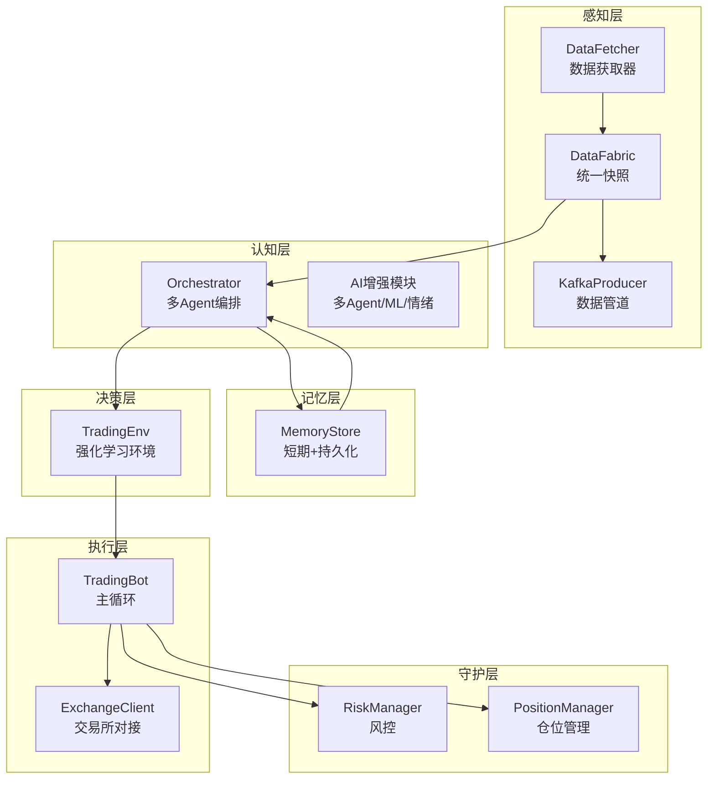
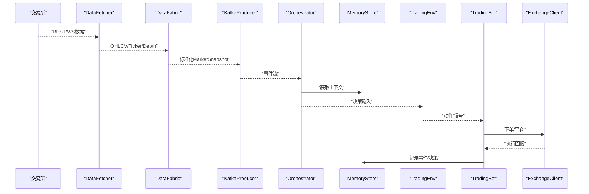
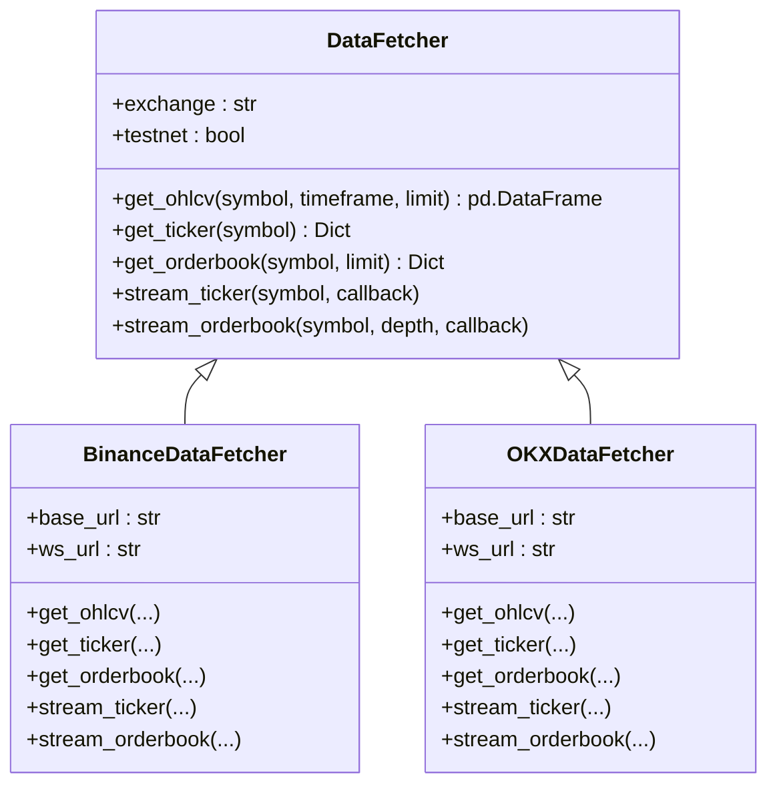
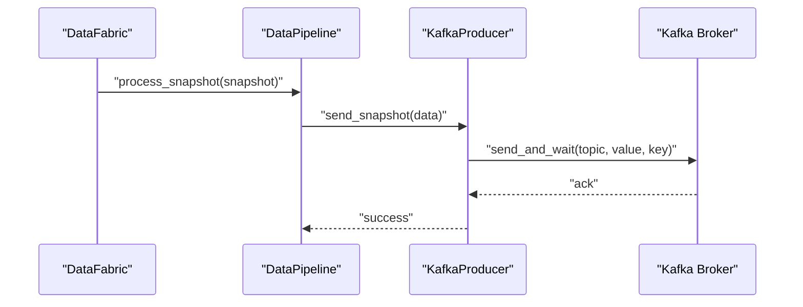
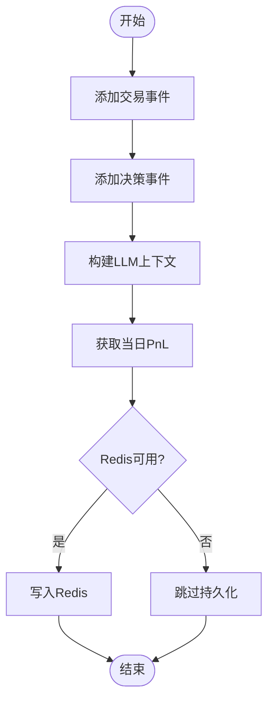
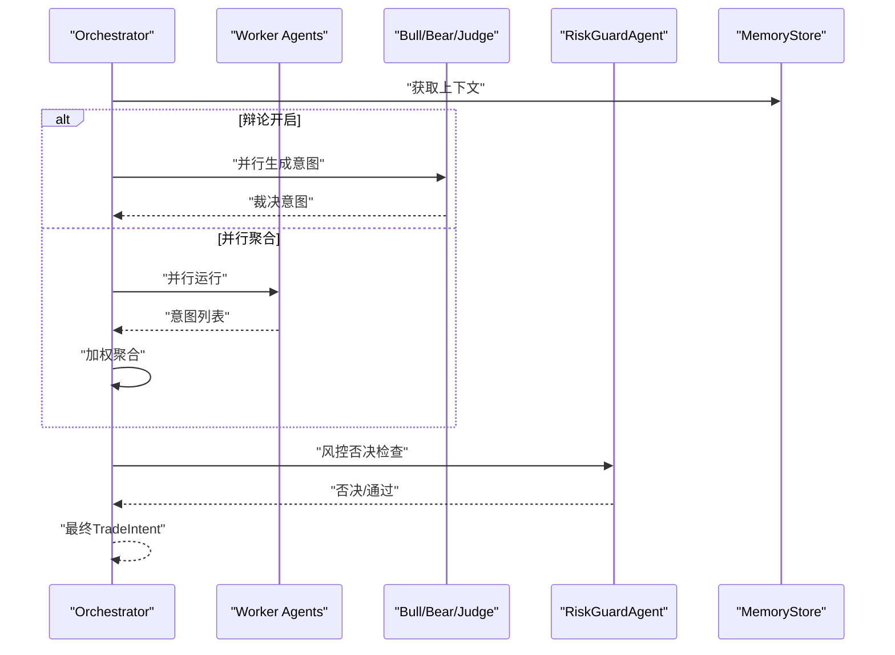
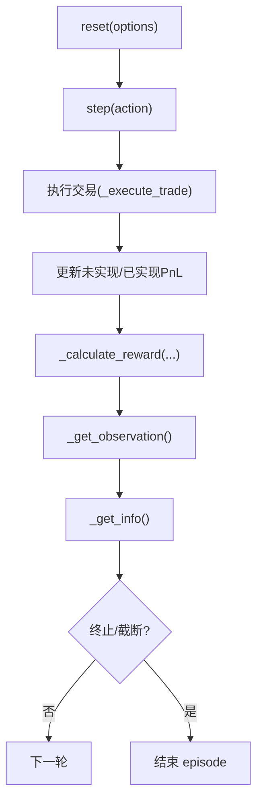
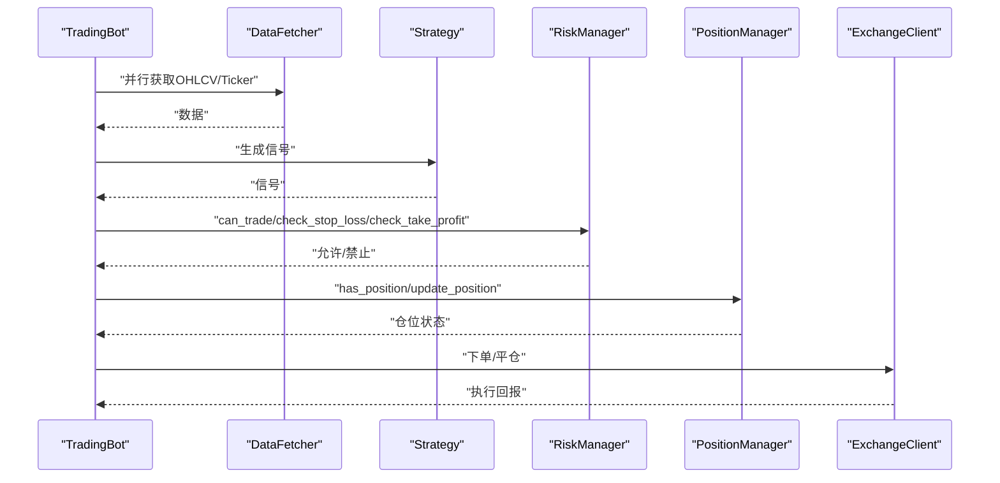
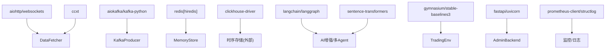

# 技术栈架构

<cite>
**本文引用的文件**
- [requirements.txt](file://requirements.txt)
- [src/aetherlife/__init__.py](file://src/aetherlife/__init__.py)
- [src/aetherlife/config.py](file://src/aetherlife/config.py)
- [configs/config.json](file://configs/config.json)
- [src/utils/ai_enhancer.py](file://src/utils/ai_enhancer.py)
- [src/aetherlife/cognition/orchestrator.py](file://src/aetherlife/cognition/orchestrator.py)
- [src/aetherlife/perception/fabric.py](file://src/aetherlife/perception/fabric.py)
- [src/aetherlife/memory/store.py](file://src/aetherlife/memory/store.py)
- [src/aetherlife/decision/rl_env.py](file://src/aetherlife/decision/rl_env.py)
- [src/aetherlife/perception/kafka_producer.py](file://src/aetherlife/perception/kafka_producer.py)
- [src/data/data_fetcher.py](file://src/data/data_fetcher.py)
- [src/utils/logger.py](file://src/utils/logger.py)
- [src/ui/admin_backend.py](file://src/ui/admin_backend.py)
- [src/trading_bot.py](file://src/trading_bot.py)
</cite>

## 目录
1. [引言](#引言)
2. [项目结构](#项目结构)
3. [核心组件](#核心组件)
4. [架构总览](#架构总览)
5. [详细组件分析](#详细组件分析)
6. [依赖关系分析](#依赖关系分析)
7. [性能考虑](#性能考虑)
8. [故障排查指南](#故障排查指南)
9. [结论](#结论)
10. [附录](#附录)

## 引言
本技术栈架构文档面向量化交易系统，聚焦支撑系统运行的核心技术与框架选择，涵盖异步编程模型、AI增强技术栈（langchain、langgraph、sentence-transformers）、强化学习框架（gymnasium、stable-baselines3）、数据库与消息队列（redis、clickhouse-driver、kafka），并结合仓库中的实际实现进行说明。文档同时给出技术选型考量、版本兼容性与性能要求建议，并提供依赖关系图与第三方服务集成方案。

## 项目结构
系统采用分层架构：感知层（数据接入与流式处理）、记忆层（短期/长期存储）、认知层（多Agent与状态机）、决策层（LLM结构化输出与RL）、执行层（交易所对接）、守护层（风控与合规）、进化层（策略自进化）。核心模块围绕异步I/O与事件驱动展开，配合Kafka/Redis实现高吞吐与低延迟的数据通路。

图表来源
- [src/aetherlife/perception/fabric.py](file://src/aetherlife/perception/fabric.py#L13-L88)
- [src/aetherlife/perception/kafka_producer.py](file://src/aetherlife/perception/kafka_producer.py#L26-L287)
- [src/aetherlife/memory/store.py](file://src/aetherlife/memory/store.py#L43-L155)
- [src/aetherlife/cognition/orchestrator.py](file://src/aetherlife/cognition/orchestrator.py#L16-L93)
- [src/utils/ai_enhancer.py](file://src/utils/ai_enhancer.py#L15-L360)
- [src/aetherlife/decision/rl_env.py](file://src/aetherlife/decision/rl_env.py#L26-L423)
- [src/trading_bot.py](file://src/trading_bot.py#L27-L346)

章节来源
- [src/aetherlife/perception/fabric.py](file://src/aetherlife/perception/fabric.py#L13-L88)
- [src/aetherlife/perception/kafka_producer.py](file://src/aetherlife/perception/kafka_producer.py#L26-L287)
- [src/aetherlife/memory/store.py](file://src/aetherlife/memory/store.py#L43-L155)
- [src/aetherlife/cognition/orchestrator.py](file://src/aetherlife/cognition/orchestrator.py#L16-L93)
- [src/utils/ai_enhancer.py](file://src/utils/ai_enhancer.py#L15-L360)
- [src/aetherlife/decision/rl_env.py](file://src/aetherlife/decision/rl_env.py#L26-L423)
- [src/trading_bot.py](file://src/trading_bot.py#L27-L346)

## 核心组件
- 异步数据获取与WebSocket订阅：基于aiohttp与ccxt，实现多交易所（Binance/OKX）的K线、盘口、资金费率等数据的异步抓取与实时流式推送。
- Kafka数据管道：统一多源数据流，标准化消息并批量发送，支持Tick、OrderBook、Trades、Snapshot等Topic。
- 记忆与上下文：MemoryStore提供短期事件与决策的内存队列，可选Redis持久化；为LLM提供上下文摘要。
- 多Agent认知编排：Orchestrator负责并行/辩论式聚合多个专业Agent（做市、统计套利、订单流、风险、新闻情绪），并经风控否决。
- AI增强模块：整合情绪分析、机器学习预测、多Agent权重聚合与自动复利管理。
- 强化学习环境：基于gymnasium构建连续/离散动作空间的交易环境，定义状态、动作与奖励函数。
- 交易执行与风控：TradingBot主循环，策略生成信号，风控与仓位管理参与决策，交易所客户端执行订单。

章节来源
- [src/data/data_fetcher.py](file://src/data/data_fetcher.py#L17-L434)
- [src/aetherlife/perception/kafka_producer.py](file://src/aetherlife/perception/kafka_producer.py#L26-L287)
- [src/aetherlife/memory/store.py](file://src/aetherlife/memory/store.py#L43-L155)
- [src/aetherlife/cognition/orchestrator.py](file://src/aetherlife/cognition/orchestrator.py#L16-L93)
- [src/utils/ai_enhancer.py](file://src/utils/ai_enhancer.py#L15-L360)
- [src/aetherlife/decision/rl_env.py](file://src/aetherlife/decision/rl_env.py#L26-L423)
- [src/trading_bot.py](file://src/trading_bot.py#L27-L346)

## 架构总览
系统采用“异步I/O + 事件驱动 + 多Agent + 强化学习”的混合架构。数据从多交易所采集，经Kafka标准化后进入感知层，统一生成MarketSnapshot；记忆层提供上下文；认知层进行多Agent分析与决策；决策层可选择LLM结构化输出或RL策略；执行层对接交易所并受风控约束。

图表来源
- [src/data/data_fetcher.py](file://src/data/data_fetcher.py#L73-L434)
- [src/aetherlife/perception/fabric.py](file://src/aetherlife/perception/fabric.py#L32-L82)
- [src/aetherlife/perception/kafka_producer.py](file://src/aetherlife/perception/kafka_producer.py#L131-L171)
- [src/aetherlife/cognition/orchestrator.py](file://src/aetherlife/cognition/orchestrator.py#L38-L53)
- [src/aetherlife/memory/store.py](file://src/aetherlife/memory/store.py#L134-L145)
- [src/aetherlife/decision/rl_env.py](file://src/aetherlife/decision/rl_env.py#L157-L223)
- [src/trading_bot.py](file://src/trading_bot.py#L115-L204)

## 详细组件分析

### 异步数据获取与WebSocket（DataFetcher）
- 设计要点：抽象基类统一接口，Binance/OKX具体实现；使用aiohttp ClientSession与WebSocket连接，支持超时与心跳。
- 关键能力：K线、Ticker、OrderBook、资金费率、账户信息等；支持实时流式回调。
- 性能特性：并发抓取OHLCV与Ticker；WebSocket长连接降低延迟。

图表来源
- [src/data/data_fetcher.py](file://src/data/data_fetcher.py#L17-L434)

章节来源
- [src/data/data_fetcher.py](file://src/data/data_fetcher.py#L17-L434)

### 数据管道与Kafka（KafkaProducer/DataPipeline）
- 设计要点：AIOKafkaProducer异步发送，支持gzip压缩、acks=all、批量延迟；Topic按Tick/OrderBook/Trades/Snapshot划分。
- 关键能力：去重（基于timestamp/nonce）、缓冲、flush与连接管理。
- 性能特性：批量发送减少网络开销；异步非阻塞提升吞吐。

图表来源
- [src/aetherlife/perception/fabric.py](file://src/aetherlife/perception/fabric.py#L132-L171)
- [src/aetherlife/perception/kafka_producer.py](file://src/aetherlife/perception/kafka_producer.py#L131-L210)

章节来源
- [src/aetherlife/perception/kafka_producer.py](file://src/aetherlife/perception/kafka_producer.py#L26-L287)
- [src/aetherlife/perception/fabric.py](file://src/aetherlife/perception/fabric.py#L13-L88)

### 记忆与上下文（MemoryStore）
- 设计要点：短期事件与决策队列，可选Redis持久化；提供LLM上下文摘要与当日PnL查询。
- 关键能力：trade/decision事件入队、短时上下文拼接、Redis读写、关闭清理。
- 性能特性：deque限制容量，避免内存膨胀；异步写入Redis降低阻塞。

图表来源
- [src/aetherlife/memory/store.py](file://src/aetherlife/memory/store.py#L64-L145)

章节来源
- [src/aetherlife/memory/store.py](file://src/aetherlife/memory/store.py#L43-L155)

### 多Agent编排与AI增强（Orchestrator/AI增强模块）
- 设计要点：Orchestrator支持并行聚合与辩论（Bull/Bear/Judge）；AI增强模块包含情绪分析、ML预测、多Agent权重聚合与自动复利。
- 关键能力：并行调用Agent、加权聚合、风控否决、组合信号与决策。
- 性能特性：asyncio.gather并行执行；权重与缓存减少重复计算。

图表来源
- [src/aetherlife/cognition/orchestrator.py](file://src/aetherlife/cognition/orchestrator.py#L38-L93)
- [src/utils/ai_enhancer.py](file://src/utils/ai_enhancer.py#L131-L268)

章节来源
- [src/aetherlife/cognition/orchestrator.py](file://src/aetherlife/cognition/orchestrator.py#L16-L93)
- [src/utils/ai_enhancer.py](file://src/utils/ai_enhancer.py#L15-L360)

### 强化学习环境（TradingEnv）
- 设计要点：基于gymnasium，连续/离散动作空间；状态包含价格、成交量、订单簿、持仓、历史PnL与技术指标；奖励函数包含PnL、滑点、回撤与Sharpe。
- 关键能力：状态构造、交易执行、奖励计算、终止条件判断。
- 性能特性：向量化状态与奖励，便于RL算法高效训练。

图表来源
- [src/aetherlife/decision/rl_env.py](file://src/aetherlife/decision/rl_env.py#L119-L223)
- [src/aetherlife/decision/rl_env.py](file://src/aetherlife/decision/rl_env.py#L276-L374)

章节来源
- [src/aetherlife/decision/rl_env.py](file://src/aetherlife/decision/rl_env.py#L26-L423)

### 交易执行与风控（TradingBot）
- 设计要点：主循环中并行获取数据、分析信号、检查仓位、执行下单；风控与仓位管理贯穿始终。
- 关键能力：信号生成、风控拦截、止损止盈、统计记录。
- 性能特性：异步I/O与并发抓取，降低主循环等待。

图表来源
- [src/trading_bot.py](file://src/trading_bot.py#L92-L204)
- [src/trading_bot.py](file://src/trading_bot.py#L206-L254)

章节来源
- [src/trading_bot.py](file://src/trading_bot.py#L27-L346)

## 依赖关系分析
- Python异步生态：aiohttp/websockets提供HTTP与WebSocket；ccxt统一多交易所接口；aiokafka/kafka-python实现消息管道。
- 数据与存储：pandas/numpy/polars/scipy用于高性能数据处理与科学计算；redis提供缓存与向量存储；clickhouse-driver对接时序数据库。
- AI与强化学习：langchain/langgraph/sentence-transformers用于多Agent与向量化；gymnasium/stable-baselines3用于RL训练与推理。
- API与监控：fastapi/uvicorn提供后台管理API；prometheus-client/structlog用于监控与日志。

图表来源
- [requirements.txt](file://requirements.txt#L1-L92)
- [src/aetherlife/perception/kafka_producer.py](file://src/aetherlife/perception/kafka_producer.py#L13-L21)
- [src/aetherlife/memory/store.py](file://src/aetherlife/memory/store.py#L12-L16)
- [src/aetherlife/decision/rl_env.py](file://src/aetherlife/decision/rl_env.py#L11-L18)
- [src/ui/admin_backend.py](file://src/ui/admin_backend.py#L20-L27)

章节来源
- [requirements.txt](file://requirements.txt#L1-L92)

## 性能考虑
- 异步I/O与并发：使用asyncio.gather并行抓取与处理，降低主循环等待；WebSocket长连接减少轮询开销。
- 批量与压缩：Kafka批量发送与gzip压缩，降低网络与磁盘压力。
- 缓存与上下文：MemoryStore限制短期上下文长度，避免内存膨胀；Redis持久化按上限修剪。
- 状态空间与奖励：TradingEnv状态维度与奖励函数需平衡复杂度与训练效率；动作空间连续/离散的选择影响收敛速度。
- 第三方服务：交易所API限流与重连策略、Kafka broker稳定性、Redis连接池与超时配置。

## 故障排查指南
- 日志与异常：统一logger输出，异常记录包含traceback；后台管理提供API连通性测试与公开接口测试。
- Kafka连接：检查bootstrap_servers、acks配置与broker可达性；关注KafkaError与序列化异常。
- Redis连接：确认URL格式与可用性；异常时降级为纯内存模式。
- 交易所API：校验API Key/Secret与testnet配置；关注响应码与数据格式一致性。
- RL环境：确认gymnasium安装与版本兼容；动作/状态维度与奖励函数合理性。

章节来源
- [src/utils/logger.py](file://src/utils/logger.py#L12-L34)
- [src/ui/admin_backend.py](file://src/ui/admin_backend.py#L159-L244)
- [src/aetherlife/perception/kafka_producer.py](file://src/aetherlife/perception/kafka_producer.py#L54-L74)
- [src/aetherlife/memory/store.py](file://src/aetherlife/memory/store.py#L58-L62)
- [src/aetherlife/decision/rl_env.py](file://src/aetherlife/decision/rl_env.py#L62-L63)

## 结论
该量化交易系统以异步I/O为核心，结合Kafka/Redis实现高吞吐与低延迟的数据通路，采用多Agent与LLM结构化输出增强决策能力，并通过gymnasium强化学习环境实现策略训练与优化。整体架构具备良好的扩展性与可维护性，适合在多市场、多策略场景下演进。

## 附录
- 配置入口：全局配置类与JSON配置文件共同驱动系统行为，支持符号、市场、日志级别等参数。
- 版本与兼容：依赖清单明确最低版本要求；建议在虚拟环境中安装并定期更新以获得安全与性能修复。

章节来源
- [src/aetherlife/config.py](file://src/aetherlife/config.py#L98-L131)
- [configs/config.json](file://configs/config.json#L1-L28)
- [requirements.txt](file://requirements.txt#L1-L92)