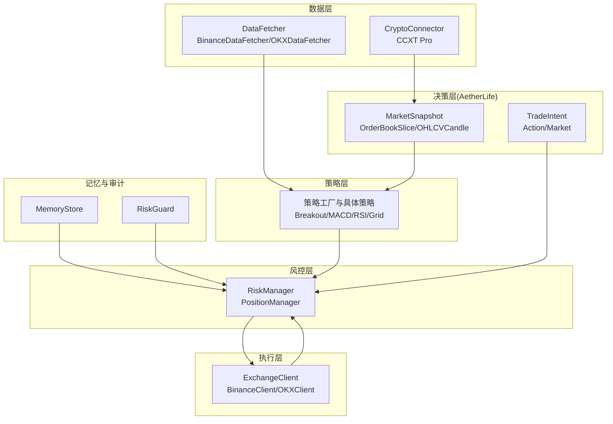
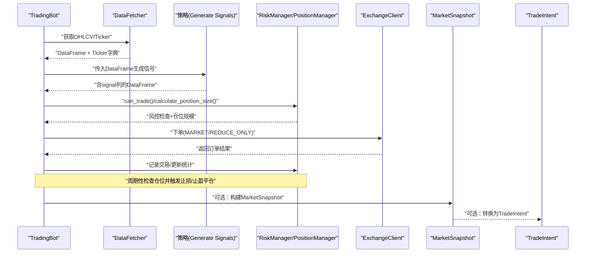
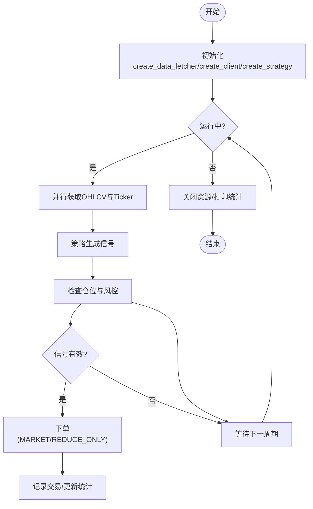
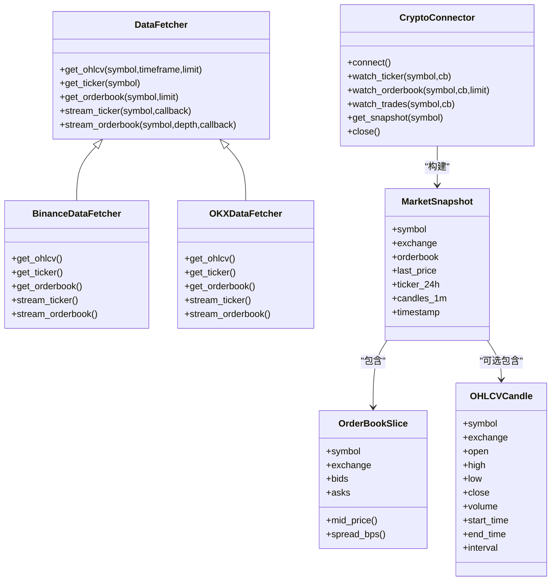
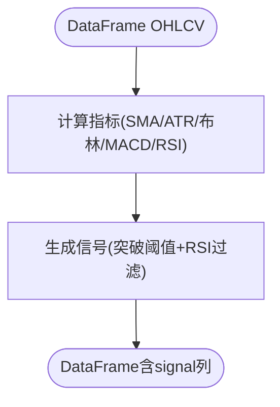
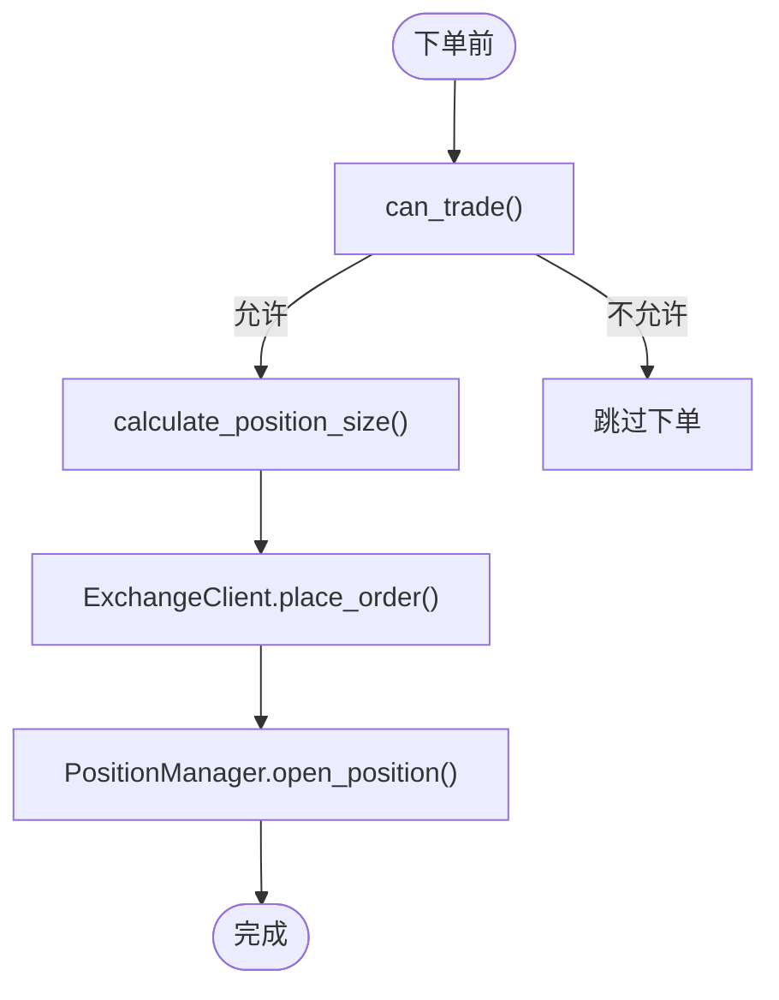
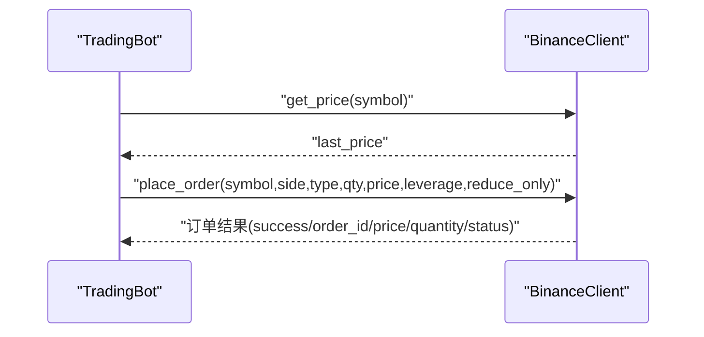
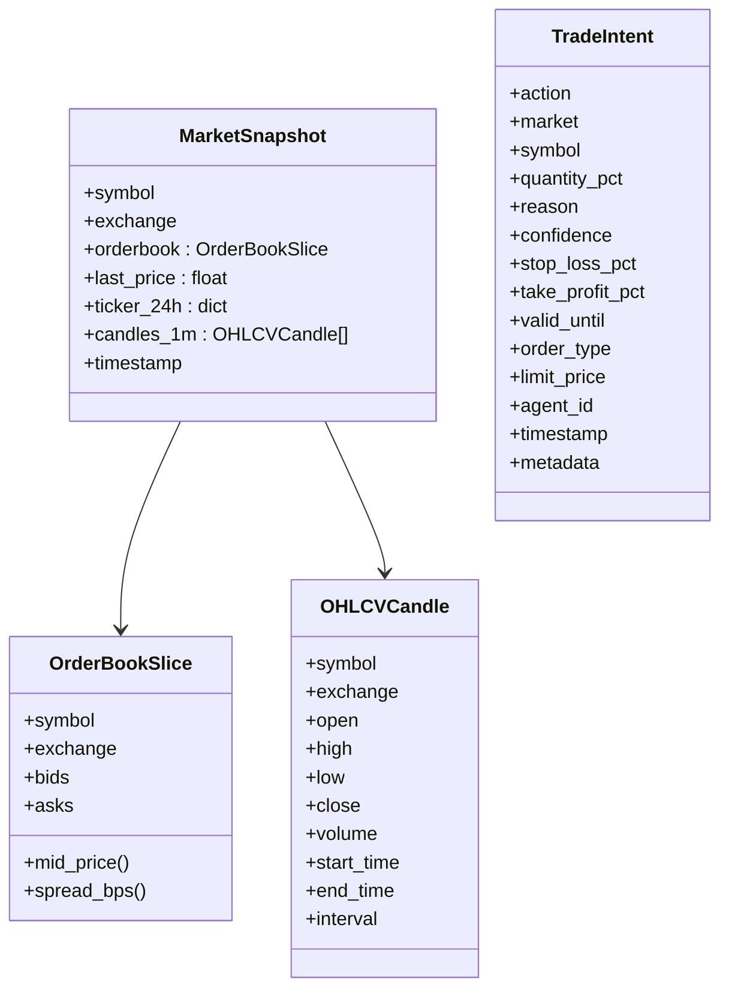
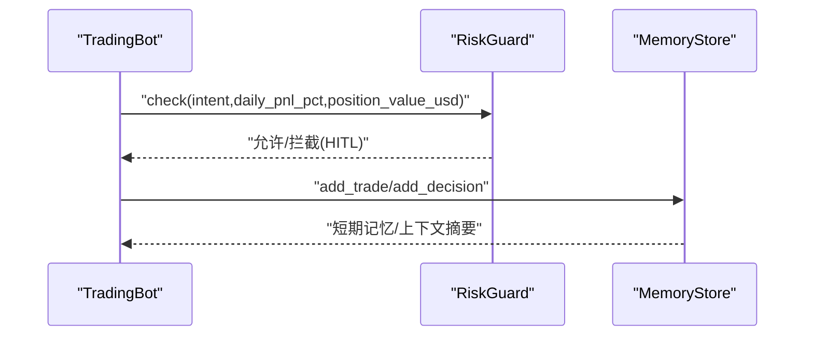
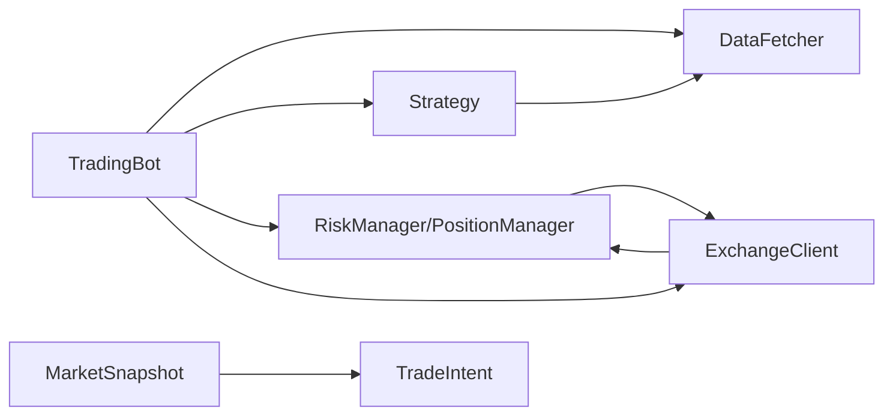

# 数据流分析

<cite>
**本文引用的文件**
- [src/trading_bot.py](file://src/trading_bot.py)
- [src/data/data_fetcher.py](file://src/data/data_fetcher.py)
- [src/execution/exchange_client.py](file://src/execution/exchange_client.py)
- [src/utils/risk_manager.py](file://src/utils/risk_manager.py)
- [src/strategies/breakout.py](file://src/strategies/breakout.py)
- [src/aetherlife/perception/models.py](file://src/aetherlife/perception/models.py)
- [src/aetherlife/perception/crypto_connector.py](file://src/aetherlife/perception/crypto_connector.py)
- [src/aetherlife/cognition/schemas.py](file://src/aetherlife/cognition/schemas.py)
- [src/aetherlife/guard/risk_guard.py](file://src/aetherlife/guard/risk_guard.py)
- [src/aetherlife/memory/store.py](file://src/aetherlife/memory/store.py)
- [configs/config.json](file://configs/config.json)
</cite>

## 目录
1. [引言](#引言)
2. [项目结构](#项目结构)
3. [核心组件](#核心组件)
4. [架构总览](#架构总览)
5. [详细组件分析](#详细组件分析)
6. [依赖关系分析](#依赖关系分析)
7. [性能考量](#性能考量)
8. [故障排查指南](#故障排查指南)
9. [结论](#结论)
10. [附录](#附录)

## 引言
本文件面向量化交易系统，聚焦“从市场数据获取、策略分析、风险评估到订单执行”的完整数据流。文档将梳理关键数据模型的生成与转换过程，包括 MarketSnapshot、TradeIntent、Position、Order 等，并分析实时数据流处理机制、批量数据处理策略与数据缓存优化方案，提供数据流图、关键节点说明与性能优化建议。

## 项目结构
系统采用分层架构：
- 数据层：负责从交易所拉取 OHLCV、Ticker、OrderBook 等实时/批量数据
- 策略层：基于 OHLCV 计算指标并生成交易信号
- 风控层：负责仓位规模、止损止盈、熔断与每日限额
- 执行层：对接交易所下单、查询账户与仓位
- 决策层（AetherLife）：提供 MarketSnapshot、TradeIntent 等结构化输出，支撑多智能体与跨市场信号
- 记忆与审计：短期记忆、审计日志与可选 Redis 持久化

图表来源
- [src/data/data_fetcher.py](file://src/data/data_fetcher.py#L17-L71)
- [src/aetherlife/perception/crypto_connector.py](file://src/aetherlife/perception/crypto_connector.py#L23-L86)
- [src/strategies/breakout.py](file://src/strategies/breakout.py#L6-L79)
- [src/utils/risk_manager.py](file://src/utils/risk_manager.py#L12-L242)
- [src/execution/exchange_client.py](file://src/execution/exchange_client.py#L20-L85)
- [src/aetherlife/perception/models.py](file://src/aetherlife/perception/models.py#L15-L64)
- [src/aetherlife/cognition/schemas.py](file://src/aetherlife/cognition/schemas.py#L32-L62)
- [src/aetherlife/memory/store.py](file://src/aetherlife/memory/store.py#L43-L155)
- [src/aetherlife/guard/risk_guard.py](file://src/aetherlife/guard/risk_guard.py#L23-L84)

章节来源
- [src/trading_bot.py](file://src/trading_bot.py#L27-L91)
- [src/data/data_fetcher.py](file://src/data/data_fetcher.py#L17-L71)
- [src/aetherlife/perception/crypto_connector.py](file://src/aetherlife/perception/crypto_connector.py#L23-L86)
- [src/strategies/breakout.py](file://src/strategies/breakout.py#L6-L79)
- [src/utils/risk_manager.py](file://src/utils/risk_manager.py#L12-L242)
- [src/execution/exchange_client.py](file://src/execution/exchange_client.py#L20-L85)
- [src/aetherlife/perception/models.py](file://src/aetherlife/perception/models.py#L15-L64)
- [src/aetherlife/cognition/schemas.py](file://src/aetherlife/cognition/schemas.py#L32-L62)
- [src/aetherlife/memory/store.py](file://src/aetherlife/memory/store.py#L43-L155)
- [src/aetherlife/guard/risk_guard.py](file://src/aetherlife/guard/risk_guard.py#L23-L84)

## 核心组件
- 交易机器人 TradingBot：编排数据获取、策略分析、风控检查与订单执行的主循环
- 数据获取 DataFetcher：抽象交易所接口，提供 OHLCV、Ticker、OrderBook、资金费率等
- 策略 BreakoutStrategy：基于滚动窗口、ATR、布林带、MACD、RSI等生成信号
- 风控 RiskManager/PositionManager：计算仓位规模、检查止损止盈、熔断与每日限额
- 交易所客户端 ExchangeClient：封装下单、撤单、查询账户与仓位、设置杠杆
- 决策模型 MarketSnapshot/TradeIntent：统一市场快照与交易意图结构
- 记忆与审计 MemoryStore/RiskGuard：短期记忆、审计日志与风控拦截

章节来源
- [src/trading_bot.py](file://src/trading_bot.py#L27-L91)
- [src/data/data_fetcher.py](file://src/data/data_fetcher.py#L17-L71)
- [src/strategies/breakout.py](file://src/strategies/breakout.py#L6-L79)
- [src/utils/risk_manager.py](file://src/utils/risk_manager.py#L12-L242)
- [src/execution/exchange_client.py](file://src/execution/exchange_client.py#L20-L85)
- [src/aetherlife/perception/models.py](file://src/aetherlife/perception/models.py#L15-L64)
- [src/aetherlife/cognition/schemas.py](file://src/aetherlife/cognition/schemas.py#L32-L62)
- [src/aetherlife/memory/store.py](file://src/aetherlife/memory/store.py#L43-L155)
- [src/aetherlife/guard/risk_guard.py](file://src/aetherlife/guard/risk_guard.py#L23-L84)

## 架构总览
下图展示从市场数据到订单执行的端到端数据流，标注关键数据模型与转换节点。

图表来源
- [src/trading_bot.py](file://src/trading_bot.py#L92-L205)
- [src/data/data_fetcher.py](file://src/data/data_fetcher.py#L40-L62)
- [src/strategies/breakout.py](file://src/strategies/breakout.py#L64-L79)
- [src/utils/risk_manager.py](file://src/utils/risk_manager.py#L62-L194)
- [src/execution/exchange_client.py](file://src/execution/exchange_client.py#L226-L275)
- [src/aetherlife/perception/models.py](file://src/aetherlife/perception/models.py#L55-L64)
- [src/aetherlife/cognition/schemas.py](file://src/aetherlife/cognition/schemas.py#L32-L62)

## 详细组件分析

### 组件A：交易机器人 TradingBot
- 职责：初始化配置与各子系统、主循环拉取数据、分析信号、风控检查、执行订单、周期性检查仓位
- 关键流程：
  - 初始化：校验配置、创建 DataFetcher/ExchangeClient/Strategy
  - 主循环：fetch_market_data 并行获取 OHLCV 与 Ticker，analyze 生成信号，check_positions 检查止损止盈，execute_signal 执行下单
  - 停止：关闭 DataFetcher 与 ExchangeClient，打印交易统计

图表来源
- [src/trading_bot.py](file://src/trading_bot.py#L63-L297)

章节来源
- [src/trading_bot.py](file://src/trading_bot.py#L27-L297)

### 组件B：数据获取 DataFetcher 与 CryptoConnector
- DataFetcher 抽象：定义 get_ohlcv/get_ticker/get_orderbook/stream_ticker/stream_orderbook 等接口
- BinanceDataFetcher/OKXDataFetcher：实现 REST 接口，支持测试网与正式网
- CryptoConnector（CCXT Pro）：提供 WebSocket 实时订阅 Ticker/OrderBook/Trades，支持自动重连与回调
- 关键数据模型：MarketSnapshot、OrderBookSlice、OHLCVCandle

图表来源
- [src/data/data_fetcher.py](file://src/data/data_fetcher.py#L17-L71)
- [src/data/data_fetcher.py](file://src/data/data_fetcher.py#L73-L408)
- [src/aetherlife/perception/crypto_connector.py](file://src/aetherlife/perception/crypto_connector.py#L23-L369)
- [src/aetherlife/perception/models.py](file://src/aetherlife/perception/models.py#L15-L64)

章节来源
- [src/data/data_fetcher.py](file://src/data/data_fetcher.py#L17-L434)
- [src/aetherlife/perception/crypto_connector.py](file://src/aetherlife/perception/crypto_connector.py#L23-L369)
- [src/aetherlife/perception/models.py](file://src/aetherlife/perception/models.py#L15-L64)

### 组件C：策略 BreakoutStrategy
- 分析阶段：计算 SMA、最高/最低、ATR、布林带、MACD、RSI
- 信号生成：基于突破阈值与 RSI 过热/过冷过滤生成 1/-1/0 信号
- 与 TradingBot 的集成：TradingBot.analyze 将 DataFrame 传入策略，取最新信号

图表来源
- [src/strategies/breakout.py](file://src/strategies/breakout.py#L21-L79)

章节来源
- [src/strategies/breakout.py](file://src/strategies/breakout.py#L6-L79)

### 组件D：风控与仓位 RiskManager/PositionManager
- RiskManager：计算仓位规模、检查止损止盈、熔断、每日限额、记录交易并维护统计
- PositionManager：开仓/平仓、更新浮动盈亏、查询仓位、设置止损止盈
- 与 TradingBot 的交互：execute_signal 前调用 can_trade/calculate_position_size，平仓后记录交易

图表来源
- [src/utils/risk_manager.py](file://src/utils/risk_manager.py#L62-L194)
- [src/execution/exchange_client.py](file://src/execution/exchange_client.py#L226-L275)
- [src/utils/risk_manager.py](file://src/utils/risk_manager.py#L244-L339)

章节来源
- [src/utils/risk_manager.py](file://src/utils/risk_manager.py#L12-L388)

### 组件E：执行层 ExchangeClient
- BinanceClient：REST/WS 接口封装，下单时动态精度处理与步进校验，设置杠杆与保证金模式
- OKXClient：占位实现，部分接口返回占位结果
- 与 TradingBot 的交互：获取价格、账户余额、下单、设置杠杆

图表来源
- [src/execution/exchange_client.py](file://src/execution/exchange_client.py#L181-L275)

章节来源
- [src/execution/exchange_client.py](file://src/execution/exchange_client.py#L20-L432)

### 组件F：决策层数据模型 MarketSnapshot 与 TradeIntent
- MarketSnapshot：统一的市场快照，包含订单簿、24h行情、可选 K 线与时间戳
- OrderBookSlice：统一订单簿结构，提供 mid_price/spread_bps
- TradeIntent：结构化交易意图，包含动作、市场、数量比例、止盈止损、有效期与元数据
- 与 TradingBot 的关系：TradingBot 主循环使用 DataFetcher/CCXT 提供的数据，可选转换为 MarketSnapshot/TradeIntent 供更高层使用

图表来源
- [src/aetherlife/perception/models.py](file://src/aetherlife/perception/models.py#L15-L64)
- [src/aetherlife/cognition/schemas.py](file://src/aetherlife/cognition/schemas.py#L32-L62)

章节来源
- [src/aetherlife/perception/models.py](file://src/aetherlife/perception/models.py#L15-L64)
- [src/aetherlife/cognition/schemas.py](file://src/aetherlife/cognition/schemas.py#L32-L62)

### 组件G：记忆与审计 MemoryStore 与 RiskGuard
- MemoryStore：短期事件与决策记忆，支持 Redis 持久化与加载，提供上下文摘要与当日 PnL
- RiskGuard：执行前风控拦截，支持熔断、单日最大亏损、大额 HITL 审计

图表来源
- [src/aetherlife/guard/risk_guard.py](file://src/aetherlife/guard/risk_guard.py#L48-L84)
- [src/aetherlife/memory/store.py](file://src/aetherlife/memory/store.py#L64-L139)

章节来源
- [src/aetherlife/guard/risk_guard.py](file://src/aetherlife/guard/risk_guard.py#L16-L84)
- [src/aetherlife/memory/store.py](file://src/aetherlife/memory/store.py#L43-L155)

## 依赖关系分析
- TradingBot 依赖 DataFetcher/ExchangeClient/Strategy/RiskManager/PositionManager
- 策略依赖 pandas/numpy 进行指标计算
- 风控依赖 RiskManager/PositionManager 进行风控与统计
- 执行层依赖 ExchangeClient 进行下单与查询
- 决策层模型独立于主循环，可被更高层（如 AetherLife Orchestrator）复用

图表来源
- [src/trading_bot.py](file://src/trading_bot.py#L14-L85)
- [src/strategies/breakout.py](file://src/strategies/breakout.py#L6-L79)
- [src/utils/risk_manager.py](file://src/utils/risk_manager.py#L12-L242)
- [src/execution/exchange_client.py](file://src/execution/exchange_client.py#L20-L85)
- [src/aetherlife/perception/models.py](file://src/aetherlife/perception/models.py#L55-L64)
- [src/aetherlife/cognition/schemas.py](file://src/aetherlife/cognition/schemas.py#L32-L62)

章节来源
- [src/trading_bot.py](file://src/trading_bot.py#L14-L85)

## 性能考量
- 并行获取：TradingBot.fetch_market_data 并行获取 OHLCV 与 Ticker，降低主循环等待
- 异步网络：DataFetcher/ExchangeClient/CryptoConnector 均采用异步 HTTP/WebSocket，提升吞吐
- 精度与步进：BinanceClient 在市价单中进行精度与步进校验，避免下单失败
- 批量与去重：Kafka 数据管道对 Tick/OrderBook 做去重与时序对齐，减少重复处理
- 缓存与会话：DataFetcher/ExchangeClient 复用 aiohttp 会话，减少连接开销
- 配置驱动：通过 config.json 控制交易对、时间周期、杠杆与风控参数，便于快速调整

章节来源
- [src/trading_bot.py](file://src/trading_bot.py#L92-L99)
- [src/data/data_fetcher.py](file://src/data/data_fetcher.py#L27-L38)
- [src/execution/exchange_client.py](file://src/execution/exchange_client.py#L238-L254)
- [src/aetherlife/perception/kafka_producer.py](file://src/aetherlife/perception/kafka_producer.py#L237-L270)
- [configs/config.json](file://configs/config.json#L1-L28)

## 故障排查指南
- 配置校验失败：TradingBot.initialize 校验配置并记录错误，检查 exchange/testnet/symbols/timeframe/strategy 等
- API 错误：DataFetcher/BinanceClient 在响应中检测错误码并抛出异常，检查网络与凭证
- 下单失败：ExchangeClient.place_order 捕获异常并记录，检查精度、步进、可用余额与杠杆设置
- 风控拦截：RiskManager.can_trade 返回 should_stop/reason，根据熔断/限额/暂停状态排查
- 记忆与审计：MemoryStore 提供短期记忆与上下文摘要，RiskGuard 审计日志可定位异常事件

章节来源
- [src/trading_bot.py](file://src/trading_bot.py#L63-L89)
- [src/data/data_fetcher.py](file://src/data/data_fetcher.py#L95-L98)
- [src/execution/exchange_client.py](file://src/execution/exchange_client.py#L165-L170)
- [src/utils/risk_manager.py](file://src/utils/risk_manager.py#L175-L194)
- [src/aetherlife/guard/risk_guard.py](file://src/aetherlife/guard/risk_guard.py#L70-L84)

## 结论
本系统通过清晰的分层与模块化设计，实现了从市场数据到订单执行的闭环数据流。关键数据模型（MarketSnapshot、TradeIntent）为上层智能体与跨市场分析提供了统一基础。通过并行获取、异步网络、风控拦截与记忆审计，系统在性能与可靠性之间取得平衡。建议后续在高并发场景下引入 Kafka 管道与 Redis 持久化，进一步增强实时性与可运维性。

## 附录
- 配置文件位置与关键字段参考：configs/config.json
- 代码片段路径参考：见各章节来源