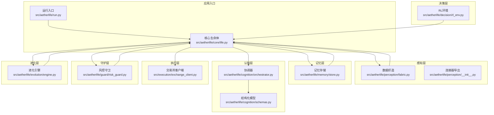
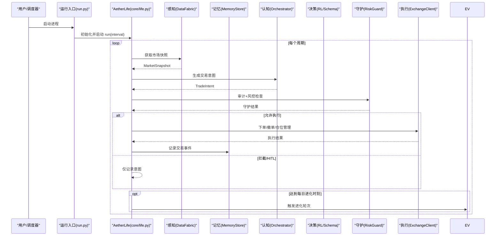
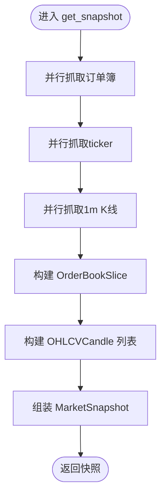
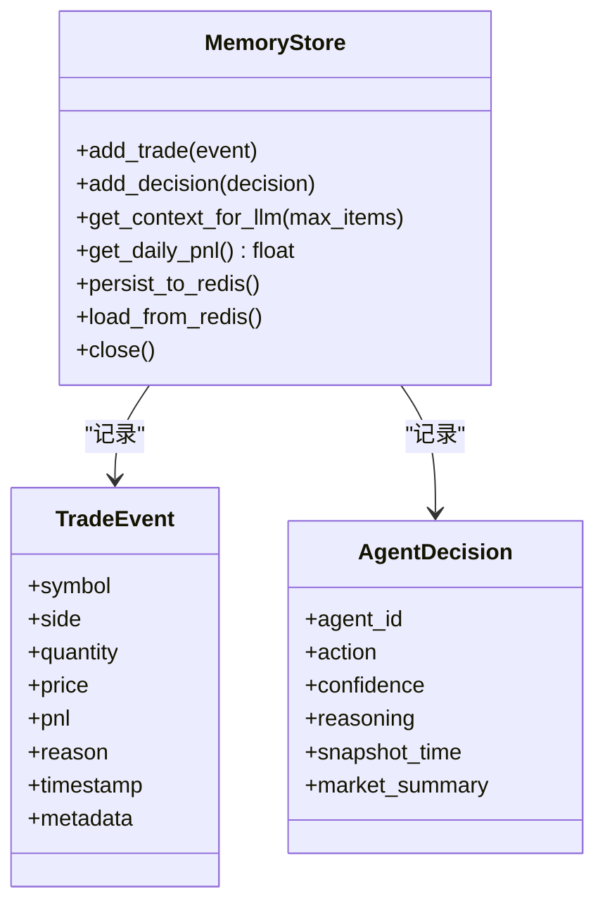
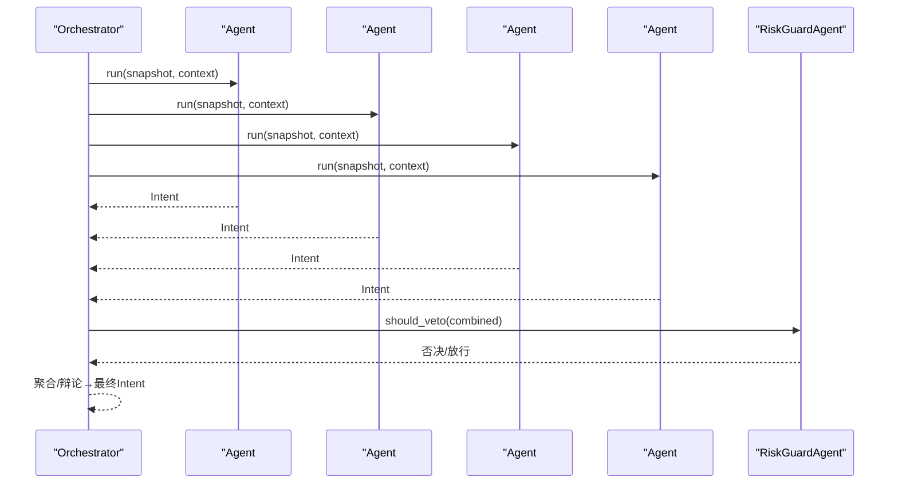
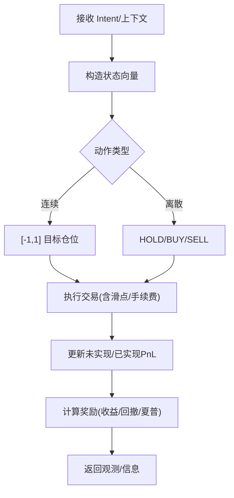
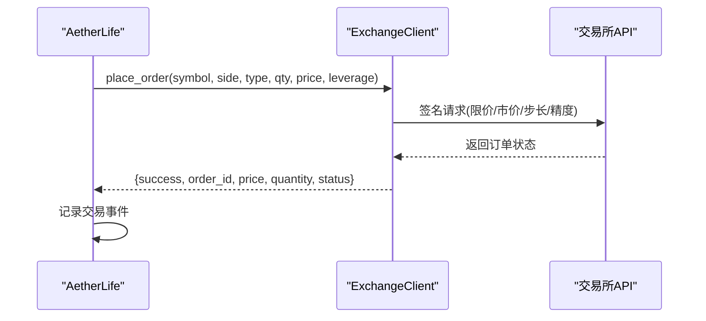
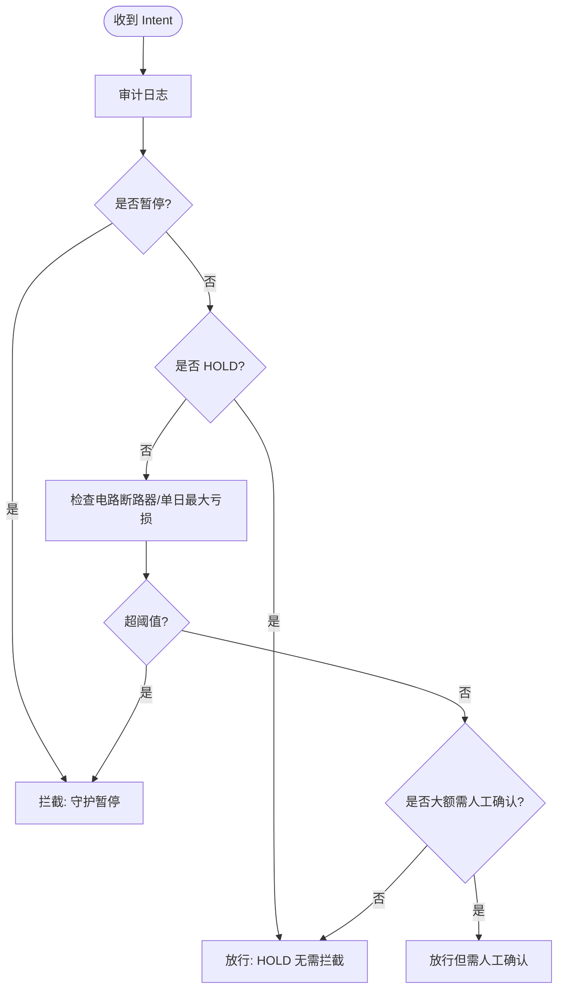
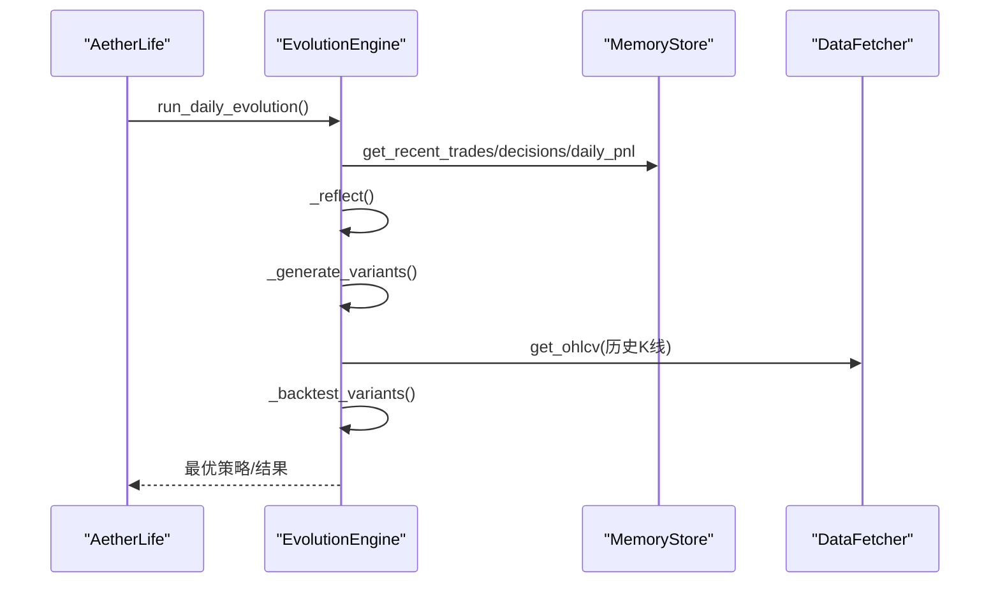
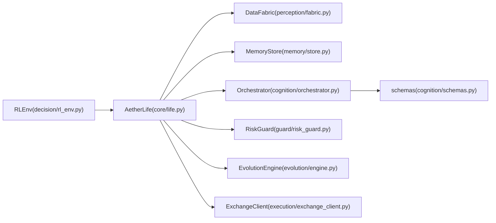

# 整体架构概览

<cite>
**本文引用的文件**
- [src/aetherlife/__init__.py](file://src/aetherlife/__init__.py)
- [src/aetherlife/run.py](file://src/aetherlife/run.py)
- [src/aetherlife/config.py](file://src/aetherlife/config.py)
- [src/aetherlife/core/life.py](file://src/aetherlife/core/life.py)
- [src/aetherlife/perception/__init__.py](file://src/aetherlife/perception/__init__.py)
- [src/aetherlife/perception/fabric.py](file://src/aetherlife/perception/fabric.py)
- [src/aetherlife/memory/store.py](file://src/aetherlife/memory/store.py)
- [src/aetherlife/cognition/orchestrator.py](file://src/aetherlife/cognition/orchestrator.py)
- [src/aetherlife/cognition/schemas.py](file://src/aetherlife/cognition/schemas.py)
- [src/aetherlife/decision/rl_env.py](file://src/aetherlife/decision/rl_env.py)
- [src/aetherlife/guard/risk_guard.py](file://src/aetherlife/guard/risk_guard.py)
- [src/aetherlife/evolution/engine.py](file://src/aetherlife/evolution/engine.py)
- [src/execution/exchange_client.py](file://src/execution/exchange_client.py)
</cite>

## 目录
1. [引言](#引言)
2. [项目结构](#项目结构)
3. [核心组件](#核心组件)
4. [架构总览](#架构总览)
5. [详细组件分析](#详细组件分析)
6. [依赖关系分析](#依赖关系分析)
7. [性能考量](#性能考量)
8. [故障排查指南](#故障排查指南)
9. [结论](#结论)
10. [附录](#附录)

## 引言
本文件面向量化交易系统“AetherLife”的整体架构概览，围绕其“感知→记忆→认知→决策→守护→执行→进化”的七层闭环进行系统化阐述。文档旨在帮助读者快速理解各层级职责、相互关系与数据流，掌握系统边界与控制流，并提供可扩展性与模块化设计原则指导。

## 项目结构
AetherLife采用分层模块化组织，核心入口位于运行脚本，配置集中于全局配置对象，各层级组件分别位于独立子包中，便于演进与替换。

图表来源
- [src/aetherlife/run.py](file://src/aetherlife/run.py#L52-L71)
- [src/aetherlife/core/life.py](file://src/aetherlife/core/life.py#L20-L46)
- [src/aetherlife/perception/fabric.py](file://src/aetherlife/perception/fabric.py#L13-L31)
- [src/aetherlife/memory/store.py](file://src/aetherlife/memory/store.py#L43-L63)
- [src/aetherlife/cognition/orchestrator.py](file://src/aetherlife/cognition/orchestrator.py#L16-L36)
- [src/aetherlife/cognition/schemas.py](file://src/aetherlife/cognition/schemas.py#L32-L58)
- [src/aetherlife/decision/rl_env.py](file://src/aetherlife/decision/rl_env.py#L26-L96)
- [src/aetherlife/guard/risk_guard.py](file://src/aetherlife/guard/risk_guard.py#L23-L43)
- [src/aetherlife/evolution/engine.py](file://src/aetherlife/evolution/engine.py#L17-L38)
- [src/execution/exchange_client.py](file://src/execution/exchange_client.py#L20-L41)

章节来源
- [src/aetherlife/run.py](file://src/aetherlife/run.py#L1-L71)
- [src/aetherlife/core/life.py](file://src/aetherlife/core/life.py#L1-L164)

## 核心组件
- 全局配置中心：集中定义感知、记忆、认知、决策、执行、守护、进化各层的参数与行为开关，支持从JSON加载与环境变量覆盖。
- 运行入口：负责加载配置、初始化AetherLife实例、启动主循环与优雅关闭。
- AetherLife核心：封装单周期生命周期，串联感知→认知→决策→守护→执行，并在每日固定时刻触发进化。

章节来源
- [src/aetherlife/config.py](file://src/aetherlife/config.py#L98-L131)
- [src/aetherlife/run.py](file://src/aetherlife/run.py#L32-L71)
- [src/aetherlife/core/life.py](file://src/aetherlife/core/life.py#L20-L88)

## 架构总览
AetherLife采用“感知→认知→决策→守护→执行”的闭环流程，结合记忆与进化形成持续优化的自主交易系统。系统边界以内核AetherLife为核心，向外通过模块化组件与外部数据/执行接口耦合。

图表来源
- [src/aetherlife/run.py](file://src/aetherlife/run.py#L52-L71)
- [src/aetherlife/core/life.py](file://src/aetherlife/core/life.py#L59-L149)
- [src/aetherlife/perception/fabric.py](file://src/aetherlife/perception/fabric.py#L32-L82)
- [src/aetherlife/cognition/orchestrator.py](file://src/aetherlife/cognition/orchestrator.py#L38-L53)
- [src/aetherlife/guard/risk_guard.py](file://src/aetherlife/guard/risk_guard.py#L48-L68)
- [src/execution/exchange_client.py](file://src/execution/exchange_client.py#L20-L85)
- [src/aetherlife/evolution/engine.py](file://src/aetherlife/evolution/engine.py#L45-L60)

## 详细组件分析

### 感知层（Perception）
- 职责：统一接入多数据源，生成标准化市场快照（订单簿、最新价、K线等），支持轮询与未来WS/Kafka扩展。
- 关键实现：DataFabric负责并行抓取订单簿、ticker与K线，组装为MarketSnapshot；连接器导出支持多种外部系统。
- 数据流：从数据获取器并行拉取→标准化→返回给核心生命周期。

图表来源
- [src/aetherlife/perception/fabric.py](file://src/aetherlife/perception/fabric.py#L32-L82)

章节来源
- [src/aetherlife/perception/fabric.py](file://src/aetherlife/perception/fabric.py#L13-L88)
- [src/aetherlife/perception/__init__.py](file://src/aetherlife/perception/__init__.py#L1-L47)

### 记忆层（Memory）
- 职责：短期+情景记忆，支持内存与可选Redis持久化；提供上下文摘要与日收益统计。
- 关键实现：MemoryStore维护交易事件与决策列表，支持短时上下文拼接、Redis批量持久化/加载、日收益汇总。
- 数据流：执行后写入交易事件→更新短期上下文→供认知层与风控使用。

图表来源
- [src/aetherlife/memory/store.py](file://src/aetherlife/memory/store.py#L43-L155)

章节来源
- [src/aetherlife/memory/store.py](file://src/aetherlife/memory/store.py#L43-L155)

### 认知层（Cognition）
- 职责：多代理并行分析与聚合，可选辩论（多方/空方/法官）；最终输出结构化交易意图。
- 关键实现：Orchestrator管理多个专业Agent（做市、统计套利、订单流、新闻情绪等），支持权重聚合与风控否决；结构化模型定义TradeIntent、Vote、LangGraph状态等。
- 数据流：接收MarketSnapshot与短期上下文→多Agent并行推理→聚合/辩论→风险守卫否决→输出Intent。

图表来源
- [src/aetherlife/cognition/orchestrator.py](file://src/aetherlife/cognition/orchestrator.py#L38-L53)
- [src/aetherlife/cognition/schemas.py](file://src/aetherlife/cognition/schemas.py#L32-L74)

章节来源
- [src/aetherlife/cognition/orchestrator.py](file://src/aetherlife/cognition/orchestrator.py#L16-L93)
- [src/aetherlife/cognition/schemas.py](file://src/aetherlife/cognition/schemas.py#L32-L160)

### 决策层（Decision）
- 职责：提供结构化输出约束与可选强化学习环境，确保LLM/RL输出可解析、可审计、可复现。
- 关键实现：TradeIntent等Pydantic模型严格约束字段；TradingEnv构建状态/动作空间与奖励函数，支持连续/离散动作与合规惩罚。
- 数据流：认知层输出Intent→风控审计→执行层下单；RL环境用于策略训练与回测。

图表来源
- [src/aetherlife/decision/rl_env.py](file://src/aetherlife/decision/rl_env.py#L157-L223)
- [src/aetherlife/cognition/schemas.py](file://src/aetherlife/cognition/schemas.py#L32-L58)

章节来源
- [src/aetherlife/decision/rl_env.py](file://src/aetherlife/decision/rl_env.py#L26-L423)
- [src/aetherlife/cognition/schemas.py](file://src/aetherlife/cognition/schemas.py#L32-L74)

### 执行层（Execution）
- 职责：对接交易所API，完成下单、撤单、仓位管理与杠杆设置；提供抽象客户端与具体实现（如Binance）。
- 关键实现：ExchangeClient抽象+BinanceClient/OKXClient实现；下单时处理精度、步长与签名；支持测试网。
- 数据流：AetherLife根据Intent调用下单→返回执行结果→写入记忆。

图表来源
- [src/aetherlife/core/life.py](file://src/aetherlife/core/life.py#L89-L122)
- [src/execution/exchange_client.py](file://src/execution/exchange_client.py#L226-L275)

章节来源
- [src/execution/exchange_client.py](file://src/execution/exchange_client.py#L20-L432)
- [src/aetherlife/core/life.py](file://src/aetherlife/core/life.py#L89-L122)

### 守护层（Guard）
- 职责：执行前最后一道关卡，包括电路断路器、单日最大亏损限制、大额人工确认（HITL）、审计日志。
- 关键实现：RiskGuard提供check与audit方法，支持暂停状态、回调与文件落盘。
- 数据流：决策后先审计→再风控检查→放行/拦截/HITL。

图表来源
- [src/aetherlife/guard/risk_guard.py](file://src/aetherlife/guard/risk_guard.py#L48-L68)

章节来源
- [src/aetherlife/guard/risk_guard.py](file://src/aetherlife/guard/risk_guard.py#L23-L84)

### 进化层（Evolution）
- 职责：每日反思→生成策略变体→回测→选优→部署（可选）。支持参数扰动与简单回测。
- 关键实现：EvolutionEngine读取记忆中的交易与决策→生成变体→回测→选择最佳策略。
- 数据流：主循环在固定时刻触发→反思→生成→回测→择优。

图表来源
- [src/aetherlife/core/life.py](file://src/aetherlife/core/life.py#L141-L144)
- [src/aetherlife/evolution/engine.py](file://src/aetherlife/evolution/engine.py#L45-L60)

章节来源
- [src/aetherlife/evolution/engine.py](file://src/aetherlife/evolution/engine.py#L17-L145)

## 依赖关系分析
- 层内高内聚：每层内部职责单一，接口清晰。
- 层间低耦合：通过标准化数据结构（MarketSnapshot、TradeIntent、DecisionContext）解耦。
- 外部依赖：交易所API、Redis、可选Kafka/WS；通过工厂/创建函数注入，便于替换。
- 循环依赖规避：核心生命周期驱动各层协作，未见直接循环引用。

图表来源
- [src/aetherlife/core/life.py](file://src/aetherlife/core/life.py#L20-L46)
- [src/aetherlife/perception/fabric.py](file://src/aetherlife/perception/fabric.py#L13-L31)
- [src/aetherlife/memory/store.py](file://src/aetherlife/memory/store.py#L43-L63)
- [src/aetherlife/cognition/orchestrator.py](file://src/aetherlife/cognition/orchestrator.py#L16-L36)
- [src/aetherlife/cognition/schemas.py](file://src/aetherlife/cognition/schemas.py#L32-L58)
- [src/aetherlife/decision/rl_env.py](file://src/aetherlife/decision/rl_env.py#L26-L96)
- [src/aetherlife/guard/risk_guard.py](file://src/aetherlife/guard/risk_guard.py#L23-L43)
- [src/aetherlife/evolution/engine.py](file://src/aetherlife/evolution/engine.py#L17-L38)
- [src/execution/exchange_client.py](file://src/execution/exchange_client.py#L20-L41)

章节来源
- [src/aetherlife/core/life.py](file://src/aetherlife/core/life.py#L20-L46)
- [src/aetherlife/config.py](file://src/aetherlife/config.py#L98-L131)

## 性能考量
- 并行抓取：感知层对订单簿、ticker、K线采用并发拉取，降低单点等待。
- 短期上下文：记忆层维护有限长度的短期上下文，平衡LLM上下文窗口与实时性。
- RL训练：环境状态维数与观测向量设计考虑计算效率，动作空间可连续/离散折中延迟与稳定性。
- 执行精度：下单前按交易所步长与精度规整数量，减少无效请求与失败重试。
- 持久化：Redis批量写入/修剪，避免阻塞主循环。

## 故障排查指南
- 启动与配置
  - 确认运行入口加载配置成功，优先级：配置文件→环境变量。
  - 检查日志级别与审计文件路径配置。
- 感知层
  - 若快照为空，检查数据获取器可用性与网络连通性。
  - 确认Symbol与市场类型匹配。
- 记忆层
  - Redis不可用时不影响内存模式，但无法持久化；检查URL与权限。
- 认知层
  - 多Agent聚合/辩论异常时，查看各Agent输出与权重配置。
- 决策层
  - RL环境需安装gymnasium；动作/状态空间与奖励函数可调。
- 执行层
  - API密钥、测试网开关、杠杆与精度配置需正确；关注签名与限流。
- 守护层
  - 断路器阈值与单日最大亏损阈值需结合资金曲线调整；HITL阈值用于大额人工确认。
- 进化层
  - 回测数据拉取失败时，检查历史数据服务与网络；策略变体过多可限制生成数量。

章节来源
- [src/aetherlife/run.py](file://src/aetherlife/run.py#L32-L49)
- [src/aetherlife/perception/fabric.py](file://src/aetherlife/perception/fabric.py#L32-L82)
- [src/aetherlife/memory/store.py](file://src/aetherlife/memory/store.py#L90-L126)
- [src/aetherlife/decision/rl_env.py](file://src/aetherlife/decision/rl_env.py#L62-L63)
- [src/execution/exchange_client.py](file://src/execution/exchange_client.py#L136-L170)
- [src/aetherlife/guard/risk_guard.py](file://src/aetherlife/guard/risk_guard.py#L48-L68)
- [src/aetherlife/evolution/engine.py](file://src/aetherlife/evolution/engine.py#L94-L101)

## 结论
AetherLife以“感知→认知→决策→守护→执行→记忆→进化”为主线，构建了可演进的自主交易闭环。通过模块化与标准化接口，系统具备良好的可扩展性与可维护性；通过风控与审计保障安全；通过进化机制持续优化策略表现。建议在生产环境中进一步完善WS/Kafka接入、向量记忆与合规引擎，并逐步引入LangGraph状态机与更复杂的RL策略。

## 附录
- 系统边界
  - 内部：AetherLife核心生命周期与各层组件。
  - 外部：交易所API、Redis、可选Kafka/WS、历史数据服务。
- 关键配置项参考
  - 感知层：多交易所、刷新间隔、新闻流开关。
  - 记忆层：Redis地址、上下文窗口、向量记忆开关、事件保留条数。
  - 认知层：协调器类型、Worker Agent集合、辩论开关、并行分析深度。
  - 决策层：决策模式（LLM结构化/RL/混合）、严格Schema、快速路径NN。
  - 执行层：引擎类型、交易所、测试网。
  - 守护层：HITL开关与阈值、断路器与单日最大亏损、审计日志。
  - 进化层：每日触发时刻、每轮变体数、最小夏普阈值、是否允许代码生成。

章节来源
- [src/aetherlife/config.py](file://src/aetherlife/config.py#L11-L131)