# 系统架构设计

<cite>
**本文引用的文件**
- [src/trading_bot.py](file://src/trading_bot.py)
- [src/aetherlife/core/life.py](file://src/aetherlife/core/life.py)
- [src/aetherlife/cognition/orchestrator.py](file://src/aetherlife/cognition/orchestrator.py)
- [src/aetherlife/memory/store.py](file://src/aetherlife/memory/store.py)
- [src/aetherlife/perception/fabric.py](file://src/aetherlife/perception/fabric.py)
- [src/aetherlife/guard/risk_guard.py](file://src/aetherlife/guard/risk_guard.py)
- [src/aetherlife/evolution/engine.py](file://src/aetherlife/evolution/engine.py)
- [src/execution/exchange_client.py](file://src/execution/exchange_client.py)
- [src/strategies/base.py](file://src/strategies/base.py)
- [src/utils/ai_enhancer.py](file://src/utils/ai_enhancer.py)
- [configs/config.json](file://configs/config.json)
- [src/aetherlife/__init__.py](file://src/aetherlife/__init__.py)
</cite>

## 目录
1. [引言](#引言)
2. [项目结构](#项目结构)
3. [核心组件](#核心组件)
4. [架构总览](#架构总览)
5. [详细组件分析](#详细组件分析)
6. [依赖分析](#依赖分析)
7. [性能考量](#性能考量)
8. [故障排查指南](#故障排查指南)
9. [结论](#结论)
10. [附录](#附录)

## 引言
本系统是一个面向合约市场的量化交易系统，采用分层架构设计，自下而上包含感知层、记忆层、认知层、决策层、执行层、守护层与进化层。系统同时提供两类运行形态：
- 传统策略驱动的交易机器人（TradingBot），强调快速落地与可配置；
- AetherLife 生命体框架，强调多智能体认知、记忆与自我进化。

系统目标是在高波动市场中实现稳定、可解释且可持续的超额收益，并通过风控与审计保障安全运营。

## 项目结构
仓库采用按功能域划分的目录组织方式，核心模块如下：
- aetherlife：以“以太生命体”为核心的高级框架，包含感知、记忆、认知、守护、进化等子模块；
- execution：执行层，封装交易所客户端与下单逻辑；
- strategies：策略工厂与多种策略实现；
- data：数据获取与缓存；
- utils：AI增强、风险与配置工具；
- configs：系统配置；
- scripts：演示脚本与实时数据展示；
- ui：管理后台与可视化仪表盘。

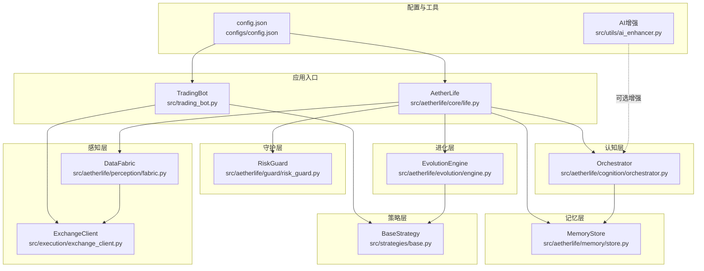

图表来源
- [src/trading_bot.py](file://src/trading_bot.py#L27-L346)
- [src/aetherlife/core/life.py](file://src/aetherlife/core/life.py#L20-L164)
- [src/aetherlife/perception/fabric.py](file://src/aetherlife/perception/fabric.py#L13-L88)
- [src/aetherlife/memory/store.py](file://src/aetherlife/memory/store.py#L43-L155)
- [src/aetherlife/cognition/orchestrator.py](file://src/aetherlife/cognition/orchestrator.py#L16-L93)
- [src/aetherlife/guard/risk_guard.py](file://src/aetherlife/guard/risk_guard.py#L23-L84)
- [src/aetherlife/evolution/engine.py](file://src/aetherlife/evolution/engine.py#L17-L145)
- [src/execution/exchange_client.py](file://src/execution/exchange_client.py#L20-L432)
- [src/strategies/base.py](file://src/strategies/base.py#L6-L31)
- [configs/config.json](file://configs/config.json#L1-L28)
- [src/utils/ai_enhancer.py](file://src/utils/ai_enhancer.py#L15-L360)

章节来源
- [src/aetherlife/__init__.py](file://src/aetherlife/__init__.py#L1-L13)

## 核心组件
- 交易机器人（TradingBot）：负责数据获取、策略分析、风控与执行闭环，支持多交易所与多策略切换。
- AetherLife 生命体：以感知-记忆-认知-决策-守护-执行-进化的完整生命周期运行，支持多Agent协同与自我优化。
- 执行层（ExchangeClient）：抽象交易所客户端，内置 Binance/OKX 支持，提供下单、撤单、杠杆与保证金设置等能力。
- 记忆层（MemoryStore）：短期与情景记忆，支持可选 Redis 持久化，提供上下文摘要与日收益统计。
- 认知层（Orchestrator）：多Agent聚合或辩论（多空视角）决策，结合风控Agent进行否决。
- 守护层（RiskGuard）：电路断路器、单日最大亏损、大额人工确认（HITL）与审计。
- 进化层（EvolutionEngine）：基于反思与回测的策略参数空间探索，选择夏普比率最优方案。
- 策略层（BaseStrategy 及其实现）：策略工厂与多种经典策略（突破、RSI、MACD、网格等）。
- AI增强（AI增强模块）：情绪分析、ML预测、多Agent协调与自动复利管理。

章节来源
- [src/trading_bot.py](file://src/trading_bot.py#L27-L346)
- [src/aetherlife/core/life.py](file://src/aetherlife/core/life.py#L20-L164)
- [src/execution/exchange_client.py](file://src/execution/exchange_client.py#L20-L432)
- [src/aetherlife/memory/store.py](file://src/aetherlife/memory/store.py#L43-L155)
- [src/aetherlife/cognition/orchestrator.py](file://src/aetherlife/cognition/orchestrator.py#L16-L93)
- [src/aetherlife/guard/risk_guard.py](file://src/aetherlife/guard/risk_guard.py#L23-L84)
- [src/aetherlife/evolution/engine.py](file://src/aetherlife/evolution/engine.py#L17-L145)
- [src/strategies/base.py](file://src/strategies/base.py#L6-L31)
- [src/utils/ai_enhancer.py](file://src/utils/ai_enhancer.py#L15-L360)

## 架构总览
系统采用分层解耦与模块化设计，核心流程如下：
- 感知层：DataFabric 统一从数据源拉取行情、订单簿与K线，形成 MarketSnapshot。
- 记忆层：MemoryStore 记录交易事件与Agent决策，提供短期记忆与上下文摘要。
- 认知层：Orchestrator 调度多个专业Agent（市场微观结构、技术面、新闻情绪等），聚合或辩论后输出 TradeIntent。
- 决策层：由 Orchestrator 决定行动方向与规模，结合风控Agent进行否决。
- 守护层：RiskGuard 在执行前进行电路断路器与HITL检查，必要时拦截或要求人工确认。
- 执行层：ExchangeClient 将意图转化为实际下单，处理精度与杠杆设置。
- 进化层：EvolutionEngine 每日反思与回测，筛选最优策略参数组合。

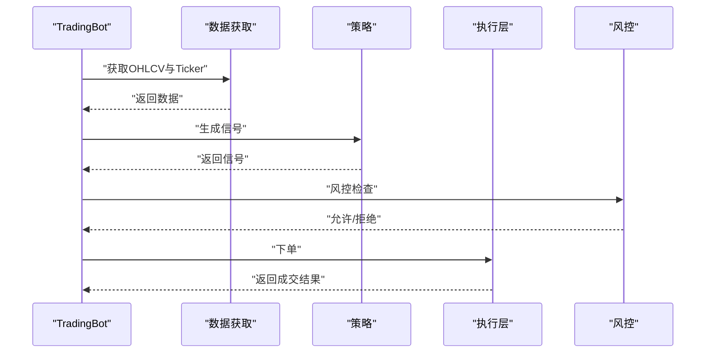

图表来源
- [src/trading_bot.py](file://src/trading_bot.py#L92-L205)
- [src/execution/exchange_client.py](file://src/execution/exchange_client.py#L226-L275)
- [src/utils/ai_enhancer.py](file://src/utils/ai_enhancer.py#L270-L317)

## 详细组件分析

### 分层架构职责与交互
- 感知层：DataFabric 并行拉取订单簿、Ticker与K线，统一为 MarketSnapshot，便于后续模块消费。
- 记忆层：MemoryStore 提供短期事件与决策记录，支持 Redis 持久化，便于重启后恢复与审计。
- 认知层：Orchestrator 以多Agent并行聚合或辩论方式生成 TradeIntent，权重与投票机制保证稳健性。
- 决策层：TradeIntent 包含动作、规模占比与置信度，作为执行依据。
- 守护层：RiskGuard 在执行前进行断路器与HITL检查，确保系统安全。
- 执行层：ExchangeClient 封装下单细节，处理精度、杠杆与保证金模式。
- 进化层：EvolutionEngine 基于反思与回测筛选最优参数组合，实现策略的自我优化。

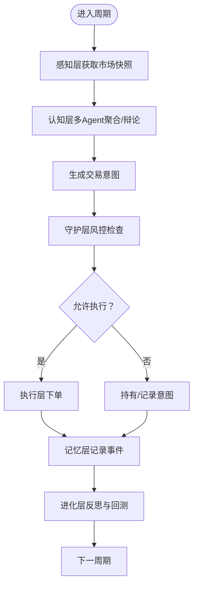

图表来源
- [src/aetherlife/core/life.py](file://src/aetherlife/core/life.py#L59-L149)
- [src/aetherlife/cognition/orchestrator.py](file://src/aetherlife/cognition/orchestrator.py#L38-L53)
- [src/aetherlife/guard/risk_guard.py](file://src/aetherlife/guard/risk_guard.py#L48-L68)
- [src/aetherlife/memory/store.py](file://src/aetherlife/memory/store.py#L64-L88)
- [src/aetherlife/evolution/engine.py](file://src/aetherlife/evolution/engine.py#L45-L60)

章节来源
- [src/aetherlife/perception/fabric.py](file://src/aetherlife/perception/fabric.py#L32-L82)
- [src/aetherlife/memory/store.py](file://src/aetherlife/memory/store.py#L43-L155)
- [src/aetherlife/cognition/orchestrator.py](file://src/aetherlife/cognition/orchestrator.py#L16-L93)
- [src/aetherlife/guard/risk_guard.py](file://src/aetherlife/guard/risk_guard.py#L23-L84)
- [src/aetherlife/evolution/engine.py](file://src/aetherlife/evolution/engine.py#L17-L145)

### 交易机器人（TradingBot）分析
- 初始化：校验配置、创建数据获取器、客户端与策略实例。
- 主循环：并行获取OHLCV与Ticker，生成信号，检查仓位与风控，执行下单与止盈止损。
- 风控：最大仓位比例、止损止盈阈值、单日最大亏损与连续亏损限制。
- 执行：根据信号与风控结果下单，处理精度与杠杆，记录交易统计。

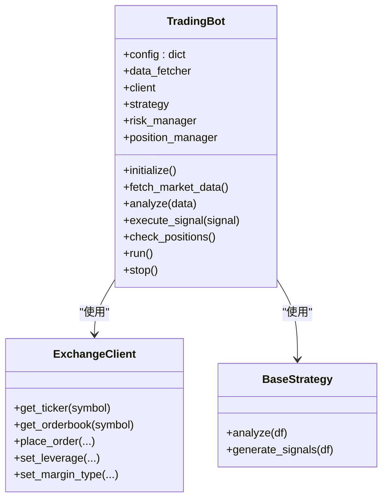

图表来源
- [src/trading_bot.py](file://src/trading_bot.py#L27-L346)
- [src/execution/exchange_client.py](file://src/execution/exchange_client.py#L20-L432)
- [src/strategies/base.py](file://src/strategies/base.py#L6-L31)

章节来源
- [src/trading_bot.py](file://src/trading_bot.py#L27-L346)

### AetherLife 生命体分析
- 生命周期：one_cycle 完成感知-认知-决策-审计-守护-执行的完整闭环。
- 执行：对接 ExchangeClient，按账户资金与意图计算下单数量，记录交易事件。
- 进化：每日凌晨触发 EvolutionEngine，进行反思、参数变体生成、回测与择优。

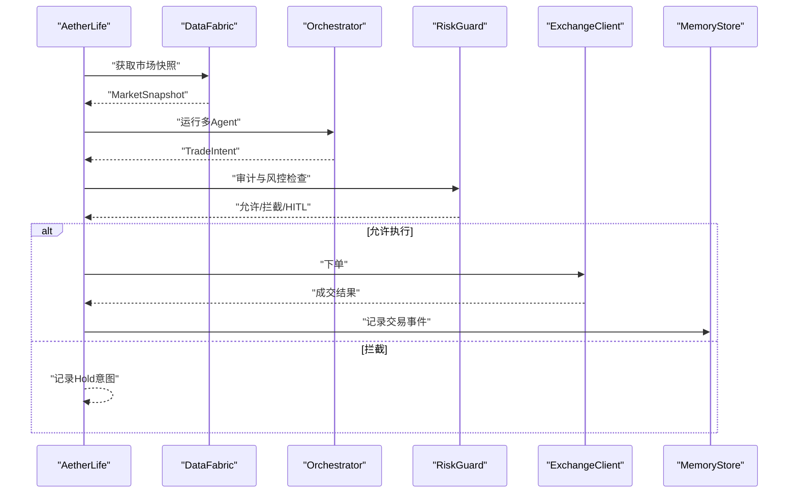

图表来源
- [src/aetherlife/core/life.py](file://src/aetherlife/core/life.py#L59-L122)
- [src/aetherlife/cognition/orchestrator.py](file://src/aetherlife/cognition/orchestrator.py#L38-L53)
- [src/aetherlife/guard/risk_guard.py](file://src/aetherlife/guard/risk_guard.py#L48-L68)
- [src/execution/exchange_client.py](file://src/execution/exchange_client.py#L226-L275)
- [src/aetherlife/memory/store.py](file://src/aetherlife/memory/store.py#L64-L88)

章节来源
- [src/aetherlife/core/life.py](file://src/aetherlife/core/life.py#L20-L164)

### 记忆层（MemoryStore）分析
- 数据结构：短期事件队列与决策队列，支持 JSON 序列化与 Redis 列表持久化。
- 上下文：为 LLM 提供短期记忆摘要，便于认知层决策。
- 日收益：按自然日统计 PnL，用于风控与进化。

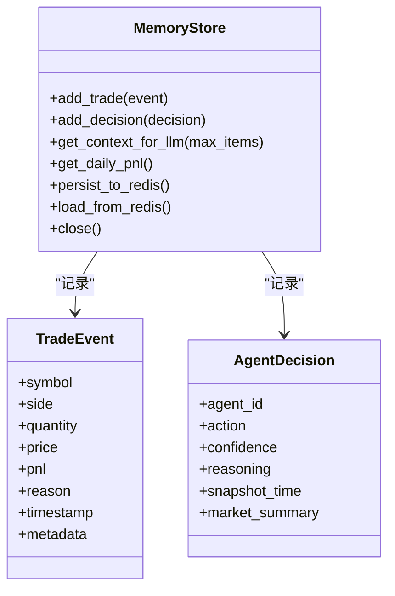

图表来源
- [src/aetherlife/memory/store.py](file://src/aetherlife/memory/store.py#L43-L155)

章节来源
- [src/aetherlife/memory/store.py](file://src/aetherlife/memory/store.py#L43-L155)

### 认知层（Orchestrator）分析
- 多Agent：市场微观结构、订单流、统计套利、新闻情绪等Agent并行分析。
- 聚合/辩论：默认加权聚合，可启用 Bull/Bear/Judge 辩论裁决。
- 风控否决：RiskGuardAgent 可对倾向性过强的意图进行否决。

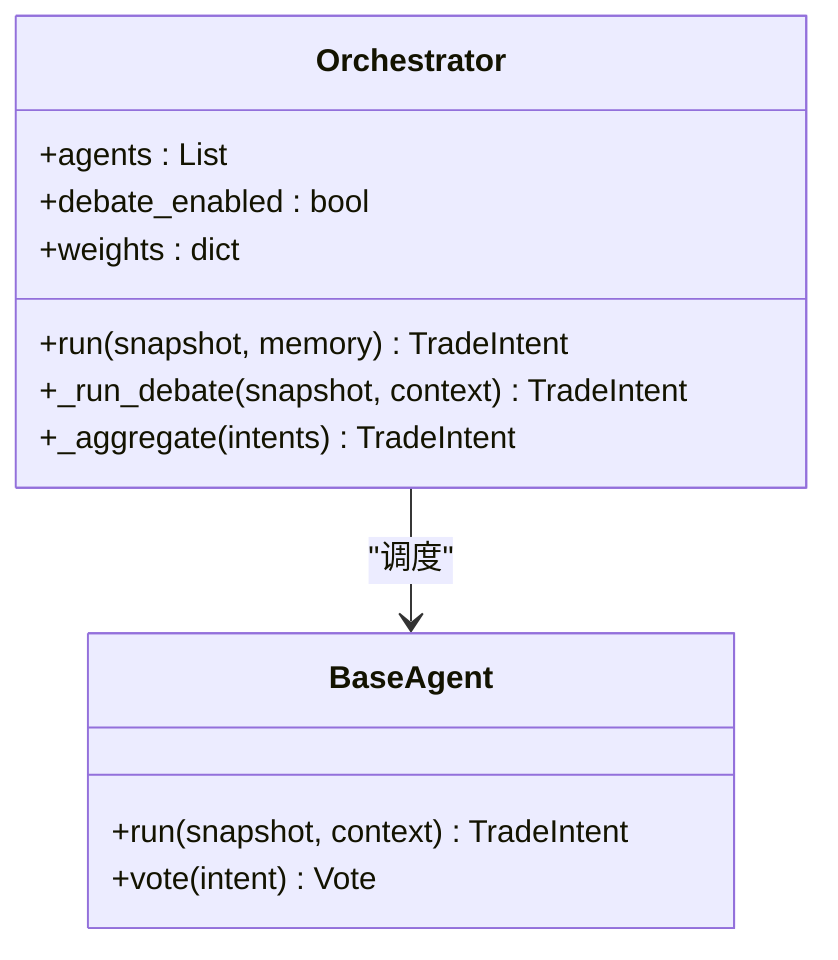

图表来源
- [src/aetherlife/cognition/orchestrator.py](file://src/aetherlife/cognition/orchestrator.py#L16-L93)

章节来源
- [src/aetherlife/cognition/orchestrator.py](file://src/aetherlife/cognition/orchestrator.py#L16-L93)

### 守护层（RiskGuard）分析
- 断路器：当日累计亏损达到阈值则拦截。
- 单日最大亏损：防止极端回撤扩大。
- HITL：大额头寸触发人工确认。
- 审计：统一审计日志输出与落盘。

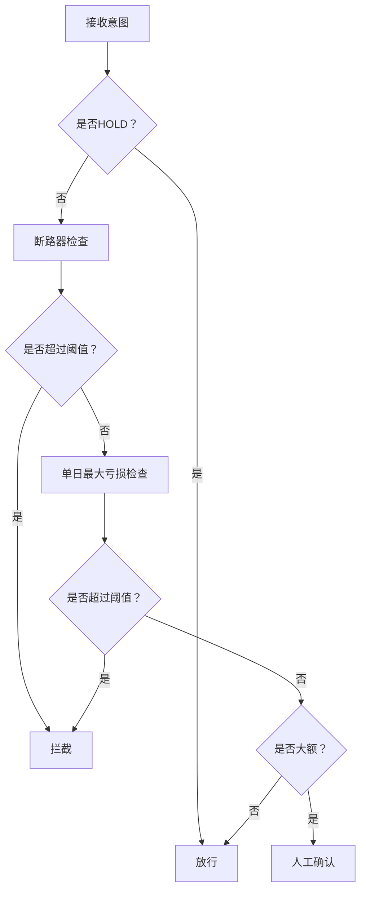

图表来源
- [src/aetherlife/guard/risk_guard.py](file://src/aetherlife/guard/risk_guard.py#L48-L68)

章节来源
- [src/aetherlife/guard/risk_guard.py](file://src/aetherlife/guard/risk_guard.py#L23-L84)

### 执行层（ExchangeClient）分析
- 抽象基类：定义统一接口，便于扩展多交易所。
- Binance 实现：支持测试网与正式网，动态精度与步长处理，签名与错误码解析。
- OKX 实现：占位实现，便于后续扩展。
- 工具函数：create_client 根据配置创建具体客户端。

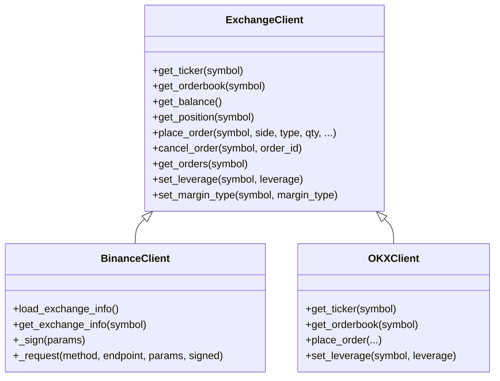

图表来源
- [src/execution/exchange_client.py](file://src/execution/exchange_client.py#L20-L432)

章节来源
- [src/execution/exchange_client.py](file://src/execution/exchange_client.py#L20-L432)

### 进化层（EvolutionEngine）分析
- 反思：汇总最近交易与决策，生成反思摘要。
- 变体生成：针对突破、RSI 等策略生成参数空间变体。
- 回测：使用历史K线进行简单回测，计算总收益与夏普比率。
- 择优：按夏普比率选择最优变体，决定是否部署。

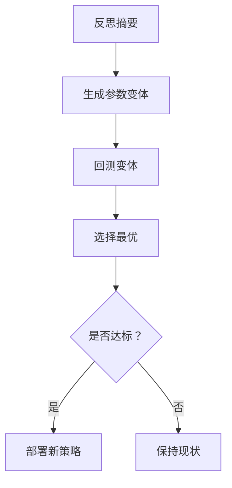

图表来源
- [src/aetherlife/evolution/engine.py](file://src/aetherlife/evolution/engine.py#L45-L145)

章节来源
- [src/aetherlife/evolution/engine.py](file://src/aetherlife/evolution/engine.py#L17-L145)

### 策略系统与工厂
- BaseStrategy：定义策略接口，子类实现分析与信号生成。
- 工厂：create_strategy 根据配置创建具体策略实例。
- 策略类型：突破、RSI、MACD、网格、成交量等。

章节来源
- [src/strategies/base.py](file://src/strategies/base.py#L6-L31)

### AI增强系统
- 情绪分析：SentimentAnalyzer 提供恐慌贪婪指数与社交媒体情绪。
- ML预测：MLPredictor 基于特征工程与分类模型给出置信度。
- 多Agent协调：MultiAgentCoordinator 融合微观结构、技术面、基本面等信号。
- 自动复利：AutoCompoundManager 根据利润比例与阈值进行复利再投资。

章节来源
- [src/utils/ai_enhancer.py](file://src/utils/ai_enhancer.py#L15-L360)

## 依赖分析
- 组件内聚：各层内部职责清晰，跨层通过明确接口交互。
- 组件耦合：感知层与执行层通过 DataFabric 与 ExchangeClient 解耦；记忆层为横切关注点，被认知与守护共享。
- 外部依赖：Redis（可选）、aiohttp（异步HTTP）、pandas/numpy（数据处理）、scikit-learn（ML预测）。
- 循环依赖：未发现直接循环导入；模块间通过工厂与接口避免强耦合。

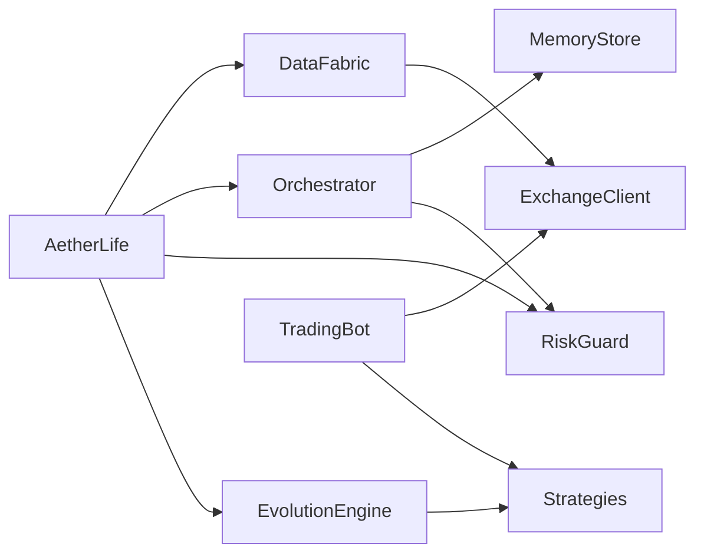

图表来源
- [src/aetherlife/perception/fabric.py](file://src/aetherlife/perception/fabric.py#L23-L27)
- [src/aetherlife/cognition/orchestrator.py](file://src/aetherlife/cognition/orchestrator.py#L44-L53)
- [src/aetherlife/guard/risk_guard.py](file://src/aetherlife/guard/risk_guard.py#L32-L41)
- [src/aetherlife/evolution/engine.py](file://src/aetherlife/evolution/engine.py#L39-L43)
- [src/trading_bot.py](file://src/trading_bot.py#L14-L21)

章节来源
- [src/aetherlife/core/life.py](file://src/aetherlife/core/life.py#L20-L44)
- [src/execution/exchange_client.py](file://src/execution/exchange_client.py#L403-L411)

## 性能考量
- 异步并发：数据获取与Agent推理均采用 asyncio.gather 并行化，降低延迟。
- 精度与步长：下单前根据交易所规则动态调整数量精度与步长，避免无效订单。
- 缓存与持久化：MemoryStore 支持 Redis 持久化，减少重启后数据丢失风险。
- 回测效率：EvolutionEngine 使用简单回测指标（总收益、夏普），兼顾速度与稳定性。
- 资源限制：请求超时与重试策略避免阻塞；风控与断路器防止极端损失。

## 故障排查指南
- 配置校验失败：检查配置文件与环境变量，确保交易所、API密钥与策略参数正确。
- 下单失败：查看 ExchangeClient 返回的错误码与签名参数，确认时间戳与签名字符串。
- 精度问题：核对交易所的 quantity_precision 与 step_size，确保下单数量符合规则。
- 风控拦截：关注 RiskGuard 的断路器与单日最大亏损阈值，必要时降低仓位或收紧参数。
- 进化失败：确认历史数据拉取成功与回测数据长度满足最低要求。

章节来源
- [src/trading_bot.py](file://src/trading_bot.py#L63-L91)
- [src/execution/exchange_client.py](file://src/execution/exchange_client.py#L136-L171)
- [src/aetherlife/guard/risk_guard.py](file://src/aetherlife/guard/risk_guard.py#L59-L68)
- [src/aetherlife/evolution/engine.py](file://src/aetherlife/evolution/engine.py#L96-L101)

## 结论
该量化交易系统通过分层架构实现了从感知到进化的完整闭环，既能在短期内以 TradingBot 快速落地策略，也能在长期以 AetherLife 框架实现多Agent认知与自我优化。通过严格的风控与审计机制，系统在追求收益的同时兼顾了安全性与可运维性。建议在生产环境中启用 Redis 持久化、完善多交易所适配与监控告警体系，并持续迭代策略参数空间与AI增强模块。

## 附录
- 配置项概览：交换所、测试网、交易对、时间周期、杠杆、策略与风控参数、AI增强开关等。
- 部署拓扑：可单机运行，推荐使用容器编排与任务调度（如 cron）触发每日进化；Redis 用于记忆层持久化；日志与审计文件落盘以便合规审查。

章节来源
- [configs/config.json](file://configs/config.json#L1-L28)