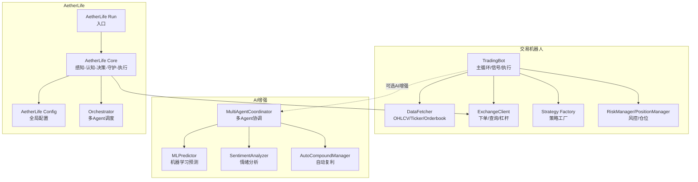
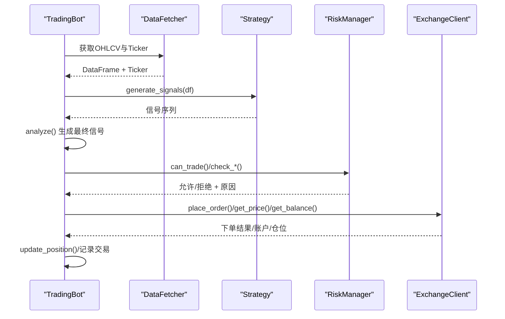
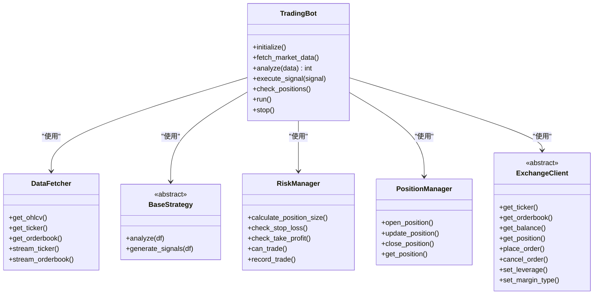
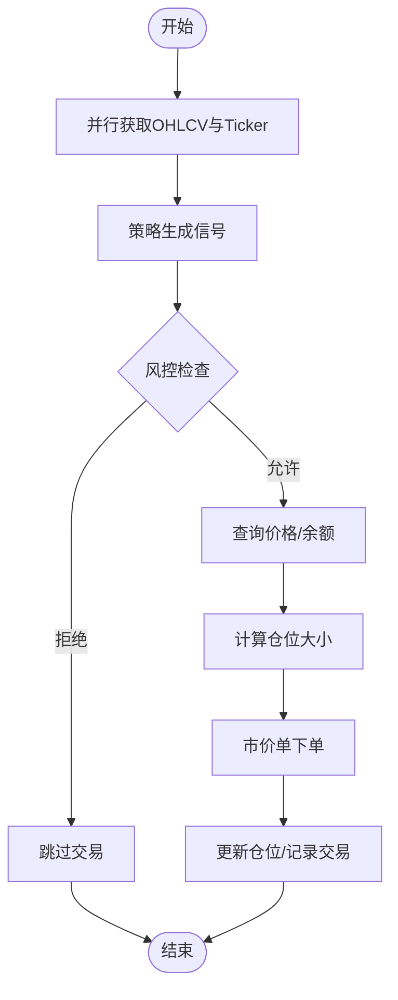
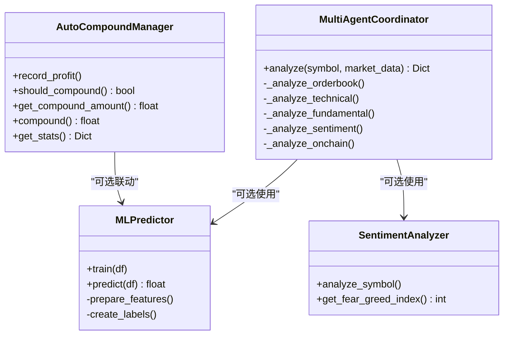
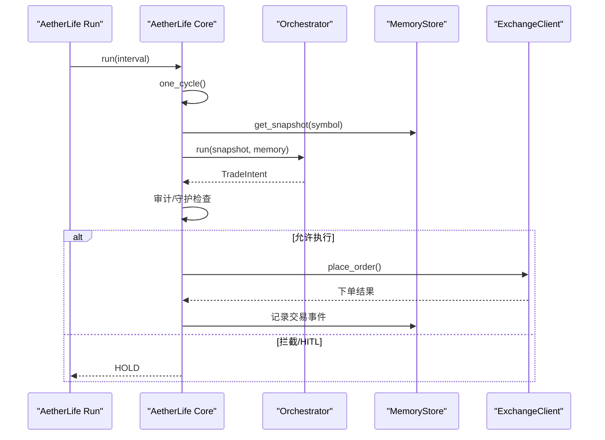
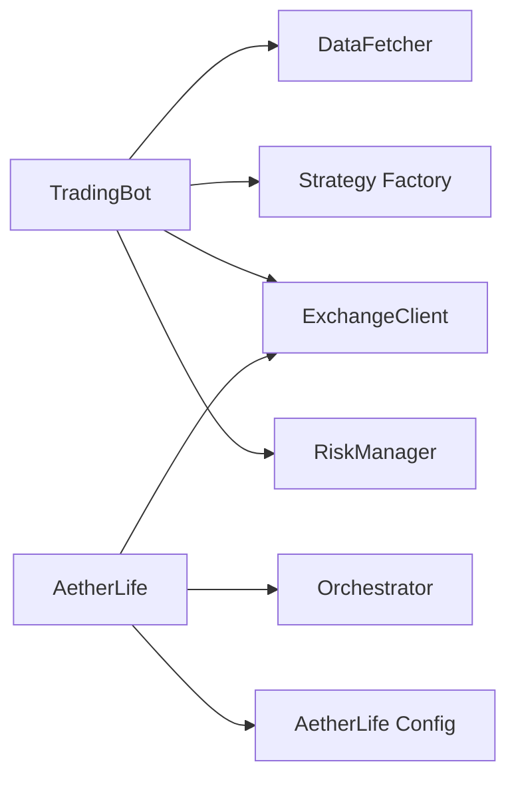

# 组件交互关系

<cite>
**本文引用的文件**   
- [src/trading_bot.py](file://src/trading_bot.py)
- [src/data/data_fetcher.py](file://src/data/data_fetcher.py)
- [src/execution/exchange_client.py](file://src/execution/exchange_client.py)
- [src/strategies/base.py](file://src/strategies/base.py)
- [src/strategies/factory.py](file://src/strategies/factory.py)
- [src/utils/risk_manager.py](file://src/utils/risk_manager.py)
- [src/utils/ai_enhancer.py](file://src/utils/ai_enhancer.py)
- [src/aetherlife/run.py](file://src/aetherlife/run.py)
- [src/aetherlife/core/life.py](file://src/aetherlife/core/life.py)
- [src/aetherlife/config.py](file://src/aetherlife/config.py)
- [src/aetherlife/cognition/orchestrator.py](file://src/aetherlife/cognition/orchestrator.py)
- [configs/config.json](file://configs/config.json)
</cite>

## 目录
1. [简介](#简介)
2. [项目结构](#项目结构)
3. [核心组件](#核心组件)
4. [架构总览](#架构总览)
5. [详细组件分析](#详细组件分析)
6. [依赖分析](#依赖分析)
7. [性能考量](#性能考量)
8. [故障排查指南](#故障排查指南)
9. [结论](#结论)
10. [附录](#附录)

## 简介
本文件聚焦量化交易系统的组件交互关系，系统由“交易机器人”和“AetherLife 数字生命体”两条主线构成。前者以策略驱动、数据驱动、风控驱动为核心，后者以感知-记忆-认知-决策-守护-执行为主线，强调AI增强与多Agent协作。本文将系统梳理组件间的依赖关系、数据流向、事件驱动机制、消息传递协议、错误处理与状态同步策略，并提供时序图与集成架构图。

## 项目结构
系统采用分层与功能域结合的组织方式：
- 顶层入口：交易机器人与AetherLife分别提供独立入口
- 数据层：统一抽象数据获取器，支持多交易所
- 策略层：策略工厂与多种策略实现
- 执行层：交易所客户端封装，统一下单/撤单/查询接口
- 风控层：风险与仓位管理
- AI增强：多Agent协调、机器学习预测、情绪分析、自动复利
- AetherLife：感知-记忆-认知-决策-守护-执行的完整闭环

图表来源
- [src/trading_bot.py](file://src/trading_bot.py#L27-L298)
- [src/data/data_fetcher.py](file://src/data/data_fetcher.py#L17-L434)
- [src/execution/exchange_client.py](file://src/execution/exchange_client.py#L20-L432)
- [src/strategies/factory.py](file://src/strategies/factory.py#L10-L36)
- [src/utils/risk_manager.py](file://src/utils/risk_manager.py#L12-L388)
- [src/utils/ai_enhancer.py](file://src/utils/ai_enhancer.py#L15-L360)
- [src/aetherlife/run.py](file://src/aetherlife/run.py#L52-L67)
- [src/aetherlife/core/life.py](file://src/aetherlife/core/life.py#L20-L169)
- [src/aetherlife/config.py](file://src/aetherlife/config.py#L98-L131)
- [src/aetherlife/cognition/orchestrator.py](file://src/aetherlife/cognition/orchestrator.py#L16-L93)

章节来源
- [src/trading_bot.py](file://src/trading_bot.py#L1-L346)
- [src/aetherlife/run.py](file://src/aetherlife/run.py#L1-L71)

## 核心组件
- 交易机器人（TradingBot）
  - 负责初始化、数据拉取、策略分析、信号执行、风控检查与仓位管理
  - 关键方法：initialize、fetch_market_data、analyze、execute_signal、check_positions、run、stop
- 数据获取器（DataFetcher）
  - 提供OHLCV、Ticker、Orderbook、资金费率等接口，支持WebSocket实时流
  - 支持Binance与OKX
- 交易所客户端（ExchangeClient）
  - 统一下单、撤单、查询账户/仓位、设置杠杆/保证金模式
  - 支持Binance与OKX
- 策略工厂（Strategy Factory）
  - 创建具体策略实例，支持组合策略
- 风控与仓位（RiskManager/PositionManager）
  - 仓位规模计算、止损止盈、熔断、日限额、连败控制、历史记录与统计
- AI增强（AI Enhancer）
  - 多Agent协调、机器学习预测、情绪分析、自动复利
- AetherLife（数字生命体）
  - 入口与主循环，感知-记忆-认知-决策-守护-执行闭环，支持与现有执行层对接

章节来源
- [src/trading_bot.py](file://src/trading_bot.py#L27-L298)
- [src/data/data_fetcher.py](file://src/data/data_fetcher.py#L17-L434)
- [src/execution/exchange_client.py](file://src/execution/exchange_client.py#L20-L432)
- [src/strategies/base.py](file://src/strategies/base.py#L6-L31)
- [src/strategies/factory.py](file://src/strategies/factory.py#L10-L36)
- [src/utils/risk_manager.py](file://src/utils/risk_manager.py#L12-L388)
- [src/utils/ai_enhancer.py](file://src/utils/ai_enhancer.py#L15-L360)
- [src/aetherlife/core/life.py](file://src/aetherlife/core/life.py#L20-L169)

## 架构总览
系统采用“事件驱动 + 分层解耦”的架构：
- 事件驱动：主循环定期拉取数据、分析信号、执行风控与下单
- 分层解耦：数据层、策略层、执行层、风控层相互独立，通过抽象接口交互
- AI增强：作为可插拔模块，既可辅助策略信号，也可用于AetherLife的认知层

图表来源
- [src/trading_bot.py](file://src/trading_bot.py#L92-L298)
- [src/data/data_fetcher.py](file://src/data/data_fetcher.py#L40-L62)
- [src/strategies/base.py](file://src/strategies/base.py#L14-L26)
- [src/utils/risk_manager.py](file://src/utils/risk_manager.py#L175-L194)
- [src/execution/exchange_client.py](file://src/execution/exchange_client.py#L64-L84)

## 详细组件分析

### 交易机器人与策略系统的协作
- TradingBot负责：
  - 初始化配置与各子系统
  - 并行获取OHLCV与Ticker，加速主循环
  - 调用策略生成信号，进行风控校验
  - 执行市价单，管理仓位与止盈止损
- 策略系统：
  - 策略工厂根据配置创建具体策略
  - 策略实现遵循统一接口，便于替换与组合

图表来源
- [src/trading_bot.py](file://src/trading_bot.py#L27-L298)
- [src/data/data_fetcher.py](file://src/data/data_fetcher.py#L17-L62)
- [src/strategies/base.py](file://src/strategies/base.py#L6-L31)
- [src/utils/risk_manager.py](file://src/utils/risk_manager.py#L12-L388)
- [src/execution/exchange_client.py](file://src/execution/exchange_client.py#L20-L84)

章节来源
- [src/trading_bot.py](file://src/trading_bot.py#L63-L298)
- [src/strategies/factory.py](file://src/strategies/factory.py#L10-L36)

### 数据获取模块与执行引擎的接口设计
- DataFetcher抽象了交易所差异，提供统一的OHLCV/Ticker/Orderbook接口与WebSocket流
- ExchangeClient抽象了下单与查询接口，支持签名、超时、错误码处理
- 两者通过TradingBot串联，形成“数据-策略-执行”的闭环

图表来源
- [src/trading_bot.py](file://src/trading_bot.py#L92-L205)
- [src/data/data_fetcher.py](file://src/data/data_fetcher.py#L85-L179)
- [src/execution/exchange_client.py](file://src/execution/exchange_client.py#L173-L320)
- [src/utils/risk_manager.py](file://src/utils/risk_manager.py#L62-L72)

章节来源
- [src/data/data_fetcher.py](file://src/data/data_fetcher.py#L73-L434)
- [src/execution/exchange_client.py](file://src/execution/exchange_client.py#L87-L432)

### AI增强系统与传统交易模块的集成方式
- 多Agent协调器（MultiAgentCoordinator）可对同一市场数据进行多维度分析，输出综合信号
- 机器学习预测器（MLPredictor）基于特征工程与分类模型给出置信度
- 情绪分析器（SentimentAnalyzer）提供恐慌贪婪指数与社交媒体情绪
- 自动复利管理器（AutoCompoundManager）在满足条件时将利润再投资
- 集成方式：
  - 作为TradingBot的可选增强模块，参与信号融合或风控参数调节
  - 在AetherLife中作为认知层的Agent之一，参与Orchestrator的决策

图表来源
- [src/utils/ai_enhancer.py](file://src/utils/ai_enhancer.py#L15-L360)

章节来源
- [src/utils/ai_enhancer.py](file://src/utils/ai_enhancer.py#L15-L360)

### AetherLife与传统交易模块的集成
- AetherLife提供独立入口与主循环，感知-记忆-认知-决策-守护-执行完整闭环
- 与现有执行层对接：通过create_client获取ExchangeClient，执行交易意图
- 风控：RiskGuard参与守护层检查，支持熔断、日限额、人工确认（HITL）

图表来源
- [src/aetherlife/run.py](file://src/aetherlife/run.py#L52-L67)
- [src/aetherlife/core/life.py](file://src/aetherlife/core/life.py#L59-L122)
- [src/aetherlife/cognition/orchestrator.py](file://src/aetherlife/cognition/orchestrator.py#L38-L53)
- [src/execution/exchange_client.py](file://src/execution/exchange_client.py#L403-L411)

章节来源
- [src/aetherlife/core/life.py](file://src/aetherlife/core/life.py#L20-L169)
- [src/aetherlife/config.py](file://src/aetherlife/config.py#L98-L131)

## 依赖分析
- 组件耦合与内聚
  - TradingBot高内聚于主循环，依赖数据、策略、风控、执行四层接口
  - DataFetcher与ExchangeClient均采用抽象基类，降低对具体交易所的耦合
  - 策略工厂提供策略实例化与组合能力，提升可扩展性
- 外部依赖与集成点
  - 交易所API：Binance/OKX，支持测试网
  - WebSocket：实时行情与订单簿流
  - 配置：JSON配置与环境变量
- 潜在循环依赖
  - 未发现直接循环导入；TradingBot与AetherLife分别独立运行

图表来源
- [src/trading_bot.py](file://src/trading_bot.py#L14-L21)
- [src/aetherlife/core/life.py](file://src/aetherlife/core/life.py#L23-L46)
- [src/aetherlife/config.py](file://src/aetherlife/config.py#L98-L131)

章节来源
- [src/trading_bot.py](file://src/trading_bot.py#L14-L21)
- [src/aetherlife/core/life.py](file://src/aetherlife/core/life.py#L23-L46)

## 性能考量
- 异步I/O与并发
  - TradingBot并行获取OHLCV与Ticker，缩短主循环等待时间
  - DataFetcher与ExchangeClient均使用异步HTTP会话与WebSocket连接
- 精度与容错
  - 交易所下单数量按步长取整，避免精度错误
  - API错误码与异常捕获，防止阻塞主循环
- 风控前置
  - 在下单前进行风控检查，减少无效请求与潜在损失

章节来源
- [src/trading_bot.py](file://src/trading_bot.py#L95-L98)
- [src/execution/exchange_client.py](file://src/execution/exchange_client.py#L242-L254)
- [src/utils/risk_manager.py](file://src/utils/risk_manager.py#L175-L194)

## 故障排查指南
- 常见问题与处理
  - API错误：检查交易所返回的错误码与消息，确认签名与密钥
  - 网络超时：调整请求超时配置，检查代理与防火墙
  - 精度异常：核对交易所步长与精度，确保下单数量合法
  - 风控拦截：查看熔断、日限额、连败控制触发原因
- 日志与审计
  - TradingBot与AetherLife均输出详细日志，便于定位问题
  - AetherLife守护层支持审计日志，记录决策与执行

章节来源
- [src/execution/exchange_client.py](file://src/execution/exchange_client.py#L165-L171)
- [src/utils/risk_manager.py](file://src/utils/risk_manager.py#L129-L154)
- [src/aetherlife/core/life.py](file://src/aetherlife/core/life.py#L76-L83)

## 结论
本系统通过清晰的分层与抽象接口，实现了数据、策略、执行、风控的解耦与协同。TradingBot提供稳定可靠的事件驱动主循环，AetherLife提供面向未来的认知-决策闭环。AI增强模块可作为插件式能力融入，提升系统智能化水平。建议在生产环境中进一步完善监控、告警与自动化运维体系。

## 附录
- 配置参考
  - 交易机器人默认配置与策略参数
  - AetherLife全局配置项与执行参数
- 快速启动
  - 两种入口分别运行交易机器人与AetherLife

章节来源
- [configs/config.json](file://configs/config.json#L1-L28)
- [src/aetherlife/config.py](file://src/aetherlife/config.py#L98-L131)
- [src/aetherlife/run.py](file://src/aetherlife/run.py#L52-L67)
- [src/trading_bot.py](file://src/trading_bot.py#L323-L346)