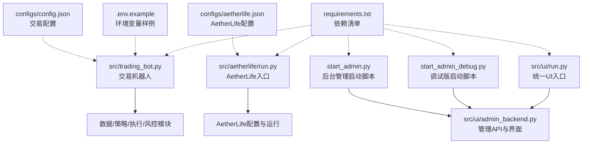
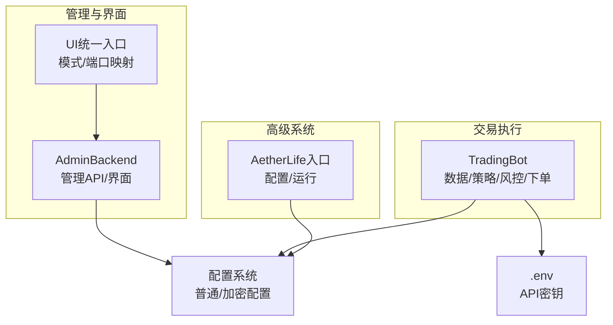
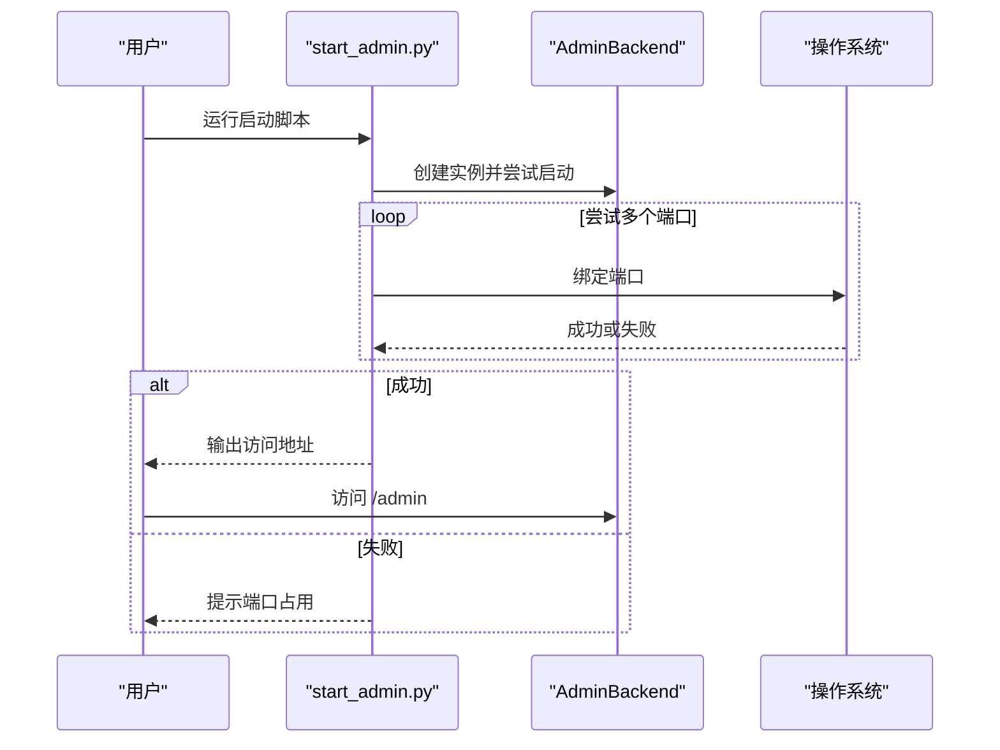
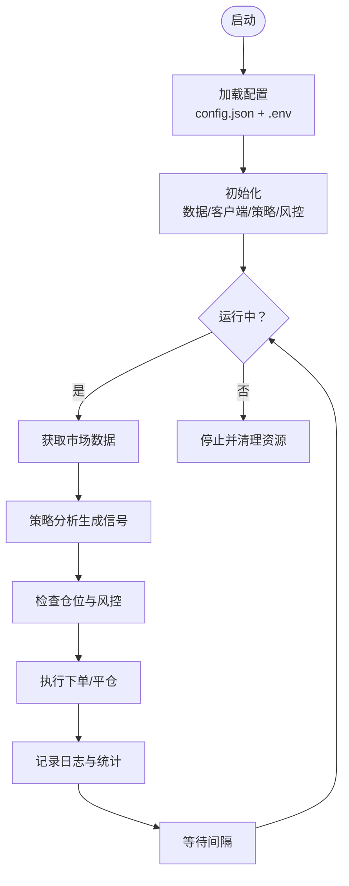
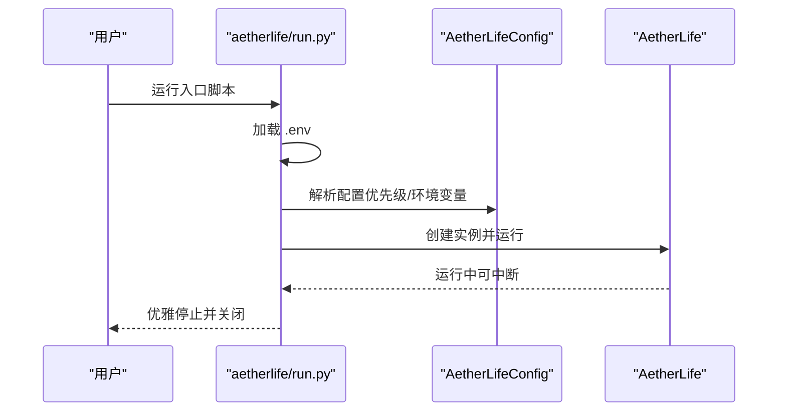
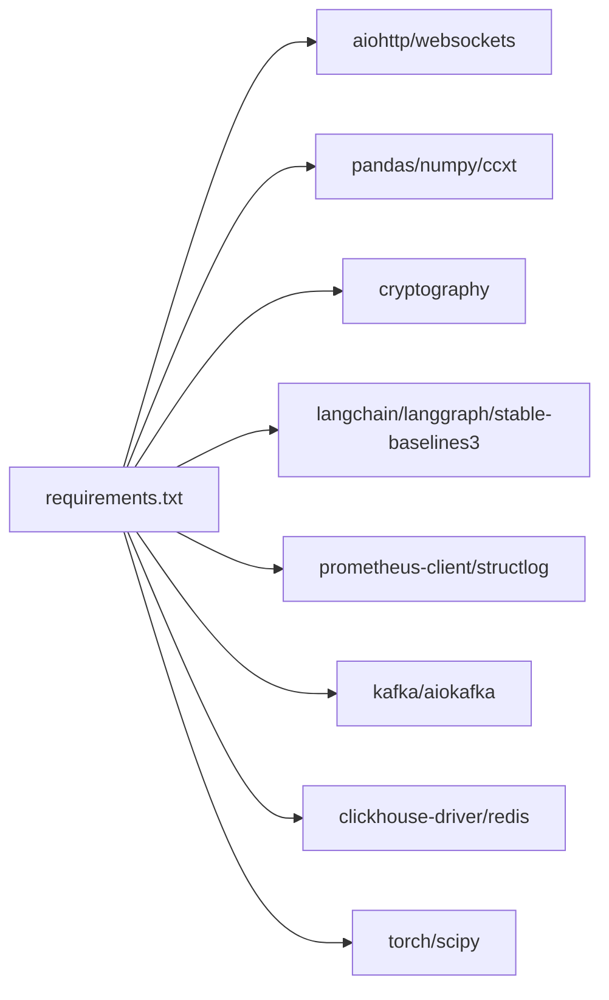

# 服务部署

<cite>
**本文引用的文件**
- [start_admin.py](file://start_admin.py)
- [start_admin_debug.py](file://start_admin_debug.py)
- [check_admin.py](file://check_admin.py)
- [test_admin.py](file://test_admin.py)
- [src/ui/admin_backend.py](file://src/ui/admin_backend.py)
- [src/ui/run.py](file://src/ui/run.py)
- [src/trading_bot.py](file://src/trading_bot.py)
- [src/aetherlife/run.py](file://src/aetherlife/run.py)
- [configs/config.json](file://configs/config.json)
- [configs/aetherlife.json](file://configs/aetherlife.json)
- [.env.example](file://.env.example)
- [requirements.txt](file://requirements.txt)
</cite>

## 目录
1. [简介](#简介)
2. [项目结构](#项目结构)
3. [核心组件](#核心组件)
4. [架构总览](#架构总览)
5. [详细组件分析](#详细组件分析)
6. [依赖分析](#依赖分析)
7. [性能考虑](#性能考虑)
8. [故障排查指南](#故障排查指南)
9. [结论](#结论)
10. [附录](#附录)

## 简介
本指南面向量化交易系统的运维与开发人员，提供生产与开发环境的部署差异说明，以及后台管理服务与交易机器人的启动流程、参数配置、端口自动选择与冲突处理机制。同时给出 AetherLife 系统的启动顺序与依赖关系、服务自启动（systemd/Docker）建议、以及服务监控与健康检查的配置思路。

## 项目结构
该仓库采用“分层+功能模块”组织方式：
- 根目录提供启动脚本与配置样例
- src 下按领域拆分：ui（管理界面）、aetherlife（高级认知/进化系统）、trading_bot（交易机器人）、utils（通用工具）
- configs 存放系统配置文件
- requirements.txt 管理依赖

图表来源
- [start_admin.py](file://start_admin.py#L1-L85)
- [start_admin_debug.py](file://start_admin_debug.py#L1-L93)
- [src/ui/admin_backend.py](file://src/ui/admin_backend.py#L1-L447)
- [src/ui/run.py](file://src/ui/run.py#L1-L102)
- [src/trading_bot.py](file://src/trading_bot.py#L1-L346)
- [src/aetherlife/run.py](file://src/aetherlife/run.py#L1-L71)
- [configs/config.json](file://configs/config.json#L1-L28)
- [configs/aetherlife.json](file://configs/aetherlife.json#L1-L17)
- [.env.example](file://.env.example#L1-L17)
- [requirements.txt](file://requirements.txt#L1-L92)

章节来源
- [start_admin.py](file://start_admin.py#L1-L85)
- [src/ui/admin_backend.py](file://src/ui/admin_backend.py#L1-L447)
- [src/ui/run.py](file://src/ui/run.py#L1-L102)
- [src/trading_bot.py](file://src/trading_bot.py#L1-L346)
- [src/aetherlife/run.py](file://src/aetherlife/run.py#L1-L71)
- [configs/config.json](file://configs/config.json#L1-L28)
- [configs/aetherlife.json](file://configs/aetherlife.json#L1-L17)
- [.env.example](file://.env.example#L1-L17)
- [requirements.txt](file://requirements.txt#L1-L92)

## 核心组件
- 后台管理服务（AdminBackend）：提供配置管理、API测试、策略信息、Bot启停等接口，内置静态页面。
- 交易机器人（TradingBot）：封装数据获取、策略分析、风控与下单执行的主循环。
- AetherLife（高级认知/进化系统）：独立入口，按配置运行，支持日志级别、审计日志、进化解析等。
- 配置系统：普通配置与敏感配置分离加密存储，支持默认配置、导出、重置等。
- 启动脚本：start_admin.py（生产/快速）与 start_admin_debug.py（调试/详细日志）。

章节来源
- [src/ui/admin_backend.py](file://src/ui/admin_backend.py#L20-L431)
- [src/trading_bot.py](file://src/trading_bot.py#L27-L297)
- [src/aetherlife/run.py](file://src/aetherlife/run.py#L32-L67)
- [src/utils/config_manager.py](file://src/utils/config_manager.py#L14-L212)
- [start_admin.py](file://start_admin.py#L16-L80)
- [start_admin_debug.py](file://start_admin_debug.py#L25-L89)

## 架构总览
后台管理服务与交易机器人通过统一的配置与日志体系协同工作；AetherLife 作为独立子系统，按需启动并可与交易系统共享部分基础设施（如日志、缓存）。

图表来源
- [src/ui/admin_backend.py](file://src/ui/admin_backend.py#L20-L431)
- [src/ui/run.py](file://src/ui/run.py#L24-L95)
- [src/trading_bot.py](file://src/trading_bot.py#L30-L91)
- [src/aetherlife/run.py](file://src/aetherlife/run.py#L32-L67)
- [configs/config.json](file://configs/config.json#L1-L28)
- [.env.example](file://.env.example#L1-L17)

## 详细组件分析

### 后台管理服务启动流程与参数
- 绑定主机与端口
  - 生产脚本默认绑定 127.0.0.1，端口优先尝试 8080/8081/8082/8888/9000，自动选择可用端口并打印访问地址。
  - 调试脚本固定绑定 127.0.0.1:8080，便于开发定位。
- 端口冲突处理
  - 当前端口被占用时，生产脚本会依次尝试下一个端口；若全部占用则提示手动停止其他服务。
- 健康检查与可用性
  - 提供检查脚本与测试脚本，分别用于端口探测与模块/配置/服务链路测试。
- 管理界面与API
  - 管理界面静态页托管于 /admin；API 包含配置读写、导出、连接测试、策略信息、Bot启停等。

图表来源
- [start_admin.py](file://start_admin.py#L41-L74)
- [src/ui/admin_backend.py](file://src/ui/admin_backend.py#L424-L431)

章节来源
- [start_admin.py](file://start_admin.py#L16-L80)
- [start_admin_debug.py](file://start_admin_debug.py#L25-L89)
- [src/ui/admin_backend.py](file://src/ui/admin_backend.py#L29-L56)
- [check_admin.py](file://check_admin.py#L9-L37)
- [test_admin.py](file://test_admin.py#L102-L130)

### 交易机器人服务部署
- 启动入口
  - 可直接运行主程序进入主循环；也可通过管理后台的 Bot 控制接口进行启停。
- 配置来源
  - 默认配置与用户覆盖配置合并，支持从 config.json 读取；同时支持 .env 中的 API 密钥。
- 关键参数
  - 交易所、测试网、交易对、时间周期、杠杆、策略及风控参数均来自配置文件。
- 运行逻辑
  - 初始化后进入循环：拉取市场数据、生成信号、风控检查、执行下单、记录统计。

图表来源
- [src/trading_bot.py](file://src/trading_bot.py#L300-L342)
- [configs/config.json](file://configs/config.json#L1-L28)
- [.env.example](file://.env.example#L1-L17)

章节来源
- [src/trading_bot.py](file://src/trading_bot.py#L27-L297)
- [configs/config.json](file://configs/config.json#L1-L28)
- [.env.example](file://.env.example#L1-L17)

### AetherLife 系统启动顺序与依赖
- 启动入口
  - 支持两种运行方式：在 src 目录下以模块方式运行，或在项目根目录直接运行入口脚本。
- 配置加载
  - 优先级：项目根 configs/aetherlife.json > 项目根 aetherlife.json > src/aetherlife.json；可通过环境变量覆盖 symbol 与 testnet。
- 运行参数
  - 通过环境变量设置运行间隔；键盘中断优雅停止并关闭资源。
- 依赖关系
  - 依赖 dotenv 加载 .env；日志级别可在配置中设置；支持审计日志输出路径配置。

图表来源
- [src/aetherlife/run.py](file://src/aetherlife/run.py#L32-L67)
- [configs/aetherlife.json](file://configs/aetherlife.json#L1-L17)

章节来源
- [src/aetherlife/run.py](file://src/aetherlife/run.py#L52-L67)
- [configs/aetherlife.json](file://configs/aetherlife.json#L1-L17)

### 配置与安全
- 配置管理
  - 普通配置与敏感配置分离存储；敏感字段（API Key/Secret/Passphrase）加密保存；支持默认配置、导出、重置、删除。
- 环境变量
  - .env.example 展示了 Binance/OKX/Bybit 的密钥占位符；交易机器人与 AetherLife 均支持从 .env 读取。
- 日志级别
  - AetherLife 配置中可设置 log_level；后台管理服务使用标准日志模块。

章节来源
- [src/utils/config_manager.py](file://src/utils/config_manager.py#L48-L116)
- [.env.example](file://.env.example#L1-L17)
- [configs/aetherlife.json](file://configs/aetherlife.json#L3-L3)

## 依赖分析
- Python 依赖集中在 requirements.txt，涵盖异步HTTP、数据处理、官方API客户端、回测、加密、AetherLife相关（LangChain/LangGraph、强化学习、Kafka、ClickHouse、Redis、LLM客户端、监控等）。
- 后台管理服务与 UI 统一入口依赖 aiohttp；交易机器人依赖数据/策略/执行/风控模块；AetherLife 依赖高级库栈。

图表来源
- [requirements.txt](file://requirements.txt#L1-L92)

章节来源
- [requirements.txt](file://requirements.txt#L1-L92)

## 性能考虑
- 并行数据获取：交易机器人在获取 OHLCV 与 Ticker 时采用并发请求，降低等待时间。
- 循环间隔：可通过配置调整主循环间隔，平衡响应速度与资源消耗。
- 日志级别：生产环境建议提升日志级别，减少 I/O 压力。
- 端口选择：生产脚本自动选择可用端口，避免冲突导致的启动失败与资源浪费。

章节来源
- [src/trading_bot.py](file://src/trading_bot.py#L95-L99)
- [start_admin.py](file://start_admin.py#L44-L66)

## 故障排查指南
- 端口占用
  - 使用检查脚本探测 8080/8081/8082/8888/9000 是否被占用；生产脚本会自动切换端口，若全部占用请先停止其他服务。
- 模块导入问题
  - 调试脚本与测试脚本包含详细的导入与异常堆栈输出，可帮助定位依赖缺失或路径问题。
- 配置与密钥
  - 确认 .env 文件存在且包含有效 API Key；后台管理的连接测试接口可用于验证密钥格式与连通性。
- 后台服务可用性
  - 通过测试脚本验证模块导入、配置读写与路由注册情况；确认静态页面可访问。

章节来源
- [check_admin.py](file://check_admin.py#L9-L37)
- [start_admin_debug.py](file://start_admin_debug.py#L16-L22)
- [test_admin.py](file://test_admin.py#L12-L37)
- [src/ui/admin_backend.py](file://src/ui/admin_backend.py#L159-L244)

## 结论
本指南提供了从启动脚本、配置管理到服务监控与健康检查的完整部署参考。生产环境推荐使用 start_admin.py 的自动端口选择能力，配合 .env 与 config.json 的分层配置；开发/调试阶段可使用 start_admin_debug.py 与测试脚本快速定位问题。AetherLife 与交易机器人可按需独立部署，共享配置与日志体系。

## 附录

### 启动命令与参数速查
- 后台管理（生产）
  - 命令：python3 start_admin.py
  - 主机绑定：127.0.0.1
  - 端口：优先尝试 8080/8081/8082/8888/9000
  - 访问：http://127.0.0.1:<端口>/admin
- 后台管理（调试）
  - 命令：python3 start_admin_debug.py
  - 主机绑定：127.0.0.1
  - 端口：固定 8080
- UI统一入口
  - 命令：python3 src/ui/run.py --mode admin|basic|pro|ultra [--host] [--port] [--exchange] [--testnet] [--no-browser]
  - 端口映射：admin=8080, basic=8081, pro=8082, ultra=8088
- 交易机器人
  - 命令：python3 src/trading_bot.py
  - 配置来源：config.json + .env
- AetherLife
  - 命令：cd src && python -m aetherlife.run 或 python src/aetherlife/run.py
  - 配置来源：configs/aetherlife.json + .env（可覆盖 symbol/testnet）

章节来源
- [start_admin.py](file://start_admin.py#L41-L74)
- [start_admin_debug.py](file://start_admin_debug.py#L57-L78)
- [src/ui/run.py](file://src/ui/run.py#L24-L95)
- [src/trading_bot.py](file://src/trading_bot.py#L323-L342)
- [src/aetherlife/run.py](file://src/aetherlife/run.py#L52-L67)

### 服务自启动与容器化建议
- systemd 服务配置要点（示例思路）
  - ExecStart：指向具体启动命令（如 start_admin.py 或 src/trading_bot.py）
  - WorkingDirectory：项目根目录
  - EnvironmentFile：/etc/environment 或单独的 .env 文件
  - Restart：on-failure 或 always
  - User/Group：非 root 用户运行
  - StandardOutput/StandardError：syslog 或文件
- Docker 容器部署要点（示例思路）
  - 基础镜像：python:3.x-alpine 或 slim
  - 复制依赖与源码，安装 requirements.txt
  - 挂载配置卷：/opt/app/configs（包含 config.json/aetherlife.json/.key）
  - 挂载环境变量：.env 或 Docker secrets
  - 暴露端口：8080/8081/8082/8888/9000（按需）
  - CMD：对应启动脚本或入口

[本节为通用实践建议，不直接分析具体文件，故无章节来源]

### 服务监控与健康检查
- 健康检查
  - 后台管理：GET /admin（静态页面）与 /api/config（返回数据）可作为简单健康探针
  - 交易机器人：可通过管理后台 /api/bot/status 查询运行状态
- 监控指标
  - Prometheus 客户端已在依赖中，可在应用内注册指标并暴露 /metrics
  - structlog 提供结构化日志，便于集中采集与检索
- 建议
  - 在反向代理后暴露单一入口，结合 Nginx/HAProxy 健康检查
  - 对关键服务（交易机器人、AetherLife）增加进程存活与告警

章节来源
- [src/ui/admin_backend.py](file://src/ui/admin_backend.py#L57-L56)
- [src/trading_bot.py](file://src/trading_bot.py#L378-L396)
- [requirements.txt](file://requirements.txt#L78-L81)