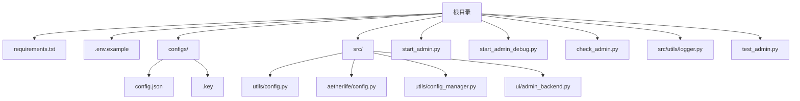
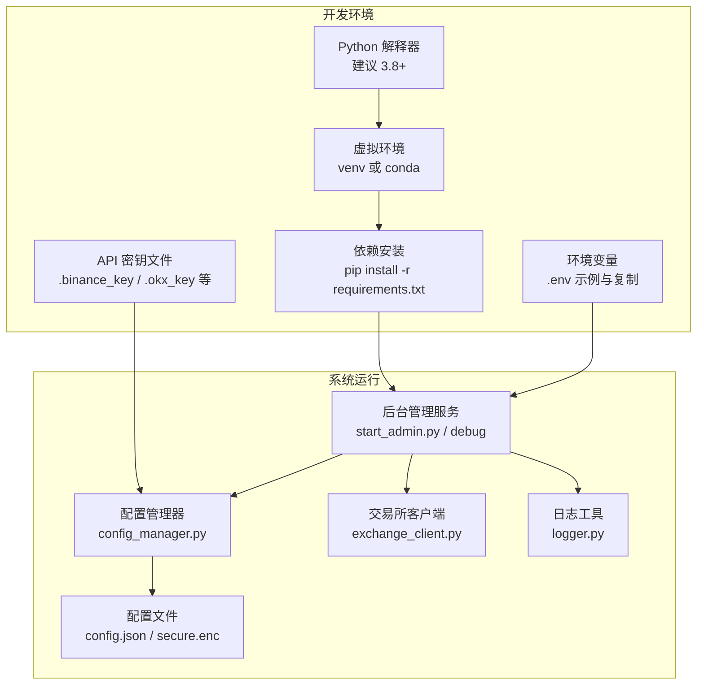
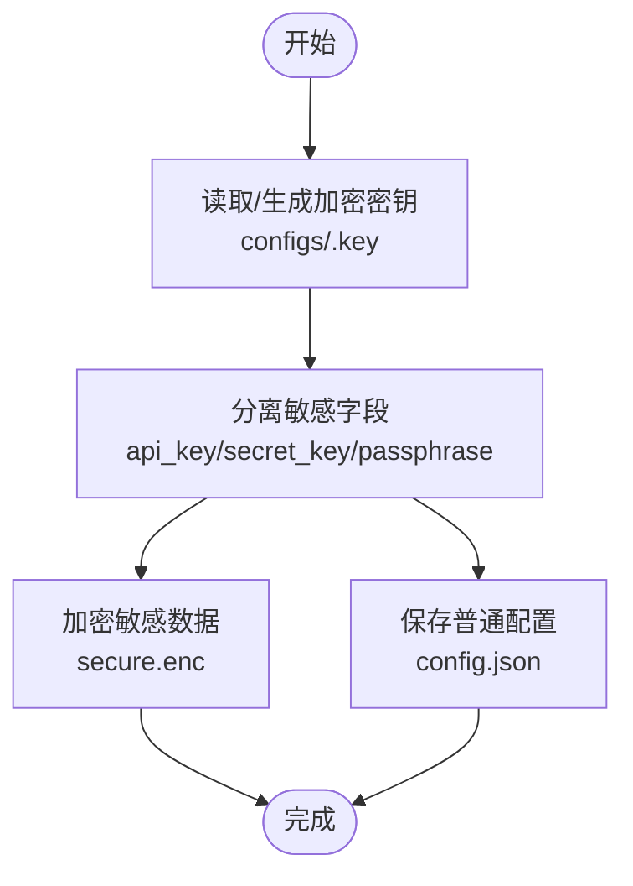
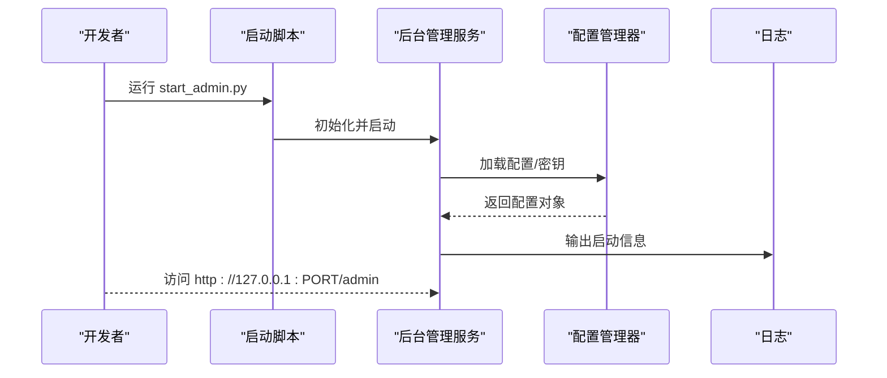
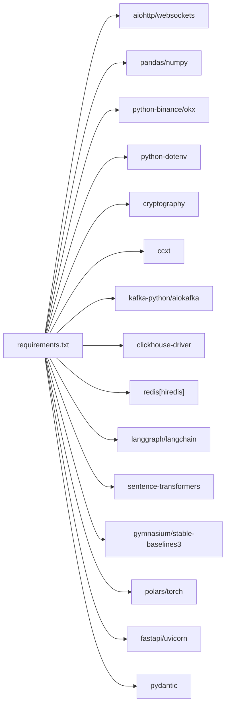

# 环境准备

<cite>
**本文引用的文件**
- [requirements.txt](file://requirements.txt)
- [.env.example](file://.env.example)
- [configs/config.json](file://configs/config.json)
- [configs/.key](file://configs/.key)
- [src/utils/config.py](file://src/utils/config.py)
- [src/aetherlife/config.py](file://src/aetherlife/config.py)
- [src/utils/config_manager.py](file://src/utils/config_manager.py)
- [src/ui/admin_backend.py](file://src/ui/admin_backend.py)
- [start_admin.py](file://start_admin.py)
- [start_admin_debug.py](file://start_admin_debug.py)
- [check_admin.py](file://check_admin.py)
- [src/utils/logger.py](file://src/utils/logger.py)
- [test_admin.py](file://test_admin.py)
</cite>

## 目录
1. [简介](#简介)
2. [项目结构](#项目结构)
3. [核心组件](#核心组件)
4. [架构总览](#架构总览)
5. [详细组件分析](#详细组件分析)
6. [依赖分析](#依赖分析)
7. [性能考虑](#性能考虑)
8. [故障排除指南](#故障排除指南)
9. [结论](#结论)
10. [附录](#附录)

## 简介
本指南面向量化交易系统的环境准备与验证，覆盖以下要点：
- Python 版本要求与操作系统兼容性
- 虚拟环境创建与激活（venv 与 conda 两种方式）
- 系统依赖安装（pip 与可选编译依赖）
- 环境变量配置（.env 文件与关键变量）
- API 密钥安全存储与配置（.binance_key、.okx_key 等）
- 环境验证方法与常见问题排查

## 项目结构
该仓库采用“根目录 + 子目录”的组织方式，核心与运行相关的关键位置如下：
- 依赖声明：requirements.txt
- 示例环境变量：.env.example
- 配置文件与密钥：configs/config.json、configs/.key
- 配置校验与默认值：src/utils/config.py
- AetherLife 全局配置：src/aetherlife/config.py
- 配置管理器（含加密存储）：src/utils/config_manager.py
- 后台管理服务：src/ui/admin_backend.py
- 启动脚本：start_admin.py、start_admin_debug.py
- 端口检查脚本：check_admin.py
- 日志工具：src/utils/logger.py
- 导入测试脚本：test_admin.py

图表来源
- [requirements.txt](file://requirements.txt#L1-L70)
- [.env.example](file://.env.example#L1-L17)
- [configs/config.json](file://configs/config.json#L1-L28)
- [configs/.key](file://configs/.key#L1-L1)
- [src/utils/config.py](file://src/utils/config.py#L1-L49)
- [src/aetherlife/config.py](file://src/aetherlife/config.py#L1-L131)
- [src/utils/config_manager.py](file://src/utils/config_manager.py#L1-L212)
- [src/ui/admin_backend.py](file://src/ui/admin_backend.py#L1-L447)
- [start_admin.py](file://start_admin.py#L1-L85)
- [start_admin_debug.py](file://start_admin_debug.py#L1-L93)
- [check_admin.py](file://check_admin.py#L1-L40)
- [src/utils/logger.py](file://src/utils/logger.py#L1-L34)
- [test_admin.py](file://test_admin.py#L1-L37)

章节来源
- [requirements.txt](file://requirements.txt#L1-L70)
- [.env.example](file://.env.example#L1-L17)
- [configs/config.json](file://configs/config.json#L1-L28)
- [configs/.key](file://configs/.key#L1-L1)
- [src/utils/config.py](file://src/utils/config.py#L1-L49)
- [src/aetherlife/config.py](file://src/aetherlife/config.py#L1-L131)
- [src/utils/config_manager.py](file://src/utils/config_manager.py#L1-L212)
- [src/ui/admin_backend.py](file://src/ui/admin_backend.py#L1-L447)
- [start_admin.py](file://start_admin.py#L1-L85)
- [start_admin_debug.py](file://start_admin_debug.py#L1-L93)
- [check_admin.py](file://check_admin.py#L1-L40)
- [src/utils/logger.py](file://src/utils/logger.py#L1-L34)
- [test_admin.py](file://test_admin.py#L1-L37)

## 核心组件
- 依赖清单：定义了异步 HTTP、数据处理、官方 API 客户端、环境变量、回测、工具、加密、AIO、Kafka、ClickHouse、Redis、LangChain/LangGraph、向量化、强化学习、Polars、PyTorch、FastAPI/Uvicorn、Pydantic 等依赖及版本下限。
- 环境变量模板：提供 BINANCE_* 与 OKX_* 的示例键名，便于复制为 .env 使用。
- 配置与校验：提供配置校验函数与默认值合并逻辑，确保 exchange、symbols、strategy、risk 等字段合法。
- AetherLife 全局配置：以数据类形式描述感知、记忆、认知、决策、执行、守护、进化等模块的配置项，并支持从字典加载。
- 配置管理器：负责配置文件的加密存储与读取，分离敏感信息（API Key/Secret/Passphrase），使用 cryptography 生成/读取密钥并加密存储。
- 后台管理服务：提供配置管理、API 测试、交易所信息、策略信息、Bot 控制等接口；支持连接测试与公开接口测试。
- 启动与调试脚本：提供快速启动与带调试输出的启动脚本，以及端口检查脚本。

章节来源
- [requirements.txt](file://requirements.txt#L1-L70)
- [.env.example](file://.env.example#L1-L17)
- [src/utils/config.py](file://src/utils/config.py#L15-L49)
- [src/aetherlife/config.py](file://src/aetherlife/config.py#L98-L131)
- [src/utils/config_manager.py](file://src/utils/config_manager.py#L14-L212)
- [src/ui/admin_backend.py](file://src/ui/admin_backend.py#L20-L56)

## 架构总览
下图展示了环境准备与运行的关键交互：依赖安装、环境变量与密钥配置、后台管理服务启动、配置加载与校验、API 密钥测试与连接验证。

图表来源
- [requirements.txt](file://requirements.txt#L1-L70)
- [.env.example](file://.env.example#L1-L17)
- [src/utils/config_manager.py](file://src/utils/config_manager.py#L14-L81)
- [configs/config.json](file://configs/config.json#L1-L28)
- [start_admin.py](file://start_admin.py#L16-L81)
- [src/ui/admin_backend.py](file://src/ui/admin_backend.py#L20-L56)
- [src/utils/logger.py](file://src/utils/logger.py#L12-L28)

## 详细组件分析

### Python 版本与操作系统
- Python 版本：建议使用 3.8 及以上版本，以满足高版本依赖（如 pydantic、torch、langchain 等）的要求。
- 操作系统：项目依赖多为纯 Python 包，可在 Linux/macOS/Windows 上运行；若涉及特定二进制扩展，需遵循各包的平台支持说明。

章节来源
- [requirements.txt](file://requirements.txt#L62-L69)

### 虚拟环境创建与激活
- 方式一：使用标准库 venv
  - 创建：python3 -m venv .venv
  - 激活（Linux/macOS）：source .venv/bin/activate
  - 激活（Windows）：.venv\Scripts\Activate.ps1
- 方式二：使用 conda
  - 创建：conda create -n quant python=3.11
  - 激活：conda activate quant

章节来源
- [requirements.txt](file://requirements.txt#L1-L70)

### 依赖安装与编译依赖
- 安装命令：pip install -r requirements.txt
- 可能涉及编译的依赖（视平台而定）：numpy、pandas、torch、cryptography、clickhouse-driver、redis 等。若出现编译错误，可参考各包官方文档安装系统级依赖（如编译器、头文件等）。

章节来源
- [requirements.txt](file://requirements.txt#L1-L70)

### 环境变量配置
- 复制示例：cp .env.example .env
- 关键变量（示例）：BINANCE_API_KEY、BINANCE_SECRET_KEY、OKX_API_KEY、OKX_SECRET_KEY、OKX_PASSPHRASE、BYBIT_API_KEY、BYBIT_SECRET_KEY
- 用途：后台管理服务在连接测试时会读取这些变量进行 API 校验与连接测试。

章节来源
- [.env.example](file://.env.example#L1-L17)
- [src/ui/admin_backend.py](file://src/ui/admin_backend.py#L159-L209)

### API 密钥安全存储与配置
- 密钥文件位置：项目在 configs 目录下维护 .key（加密密钥）与 config.json（普通配置）及 secure.enc（加密的敏感配置）。
- 加密流程：首次运行会在 configs/.key 生成密钥并设置严格权限；敏感字段（api_key、secret_key、passphrase）会被分离并加密保存至 secure.enc。
- 后台管理服务：提供 API 密钥格式校验与连接测试接口，便于在本地验证密钥有效性。

图表来源
- [src/utils/config_manager.py](file://src/utils/config_manager.py#L31-L81)
- [configs/.key](file://configs/.key#L1-L1)
- [configs/config.json](file://configs/config.json#L1-L28)

章节来源
- [src/utils/config_manager.py](file://src/utils/config_manager.py#L14-L212)
- [configs/.key](file://configs/.key#L1-L1)
- [configs/config.json](file://configs/config.json#L1-L28)
- [src/ui/admin_backend.py](file://src/ui/admin_backend.py#L159-L209)

### 环境验证方法
- 启动后台管理服务
  - 正常模式：python3 start_admin.py
  - 调试模式：python3 start_admin_debug.py（打印详细导入与运行信息）
- 端口检查：python3 check_admin.py（检测 8080/8081/8082/8888/9000 端口占用情况）
- 导入测试：python3 test_admin.py（验证 cryptography、ConfigManager、AdminBackend 可导入）

图表来源
- [start_admin.py](file://start_admin.py#L16-L81)
- [start_admin_debug.py](file://start_admin_debug.py#L25-L93)
- [check_admin.py](file://check_admin.py#L17-L40)
- [src/ui/admin_backend.py](file://src/ui/admin_backend.py#L424-L431)
- [src/utils/logger.py](file://src/utils/logger.py#L12-L28)

章节来源
- [start_admin.py](file://start_admin.py#L16-L81)
- [start_admin_debug.py](file://start_admin_debug.py#L25-L93)
- [check_admin.py](file://check_admin.py#L17-L40)
- [test_admin.py](file://test_admin.py#L12-L37)
- [src/ui/admin_backend.py](file://src/ui/admin_backend.py#L424-L431)
- [src/utils/logger.py](file://src/utils/logger.py#L12-L28)

## 依赖分析
- 直接依赖：aiohttp、websockets、pandas、numpy、python-binance、okx、python-dotenv、cryptography、ccxt、kafka-python、aiokafka、clickhouse-driver、redis、langgraph、langchain、sentence-transformers、gymnasium、stable-baselines3、polars、torch、fastapi、uvicorn、pydantic 等。
- 间接依赖：随上述包引入的子依赖（例如 cryptography 引入的 openssl、langchain 引入的 requests 等）。
- 环境变量：python-dotenv 用于从 .env 文件加载环境变量。

图表来源
- [requirements.txt](file://requirements.txt#L1-L70)

章节来源
- [requirements.txt](file://requirements.txt#L1-L70)

## 性能考虑
- 优先使用较新的 Python 版本（如 3.10/3.11）以获得更好的性能与兼容性。
- 在生产环境中，建议使用更高性能的数据处理库（如 polars）与深度学习框架（torch）的 GPU 版本。
- 后台管理服务采用异步框架（aiohttp），在高并发请求场景下具备良好吞吐能力。

## 故障排除指南
- 启动失败（端口占用）
  - 现象：启动脚本报错提示端口被占用
  - 处理：使用 check_admin.py 查看占用端口；修改端口或释放占用进程；调试脚本会尝试多个端口自动选择
- 导入失败（cryptography/ConfigManager/AdminBackend）
  - 现象：导入时报错 ImportError
  - 处理：确认 requirements.txt 已安装；检查虚拟环境是否激活；使用 test_admin.py 进行逐项验证
- API 密钥无效
  - 现象：连接测试返回格式错误或连接失败
  - 处理：核对 .env 中的 KEY/SECRET/PASSPHRASE；使用后台管理服务的“测试连接”接口进行验证
- 配置文件损坏或缺失
  - 现象：加载配置失败或为空
  - 处理：使用后台管理服务的“重置配置”或重新生成 secure.enc 与 config.json

章节来源
- [check_admin.py](file://check_admin.py#L17-L40)
- [test_admin.py](file://test_admin.py#L12-L37)
- [src/ui/admin_backend.py](file://src/ui/admin_backend.py#L159-L209)
- [src/utils/config_manager.py](file://src/utils/config_manager.py#L82-L116)

## 结论
按照本指南完成 Python 版本与虚拟环境准备、依赖安装、环境变量与密钥配置后，即可通过后台管理服务完成系统验证与日常运维。建议在本地完成 API 密钥测试与配置校验后再上线部署。

## 附录
- 常用命令摘要
  - 创建并激活虚拟环境：python3 -m venv .venv && source .venv/bin/activate
  - 安装依赖：pip install -r requirements.txt
  - 启动后台管理：python3 start_admin.py
  - 端口检查：python3 check_admin.py
  - 导入测试：python3 test_admin.py