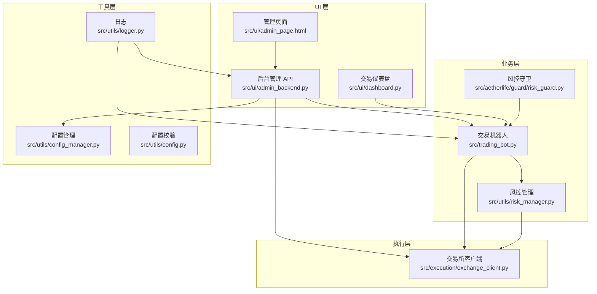
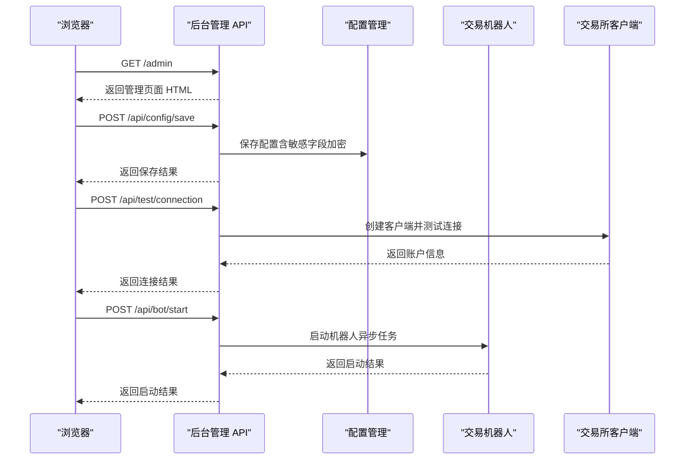
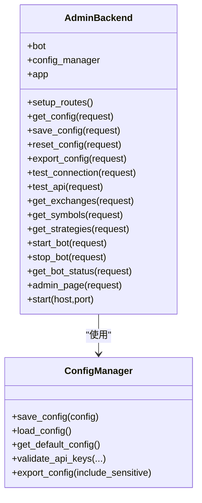
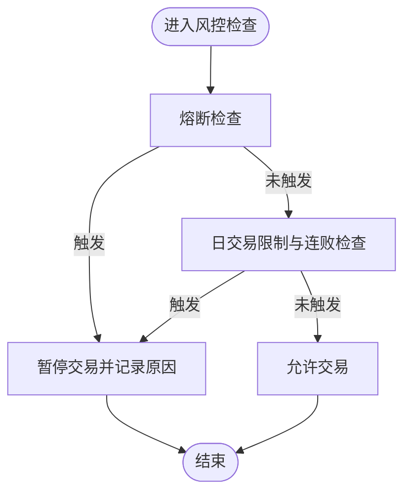
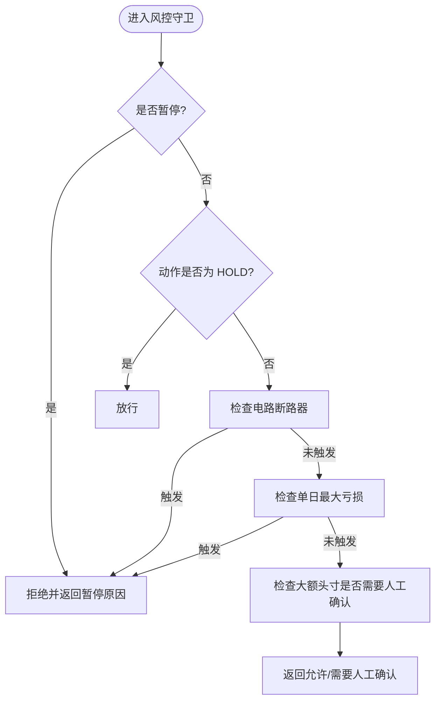
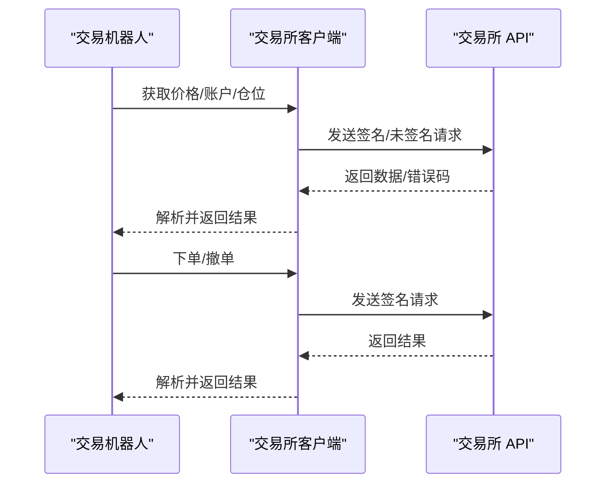
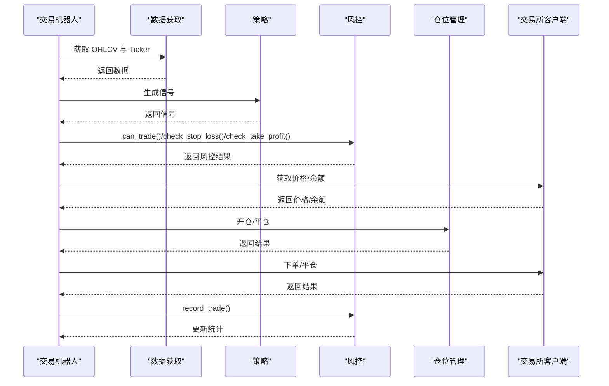
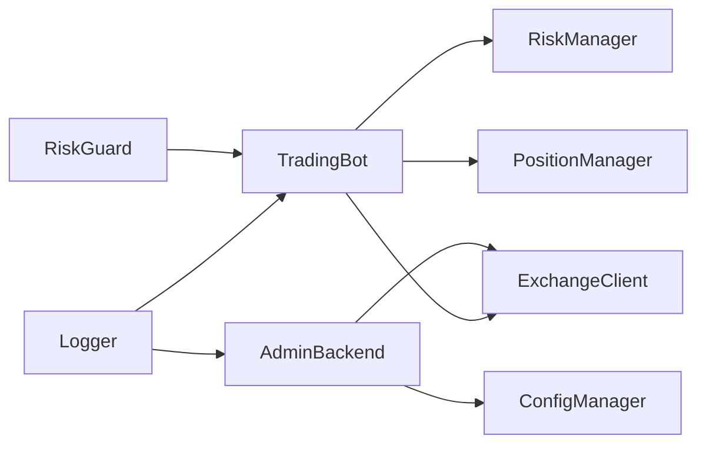

# 监控告警

<cite>
**本文引用的文件**   
- [src/ui/admin_backend.py](file://src/ui/admin_backend.py)
- [src/ui/admin_page.html](file://src/ui/admin_page.html)
- [src/ui/dashboard.py](file://src/ui/dashboard.py)
- [src/utils/logger.py](file://src/utils/logger.py)
- [src/utils/risk_manager.py](file://src/utils/risk_manager.py)
- [src/aetherlife/guard/risk_guard.py](file://src/aetherlife/guard/risk_guard.py)
- [src/trading_bot.py](file://src/trading_bot.py)
- [src/utils/config_manager.py](file://src/utils/config_manager.py)
- [src/utils/config.py](file://src/utils/config.py)
- [src/execution/exchange_client.py](file://src/execution/exchange_client.py)
- [configs/config.json](file://configs/config.json)
- [requirements.txt](file://requirements.txt)
- [start_admin.py](file://start_admin.py)
- [start_admin_debug.py](file://start_admin_debug.py)
</cite>

## 目录
1. [简介](#简介)
2. [项目结构](#项目结构)
3. [核心组件](#核心组件)
4. [架构总览](#架构总览)
5. [详细组件分析](#详细组件分析)
6. [依赖关系分析](#依赖关系分析)
7. [性能监控](#性能监控)
8. [日志与告警配置](#日志与告警配置)
9. [关键指标监控](#关键指标监控)
10. [告警机制配置](#告警机制配置)
11. [故障排除](#故障排除)
12. [结论](#结论)

## 简介
本指南面向量化交易系统的运维与开发人员，围绕“Web 管理界面”“日志系统”“关键指标监控”“告警机制”“性能监控”“故障排除”六个维度，提供可操作的使用与维护手册。系统包含：
- 后台管理 Web 服务（AIOHTTP + HTML 页面）
- 交易仪表盘（前端图表 + 实时刷新）
- 统一日志输出与异常追踪
- 风控与熔断机制
- 配置管理与安全存储
- 交易机器人主循环与风控集成

## 项目结构
系统采用“模块化分层 + Web 管理界面”的组织方式：
- UI 层：后台管理 API 与页面、交易仪表盘
- 业务层：交易机器人、策略、风控、位置管理
- 执行层：交易所客户端封装
- 工具层：日志、配置、风控守卫
- 配置与依赖：JSON 配置、Python 依赖清单

**图示来源**
- [src/ui/admin_backend.py](file://src/ui/admin_backend.py#L20-L56)
- [src/ui/admin_page.html](file://src/ui/admin_page.html#L1-L120)
- [src/ui/dashboard.py](file://src/ui/dashboard.py#L13-L30)
- [src/trading_bot.py](file://src/trading_bot.py#L27-L63)
- [src/utils/risk_manager.py](file://src/utils/risk_manager.py#L12-L52)
- [src/aetherlife/guard/risk_guard.py](file://src/aetherlife/guard/risk_guard.py#L23-L47)
- [src/execution/exchange_client.py](file://src/execution/exchange_client.py#L20-L85)
- [src/utils/logger.py](file://src/utils/logger.py#L12-L28)
- [src/utils/config_manager.py](file://src/utils/config_manager.py#L14-L47)
- [src/utils/config.py](file://src/utils/config.py#L15-L37)

**章节来源**
- [src/ui/admin_backend.py](file://src/ui/admin_backend.py#L20-L56)
- [src/ui/admin_page.html](file://src/ui/admin_page.html#L1-L120)
- [src/ui/dashboard.py](file://src/ui/dashboard.py#L13-L30)
- [src/trading_bot.py](file://src/trading_bot.py#L27-L63)
- [src/utils/risk_manager.py](file://src/utils/risk_manager.py#L12-L52)
- [src/aetherlife/guard/risk_guard.py](file://src/aetherlife/guard/risk_guard.py#L23-L47)
- [src/execution/exchange_client.py](file://src/execution/exchange_client.py#L20-L85)
- [src/utils/logger.py](file://src/utils/logger.py#L12-L28)
- [src/utils/config_manager.py](file://src/utils/config_manager.py#L14-L47)
- [src/utils/config.py](file://src/utils/config.py#L15-L37)

## 核心组件
- 后台管理 API（AdminBackend）：提供配置管理、API 测试、交易所信息、策略信息、机器人启停与状态查询等接口；内置静态页面路由。
- 管理页面（admin_page.html）：基于 AIOHTTP 路由返回的 HTML，提供仪表盘、API 配置、策略管理、风控中心、AI 增强、系统设置等标签页。
- 交易仪表盘（TradingDashboard）：提供前端图表与实时数据刷新，展示账户余额、持仓、交易次数、胜率等指标。
- 风控管理（RiskManager）：负责仓位计算、止损止盈、熔断、日统计与连败限制。
- 风控守卫（RiskGuard）：在交易意图执行前进行“电路断路器”“单日最大亏损”“人工确认（HITL）”等检查。
- 交易所客户端（ExchangeClient/BinanceClient）：封装 Binance 合约 API，提供行情、下单、账户、杠杆等接口。
- 日志（get_logger）：统一日志输出，支持异常追踪。
- 配置管理（ConfigManager）：配置文件加密存储、读取、验证与导出。

**章节来源**
- [src/ui/admin_backend.py](file://src/ui/admin_backend.py#L20-L56)
- [src/ui/admin_page.html](file://src/ui/admin_page.html#L136-L273)
- [src/ui/dashboard.py](file://src/ui/dashboard.py#L13-L30)
- [src/utils/risk_manager.py](file://src/utils/risk_manager.py#L12-L52)
- [src/aetherlife/guard/risk_guard.py](file://src/aetherlife/guard/risk_guard.py#L23-L68)
- [src/execution/exchange_client.py](file://src/execution/exchange_client.py#L20-L85)
- [src/utils/logger.py](file://src/utils/logger.py#L12-L28)
- [src/utils/config_manager.py](file://src/utils/config_manager.py#L48-L101)

## 架构总览
系统以“后台管理 API + 管理页面 + 交易仪表盘 + 交易机器人 + 风控 + 交易所客户端 + 日志 + 配置管理”为核心，形成闭环的监控与控制体系。

**图示来源**
- [src/ui/admin_backend.py](file://src/ui/admin_backend.py#L57-L113)
- [src/ui/admin_backend.py](file://src/ui/admin_backend.py#L159-L209)
- [src/ui/admin_backend.py](file://src/ui/admin_backend.py#L323-L349)
- [src/utils/config_manager.py](file://src/utils/config_manager.py#L48-L101)
- [src/execution/exchange_client.py](file://src/execution/exchange_client.py#L87-L121)

## 详细组件分析

### 后台管理 API（AdminBackend）
- 路由与职责
  - 配置管理：获取、保存、重置、导出配置；隐藏敏感字段显示。
  - API 测试：连接测试（带密钥）、公开接口测试。
  - 交易所与策略：返回支持交易所、交易对、策略列表。
  - 机器人控制：启动、停止、查询状态。
  - 静态页面：返回管理页面 HTML。
- 关键流程
  - 保存配置时分离敏感字段并加密存储，确保安全。
  - 连接测试先校验密钥格式，再创建客户端并拉取账户信息。
  - 机器人启停通过事件循环异步调度，避免阻塞。

**图示来源**
- [src/ui/admin_backend.py](file://src/ui/admin_backend.py#L20-L56)
- [src/utils/config_manager.py](file://src/utils/config_manager.py#L48-L101)

**章节来源**
- [src/ui/admin_backend.py](file://src/ui/admin_backend.py#L29-L157)
- [src/ui/admin_backend.py](file://src/ui/admin_backend.py#L159-L244)
- [src/ui/admin_backend.py](file://src/ui/admin_backend.py#L246-L396)
- [src/ui/admin_backend.py](file://src/ui/admin_backend.py#L398-L431)
- [src/utils/config_manager.py](file://src/utils/config_manager.py#L48-L101)

### 管理页面（admin_page.html）
- 功能概览
  - 仪表盘：总资产估值、活跃仓位、今日交易、胜率等。
  - 快速操作：启动/停止机器人、AI 开关切换。
  - API 配置：选择交易所、填写密钥、测试连接、保存配置。
  - 策略管理：选择策略、交易对、时间周期、杠杆、策略参数。
  - 风控中心：设置单笔最大仓位、止损止盈、每日最大亏损等。
  - 系统设置：保存/加载/导出/重置配置。
- 交互要点
  - 使用 /api/* 接口与后台通信。
  - 定时刷新机器人状态，保持界面实时性。

**章节来源**
- [src/ui/admin_page.html](file://src/ui/admin_page.html#L136-L273)
- [src/ui/admin_page.html](file://src/ui/admin_page.html#L601-L786)

### 交易仪表盘（TradingDashboard）
- 功能概览
  - 指标卡片：总权益、当前持仓、今日交易、胜率。
  - 图表：K 线图（Lightweight Charts）。
  - 控制面板：快速买入/卖出、策略状态、信号强度。
  - 最近活动：订单表格。
- 数据来源
  - /api/status、/api/positions、/api/orders、/api/stats、/api/config、/api/order。
  - 前端定时轮询更新指标与图表。

**章节来源**
- [src/ui/dashboard.py](file://src/ui/dashboard.py#L31-L336)
- [src/ui/dashboard.py](file://src/ui/dashboard.py#L338-L375)

### 风控管理（RiskManager）
- 核心能力
  - 仓位计算：基于信号强度与账户余额，结合最大/最小仓位限制。
  - 止损止盈：按多空方向计算当前盈亏百分比并判定触发。
  - 熔断与日限：单日最大亏损、最大交易次数、连续亏损限制。
  - 统计与恢复：日统计重置、暂停与恢复。
- 关键流程

**图示来源**
- [src/utils/risk_manager.py](file://src/utils/risk_manager.py#L129-L194)

**章节来源**
- [src/utils/risk_manager.py](file://src/utils/risk_manager.py#L62-L128)
- [src/utils/risk_manager.py](file://src/utils/risk_manager.py#L129-L194)
- [src/utils/risk_manager.py](file://src/utils/risk_manager.py#L196-L241)

### 风控守卫（RiskGuard）
- 核心能力
  - 电路断路器：当日累计亏损达到阈值则暂停。
  - 单日最大亏损：超过阈值暂停。
  - 人工确认（HITL）：大额头寸触发人工确认。
  - 审计日志：统一审计事件记录，支持文件落盘与回调。
- 关键流程

**图示来源**
- [src/aetherlife/guard/risk_guard.py](file://src/aetherlife/guard/risk_guard.py#L48-L68)

**章节来源**
- [src/aetherlife/guard/risk_guard.py](file://src/aetherlife/guard/risk_guard.py#L16-L68)

### 交易所客户端（ExchangeClient/BinanceClient）
- 能力范围
  - 行情：24 小时行情、深度、价格。
  - 交易：账户余额、仓位、下单、撤单、活跃订单、杠杆、保证金模式。
  - 安全：签名、超时、错误码处理。
- 关键流程

**图示来源**
- [src/execution/exchange_client.py](file://src/execution/exchange_client.py#L136-L171)
- [src/execution/exchange_client.py](file://src/execution/exchange_client.py#L172-L205)

**章节来源**
- [src/execution/exchange_client.py](file://src/execution/exchange_client.py#L20-L85)
- [src/execution/exchange_client.py](file://src/execution/exchange_client.py#L136-L171)
- [src/execution/exchange_client.py](file://src/execution/exchange_client.py#L172-L205)

### 交易机器人（TradingBot）
- 主循环
  - 初始化：校验配置、创建数据源与客户端、策略实例。
  - 循环：拉取市场数据 → 生成信号 → 检查仓位与风控 → 执行下单 → 记录统计。
  - 停止：关闭会话、打印统计。
- 关键流程

**图示来源**
- [src/trading_bot.py](file://src/trading_bot.py#L63-L91)
- [src/trading_bot.py](file://src/trading_bot.py#L256-L282)
- [src/utils/risk_manager.py](file://src/utils/risk_manager.py#L175-L194)

**章节来源**
- [src/trading_bot.py](file://src/trading_bot.py#L63-L91)
- [src/trading_bot.py](file://src/trading_bot.py#L256-L282)
- [src/utils/risk_manager.py](file://src/utils/risk_manager.py#L175-L194)

## 依赖关系分析
- 组件耦合
  - AdminBackend 依赖 ConfigManager 与 ExchangeClient。
  - TradingBot 依赖 RiskManager、PositionManager、ExchangeClient。
  - RiskGuard 作为守卫层与 TradingBot 协作。
- 外部依赖
  - aiohttp、ccxt、prometheus-client、structlog 等。

**图示来源**
- [src/ui/admin_backend.py](file://src/ui/admin_backend.py#L16-L27)
- [src/trading_bot.py](file://src/trading_bot.py#L20-L52)
- [src/aetherlife/guard/risk_guard.py](file://src/aetherlife/guard/risk_guard.py#L23-L47)
- [src/utils/logger.py](file://src/utils/logger.py#L12-L28)

**章节来源**
- [src/ui/admin_backend.py](file://src/ui/admin_backend.py#L16-L27)
- [src/trading_bot.py](file://src/trading_bot.py#L20-L52)
- [src/aetherlife/guard/risk_guard.py](file://src/aetherlife/guard/risk_guard.py#L23-L47)
- [src/utils/logger.py](file://src/utils/logger.py#L12-L28)

## 性能监控
- 系统资源
  - 内存占用与 API 延迟可在管理页面“运行环境”区域查看。
- 交易性能
  - 机器人循环间隔可通过配置调整，默认 5 秒。
  - 交易所请求超时已设置，避免长时间阻塞。
- 监控扩展
  - 项目依赖包含 prometheus-client，可用于接入 Prometheus 指标采集与 Grafana 可视化。

**章节来源**
- [src/ui/admin_page.html](file://src/ui/admin_page.html#L250-L271)
- [src/trading_bot.py](file://src/trading_bot.py#L261-L282)
- [src/execution/exchange_client.py](file://src/execution/exchange_client.py#L16-L17)
- [requirements.txt](file://requirements.txt#L78-L80)

## 日志与告警配置
- 日志输出
  - 统一日志器，控制台输出，格式包含时间、级别、名称与消息。
  - 异常追踪：提供记录当前异常与堆栈的便捷方法。
- 日志级别
  - 默认 INFO，可通过日志器设置。
- 日志轮转
  - 当前实现为控制台输出，未包含文件轮转逻辑；如需文件轮转，建议在生产环境引入标准库 logging.handlers.RotatingFileHandler 或第三方方案。
- 错误追踪
  - 在关键路径（如下单、风控检查、主循环）使用异常捕获与日志记录，便于定位问题。

**章节来源**
- [src/utils/logger.py](file://src/utils/logger.py#L12-L28)
- [src/trading_bot.py](file://src/trading_bot.py#L280-L282)
- [src/utils/risk_manager.py](file://src/utils/risk_manager.py#L175-L194)

## 关键指标监控
- 账户余额与权益
  - 仪表盘通过 /api/status 获取总权益与浮动盈亏；机器人侧通过客户端获取账户余额。
- 持仓情况
  - 仪表盘通过 /api/positions 获取；机器人侧通过 PositionManager 管理。
- 交易统计
  - 仪表盘通过 /api/stats 获取总交易、胜/负次数、总盈亏；风控侧通过 RiskManager 记录与统计。
- 胜率
  - 仪表盘显示“最近 20 笔交易”的胜率；风控统计中包含 win_count/loss_count。
- 最大回撤
  - 当前未直接计算最大回撤；可在风控统计基础上扩展，或在数据层增加序列化存储与回撤计算。

**章节来源**
- [src/ui/dashboard.py](file://src/ui/dashboard.py#L338-L364)
- [src/trading_bot.py](file://src/trading_bot.py#L130-L133)
- [src/utils/risk_manager.py](file://src/utils/risk_manager.py#L196-L241)

## 告警机制配置
- 现状
  - 系统未内置邮件/短信/微信等外部告警通道。
  - 风控守卫支持审计日志（文件与回调），可作为告警数据源。
- 建议接入
  - 邮件：使用 smtplib 或第三方 SMTP 服务。
  - 短信：接入阿里云/腾讯云短信服务。
  - 微信：企业微信/钉钉机器人 Webhook。
  - Prometheus 报警：结合 prometheus-client 与 Alertmanager。
- 审计与回调
  - RiskGuard.audit 支持将审计事件写入文件与回调，便于外部系统消费。

**章节来源**
- [src/aetherlife/guard/risk_guard.py](file://src/aetherlife/guard/risk_guard.py#L70-L84)

## 故障排除
- 启动与访问
  - 使用 start_admin.py 或 start_admin_debug.py 启动后台管理服务，访问 http://127.0.0.1:端口/admin。
  - 若端口被占用，脚本会尝试多个端口。
- 配置与密钥
  - 在管理页面“API 配置”中填写交易所、密钥、测试网模式，点击“验证连接”。
  - 保存配置后，后台会分离并加密敏感字段。
- 机器人启停
  - 在“仪表盘”中点击“启动/停止”，或通过后台 API /api/bot/start 与 /api/bot/stop。
- 常见问题
  - API 密钥格式错误：后台会返回格式校验失败提示。
  - 连接失败：检查网络、代理、交易所状态与密钥权限。
  - 机器人未运行：检查日志输出与配置校验结果。
- 诊断命令
  - 查看日志：关注控制台输出与异常堆栈。
  - 校验配置：使用 /api/config 与 /api/config/save 接口验证。
  - 重置配置：使用 /api/config/reset 恢复默认配置。

**章节来源**
- [start_admin.py](file://start_admin.py#L43-L66)
- [start_admin_debug.py](file://start_admin_debug.py#L57-L78)
- [src/ui/admin_backend.py](file://src/ui/admin_backend.py#L159-L209)
- [src/ui/admin_backend.py](file://src/ui/admin_backend.py#L114-L135)
- [src/ui/admin_backend.py](file://src/ui/admin_backend.py#L323-L376)

## 结论
本系统提供了完整的 Web 管理与监控能力：后台 API 与页面用于配置与控制，交易仪表盘用于实时观测，风控与守卫保障交易安全，日志与审计便于排障。建议在生产环境中补充文件日志轮转、外部告警通道与 Prometheus 指标采集，以满足更高标准的监控与告警需求。