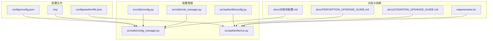
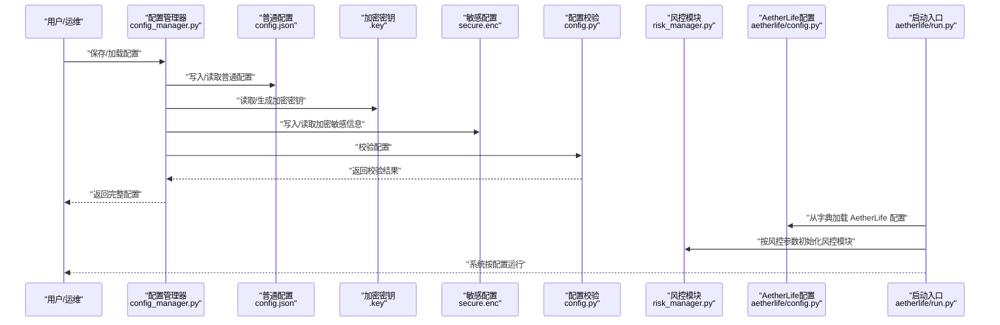
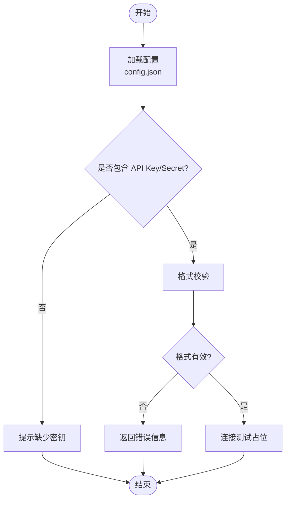
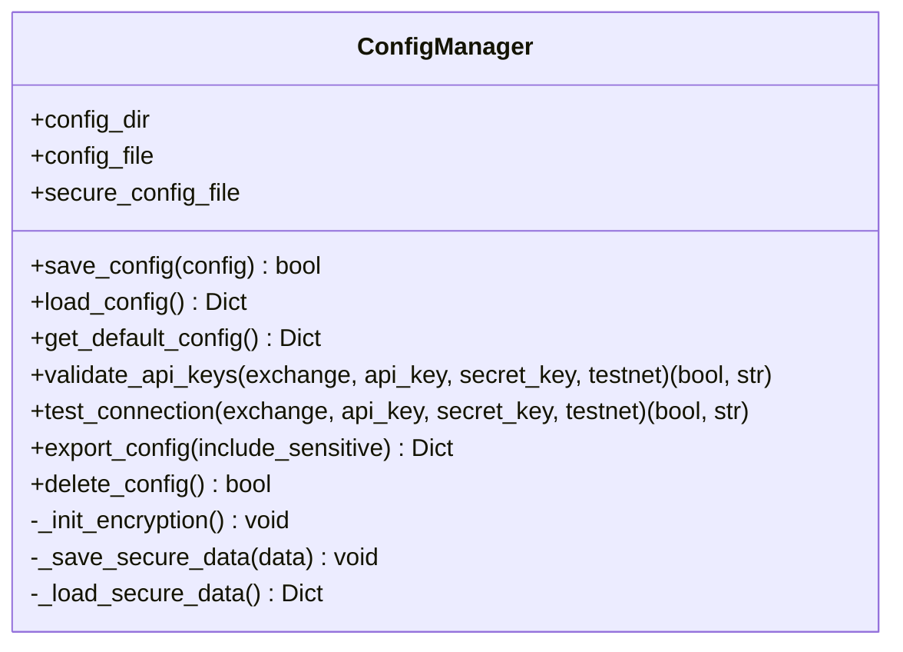
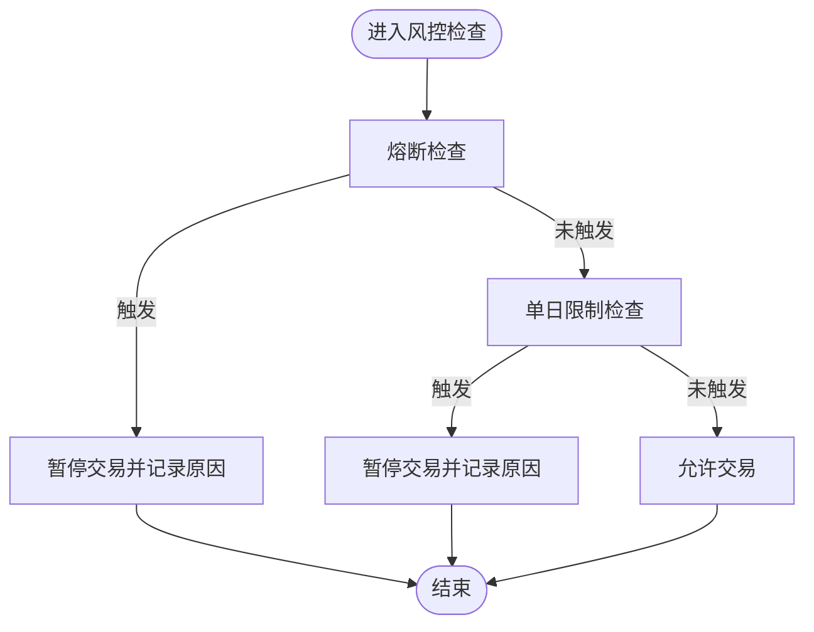
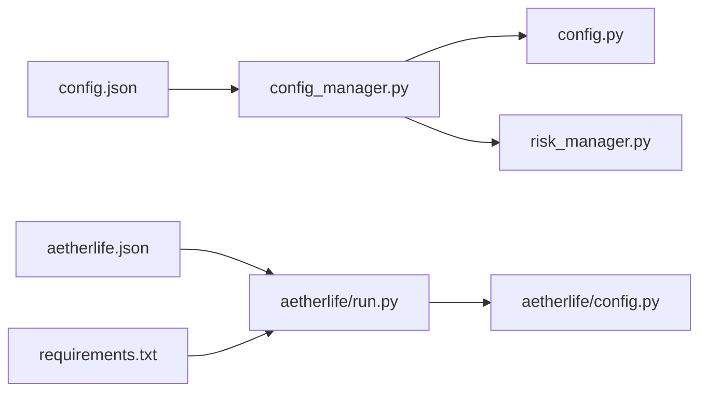

# 系统配置

<cite>
**本文引用的文件**
- [config.json](file://configs/config.json)
- [aetherlife.json](file://configs/aetherlife.json)
- [.key](file://configs/.key)
- [config_manager.py](file://src/utils/config_manager.py)
- [config.py](file://src/utils/config.py)
- [risk_manager.py](file://src/utils/risk_manager.py)
- [config.py](file://src/aetherlife/config.py)
- [run.py](file://src/aetherlife/run.py)
- [PERCEPTION_UPGRADE_GUIDE.md](file://docs/PERCEPTION_UPGRADE_GUIDE.md)
- [COGNITION_UPGRADE_GUIDE.md](file://docs/COGNITION_UPGRADE_GUIDE.md)
- [交易所配置.md](file://docs/交易所配置.md)
- [requirements.txt](file://requirements.txt)
</cite>

## 目录
1. [简介](#简介)
2. [项目结构](#项目结构)
3. [核心组件](#核心组件)
4. [架构总览](#架构总览)
5. [详细组件分析](#详细组件分析)
6. [依赖关系分析](#依赖关系分析)
7. [性能考量](#性能考量)
8. [故障排查指南](#故障排查指南)
9. [结论](#结论)
10. [附录](#附录)

## 简介
本文件面向量化交易系统的运维与开发人员，提供系统配置的权威说明。内容覆盖以下方面：
- config.json 交易与风控配置参数详解
- AetherLife 专用配置 aetherlife.json 的结构与用途（感知层、认知层、决策层等）
- API 密钥的申请、配置与测试方法
- 网络参数（代理、连接超时、重试机制）的设置建议
- 配置文件的备份与恢复、变更最佳实践
- 配置验证与错误排查指引

## 项目结构
系统配置主要分布在以下位置：
- 交易与风控配置：configs/config.json
- AetherLife 架构配置：configs/aetherlife.json
- 加密密钥文件：configs/.key
- 配置管理与校验：src/utils/config_manager.py、src/utils/config.py、src/utils/risk_manager.py
- AetherLife 配置数据类：src/aetherlife/config.py
- AetherLife 启动入口与配置加载：src/aetherlife/run.py
- 相关文档：docs/PERCEPTION_UPGRADE_GUIDE.md、docs/COGNITION_UPGRADE_GUIDE.md、docs/交易所配置.md
- 依赖声明：requirements.txt

**图示来源**
- [config.json](file://configs/config.json#L1-L28)
- [aetherlife.json](file://configs/aetherlife.json#L1-L17)
- [.key](file://configs/.key#L1-L1)
- [config_manager.py](file://src/utils/config_manager.py#L1-L212)
- [config.py](file://src/utils/config.py#L1-L49)
- [risk_manager.py](file://src/utils/risk_manager.py#L1-L388)
- [config.py](file://src/aetherlife/config.py#L1-L131)
- [run.py](file://src/aetherlife/run.py#L1-L71)
- [PERCEPTION_UPGRADE_GUIDE.md](file://docs/PERCEPTION_UPGRADE_GUIDE.md#L1-L327)
- [COGNITION_UPGRADE_GUIDE.md](file://docs/COGNITION_UPGRADE_GUIDE.md#L1-L406)
- [交易所配置.md](file://docs/交易所配置.md#L1-L32)
- [requirements.txt](file://requirements.txt#L1-L92)

**章节来源**
- [config.json](file://configs/config.json#L1-L28)
- [aetherlife.json](file://configs/aetherlife.json#L1-L17)
- [.key](file://configs/.key#L1-L1)
- [config_manager.py](file://src/utils/config_manager.py#L1-L212)
- [config.py](file://src/utils/config.py#L1-L49)
- [risk_manager.py](file://src/utils/risk_manager.py#L1-L388)
- [config.py](file://src/aetherlife/config.py#L1-L131)
- [run.py](file://src/aetherlife/run.py#L1-L71)
- [PERCEPTION_UPGRADE_GUIDE.md](file://docs/PERCEPTION_UPGRADE_GUIDE.md#L1-L327)
- [COGNITION_UPGRADE_GUIDE.md](file://docs/COGNITION_UPGRADE_GUIDE.md#L1-L406)
- [交易所配置.md](file://docs/交易所配置.md#L1-L32)
- [requirements.txt](file://requirements.txt#L1-L92)

## 核心组件
本节聚焦两类配置文件及其管理工具：

- 交易与风控配置（config.json）
  - 交易参数：交易所、沙盒、交易对、时间框架、策略、杠杆
  - 策略参数：不同策略所需的内部参数
  - 风控参数：最大持仓比例、止损、止盈、单日最大亏损等
  - AI 增强：是否启用多代理、ML 预测、情绪分析、自动复利等

- AetherLife 专用配置（aetherlife.json）
  - 全局参数：交易对、日志级别
  - 认知层：是否启用辩论工作流
  - 守护层：审计日志开关与路径
  - 进化层：每日进化触发时间、策略变体数量、部署阈值等

- 配置管理与校验（config_manager.py、config.py）
  - 加密存储：敏感信息与普通配置分离加密
  - 默认配置：提供完整默认模板
  - 校验规则：支持的交易所与策略、数值范围等
  - API 密钥验证与连接测试占位

- 风控模块（risk_manager.py）
  - 仓位管理、止损止盈、追踪止损、熔断与单日限制
  - 交易历史与统计

**章节来源**
- [config.json](file://configs/config.json#L1-L28)
- [aetherlife.json](file://configs/aetherlife.json#L1-L17)
- [config_manager.py](file://src/utils/config_manager.py#L1-L212)
- [config.py](file://src/utils/config.py#L1-L49)
- [risk_manager.py](file://src/utils/risk_manager.py#L1-L388)

## 架构总览
下图展示配置在系统中的加载与使用路径，以及与各模块的耦合关系。

**图示来源**
- [config_manager.py](file://src/utils/config_manager.py#L1-L212)
- [config.py](file://src/utils/config.py#L1-L49)
- [risk_manager.py](file://src/utils/risk_manager.py#L1-L388)
- [config.py](file://src/aetherlife/config.py#L1-L131)
- [run.py](file://src/aetherlife/run.py#L1-L71)

## 详细组件分析

### 交易与风控配置（config.json）
- 交易参数
  - exchange：当前支持的交易所标识
  - testnet：是否使用沙盒
  - symbols：交易对列表
  - timeframe：K线时间框架
  - strategy：策略名称
  - leverage：杠杆倍数
- 策略参数（strategy_config）
  - 不同策略所需的内部参数集合
- 风控参数（risk）
  - max_position_pct：最大持仓占可用资金比例
  - stop_loss_pct：止损比例
  - take_profit_pct：止盈比例
  - max_daily_loss：单日最大亏损比例
- AI 增强（ai_enhance）
  - enabled：是否启用 AI 增强
  - multi_agent：是否启用多代理
  - ml_predictor：是否启用 ML 预测
  - sentiment：是否启用情绪分析
  - auto_compound：是否启用自动复利

配置校验要点
- 支持的交易所与策略枚举
- symbols 必须为非空字符串列表
- 数值范围校验（如 max_position_pct ∈ (0,1]）

**章节来源**
- [config.json](file://configs/config.json#L1-L28)
- [config.py](file://src/utils/config.py#L1-L49)

### AetherLife 专用配置（aetherlife.json）
- symbol：全局交易对
- log_level：日志级别
- cognition
  - debate_enabled：是否启用辩论工作流
- guard
  - audit_log_enabled：是否启用审计日志
  - audit_log_path：审计日志文件路径
- evolution
  - evolution_hour_utc：每日进化触发 UTC 时间
  - strategy_variants_per_round：每轮策略变体数量
  - min_sharpe_to_deploy：部署最低夏普比率

AetherLife 配置数据类
- DataFabricConfig：感知层配置（多源数据、刷新间隔、新闻流等）
- MemoryConfig：记忆层配置（Redis、上下文长度、向量记忆等）
- CognitionConfig：认知层配置（编排器类型、Worker 角色、辩论、并行分析数等）
- DecisionConfig：决策层配置（决策模式、严格校验、快速路径等）
- ExecutionConfig：执行层配置（引擎、交易所、沙盒）
- GuardConfig：守护层配置（人工在环、熔断、审计）
- EvolutionConfig：进化层配置（触发时间、变体数、部署阈值、代码生成）

配置加载流程
- 启动入口会尝试从多个路径加载 aetherlife.json，并通过 from_dict 兼容 config.json 的部分字段。

**章节来源**
- [aetherlife.json](file://configs/aetherlife.json#L1-L17)
- [config.py](file://src/aetherlife/config.py#L1-L131)
- [run.py](file://src/aetherlife/run.py#L1-L71)

### API 密钥配置与测试
- 配置方式
  - 在交易所创建 API Key，确保具备合约交易与读取权限
  - 通过环境变量注入（示例见文档）
- 安全建议
  - 不提交到版本库
  - 优先使用只读 Key
  - 设置 IP 白名单并定期更换
- 格式校验
  - 配置管理器提供基础格式校验（长度与非空）
- 连接测试
  - 提供占位实现，后续可对接具体交易所客户端进行实际测试

**图示来源**
- [config_manager.py](file://src/utils/config_manager.py#L146-L212)
- [交易所配置.md](file://docs/交易所配置.md#L1-L32)

**章节来源**
- [config_manager.py](file://src/utils/config_manager.py#L146-L212)
- [交易所配置.md](file://docs/交易所配置.md#L1-L32)

### 网络参数与连接行为
- 代理与网络
  - 通过第三方库支持（如 aiohttp、websockets、ccxt、ib_insync 等）
  - 文档提供了 IBKR、加密货币、Kafka 等连接器的前置条件与注意事项
- 连接超时与重试
  - 未在配置文件中显式定义超时与重试参数
  - 建议在应用层或连接器层设置合理的超时与指数退避重试策略
- Kafka 管道
  - 支持批量发送与压缩，建议结合消费者滞后监控

**章节来源**
- [PERCEPTION_UPGRADE_GUIDE.md](file://docs/PERCEPTION_UPGRADE_GUIDE.md#L1-L327)
- [COGNITION_UPGRADE_GUIDE.md](file://docs/COGNITION_UPGRADE_GUIDE.md#L1-L406)
- [requirements.txt](file://requirements.txt#L1-L92)

### 配置管理与安全
- 加密存储
  - 普通配置与敏感信息分离
  - 使用对称加密（Fernet）保存敏感字段
  - 密钥文件与加密配置文件设置只读权限
- 默认配置
  - 提供完整默认模板，便于快速启动
- 导出与删除
  - 支持导出不含敏感信息的配置
  - 删除配置文件（普通与加密）

**图示来源**
- [config_manager.py](file://src/utils/config_manager.py#L1-L212)

**章节来源**
- [config_manager.py](file://src/utils/config_manager.py#L1-L212)
- [.key](file://configs/.key#L1-L1)

### 风控参数与策略
- 仓位管理
  - 基于最大持仓比例与信号强度计算下单数量
  - 最小/最大仓位约束
- 止损止盈
  - 固定止损与止盈比例
  - 追踪止损（基于峰值）
- 熔断与单日限制
  - 单日最大亏损触发熔断
  - 单日交易笔数与连续亏损限制
- 统计与暂停
  - 日统计、连败计数、暂停状态与原因
  - 提供恢复交易接口

**图示来源**
- [risk_manager.py](file://src/utils/risk_manager.py#L129-L194)

**章节来源**
- [risk_manager.py](file://src/utils/risk_manager.py#L1-L388)

## 依赖关系分析
- 配置文件与模块
  - config.json 与 aetherlife.json 分别被交易与 AetherLife 模块消费
  - 配置管理器统一处理加密与校验
- 第三方依赖
  - 交易所客户端、WebSocket、Kafka、Redis、LangGraph/LangChain、强化学习等
- 启动流程
  - AetherLife 启动入口加载 aetherlife.json 并注入到配置数据类

**图示来源**
- [config.json](file://configs/config.json#L1-L28)
- [aetherlife.json](file://configs/aetherlife.json#L1-L17)
- [config_manager.py](file://src/utils/config_manager.py#L1-L212)
- [config.py](file://src/utils/config.py#L1-L49)
- [risk_manager.py](file://src/utils/risk_manager.py#L1-L388)
- [config.py](file://src/aetherlife/config.py#L1-L131)
- [run.py](file://src/aetherlife/run.py#L1-L71)
- [requirements.txt](file://requirements.txt#L1-L92)

**章节来源**
- [requirements.txt](file://requirements.txt#L1-L92)
- [run.py](file://src/aetherlife/run.py#L1-L71)

## 性能考量
- 配置加载
  - 优先使用本地配置文件，避免频繁远程拉取
  - 对敏感配置采用只读权限，减少磁盘 I/O 开销
- 网络层
  - WebSocket 订阅频率较高时，建议在连接器层做去重与批量处理
  - Kafka 发送采用批量与压缩，降低网络开销
- 风控检查
  - 风控逻辑在高频交易中应尽量保持 O(1) 复杂度，避免成为瓶颈

## 故障排查指南
- 配置加载失败
  - 检查配置文件是否存在与 JSON 格式是否正确
  - 查看配置管理器的错误输出
- API 密钥问题
  - 校验长度与非空
  - 确认交易所权限与 IP 白名单
- 连接器问题
  - IBKR：检查 TWS/Gateway 是否启动、端口是否正确、API 是否启用
  - CCXT：检查网络与代理、交易所可达性
  - Kafka：检查服务运行、端口可达、Topic 自动创建
- 风控触发
  - 熔断：检查单日亏损与冷却时间
  - 单日限制：检查交易笔数与连续亏损
- AetherLife 配置
  - 确认 aetherlife.json 路径与加载顺序
  - 检查环境变量覆盖（如 AETHERLIFE_SYMBOL、AETHERLIFE_TESTNET）

**章节来源**
- [config_manager.py](file://src/utils/config_manager.py#L82-L115)
- [PERCEPTION_UPGRADE_GUIDE.md](file://docs/PERCEPTION_UPGRADE_GUIDE.md#L289-L327)
- [COGNITION_UPGRADE_GUIDE.md](file://docs/COGNITION_UPGRADE_GUIDE.md#L379-L406)
- [risk_manager.py](file://src/utils/risk_manager.py#L129-L194)
- [run.py](file://src/aetherlife/run.py#L32-L49)

## 结论
本配置文档梳理了交易与风控配置、AetherLife 架构配置、API 密钥安全、网络参数建议、配置管理与风控策略，并提供了故障排查与性能优化建议。建议在生产环境中：
- 使用配置管理器进行加密存储与校验
- 严格遵循 API 密钥安全规范
- 在连接器层实现合理的超时与重试策略
- 定期备份配置并演练恢复流程

## 附录

### 配置备份与恢复
- 备份
  - 备份 configs/config.json、configs/aetherlife.json、configs/.key 与 configs/secure.enc
  - 建议将备份纳入版本控制的保密分支或外部安全存储
- 恢复
  - 将备份文件放回原路径
  - 确保 .key 与 secure.enc 的权限正确
  - 重新启动系统以加载配置

**章节来源**
- [config_manager.py](file://src/utils/config_manager.py#L169-L180)

### 配置变更最佳实践
- 渐进式变更：先在沙盒环境验证，再逐步推广到主网
- 变更记录：记录每次变更的参数、原因与影响范围
- 回滚预案：保留最近一次稳定配置的快照
- 权限最小化：仅授予必要的只读或有限权限的 API Key

**章节来源**
- [config_manager.py](file://src/utils/config_manager.py#L181-L194)
- [交易所配置.md](file://docs/交易所配置.md#L27-L32)