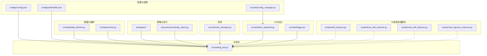
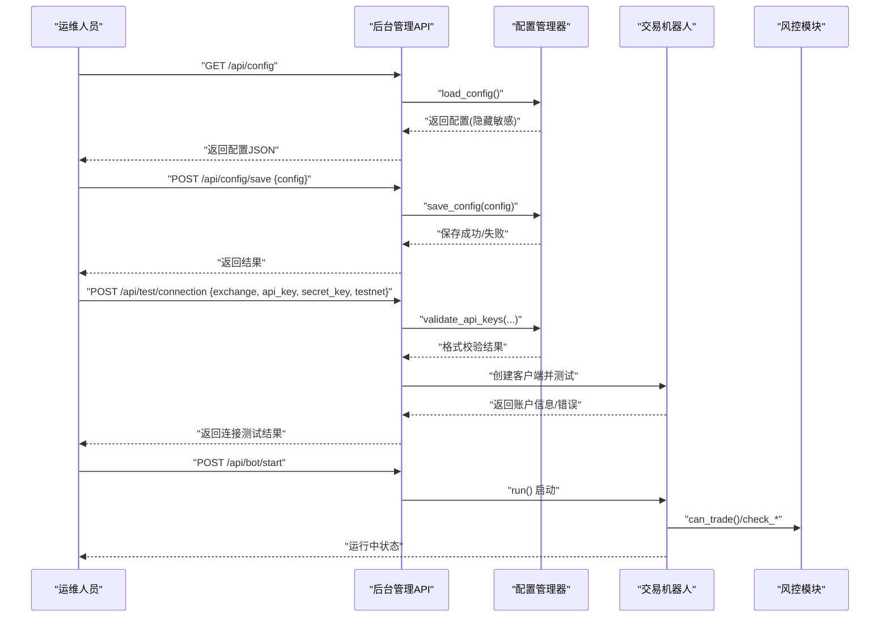
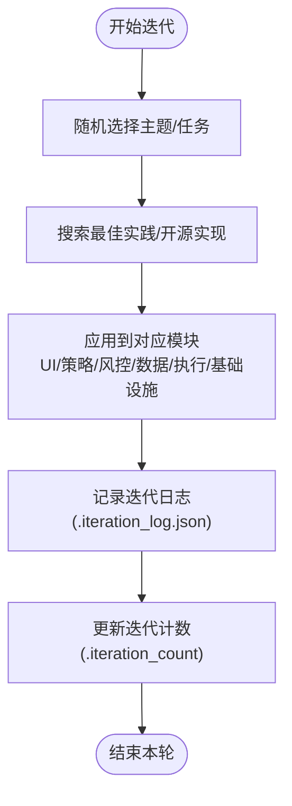
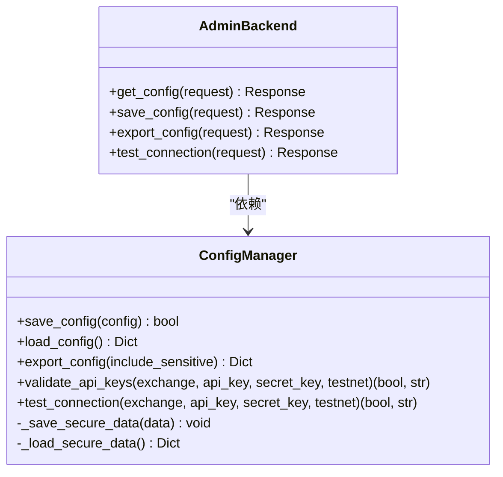
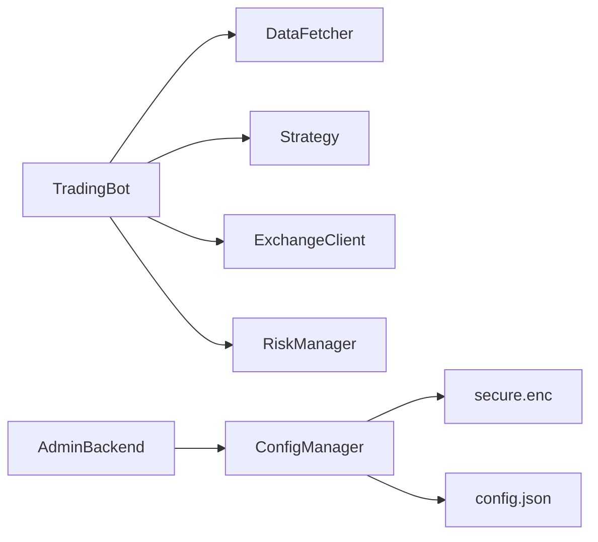

# 维护升级

<cite>
**本文引用的文件**
- [requirements.txt](file://requirements.txt)
- [scripts/self_improve.py](file://scripts/self_improve.py)
- [scripts/true_self_improve.py](file://scripts/true_self_improve.py)
- [scripts/real_self_improve.py](file://scripts/real_self_improve.py)
- [scripts/real_rigorous_improve.py](file://scripts/real_rigorous_improve.py)
- [configs/config.json](file://configs/config.json)
- [configs/aetherlife.json](file://configs/aetherlife.json)
- [src/utils/config_manager.py](file://src/utils/config_manager.py)
- [src/utils/logger.py](file://src/utils/logger.py)
- [src/utils/risk_manager.py](file://src/utils/risk_manager.py)
- [src/data/cache.py](file://src/data/cache.py)
- [src/ui/admin_backend.py](file://src/ui/admin_backend.py)
- [src/trading_bot.py](file://src/trading_bot.py)
</cite>

## 目录
1. [引言](#引言)
2. [项目结构](#项目结构)
3. [核心组件](#核心组件)
4. [架构总览](#架构总览)
5. [详细组件分析](#详细组件分析)
6. [依赖关系分析](#依赖关系分析)
7. [性能考虑](#性能考虑)
8. [故障排查指南](#故障排查指南)
9. [结论](#结论)
10. [附录](#附录)

## 引言
本指南面向量化交易系统的运维与开发团队，提供一套完整的维护升级方法论与实操步骤，覆盖依赖包版本管理与安全更新、系统升级流程与回退策略、AI功能的自我改进机制、配置文件版本管理与变更追踪、定期维护任务清单、热更新与零停机部署可能性及维护窗口规划与影响评估。

## 项目结构
系统采用分层架构：数据层（行情与缓存）、策略层（多种交易策略）、执行层（交易所客户端封装）、风控层（仓位与风控）、UI与后台（FastAPI管理接口）。配置分为公开配置与加密敏感配置，日志统一管理，AI自我改进脚本独立于主业务逻辑。

**图示来源**
- [src/trading_bot.py](file://src/trading_bot.py#L1-L346)
- [src/ui/admin_backend.py](file://src/ui/admin_backend.py#L1-L447)
- [src/utils/config_manager.py](file://src/utils/config_manager.py#L1-L212)
- [src/utils/risk_manager.py](file://src/utils/risk_manager.py#L1-L388)
- [src/data/cache.py](file://src/data/cache.py#L1-L7)
- [scripts/self_improve.py](file://scripts/self_improve.py#L1-L115)
- [scripts/true_self_improve.py](file://scripts/true_self_improve.py#L1-L229)
- [scripts/real_self_improve.py](file://scripts/real_self_improve.py#L1-L166)
- [scripts/real_rigorous_improve.py](file://scripts/real_rigorous_improve.py#L1-L261)

**章节来源**
- [src/trading_bot.py](file://src/trading_bot.py#L1-L346)
- [src/ui/admin_backend.py](file://src/ui/admin_backend.py#L1-L447)
- [src/utils/config_manager.py](file://src/utils/config_manager.py#L1-L212)
- [src/utils/risk_manager.py](file://src/utils/risk_manager.py#L1-L388)
- [src/data/cache.py](file://src/data/cache.py#L1-L7)
- [scripts/self_improve.py](file://scripts/self_improve.py#L1-L115)
- [scripts/true_self_improve.py](file://scripts/true_self_improve.py#L1-L229)
- [scripts/real_self_improve.py](file://scripts/real_self_improve.py#L1-L166)
- [scripts/real_rigorous_improve.py](file://scripts/real_rigorous_improve.py#L1-L261)

## 核心组件
- 配置与密钥管理：负责公开配置与敏感信息分离存储、加密读写、默认配置与导出、API密钥格式校验、连接测试占位。
- 风控与仓位：集中管理最大仓位、止损止盈、追踪止损、熔断、日级限额、连败限制、暂停与恢复、交易统计。
- 后台管理API：提供配置读写、导出、API连通性测试、策略与交易所信息查询、Bot启停与状态查询。
- 主交易循环：数据拉取、策略分析、风控检查、下单执行、仓位检查与止盈止损、日志输出。
- AI自我改进脚本：提供多种“自我迭代”模式，从简单迭代到严谨扫描-搜索-修复-验证闭环。

**章节来源**
- [src/utils/config_manager.py](file://src/utils/config_manager.py#L1-L212)
- [src/utils/risk_manager.py](file://src/utils/risk_manager.py#L1-L388)
- [src/ui/admin_backend.py](file://src/ui/admin_backend.py#L1-L447)
- [src/trading_bot.py](file://src/trading_bot.py#L1-L346)
- [scripts/self_improve.py](file://scripts/self_improve.py#L1-L115)
- [scripts/true_self_improve.py](file://scripts/true_self_improve.py#L1-L229)
- [scripts/real_self_improve.py](file://scripts/real_self_improve.py#L1-L166)
- [scripts/real_rigorous_improve.py](file://scripts/real_rigorous_improve.py#L1-L261)

## 架构总览
系统以主程序为核心，围绕其构建数据、策略、执行、风控四条流水线；后台管理API作为运维入口，提供配置与连接测试能力；AI自我改进脚本独立运行，按计划或触发式进行迭代。

**图示来源**
- [src/ui/admin_backend.py](file://src/ui/admin_backend.py#L57-L135)
- [src/utils/config_manager.py](file://src/utils/config_manager.py#L146-L211)
- [src/trading_bot.py](file://src/trading_bot.py#L256-L296)

## 详细组件分析

### 依赖包版本管理与安全更新
- 版本锁定与升级策略
  - 使用 requirements.txt 统一声明依赖范围与最低版本，建议遵循语义化版本，优先使用 >= 约束与 ~ 精确补丁版本组合，避免破坏性更新。
  - 对于安全敏感库（如加密、网络、日志、监控），建议采用固定版本或严格范围，配合自动化扫描与CI触发升级。
- 安全更新流程
  - CI扫描：镜像构建阶段集成安全扫描（如 pip-audit、safety、osv-scanner）。
  - 本地验证：在隔离环境安装新版本，运行单元测试与关键集成测试。
  - 渐进发布：灰度一台/一组服务器，观察日志与指标，确认无异常后再全量升级。
  - 回退预案：保留上一版本镜像与依赖快照，确保可一键回滚。
- 依赖清单要点（节选）
  - Web/异步：aiohttp、websockets、fastapi、uvicorn
  - 数据与AI：pandas、numpy、polars、torch、sentence-transformers、gymnasium、stable-baselines3
  - 交易所与消息：ccxt、kafka-python、aiokafka
  - 加密与监控：cryptography、prometheus-client、structlog
  - 工具与质量：python-dateutil、pytest系列、black/flake8/mypy

**章节来源**
- [requirements.txt](file://requirements.txt#L1-L92)

### 系统升级步骤与注意事项
- 升级准备
  - 制定维护窗口，通知相关方；评估停机时间与影响范围。
  - 备份：代码仓库快照、配置文件（含加密密钥）、数据库/时序库、日志目录。
  - 准备回滚包：旧版本镜像、requirements.txt、配置备份、迁移脚本。
- 升级流程
  - 停机：停止主进程与后台管理服务，释放资源。
  - 依赖更新：pip install -r requirements.txt --upgrade --force-reinstall（谨慎使用强制重装）。
  - 配置迁移：对比新旧配置键，迁移新增项，保留敏感配置。
  - 部署：部署新代码与新镜像，启动后台管理API与交易机器人。
  - 验证：连接测试、策略回测、关键路径压测、日志与监控核验。
- 回滚方案
  - 快速回滚：停止新版本，回切至旧镜像与依赖，恢复配置。
  - 数据一致性：核对数据库/缓存版本，必要时执行降级迁移。
  - 事后复盘：记录变更、影响与根因，沉淀升级规范。

**章节来源**
- [src/ui/admin_backend.py](file://src/ui/admin_backend.py#L159-L244)
- [src/trading_bot.py](file://src/trading_bot.py#L284-L296)

### AI功能的自我改进机制
- 脚本定位
  - scripts/self_improve.py：基础迭代清单与进度跟踪，适合快速推进。
  - scripts/true_self_improve.py：联网搜索并记录改进，适合探索性学习。
  - scripts/real_self_improve.py：异步搜索与主题驱动改进，适合持续演进。
  - scripts/real_rigorous_improve.py：严谨闭环（扫描→搜索→修复→验证），适合质量优先场景。
- 使用建议
  - 非生产直接修改代码：优先使用 self_improve.py 或 true_self_improve.py 的“记录+规划”模式，避免直接破坏生产代码。
  - 生产环境：使用 real_rigorous_improve.py 的扫描-修复-验证闭环，确保可编译与基本功能。
  - 结合配置：通过 configs/config.json 与 configs/aetherlife.json 控制AI增强开关与行为。
- 迭代记录
  - .iteration_count：记录迭代次数。
  - .iteration_log.json/.iteration_log.md：记录每次迭代的主题、搜索结果、改进数量与时间戳，便于追踪。

**图示来源**
- [scripts/self_improve.py](file://scripts/self_improve.py#L85-L112)
- [scripts/true_self_improve.py](file://scripts/true_self_improve.py#L140-L195)
- [scripts/real_self_improve.py](file://scripts/real_self_improve.py#L94-L127)
- [scripts/real_rigorous_improve.py](file://scripts/real_rigorous_improve.py#L163-L230)

**章节来源**
- [scripts/self_improve.py](file://scripts/self_improve.py#L1-L115)
- [scripts/true_self_improve.py](file://scripts/true_self_improve.py#L1-L229)
- [scripts/real_self_improve.py](file://scripts/real_self_improve.py#L1-L166)
- [scripts/real_rigorous_improve.py](file://scripts/real_rigorous_improve.py#L1-L261)

### 配置文件版本管理与变更追踪
- 配置拆分
  - 公开配置：configs/config.json（交易对、时间周期、策略参数、风控参数、AI增强开关）。
  - AetherLife专用：configs/aetherlife.json（日志级别、认知/守卫/进化配置）。
  - 加密敏感：由 src/utils/config_manager.py 负责分离保存与加密读写，密钥文件 .key 仅限受控访问。
- 变更追踪
  - 使用 .iteration_log.json 记录每次配置相关的改进与变更主题。
  - 在版本控制系统中提交配置变更，附带变更说明与影响评估。
- 导出与导入
  - 后台管理API提供导出接口，支持是否包含敏感字段；可用于备份与迁移。

**图示来源**
- [src/utils/config_manager.py](file://src/utils/config_manager.py#L48-L211)
- [src/ui/admin_backend.py](file://src/ui/admin_backend.py#L57-L157)

**章节来源**
- [configs/config.json](file://configs/config.json#L1-L28)
- [configs/aetherlife.json](file://configs/aetherlife.json#L1-L17)
- [src/utils/config_manager.py](file://src/utils/config_manager.py#L48-L211)
- [src/ui/admin_backend.py](file://src/ui/admin_backend.py#L57-L157)

### 定期维护任务清单
- 依赖与安全
  - 每周：扫描依赖漏洞，生成报告并制定升级计划。
  - 每月：更新非安全关键库，回归测试。
- 配置与密钥
  - 每季度：审查配置项，清理冗余键，轮换密钥与会话。
  - 每次升级后：备份配置与密钥，记录变更。
- 数据与缓存
  - 每日：清理过期缓存（Redis/本地缓存），压缩历史数据。
  - 每周：校验数据完整性与一致性，修复异常分区。
- 日志与监控
  - 每日：归档日志，清理超期日志，检查异常峰值。
  - 每周：巡检Prometheus/结构化日志指标，优化告警阈值。
- 系统健康
  - 每日：检查服务进程、端口占用、磁盘与内存使用。
  - 每月：执行压力测试与混沌演练，验证熔断与回退。

[本节为通用维护建议，不直接分析具体文件，故无“章节来源”]

### 热更新与零停机部署
- 可行性评估
  - 配置热加载：后台管理API支持动态读取配置，可在不重启主进程的情况下应用部分配置变更。
  - 代码热替换：由于交易系统涉及状态机与长连接，不建议直接热替换核心模块；可通过“优雅停机+新实例”实现近似零停机。
- 实现建议
  - 配置热加载：在主循环中定期reload配置文件或监听配置变更事件。
  - 部署策略：蓝绿/滚动发布，先启动新实例，健康检查通过后切换流量，旧实例优雅停机。
  - 熔断与降级：在升级期间启用熔断与降级策略，限制风险暴露。
- 风险控制
  - 回滚通道：确保可快速回滚至稳定版本。
  - 观察窗口：升级后至少2个完整交易周期的观察期。

**章节来源**
- [src/ui/admin_backend.py](file://src/ui/admin_backend.py#L323-L396)
- [src/trading_bot.py](file://src/trading_bot.py#L256-L296)

### 维护窗口规划与影响评估
- 规划步骤
  - 识别关键交易时段（如亚洲时段、欧美时段重叠），避开高波动与流动性差时段。
  - 评估影响：升级范围、停机时长、回滚成本、对策略回测与实盘的影响。
  - 通知与演练：提前通知业务方，进行升级演练与回滚演练。
- 影响评估
  - 对策略：回测验证升级后的依赖与配置兼容性。
  - 对风控：确认风控参数在新版本下的行为一致性。
  - 对日志与监控：确保升级后指标与告警正常。

[本节为通用规划方法，不直接分析具体文件，故无“章节来源”]

## 依赖关系分析
- 组件耦合
  - TradingBot 依赖数据、策略、执行、风控模块；AdminBackend 依赖 ConfigManager；RiskManager 独立但被 TradingBot 使用。
- 外部依赖
  - 交易所API（ccxt）、消息队列（kafka）、时序库（clickhouse）、缓存（redis）、LLM与AI库（openai/anthropic/langchain等）。
- 循环依赖
  - 未发现明显循环依赖；模块间通过接口与工厂函数解耦。

**图示来源**
- [src/trading_bot.py](file://src/trading_bot.py#L14-L22)
- [src/ui/admin_backend.py](file://src/ui/admin_backend.py#L16-L27)
- [src/utils/config_manager.py](file://src/utils/config_manager.py#L48-L115)

**章节来源**
- [src/trading_bot.py](file://src/trading_bot.py#L1-L346)
- [src/ui/admin_backend.py](file://src/ui/admin_backend.py#L1-L447)
- [src/utils/config_manager.py](file://src/utils/config_manager.py#L1-L212)

## 性能考虑
- 并行与异步：主循环使用 asyncio.gather 并行拉取OHLCV与Ticker，降低等待时间。
- 仓位与风控：PositionManager与RiskManager在下单前后更新与检查，避免重复下单与超额仓位。
- 缓存：DataCache预留扩展点，建议结合Redis实现热点数据缓存。
- 日志：统一Logger，避免频繁IO；生产环境建议落盘与结构化输出结合。

**章节来源**
- [src/trading_bot.py](file://src/trading_bot.py#L92-L104)
- [src/utils/risk_manager.py](file://src/utils/risk_manager.py#L244-L339)
- [src/data/cache.py](file://src/data/cache.py#L1-L7)
- [src/utils/logger.py](file://src/utils/logger.py#L1-L34)

## 故障排查指南
- 配置类问题
  - API密钥格式校验失败：检查长度与格式，参考 ConfigManager 的校验逻辑。
  - 连接测试失败：确认网络、代理、交易所API白名单与测试网开关。
- 风控类问题
  - 熔断触发：检查日累计亏损与冷却时间；必要时手动resume。
  - 仓位为0：检查信号强度、账户余额与最小下单精度。
- 后台管理
  - 配置保存失败：检查磁盘权限与JSON格式；查看返回错误。
  - Bot启停异常：确认运行状态与异常堆栈，必要时重启服务。

**章节来源**
- [src/utils/config_manager.py](file://src/utils/config_manager.py#L146-L211)
- [src/utils/risk_manager.py](file://src/utils/risk_manager.py#L129-L194)
- [src/ui/admin_backend.py](file://src/ui/admin_backend.py#L81-L135)
- [src/trading_bot.py](file://src/trading_bot.py#L284-L296)

## 结论
通过规范的依赖管理与安全更新流程、严谨的升级与回退策略、完善的配置版本与变更追踪、以及可落地的定期维护任务，量化交易系统可以在保证稳定性的同时持续演进。AI自我改进脚本提供了自动化与智能化的改进手段，建议在非生产环境先行验证，再逐步引入生产。零停机部署需结合配置热加载与蓝绿发布策略，确保业务连续性。

## 附录
- 关键文件索引
  - 依赖清单：requirements.txt
  - 配置文件：configs/config.json、configs/aetherlife.json
  - 配置管理：src/utils/config_manager.py
  - 风控模块：src/utils/risk_manager.py
  - 后台管理：src/ui/admin_backend.py
  - 主程序：src/trading_bot.py
  - AI自我改进：scripts/self_improve.py、scripts/true_self_improve.py、scripts/real_self_improve.py、scripts/real_rigorous_improve.py