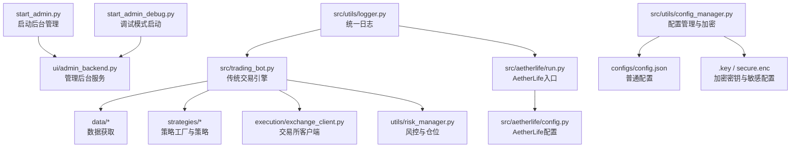
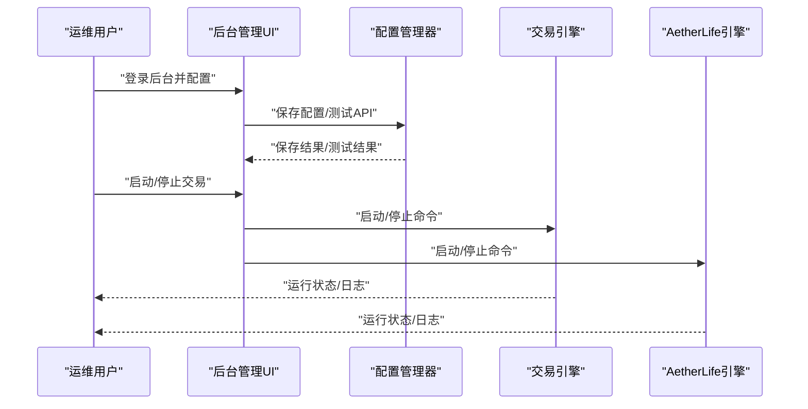
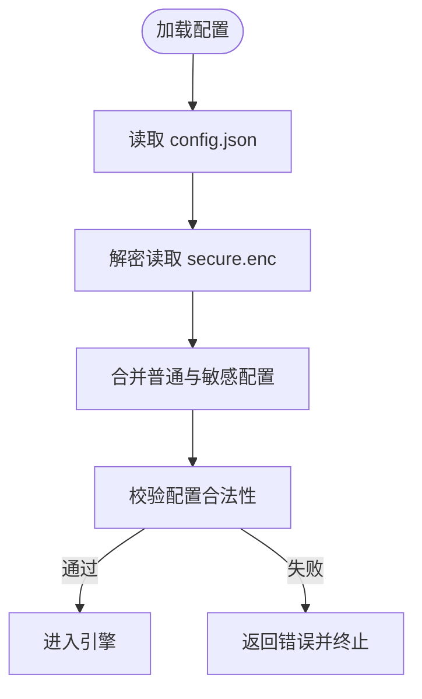
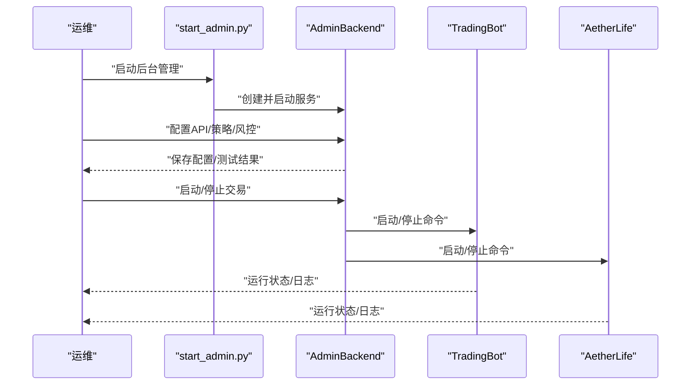
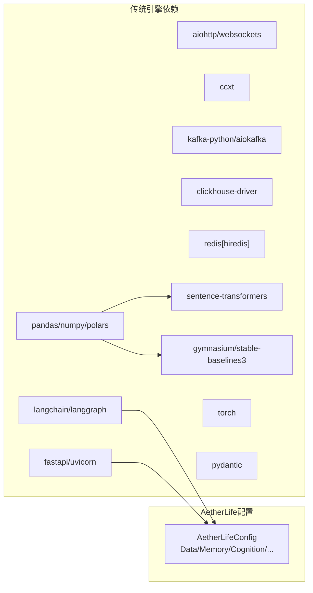

# 部署和运维

<cite>
**本文引用的文件**
- [requirements.txt](file://requirements.txt)
- [README.md](file://README.md)
- [start_admin.py](file://start_admin.py)
- [start_admin_debug.py](file://start_admin_debug.py)
- [src/trading_bot.py](file://src/trading_bot.py)
- [src/aetherlife/run.py](file://src/aetherlife/run.py)
- [src/aetherlife/config.py](file://src/aetherlife/config.py)
- [src/utils/config.py](file://src/utils/config.py)
- [src/utils/config_manager.py](file://src/utils/config_manager.py)
- [src/utils/logger.py](file://src/utils/logger.py)
- [.env.example](file://.env.example)
- [configs/config.json](file://configs/config.json)
- [configs/aetherlife.json](file://configs/aetherlife.json)
- [docs/ADMIN_GUIDE.md](file://docs/ADMIN_GUIDE.md)
</cite>

## 目录
1. [简介](#简介)
2. [项目结构](#项目结构)
3. [核心组件](#核心组件)
4. [架构总览](#架构总览)
5. [详细组件分析](#详细组件分析)
6. [依赖关系分析](#依赖关系分析)
7. [性能考量](#性能考量)
8. [故障排除指南](#故障排除指南)
9. [结论](#结论)
10. [附录](#附录)

## 简介
本指南面向量化交易系统的运维与部署，覆盖环境准备、依赖安装、配置管理、服务启动、监控告警、故障排除、安全与高可用等运维全流程。系统同时支持传统交易引擎与基于多智能体的 AetherLife 架构，提供后台管理界面以简化配置与运维。

## 项目结构
- 顶层入口与脚本
  - 后台管理启动脚本：start_admin.py、start_admin_debug.py
  - 传统交易引擎入口：src/trading_bot.py
  - AetherLife 入口：src/aetherlife/run.py
- 配置与密钥
  - 通用配置：configs/config.json
  - AetherLife 配置：configs/aetherlife.json
  - 环境变量示例：.env.example
  - 配置管理与加密存储：src/utils/config_manager.py
- 依赖与版本
  - 依赖清单：requirements.txt
- 文档
  - 后台管理使用文档：docs/ADMIN_GUIDE.md
  - 通用说明：README.md

图表来源
- [start_admin.py](file://start_admin.py#L1-L85)
- [start_admin_debug.py](file://start_admin_debug.py#L1-L93)
- [src/trading_bot.py](file://src/trading_bot.py#L1-L346)
- [src/aetherlife/run.py](file://src/aetherlife/run.py#L1-L71)
- [src/aetherlife/config.py](file://src/aetherlife/config.py#L1-L131)
- [src/utils/config_manager.py](file://src/utils/config_manager.py#L1-L212)
- [src/utils/logger.py](file://src/utils/logger.py#L1-L34)

章节来源
- [README.md](file://README.md)
- [requirements.txt](file://requirements.txt#L1-L70)
- [docs/ADMIN_GUIDE.md](file://docs/ADMIN_GUIDE.md#L1-L292)

## 核心组件
- 传统交易引擎
  - 职责：数据拉取、策略分析、订单执行、风控与统计
  - 关键点：异步主循环、信号生成、止盈止损、仓位管理
- AetherLife 架构
  - 职责：多市场/多代理/进化闭环/合规
  - 关键点：配置数据类、日志级别、审计日志、进化参数
- 配置与密钥管理
  - 职责：配置文件读写、敏感信息加密存储、默认配置、API密钥格式校验
- 后台管理
  - 职责：Web 界面配置、API 密钥测试、策略参数、风控设置、系统控制
- 日志系统
  - 职责：统一日志格式、控制台输出、异常追踪

章节来源
- [src/trading_bot.py](file://src/trading_bot.py#L27-L346)
- [src/aetherlife/config.py](file://src/aetherlife/config.py#L11-L131)
- [src/utils/config_manager.py](file://src/utils/config_manager.py#L14-L212)
- [start_admin.py](file://start_admin.py#L16-L85)
- [src/utils/logger.py](file://src/utils/logger.py#L12-L34)

## 架构总览
系统采用“前端管理 + 后端引擎”的双轨架构：
- 后台管理通过 Web 界面提供配置与控制能力，配置持久化于本地 JSON，并对敏感信息进行加密存储。
- 交易引擎可选择传统策略引擎或 AetherLife 多智能体引擎，二者均支持测试网与实盘切换。

图表来源
- [start_admin.py](file://start_admin.py#L38-L80)
- [src/utils/config_manager.py](file://src/utils/config_manager.py#L48-L101)
- [src/trading_bot.py](file://src/trading_bot.py#L323-L342)
- [src/aetherlife/run.py](file://src/aetherlife/run.py#L52-L67)

## 详细组件分析

### 环境准备与依赖安装
- Python 版本
  - 文档与依赖声明显示系统面向较新的 Python 生态，建议使用 Python 3.8+。
- 系统依赖
  - Kafka、ClickHouse、Redis、向量与强化学习相关库等，需确保系统具备相应运行环境与网络连通性。
- 依赖安装
  - 使用 requirements.txt 安装全部依赖。
  - 建议在独立虚拟环境中安装，避免全局污染。
- 环境变量
  - 复制 .env.example 为 .env 并填写 API Key/Secret Key/Passphrase。
  - 传统引擎与 AetherLife 均支持通过 .env 注入环境变量。

章节来源
- [docs/ADMIN_GUIDE.md](file://docs/ADMIN_GUIDE.md#L248-L254)
- [requirements.txt](file://requirements.txt#L1-L70)
- [.env.example](file://.env.example#L1-L17)

### 配置文件与密钥管理
- 通用配置
  - 位置：configs/config.json
  - 内容：交易所、测试网、交易对、时间周期、策略、杠杆、策略参数、风控、AI增强开关等。
- AetherLife 配置
  - 位置：configs/aetherlife.json 或运行时查找路径
  - 内容：符号、日志级别、认知层辩论开关、守护层审计日志路径、进化层参数等。
- 配置管理器
  - 职责：分离普通配置与敏感信息，加密存储敏感字段；提供默认配置、校验、导出、删除、连接测试占位。
  - 加密机制：Fernet 对称加密，密钥文件 .key 仅所有者可读。
- 配置校验
  - 支持的交易所与策略、symbols 格式、risk 参数范围等均有校验逻辑。

图表来源
- [src/utils/config_manager.py](file://src/utils/config_manager.py#L82-L116)
- [src/utils/config.py](file://src/utils/config.py#L15-L38)
- [configs/config.json](file://configs/config.json#L1-L28)

章节来源
- [configs/config.json](file://configs/config.json#L1-L28)
- [configs/aetherlife.json](file://configs/aetherlife.json#L1-L17)
- [src/utils/config_manager.py](file://src/utils/config_manager.py#L48-L116)
- [src/utils/config.py](file://src/utils/config.py#L15-L38)

### 服务启动与参数配置
- 传统交易引擎
  - 入口：python src/trading_bot.py
  - 环境变量：.env 加载；可通过环境变量覆盖部分参数。
  - 控制：键盘中断优雅停止；日志输出运行统计。
- AetherLife 引擎
  - 入口：python src/aetherlife/run.py 或在 src 目录下以模块方式运行
  - 配置加载顺序：优先查找 configs/aetherlife.json，其次项目根或 src 下同名文件；可通过环境变量覆盖符号、测试网、周期等。
- 后台管理
  - 启动：python start_admin.py
  - 调试启动：python start_admin_debug.py
  - 端口：默认尝试 8080/8081/8082/8888/9000，若被占用则自动尝试下一个。
  - 访问：http://127.0.0.1:PORT/admin

图表来源
- [start_admin.py](file://start_admin.py#L38-L80)
- [src/trading_bot.py](file://src/trading_bot.py#L323-L342)
- [src/aetherlife/run.py](file://src/aetherlife/run.py#L52-L67)

章节来源
- [src/trading_bot.py](file://src/trading_bot.py#L323-L342)
- [src/aetherlife/run.py](file://src/aetherlife/run.py#L32-L67)
- [start_admin.py](file://start_admin.py#L16-L80)
- [start_admin_debug.py](file://start_admin_debug.py#L25-L93)

### 监控告警与日志
- 日志系统
  - 统一日志格式，控制台输出；提供异常追踪工具方法。
- 建议的监控指标
  - 运行状态、交易信号、订单执行成功率、风控触发次数、日盈亏、账户余额变化。
- 建议的告警规则
  - 连续亏损超过阈值、订单执行失败率上升、引擎异常退出、日志出现高频错误。
- 建议的采集与可视化
  - 结合系统日志与引擎内部统计，接入集中式日志与监控面板。

章节来源
- [src/utils/logger.py](file://src/utils/logger.py#L12-L34)
- [src/trading_bot.py](file://src/trading_bot.py#L284-L297)

### 故障排除流程
- API 密钥与连接
  - 使用后台管理的“测试连接”功能；检查密钥格式、权限、网络与测试网/主网选择。
- 配置保存与加载
  - 检查磁盘空间、文件权限、配置格式；必要时导出配置进行比对。
- 引擎启动失败
  - 查看日志异常堆栈；确认依赖安装、环境变量、配置完整性。
- 后台管理端口占用
  - 自动尝试备用端口；如全部占用，停止冲突进程或手动指定端口。

章节来源
- [docs/ADMIN_GUIDE.md](file://docs/ADMIN_GUIDE.md#L255-L281)
- [src/utils/config_manager.py](file://src/utils/config_manager.py#L146-L212)
- [start_admin.py](file://start_admin.py#L44-L66)

### 运维最佳实践与安全
- 访问控制
  - 后台管理默认绑定 127.0.0.1，建议通过反向代理与认证网关对外暴露。
- 数据备份
  - 定期导出配置或复制 configs/ 目录；保留 .key 与 secure.enc 的备份。
- 灾难恢复
  - 准备可快速恢复的镜像或容器；验证 .env、配置文件与密钥文件的可用性。
- 安全加固
  - 不共享 .key；定期轮换 API 密钥；最小权限原则；不在生产环境开启调试模式。

章节来源
- [docs/ADMIN_GUIDE.md](file://docs/ADMIN_GUIDE.md#L161-L182)
- [src/utils/config_manager.py](file://src/utils/config_manager.py#L31-L47)

### 扩展部署与高可用
- 部署策略
  - 使用容器编排（如 Docker Compose/Kubernetes）部署后台管理与引擎服务。
  - 将 Redis、Kafka、ClickHouse 等外部依赖作为独立服务或托管服务。
- 高可用
  - 多副本运行引擎，结合健康检查与自动重启。
  - 使用负载均衡分发后台管理请求，配置持久化会话或无状态设计。
- 升级指导
  - 采用蓝绿/滚动发布；先在测试环境验证；回滚策略与快照保留。

[本节为概念性内容，不直接分析具体文件]

## 依赖关系分析
- 传统引擎依赖
  - aiohttp/websockets：异步网络
  - pandas/numpy/polars：数据处理
  - ccxt：统一交易所接口
  - kafka-python/aiokafka：消息队列
  - clickhouse-driver：时序数据库
  - redis[hiredis]：缓存与向量存储
  - langchain/langgraph：多智能体框架
  - sentence-transformers：向量化
  - gymnasium/stable-baselines3：强化学习
  - torch：深度学习
  - fastapi/uvicorn：后台管理 API 框架
  - pydantic：数据验证
- AetherLife 配置数据类
  - 通过数据类组织感知、记忆、认知、决策、执行、守护、进化等子系统配置，支持从字典加载与环境变量覆盖。

图表来源
- [requirements.txt](file://requirements.txt#L3-L70)
- [src/aetherlife/config.py](file://src/aetherlife/config.py#L98-L131)

章节来源
- [requirements.txt](file://requirements.txt#L1-L70)
- [src/aetherlife/config.py](file://src/aetherlife/config.py#L98-L131)

## 性能考量
- 异步与并发
  - 传统引擎与后台管理均采用异步 IO，减少阻塞；建议合理设置循环间隔与批处理大小。
- 数据处理
  - 使用 polars/pandas/numpy 进行高性能数据处理；注意内存峰值与 GC 影响。
- 外部依赖
  - Kafka/ClickHouse/Redis 的连接池与超时参数需根据吞吐量调优。
- 模型与多智能体
  - 向量化与强化学习会显著增加 CPU/GPU 负载，建议在专用节点运行。

[本节提供一般性指导，不直接分析具体文件]

## 故障排除指南
- 常见问题定位
  - API 连接失败：核对密钥、网络、交易所维护状态、测试网/主网选择。
  - 配置保存失败：检查磁盘空间、文件权限、配置格式。
  - 引擎启动失败：查看日志异常、依赖安装、环境变量。
- 建议的诊断步骤
  - 启用调试模式启动后台管理，观察模块导入与服务器启动过程。
  - 使用配置管理器导出不含敏感信息的配置进行比对。
  - 临时关闭 AI 增强以排除资源瓶颈。

章节来源
- [docs/ADMIN_GUIDE.md](file://docs/ADMIN_GUIDE.md#L255-L281)
- [start_admin_debug.py](file://start_admin_debug.py#L14-L93)
- [src/utils/config_manager.py](file://src/utils/config_manager.py#L181-L194)

## 结论
本指南提供了从环境准备、依赖安装、配置管理、服务启动到监控告警、故障排除与高可用部署的完整运维路径。建议在测试环境充分验证后再迁移至生产，并建立完善的备份与回滚机制。

[本节为总结性内容，不直接分析具体文件]

## 附录

### A. 环境变量与配置映射
- 传统引擎
  - .env 中的 API Key/Secret Key/Passphrase 会被读取并注入到客户端。
  - 可通过环境变量覆盖符号、测试网、周期等。
- AetherLife 引擎
  - 符号、测试网、周期等可通过环境变量覆盖。

章节来源
- [.env.example](file://.env.example#L5-L16)
- [src/trading_bot.py](file://src/trading_bot.py#L326-L329)
- [src/aetherlife/run.py](file://src/aetherlife/run.py#L52-L67)

### B. 后台管理操作要点
- API 密钥配置与测试
  - 选择交易所，填写密钥，测试连接与密钥有效性。
- 策略与风控
  - 选择策略类型与参数，设置止损止盈、最大仓位、每日最大亏损。
- 系统控制
  - 保存配置、启动/停止交易、导出配置备份。

章节来源
- [docs/ADMIN_GUIDE.md](file://docs/ADMIN_GUIDE.md#L27-L223)