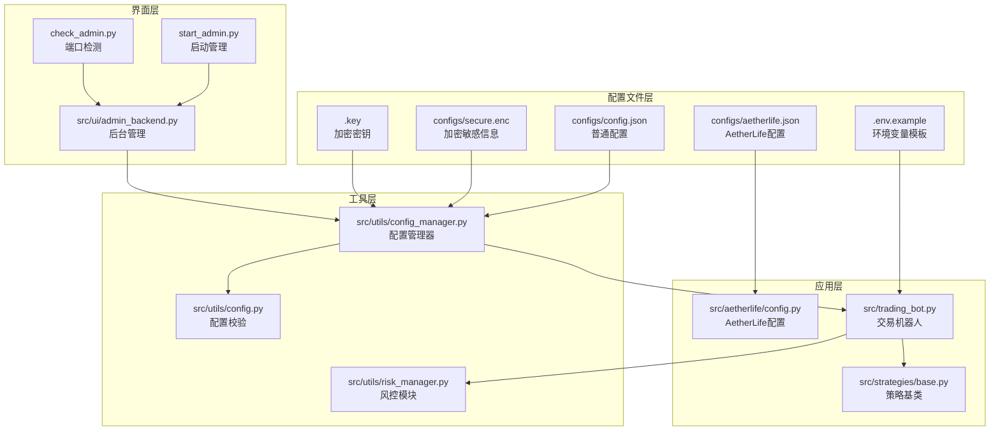
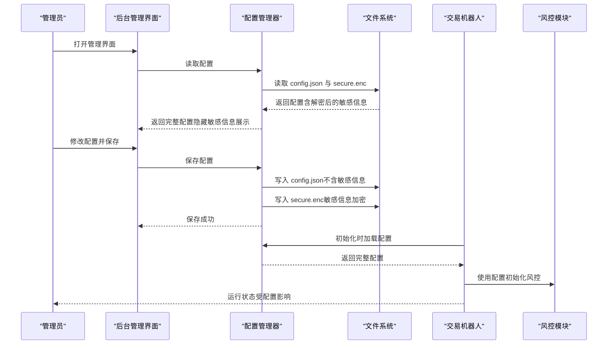
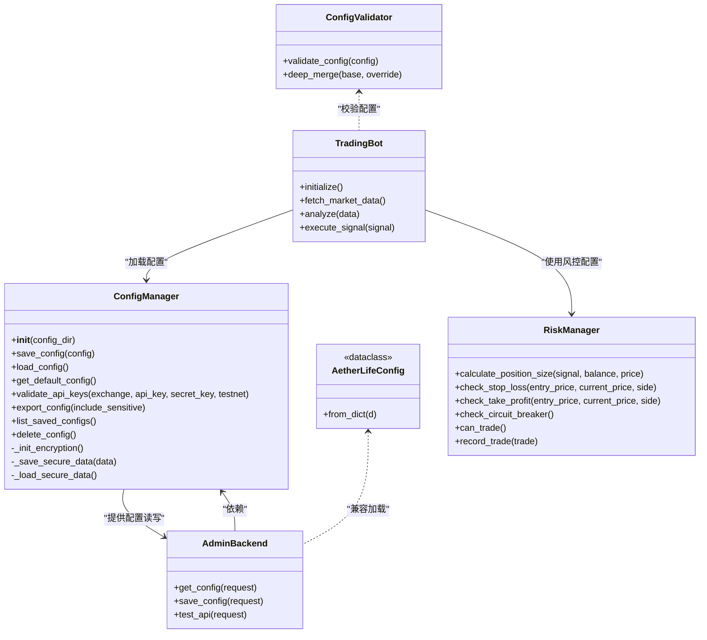

# 配置管理系统

<cite>
**本文档引用的文件**
- [configs/config.json](file://configs/config.json)
- [configs/aetherlife.json](file://configs/aetherlife.json)
- [configs/.key](file://configs/.key)
- [src/utils/config_manager.py](file://src/utils/config_manager.py)
- [src/utils/config.py](file://src/utils/config.py)
- [src/aetherlife/config.py](file://src/aetherlife/config.py)
- [.env.example](file://.env.example)
- [src/trading_bot.py](file://src/trading_bot.py)
- [src/utils/risk_manager.py](file://src/utils/risk_manager.py)
- [src/strategies/base.py](file://src/strategies/base.py)
- [src/ui/admin_backend.py](file://src/ui/admin_backend.py)
- [start_admin.py](file://start_admin.py)
- [check_admin.py](file://check_admin.py)
- [test_admin.py](file://test_admin.py)
- [docs/ADMIN_GUIDE.md](file://docs/ADMIN_GUIDE.md)
</cite>

## 更新摘要
**所做更改**
- 新增加密存储敏感API凭据的安全增强功能章节
- 更新敏感信息处理机制，包括分离存储和文件权限控制
- 新增密钥管理最佳实践和安全考虑
- 更新配置文件结构说明，包含secure.enc和.key文件
- 新增安全相关的故障排除指南

## 目录
1. [简介](#简介)
2. [项目结构](#项目结构)
3. [核心组件](#核心组件)
4. [架构总览](#架构总览)
5. [详细组件分析](#详细组件分析)
6. [依赖关系分析](#依赖关系分析)
7. [性能考量](#性能考量)
8. [故障排除指南](#故障排除指南)
9. [结论](#结论)
10. [附录](#附录)

## 简介
本文件面向量化交易系统的配置管理，系统性阐述配置文件结构与层次关系、环境变量使用与优先级、敏感信息加密存储与访问控制、动态配置更新与热加载机制、配置验证与默认值处理、配置模板与示例、最佳实践与安全考虑，以及配置与各模块的绑定关系与依赖管理。目标是帮助管理员高效地进行配置维护与故障排查。

**更新** 本版本重点增强了配置管理系统的安全功能，引入了加密存储敏感API凭据的能力，确保交易密钥的安全性和完整性。

## 项目结构
本项目采用"分层+模块化"的组织方式：
- 配置文件层：位于 configs/ 目录，包含系统基础配置与 AetherLife 全局配置，以及加密存储的敏感信息文件。
- 工具层：src/utils/ 提供配置管理、校验、风险与通用工具。
- 应用层：src/aetherlife/ 定义 AetherLife 的全局配置数据结构；src/ 下的 trading_bot.py、策略与执行模块等消费配置。
- 界面层：src/ui/ 提供后台管理界面与 API，用于可视化配置与测试。
- 启动与运维：start_admin.py、check_admin.py、test_admin.py 提供启动、检测与测试能力。

**图表来源**
- [configs/config.json](file://configs/config.json#L1-L28)
- [configs/aetherlife.json](file://configs/aetherlife.json#L1-L17)
- [configs/.key](file://configs/.key#L1-L1)
- [src/utils/config_manager.py](file://src/utils/config_manager.py#L14-L242)
- [src/utils/config.py](file://src/utils/config.py#L1-L49)
- [src/aetherlife/config.py](file://src/aetherlife/config.py#L1-L131)
- [src/trading_bot.py](file://src/trading_bot.py#L1-L200)
- [src/utils/risk_manager.py](file://src/utils/risk_manager.py#L1-L388)
- [src/strategies/base.py](file://src/strategies/base.py#L1-L31)
- [src/ui/admin_backend.py](file://src/ui/admin_backend.py#L1-L351)
- [start_admin.py](file://start_admin.py#L1-L85)
- [check_admin.py](file://check_admin.py#L1-L40)

**章节来源**
- [configs/config.json](file://configs/config.json#L1-L28)
- [configs/aetherlife.json](file://configs/aetherlife.json#L1-L17)
- [configs/.key](file://configs/.key#L1-L1)
- [src/utils/config_manager.py](file://src/utils/config_manager.py#L14-L242)
- [src/utils/config.py](file://src/utils/config.py#L1-L49)
- [src/aetherlife/config.py](file://src/aetherlife/config.py#L1-L131)
- [src/trading_bot.py](file://src/trading_bot.py#L1-L200)
- [src/utils/risk_manager.py](file://src/utils/risk_manager.py#L1-L388)
- [src/strategies/base.py](file://src/strategies/base.py#L1-L31)
- [src/ui/admin_backend.py](file://src/ui/admin_backend.py#L1-L351)
- [start_admin.py](file://start_admin.py#L1-L85)
- [check_admin.py](file://check_admin.py#L1-L40)

## 核心组件
- 配置管理器（ConfigManager）：负责配置文件的加密存储、读取、默认值、校验与导出；分离并加密敏感字段。
- 配置校验与默认值（config.py）：定义支持的交易所与策略集合，提供配置校验与深度合并工具。
- AetherLife 全局配置（aetherlife/config.py）：以数据类形式描述感知、记忆、认知、决策、执行、守护与进化等子系统配置，并提供 from_dict 兼容加载。
- 交易机器人（trading_bot.py）：消费配置，初始化数据获取器、客户端、策略与风控模块，读取环境变量中的 API 密钥。
- 风控模块（risk_manager.py）：基于配置进行仓位、止损止盈、熔断与日限检查。
- 策略基类（strategies/base.py）：策略参数通过策略工厂注入，策略内部使用参数进行信号生成。
- 后台管理（ui/admin_backend.py）：提供配置读取、保存、API 连接测试与密钥验证；隐藏敏感信息展示。
- 启动与运维：start_admin.py 启动管理后台；check_admin.py 检测端口占用；test_admin.py 测试配置管理器。

**章节来源**
- [src/utils/config_manager.py](file://src/utils/config_manager.py#L14-L242)
- [src/utils/config.py](file://src/utils/config.py#L1-L49)
- [src/aetherlife/config.py](file://src/aetherlife/config.py#L11-L131)
- [src/trading_bot.py](file://src/trading_bot.py#L27-L91)
- [src/utils/risk_manager.py](file://src/utils/risk_manager.py#L12-L242)
- [src/strategies/base.py](file://src/strategies/base.py#L6-L31)
- [src/ui/admin_backend.py](file://src/ui/admin_backend.py#L52-L229)
- [start_admin.py](file://start_admin.py#L16-L85)
- [check_admin.py](file://check_admin.py#L9-L36)
- [test_admin.py](file://test_admin.py#L39-L78)

## 架构总览
配置系统围绕"配置文件 + 加密存储 + 校验 + 环境变量 + 后台管理 + 模块绑定"展开，形成闭环：

**图表来源**
- [src/ui/admin_backend.py](file://src/ui/admin_backend.py#L96-L140)
- [src/utils/config_manager.py](file://src/utils/config_manager.py#L82-L116)
- [src/trading_bot.py](file://src/trading_bot.py#L30-L91)
- [src/utils/risk_manager.py](file://src/utils/risk_manager.py#L15-L52)

## 详细组件分析

### 配置文件结构与层次关系
- 系统基础配置（configs/config.json）
  - 包含交易对、时间周期、策略、杠杆、策略参数、风控参数与 AI 增强开关等。
  - 作为交易机器人与策略工厂的主要输入。
- AetherLife 全局配置（configs/aetherlife.json）
  - 描述感知、记忆、认知、决策、执行、守护与进化等子系统配置，以及全局符号、市场与日志级别。
  - 通过 AetherLifeConfig.from_dict 兼容加载，便于与系统基础配置协同。
- 加密敏感信息（configs/secure.enc）
  - 存储加密的 API 凭据，包括 api_key、secret_key、passphrase 等敏感字段。
  - 使用 Fernet 对称加密算法进行加密存储。
- 加密密钥（configs/.key）
  - 存储 Fernet 加密算法使用的密钥，文件权限设置为 600（仅所有者可读写）。
  - 自动生成并在首次运行时创建。
- 环境变量（.env.example）
  - 定义 BINANCE_* 与 OKX_* 等 API 密钥键名，交易机器人在未显式传入时从环境变量读取。

**章节来源**
- [configs/config.json](file://configs/config.json#L1-L28)
- [configs/aetherlife.json](file://configs/aetherlife.json#L1-L17)
- [configs/.key](file://configs/.key#L1-L1)
- [src/utils/config_manager.py](file://src/utils/config_manager.py#L28-L46)
- [.env.example](file://.env.example#L1-L17)
- [src/aetherlife/config.py](file://src/aetherlife/config.py#L98-L131)
- [src/trading_bot.py](file://src/trading_bot.py#L30-L57)

### 环境变量使用与优先级
- 交易机器人在初始化时从配置字典读取 API 密钥，若为空则回退到环境变量。
- 优先级顺序：配置字典 > 环境变量。
- 环境变量示例覆盖 Binance 与 OKX，OKX 还包含 passphrase。

**章节来源**
- [src/trading_bot.py](file://src/trading_bot.py#L30-L41)
- [.env.example](file://.env.example#L5-L16)

### 敏感信息的安全存储与访问控制
- **加密存储机制**：配置管理器将敏感字段（如 api_key、secret_key、passphrase）从普通配置中分离，单独加密存储于 secure.enc，并设置严格的文件权限。
- **密钥管理**：使用 Fernet 对称加密算法，密钥存储在 .key 文件中，权限设置为 600。
- **文件权限控制**：加密配置文件和密钥文件都设置为 600 权限，仅所有者可读写。
- **加载流程**：先读取普通配置，再解密附加敏感信息，最终返回完整配置。
- **展示控制**：后台管理在展示配置时会隐藏敏感信息，仅显示部分掩码内容。

**更新** 新增了完整的加密存储机制，包括密钥生成、文件权限管理和安全的敏感信息处理流程。

**章节来源**
- [src/utils/config_manager.py](file://src/utils/config_manager.py#L28-L46)
- [src/utils/config_manager.py](file://src/utils/config_manager.py#L48-L116)
- [src/ui/admin_backend.py](file://src/ui/admin_backend.py#L96-L106)

### 动态配置更新机制与热加载
- 后台管理提供保存配置接口，保存后立即生效；交易机器人在下一轮初始化或重启后加载最新配置。
- 管理界面提供"验证连接"与"测试 API"能力，便于在不重启系统的情况下验证配置变更的有效性。
- 注意：当前代码未实现运行时热重载，建议通过重启或模块级重新初始化的方式使配置生效。

**章节来源**
- [src/ui/admin_backend.py](file://src/ui/admin_backend.py#L108-L140)
- [src/utils/config_manager.py](file://src/utils/config_manager.py#L48-L116)

### 配置验证与默认值处理
- 配置校验：检查交易所与策略是否在支持集合内，校验 symbols 类型与非空性，校验 risk 中部分数值范围。
- 默认值：配置管理器提供默认配置字典，后台管理在无配置时回退至默认值。
- 深度合并：提供深度合并工具，便于将用户覆盖配置合并到基础配置上。

**章节来源**
- [src/utils/config.py](file://src/utils/config.py#L15-L49)
- [src/utils/config_manager.py](file://src/utils/config_manager.py#L117-L144)

### 配置模板与示例文件
- 系统基础配置模板：configs/config.json，包含交易所、测试网、交易对、时间周期、策略、杠杆、策略参数、风控参数与 AI 增强开关。
- AetherLife 全局配置模板：configs/aetherlife.json，包含符号、日志级别、认知与守护等子系统配置。
- 环境变量模板：.env.example，提供 Binance 与 OKX 的 API 密钥键名示例。
- 加密密钥模板：.key，自动生成的加密密钥文件。
- 管理后台示例：start_admin.py 展示如何启动管理后台；check_admin.py 展示如何检测端口占用；test_admin.py 展示配置管理器的单元测试流程。

**章节来源**
- [configs/config.json](file://configs/config.json#L1-L28)
- [configs/aetherlife.json](file://configs/aetherlife.json#L1-L17)
- [.env.example](file://.env.example#L1-L17)
- [configs/.key](file://configs/.key#L1-L1)
- [start_admin.py](file://start_admin.py#L16-L85)
- [check_admin.py](file://check_admin.py#L17-L36)
- [test_admin.py](file://test_admin.py#L39-L78)

### 配置与各模块的绑定关系与依赖管理
- 交易机器人绑定配置：从配置读取 exchange、testnet、symbols、timeframe、strategy、leverage、strategy_config、risk 等，初始化数据获取器、客户端与策略。
- 风控模块绑定配置：RiskManager 从 risk 字段读取仓位、止损止盈、熔断与日限参数。
- 策略基类绑定配置：策略工厂根据 strategy 与 strategy_config 实例化具体策略，策略内部使用参数生成信号。
- AetherLife 全局配置：通过 from_dict 将 aetherlife.json 映射到数据类，便于后续模块按子系统读取。

**章节来源**
- [src/trading_bot.py](file://src/trading_bot.py#L30-L91)
- [src/utils/risk_manager.py](file://src/utils/risk_manager.py#L15-L52)
- [src/strategies/base.py](file://src/strategies/base.py#L9-L12)
- [src/aetherlife/config.py](file://src/aetherlife/config.py#L113-L131)

## 依赖关系分析

**图表来源**
- [src/utils/config_manager.py](file://src/utils/config_manager.py#L14-L242)
- [src/utils/config.py](file://src/utils/config.py#L15-L49)
- [src/aetherlife/config.py](file://src/aetherlife/config.py#L98-L131)
- [src/trading_bot.py](file://src/trading_bot.py#L27-L91)
- [src/utils/risk_manager.py](file://src/utils/risk_manager.py#L12-L242)
- [src/ui/admin_backend.py](file://src/ui/admin_backend.py#L52-L229)

**章节来源**
- [src/utils/config_manager.py](file://src/utils/config_manager.py#L14-L242)
- [src/utils/config.py](file://src/utils/config.py#L15-L49)
- [src/aetherlife/config.py](file://src/aetherlife/config.py#L98-L131)
- [src/trading_bot.py](file://src/trading_bot.py#L27-L91)
- [src/utils/risk_manager.py](file://src/utils/risk_manager.py#L12-L242)
- [src/ui/admin_backend.py](file://src/ui/admin_backend.py#L52-L229)

## 性能考量
- 配置读写：配置文件体积较小，I/O 成本低；加密/解密成本由库实现，通常可忽略。
- 校验复杂度：validate_config 为线性扫描，常数因子小，性能开销极低。
- 后台管理：JSON 解析与前端渲染为主要开销，建议在高并发场景下增加缓存与限流。
- 热加载：当前未实现运行时热重载，建议通过优雅重启或模块级重新初始化降低停机窗口。
- 加密性能：Fernet 加密在现代硬件上性能良好，对系统整体性能影响可忽略。

## 故障排除指南
- 配置加载失败
  - 检查 configs/config.json 与 secure.enc 是否存在且格式正确。
  - 查看配置管理器的异常输出，确认密钥文件权限与内容。
  - 验证 .key 文件是否存在且具有正确的 600 权限。
- API 密钥无效
  - 使用后台管理的"验证连接"功能进行格式校验与连接测试。
  - 确认环境变量键名与值是否正确，OKX 需同时提供 passphrase。
  - 检查 secure.enc 文件是否被意外删除或损坏。
- 配置校验失败
  - 关注日志中的错误信息，修正不支持的交易所/策略、symbols 类型或 risk 参数范围。
- 管理后台无法访问
  - 使用 check_admin.py 检查端口占用情况，尝试其他端口。
  - 使用 start_admin.py 启动后台，确认日志输出。
- 加密相关问题
  - 如果出现解密失败，检查 .key 文件是否完整且权限正确。
  - 确认 secure.enc 文件与 .key 文件匹配。
  - 如需重置，可删除 secure.enc 和 .key 文件重新生成。

**更新** 新增了加密相关故障排除指南，包括密钥文件检查和解密问题诊断。

**章节来源**
- [src/utils/config_manager.py](file://src/utils/config_manager.py#L82-L116)
- [src/ui/admin_backend.py](file://src/ui/admin_backend.py#L96-L140)
- [src/utils/config.py](file://src/utils/config.py#L15-L37)
- [check_admin.py](file://check_admin.py#L9-L36)
- [start_admin.py](file://start_admin.py#L41-L85)

## 结论
本配置管理系统通过"明文配置 + 加密敏感信息 + 环境变量回退 + 后台管理 + 校验与默认值"的组合，实现了安全、可控、易维护的配置生命周期管理。新增的加密存储功能进一步增强了系统的安全性，通过分离存储敏感信息、严格的文件权限控制和安全的密钥管理，有效保护了用户的 API 凭据。

建议在生产环境中强化密钥轮换、最小权限原则与审计日志，并结合后台管理进行变更前的验证与灰度发布。定期备份配置文件和密钥文件，建立完善的灾难恢复计划。

**更新** 配置管理系统现已具备完整的加密存储能力，建议在生产环境中严格执行安全最佳实践。

## 附录

### 配置字段说明（节选）
- 系统基础配置（configs/config.json）
  - exchange：交易所名称（支持集合见校验模块）
  - testnet：是否使用测试网
  - symbols：交易对列表
  - timeframe：K线时间周期
  - strategy：策略名称（支持集合见校验模块）
  - leverage：杠杆倍数
  - strategy_config：策略参数对象
  - risk：风控参数对象
  - ai_enhance：AI 增强功能开关对象
- AetherLife 全局配置（configs/aetherlife.json）
  - symbol：全局交易对
  - log_level：日志级别
  - cognition.guard.evolution：认知、守护与进化子系统配置
- 环境变量（.env.example）
  - BINANCE_*：Binance API 密钥
  - OKX_*：OKX API 密钥与 passphrase
- 加密配置文件（configs/secure.enc）
  - 存储加密的 API 凭据，包括 api_key、secret_key、passphrase
- 加密密钥文件（configs/.key）
  - Fernet 加密算法使用的密钥文件，权限为 600

**更新** 新增了加密配置文件和密钥文件的说明。

**章节来源**
- [configs/config.json](file://configs/config.json#L1-L28)
- [configs/aetherlife.json](file://configs/aetherlife.json#L1-L17)
- [.env.example](file://.env.example#L5-L16)
- [src/utils/config_manager.py](file://src/utils/config_manager.py#L28-L46)

### 安全最佳实践
- **密钥管理**
  - 不要共享 .key 文件
  - 定期轮换 API 密钥
  - 使用最小权限原则，避免提币权限
- **文件权限**
  - 确保 .key、secure.enc 和 config.json 文件权限为 600
  - 定期检查文件权限是否被意外修改
- **备份策略**
  - 定期备份 configs/ 目录
  - 确保密钥文件的安全存储
- **监控与审计**
  - 启用审计日志功能
  - 定期检查系统日志
  - 建立异常告警机制

**更新** 新增了完整的安全最佳实践指南，涵盖密钥管理、文件权限、备份策略和监控审计等方面。

**章节来源**
- [docs/ADMIN_GUIDE.md](file://docs/ADMIN_GUIDE.md#L161-L182)
- [src/utils/config_manager.py](file://src/utils/config_manager.py#L40-L46)
- [src/utils/config_manager.py](file://src/utils/config_manager.py#L78-L80)