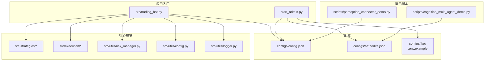
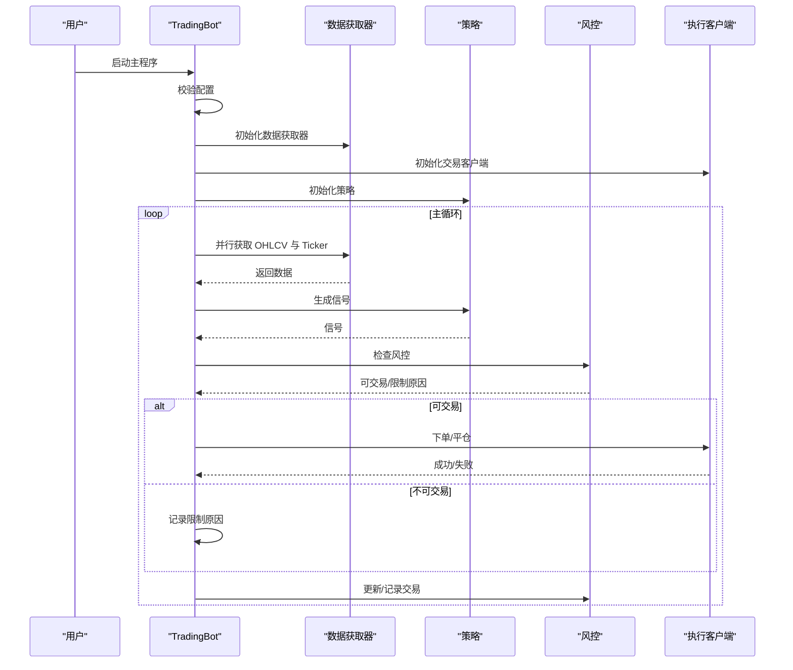
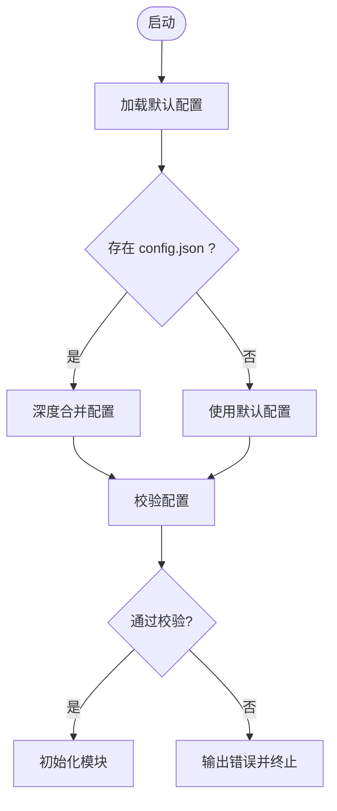
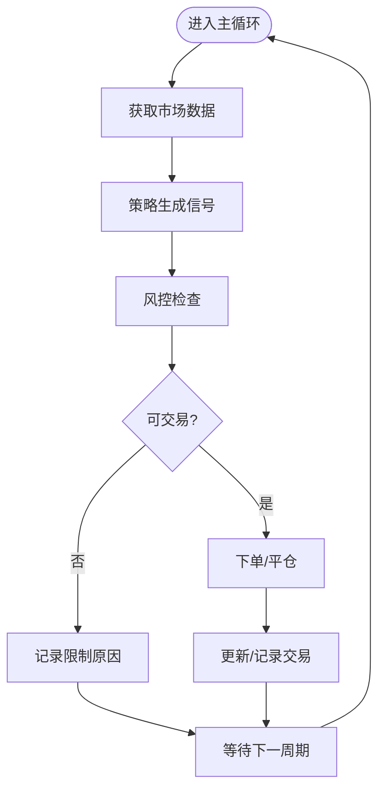
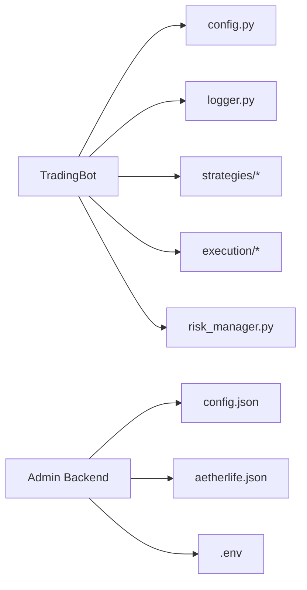

# 快速开始

<cite>
**本文引用的文件**
- [requirements.txt](file://requirements.txt)
- [.env.example](file://.env.example)
- [configs/config.json](file://configs/config.json)
- [configs/aetherlife.json](file://configs/aetherlife.json)
- [configs/.key](file://configs/.key)
- [src/trading_bot.py](file://src/trading_bot.py)
- [src/utils/config.py](file://src/utils/config.py)
- [src/utils/logger.py](file://src/utils/logger.py)
- [src/utils/risk_manager.py](file://src/utils/risk_manager.py)
- [src/strategies/base.py](file://src/strategies/base.py)
- [scripts/perception_connector_demo.py](file://scripts/perception_connector_demo.py)
- [scripts/cognition_multi_agent_demo.py](file://scripts/cognition_multi_agent_demo.py)
- [start_admin.py](file://start_admin.py)
</cite>

## 目录
1. [简介](#简介)
2. [项目结构](#项目结构)
3. [核心组件](#核心组件)
4. [架构总览](#架构总览)
5. [详细组件分析](#详细组件分析)
6. [依赖关系分析](#依赖关系分析)
7. [性能注意事项](#性能注意事项)
8. [故障排除指南](#故障排除指南)
9. [结论](#结论)
10. [附录](#附录)

## 简介
本指南面向首次接触量化交易机器人系统的用户，提供从零开始的完整安装与配置流程，涵盖环境准备、依赖安装、配置文件设置、基本运行与验证方法。系统支持多交易所（Binance/OKX）、多种策略（布林带突破、网格、均线交叉、RSI、成交量等），并内置风控模块与后台管理界面，便于快速上手与安全运维。

## 项目结构
仓库采用分层组织方式，核心模块包括数据层、策略层、执行层、风控层、感知层（AetherLife）、认知层（多Agent）与UI后台管理。关键入口为交易主程序与后台启动脚本。

图表来源
- [src/trading_bot.py](file://src/trading_bot.py#L1-L346)
- [start_admin.py](file://start_admin.py#L1-L85)
- [configs/config.json](file://configs/config.json#L1-L28)
- [configs/aetherlife.json](file://configs/aetherlife.json#L1-L17)
- [configs/.key](file://configs/.key#L1-L1)
- [.env.example](file://.env.example#L1-L17)
- [scripts/perception_connector_demo.py](file://scripts/perception_connector_demo.py#L1-L211)
- [scripts/cognition_multi_agent_demo.py](file://scripts/cognition_multi_agent_demo.py#L1-L265)

章节来源
- [src/trading_bot.py](file://src/trading_bot.py#L1-L346)
- [start_admin.py](file://start_admin.py#L1-L85)

## 核心组件
- 交易机器人主程序：负责初始化、数据拉取、策略分析、风控检查、下单执行与仓位管理。
- 风控模块：提供仓位计算、止损止盈、熔断与日级限额检查。
- 配置校验与默认值：校验交易所、策略、风险参数合法性，并提供深度合并配置能力。
- 日志模块：统一输出格式，便于排障与接入监控。
- 策略基类：定义策略抽象接口，便于扩展新策略。
- 后台管理：提供图形化界面进行配置管理与密钥测试。

章节来源
- [src/trading_bot.py](file://src/trading_bot.py#L27-L298)
- [src/utils/risk_manager.py](file://src/utils/risk_manager.py#L12-L241)
- [src/utils/config.py](file://src/utils/config.py#L15-L48)
- [src/utils/logger.py](file://src/utils/logger.py#L12-L34)
- [src/strategies/base.py](file://src/strategies/base.py#L6-L31)

## 架构总览
下图展示了从配置加载到交易执行的关键流程，以及与风控、日志、策略与执行层的交互。

图表来源
- [src/trading_bot.py](file://src/trading_bot.py#L63-L296)
- [src/utils/config.py](file://src/utils/config.py#L15-L37)
- [src/utils/risk_manager.py](file://src/utils/risk_manager.py#L175-L194)

## 详细组件分析

### 1) 环境准备与依赖安装
- Python 版本与虚拟环境
  - 使用 Python 3.10+ 创建独立虚拟环境，避免全局污染。
  - 在虚拟环境中安装依赖包，确保版本兼容性。
- 依赖安装
  - 使用提供的依赖清单一次性安装所需包，包含异步HTTP、数据处理、官方API客户端、回测、工具、加密、AetherLife新增组件（ccxt、kafka、Redis、LangGraph、强化学习、深度学习、FastAPI、LLM客户端等）。
- 环境变量
  - 复制示例环境文件为实际使用的 .env 文件，并填入各交易所的 API Key/Secret/Passphrase。

章节来源
- [requirements.txt](file://requirements.txt#L1-L92)
- [.env.example](file://.env.example#L1-L17)

### 2) 配置文件设置
- 通用配置（config.json）
  - 交易所选择与测试网开关、交易对列表、时间周期、策略名称与参数、杠杆、风控参数、AI增强开关等。
  - 示例中默认使用 Binance 测试网、布林带突破策略、10倍杠杆、基础风控参数。
- AetherLife 配置（aetherlife.json）
  - 交易对、日志级别、认知层（辩论开关）、风控审计日志路径与轮次参数等。
- 密钥与安全
  - .key 文件用于配置管理加密；.env 文件存放敏感 API Key。
  - 建议仅在本地保存，避免上传至远程仓库。

章节来源
- [configs/config.json](file://configs/config.json#L1-L28)
- [configs/aetherlife.json](file://configs/aetherlife.json#L1-L17)
- [configs/.key](file://configs/.key#L1-L1)
- [.env.example](file://.env.example#L1-L17)

### 3) 基本运行与验证
- 运行交易机器人
  - 主程序会自动加载默认配置并合并 config.json，随后初始化数据获取器、交易客户端与策略，进入主循环。
  - 主循环内并行获取 OHLCV 与 Ticker，生成信号，检查风控，执行下单或平仓，并打印实时状态。
- 后台管理
  - 启动后台管理界面，可在本地浏览器访问，进行 API 密钥配置、策略参数、风控设置与系统配置管理。
- 演示脚本
  - 感知层连接器演示：展示加密货币、IBKR、Kafka 管道的连接与订阅。
  - 认知层多 Agent 演示：展示专业化 Agent 的决策与 Orchestrator 的协作。

章节来源
- [src/trading_bot.py](file://src/trading_bot.py#L323-L346)
- [start_admin.py](file://start_admin.py#L16-L81)
- [scripts/perception_connector_demo.py](file://scripts/perception_connector_demo.py#L184-L211)
- [scripts/cognition_multi_agent_demo.py](file://scripts/cognition_multi_agent_demo.py#L238-L265)

### 4) 关键流程图解

#### 配置加载与合并

图表来源
- [src/trading_bot.py](file://src/trading_bot.py#L330-L336)
- [src/utils/config.py](file://src/utils/config.py#L15-L37)

#### 风控检查与交易执行

图表来源
- [src/trading_bot.py](file://src/trading_bot.py#L256-L282)
- [src/utils/risk_manager.py](file://src/utils/risk_manager.py#L175-L194)

### 5) 策略与风险管理要点
- 策略基类
  - 所有策略需实现分析与信号生成接口，便于统一调度。
- 风控参数
  - 最大仓位比例、止损/止盈阈值、单日最大交易次数、连续亏损限制、熔断阈值与冷却时间等。
  - 仓位计算考虑信号强度与最小/最大仓位限制，防止过度集中。

章节来源
- [src/strategies/base.py](file://src/strategies/base.py#L6-L31)
- [src/utils/risk_manager.py](file://src/utils/risk_manager.py#L62-L105)

## 依赖关系分析
- 交易主程序依赖配置校验、日志、策略工厂、执行客户端与数据获取器。
- 风控模块独立于具体策略与执行细节，提供通用风控能力。
- 后台管理依赖配置文件与密钥文件，提供可视化配置与测试。

图表来源
- [src/trading_bot.py](file://src/trading_bot.py#L14-L22)
- [start_admin.py](file://start_admin.py#L13-L13)

章节来源
- [src/trading_bot.py](file://src/trading_bot.py#L14-L22)
- [start_admin.py](file://start_admin.py#L13-L13)

## 性能注意事项
- 并行数据获取：主循环中对 OHLCV 与 Ticker 请求采用并发，减少等待时间。
- 信号与风控前置：在下单前进行风控检查，避免无效订单。
- 仓位与精度：根据交易所精度要求对下单数量进行舍入，避免因精度导致的下单失败。
- 日志与监控：统一日志格式，便于后续接入 Prometheus 等监控系统。

章节来源
- [src/trading_bot.py](file://src/trading_bot.py#L95-L98)
- [src/trading_bot.py](file://src/trading_bot.py#L138-L142)
- [requirements.txt](file://requirements.txt#L78-L80)

## 故障排除指南
- 配置校验失败
  - 检查交易所与策略是否在支持列表内；确认 symbols 为非空字符串列表；风控参数范围是否合法。
- API 密钥错误
  - 确认 .env 文件中的 Key/Secret/Passphrase 是否正确；如使用测试网，确保测试网配置开启。
- 端口占用（后台管理）
  - 后台管理会尝试多个端口，若均被占用，需关闭占用进程或手动指定可用端口。
- 订单下单失败
  - 检查风控限制（熔断、日限额、连败限制）；确认最小下单量与精度；查看日志异常堆栈。
- 演示脚本依赖外部服务
  - 感知层演示依赖 Kafka/Redpanda 与 IBKR TWS/Gateway，需先启动对应服务。

章节来源
- [src/utils/config.py](file://src/utils/config.py#L15-L37)
- [.env.example](file://.env.example#L5-L16)
- [start_admin.py](file://start_admin.py#L44-L66)
- [src/trading_bot.py](file://src/trading_bot.py#L153-L155)
- [scripts/perception_connector_demo.py](file://scripts/perception_connector_demo.py#L86-L101)

## 结论
通过本快速开始指南，您已完成环境准备、依赖安装、配置文件设置与基本运行验证。建议先以默认配置与测试网进行演练，逐步调整策略参数与风控阈值，再过渡到实盘。后台管理界面可帮助您持续优化配置与监控系统状态。

## 附录

### A. 常用命令与验证方法
- 安装依赖
  - pip install -r requirements.txt
- 运行交易机器人
  - python src/trading_bot.py
- 启动后台管理
  - python start_admin.py
- 运行演示脚本
  - python scripts/perception_connector_demo.py
  - python scripts/cognition_multi_agent_demo.py

章节来源
- [requirements.txt](file://requirements.txt#L1-L92)
- [src/trading_bot.py](file://src/trading_bot.py#L323-L346)
- [start_admin.py](file://start_admin.py#L16-L81)
- [scripts/perception_connector_demo.py](file://scripts/perception_connector_demo.py#L184-L211)
- [scripts/cognition_multi_agent_demo.py](file://scripts/cognition_multi_agent_demo.py#L238-L265)