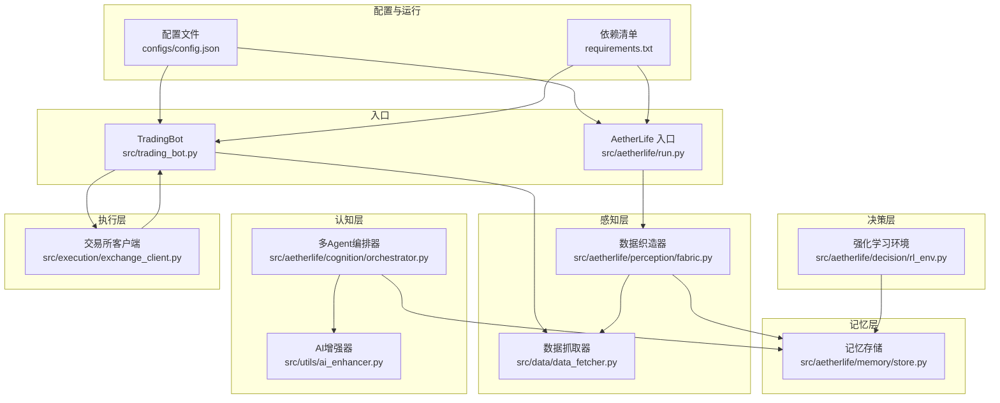
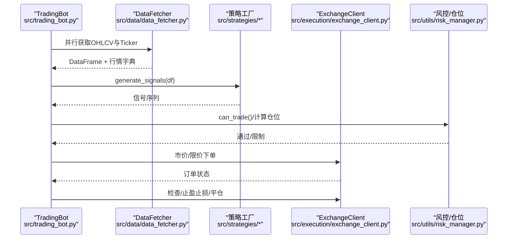
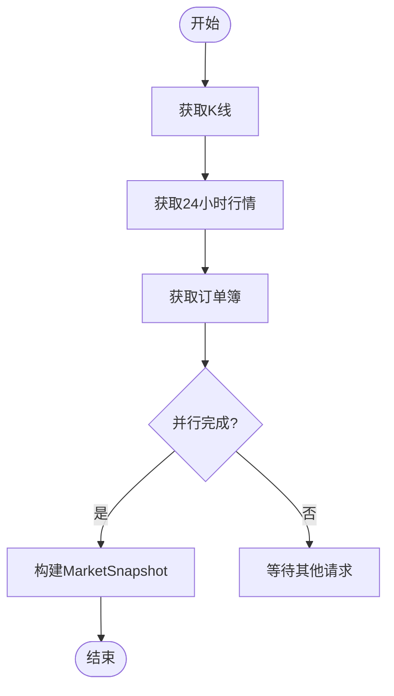
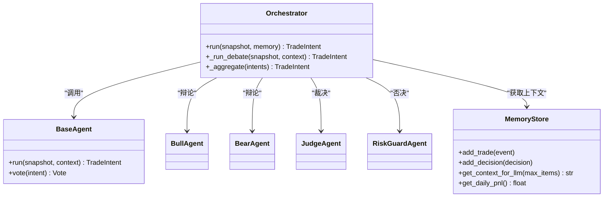
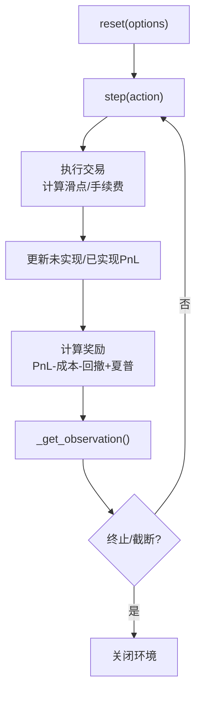
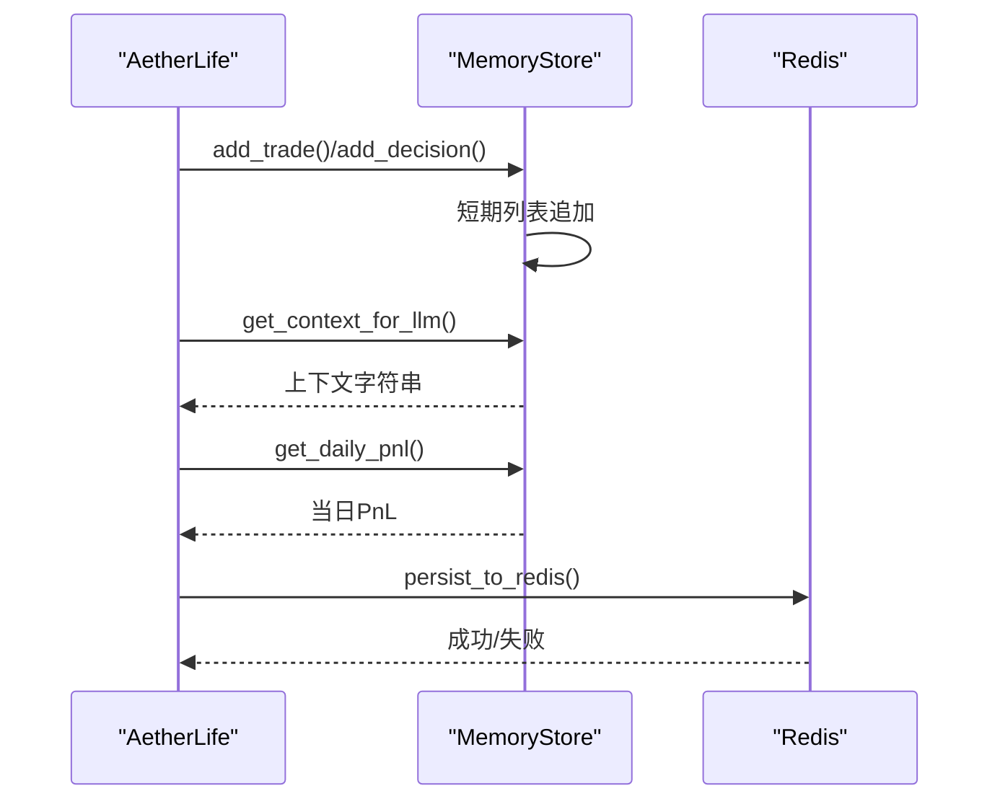
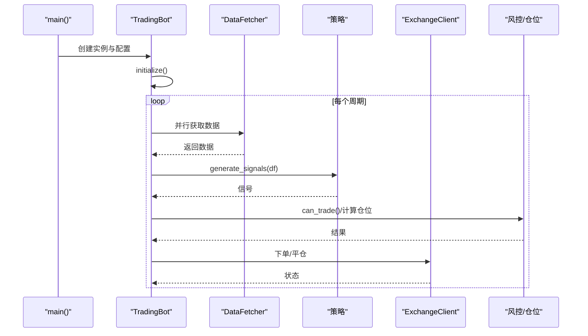
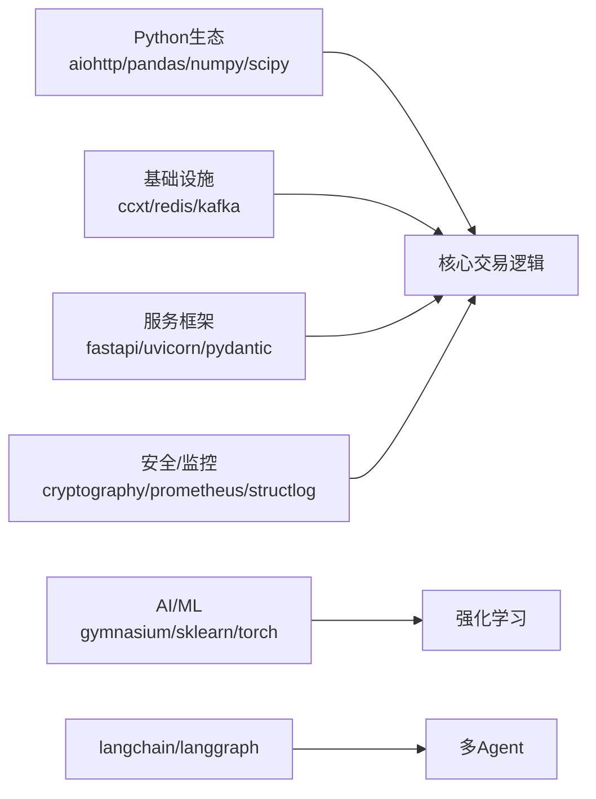

# 技术栈概览

<cite>
**本文档引用的文件**
- [requirements.txt](file://requirements.txt)
- [README.md](file://README.md)
- [src/trading_bot.py](file://src/trading_bot.py)
- [src/aetherlife/run.py](file://src/aetherlife/run.py)
- [src/aetherlife/core/life.py](file://src/aetherlife/core/life.py)
- [src/aetherlife/cognition/orchestrator.py](file://src/aetherlife/cognition/orchestrator.py)
- [src/aetherlife/decision/rl_env.py](file://src/aetherlife/decision/rl_env.py)
- [src/aetherlife/memory/store.py](file://src/aetherlife/memory/store.py)
- [src/aetherlife/perception/fabric.py](file://src/aetherlife/perception/fabric.py)
- [src/data/data_fetcher.py](file://src/data/data_fetcher.py)
- [src/execution/exchange_client.py](file://src/execution/exchange_client.py)
- [src/strategies/base.py](file://src/strategies/base.py)
- [src/utils/ai_enhancer.py](file://src/utils/ai_enhancer.py)
- [configs/config.json](file://configs/config.json)
</cite>

## 目录
1. [引言](#引言)
2. [项目结构](#项目结构)
3. [核心组件](#核心组件)
4. [架构总览](#架构总览)
5. [详细组件分析](#详细组件分析)
6. [依赖关系分析](#依赖关系分析)
7. [性能考量](#性能考量)
8. [故障排查指南](#故障排查指南)
9. [结论](#结论)
10. [附录](#附录)

## 引言
本技术栈概览面向量化交易机器人系统，聚焦Python生态、异步处理、AI与机器学习、数据库与消息队列等关键技术选型与实现要点。文档重点阐述以下核心依赖的作用与优势：aiohttp、pandas、numpy、langchain、langgraph、gymnasium、stable-baselines3，并结合项目中的实际应用路径（如异步数据抓取、多Agent认知、强化学习环境、记忆与风控等）进行说明，帮助开发者快速理解技术基础与未来演进方向。

## 项目结构
项目采用模块化分层组织，围绕“感知-记忆-认知-决策-执行-守护-进化”闭环展开，同时提供传统策略驱动的交易机器人入口与AetherLife多智能体系统入口。

**图表来源**
- [src/trading_bot.py](file://src/trading_bot.py#L1-L346)
- [src/aetherlife/run.py](file://src/aetherlife/run.py#L1-L71)
- [src/aetherlife/perception/fabric.py](file://src/aetherlife/perception/fabric.py#L1-L88)
- [src/aetherlife/memory/store.py](file://src/aetherlife/memory/store.py#L1-L155)
- [src/aetherlife/cognition/orchestrator.py](file://src/aetherlife/cognition/orchestrator.py#L1-L93)
- [src/utils/ai_enhancer.py](file://src/utils/ai_enhancer.py#L1-L360)
- [src/aetherlife/decision/rl_env.py](file://src/aetherlife/decision/rl_env.py#L1-L423)
- [src/data/data_fetcher.py](file://src/data/data_fetcher.py#L1-L434)
- [src/execution/exchange_client.py](file://src/execution/exchange_client.py#L1-L432)
- [configs/config.json](file://configs/config.json#L1-L28)
- [requirements.txt](file://requirements.txt#L1-L92)

**章节来源**
- [src/trading_bot.py](file://src/trading_bot.py#L1-L346)
- [src/aetherlife/run.py](file://src/aetherlife/run.py#L1-L71)
- [requirements.txt](file://requirements.txt#L1-L92)

## 核心组件
- 异步HTTP与WebSocket：aiohttp、websockets，支撑高频数据抓取与实时行情推送。
- 数据处理：pandas、numpy，提供高性能的数据结构与数值计算能力。
- 交易所对接：ccxt、python-binance、okx、ib_insync，统一多交易所接口与TWS对接。
- 数据流与存储：kafka-python、aiokafka、clickhouse-driver、redis[hiredis]，支持高吞吐数据流与向量/键值存储。
- 多Agent与LLM：langchain、langchain-community、langgraph，构建多Agent协作与推理。
- 机器学习与强化学习：scikit-learn、gymnasium、stable-baselines3、torch、polars、sentence-transformers、openai、anthropic。
- 工程化与可观测性：fastapi、uvicorn、pydantic、prometheus-client、structlog、pytest、black/flake8/mypy。
- 科学计算与风控：scipy、python-dateutil、cryptography、backtesting（可选）。

**章节来源**
- [requirements.txt](file://requirements.txt#L1-L92)

## 架构总览
系统分为两条主线：
- 传统策略驱动交易机器人：通过异步数据抓取、策略生成信号、风控与执行闭环。
- AetherLife多智能体系统：以感知-记忆-认知-决策-守护-执行-进化为主线，引入LLM与多Agent协作，逐步增强决策能力。

**图表来源**
- [src/trading_bot.py](file://src/trading_bot.py#L92-L282)
- [src/data/data_fetcher.py](file://src/data/data_fetcher.py#L40-L71)
- [src/execution/exchange_client.py](file://src/execution/exchange_client.py#L226-L275)

**章节来源**
- [src/trading_bot.py](file://src/trading_bot.py#L63-L282)
- [src/data/data_fetcher.py](file://src/data/data_fetcher.py#L17-L71)
- [src/execution/exchange_client.py](file://src/execution/exchange_client.py#L20-L85)

## 详细组件分析

### 异步数据抓取与实时流（aiohttp/websockets/pandas/numpy）
- 设计要点：统一DataFetcher抽象，BinanceDataFetcher/OKXDataFetcher实现，支持REST与WebSocket双通道；并行获取OHLCV、Ticker与订单簿，提升响应速度。
- 性能特性：aiohttp ClientSession复用、连接超时控制、WebSocket心跳维持；pandas/numpy高效处理K线与技术指标。
- 关键路径参考：
  - [DataFetcher基类与Binance实现](file://src/data/data_fetcher.py#L17-L120)
  - [OKX实现与WebSocket订阅](file://src/data/data_fetcher.py#L237-L396)
  - [AetherLife感知织造器](file://src/aetherlife/perception/fabric.py#L32-L82)

**图表来源**
- [src/aetherlife/perception/fabric.py](file://src/aetherlife/perception/fabric.py#L32-L82)
- [src/data/data_fetcher.py](file://src/data/data_fetcher.py#L85-L186)

**章节来源**
- [src/data/data_fetcher.py](file://src/data/data_fetcher.py#L17-L120)
- [src/aetherlife/perception/fabric.py](file://src/aetherlife/perception/fabric.py#L13-L88)

### 多Agent认知与编排（langchain/langgraph）
- 设计要点：Orchestrator负责多Agent并行/辩论（Bull/Bear/Judge）聚合，RiskGuardAgent参与否决，上下文来自MemoryStore。
- 关键路径参考：
  - [Orchestrator运行流程](file://src/aetherlife/cognition/orchestrator.py#L38-L53)
  - [辩论式决策](file://src/aetherlife/cognition/orchestrator.py#L55-L63)
  - [记忆上下文](file://src/aetherlife/memory/store.py#L134-L138)

**图表来源**
- [src/aetherlife/cognition/orchestrator.py](file://src/aetherlife/cognition/orchestrator.py#L16-L93)
- [src/aetherlife/memory/store.py](file://src/aetherlife/memory/store.py#L43-L138)

**章节来源**
- [src/aetherlife/cognition/orchestrator.py](file://src/aetherlife/cognition/orchestrator.py#L16-L93)
- [src/aetherlife/memory/store.py](file://src/aetherlife/memory/store.py#L43-L138)

### 强化学习环境与训练（gymnasium/stable-baselines3）
- 设计要点：基于gymnasium定义连续/离散动作空间，状态向量包含价格、成交量、订单簿、持仓、历史PnL与技术指标；奖励函数综合PnL、滑点、回撤与夏普比率。
- 关键路径参考：
  - [TradingEnv定义与step/reset](file://src/aetherlife/decision/rl_env.py#L26-L223)
  - [奖励函数与观察向量](file://src/aetherlife/decision/rl_env.py#L276-L374)

**图表来源**
- [src/aetherlife/decision/rl_env.py](file://src/aetherlife/decision/rl_env.py#L119-L223)
- [src/aetherlife/decision/rl_env.py](file://src/aetherlife/decision/rl_env.py#L276-L374)

**章节来源**
- [src/aetherlife/decision/rl_env.py](file://src/aetherlife/decision/rl_env.py#L26-L223)
- [src/aetherlife/decision/rl_env.py](file://src/aetherlife/decision/rl_env.py#L314-L374)

### 记忆与持久化（Redis/JSON列表）
- 设计要点：短期记忆（短列表）+交易事件（deque）+可选Redis持久化；提供LLM上下文摘要与当日PnL统计。
- 关键路径参考：
  - [MemoryStore实现](file://src/aetherlife/memory/store.py#L43-L138)
  - [Redis持久化/加载](file://src/aetherlife/memory/store.py#L90-L126)

**图表来源**
- [src/aetherlife/memory/store.py](file://src/aetherlife/memory/store.py#L64-L138)
- [src/aetherlife/memory/store.py](file://src/aetherlife/memory/store.py#L90-L126)

**章节来源**
- [src/aetherlife/memory/store.py](file://src/aetherlife/memory/store.py#L43-L138)

### 传统策略机器人（TradingBot）
- 设计要点：初始化配置与客户端，主循环中并行抓取数据、分析生成信号、风控与执行，支持止损止盈与平仓逻辑。
- 关键路径参考：
  - [主循环与信号执行](file://src/trading_bot.py#L256-L282)
  - [并行获取OHLCV与Ticker](file://src/trading_bot.py#L92-L99)
  - [下单与仓位管理](file://src/trading_bot.py#L115-L204)

**图表来源**
- [src/trading_bot.py](file://src/trading_bot.py#L323-L346)
- [src/trading_bot.py](file://src/trading_bot.py#L256-L282)
- [src/trading_bot.py](file://src/trading_bot.py#L92-L204)

**章节来源**
- [src/trading_bot.py](file://src/trading_bot.py#L27-L346)

### 交易所客户端与风控（ccxt/ib_insync/风控模块）
- 设计要点：BinanceClient/OKXClient封装REST接口与签名逻辑，支持市价/限价、杠杆设置、订单管理；TradingBot集成RiskManager/PositionManager。
- 关键路径参考：
  - [BinanceClient下单与精度处理](file://src/execution/exchange_client.py#L226-L275)
  - [AetherLife获取客户端](file://src/aetherlife/core/life.py#L47-L57)
  - [TradingBot风控与执行](file://src/trading_bot.py#L115-L204)

**章节来源**
- [src/execution/exchange_client.py](file://src/execution/exchange_client.py#L87-L343)
- [src/aetherlife/core/life.py](file://src/aetherlife/core/life.py#L47-L57)
- [src/trading_bot.py](file://src/trading_bot.py#L115-L204)

### AI增强与多Agent协调（scikit-learn/MLPredictor/多Agent）
- 设计要点：SentimentAnalyzer/MultiAgentCoordinator/MLPredictor提供多维度信号融合与预测；AutoCompoundManager支持Web4.0式复利。
- 关键路径参考：
  - [MLPredictor特征工程与训练](file://src/utils/ai_enhancer.py#L52-L111)
  - [多Agent信号聚合](file://src/utils/ai_enhancer.py#L154-L186)
  - [订单簿/技术面分析](file://src/utils/ai_enhancer.py#L188-L267)

**章节来源**
- [src/utils/ai_enhancer.py](file://src/utils/ai_enhancer.py#L15-L360)

## 依赖关系分析
- Python生态：aiohttp/websockets/pandas/numpy/scipy/pytest/black/flake8/mypy等构成异步与数据处理基石。
- AI/ML：gymnasium/stable-baselines3用于强化学习训练；scikit-learn/sentence-transformers/torch用于预测与嵌入；langchain/langgraph用于多Agent与LLM编排。
- 基础设施：ccxt/ib_insync统一多交易所；kafka/redis/clickhouse支撑数据流与存储；fastapi/uvicorn/pydantic构建后台服务。
- 风控与安全：scipy用于VaR等科学计算；cryptography用于加密；prometheus-client/structlog用于监控与日志。

**图表来源**
- [requirements.txt](file://requirements.txt#L1-L92)

**章节来源**
- [requirements.txt](file://requirements.txt#L1-L92)

## 性能考量
- 异步优先：aiohttp与WebSocket显著降低I/O阻塞，提高并发吞吐；在数据抓取与实时流处理中广泛采用。
- 数据结构优化：pandas/numpy提供向量化计算与高效索引；polars作为高性能替代方案（可选）。
- 训练与推理分离：强化学习在离线环境中使用gymnasium与stable-baselines3训练，线上采用轻量推理。
- 存储与缓存：Redis用于短期记忆与上下文缓存；ClickHouse适合时序数据归档与查询。
- 风险与稳定性：严格的风控阈值与回撤惩罚在奖励函数中体现，避免过度拟合与极端风险暴露。

## 故障排查指南
- 配置校验：TradingBot初始化阶段会校验配置，若失败直接抛出异常并记录错误日志。
- API错误处理：交易所与数据源返回错误时抛出RuntimeError，便于上层捕获与重试。
- 资金与精度：BinanceClient下单前动态解析精度与步进，确保符合交易所要求。
- 记忆持久化：Redis持久化失败不影响主流程，但会记录警告；启动时可尝试从Redis加载近期事件。
- 日志与监控：structlog提供结构化日志；prometheus-client用于指标采集，便于问题定位与容量规划。

**章节来源**
- [src/trading_bot.py](file://src/trading_bot.py#L65-L69)
- [src/data/data_fetcher.py](file://src/data/data_fetcher.py#L95-L98)
- [src/execution/exchange_client.py](file://src/execution/exchange_client.py#L165-L170)
- [src/execution/exchange_client.py](file://src/execution/exchange_client.py#L246-L252)
- [src/aetherlife/memory/store.py](file://src/aetherlife/memory/store.py#L94-L103)

## 结论
该系统以异步I/O与高性能数据处理为核心，结合多Agent与LLM编排，逐步引入强化学习训练能力，形成从感知到进化的完整闭环。核心依赖的选择兼顾性能、开发效率与可扩展性，既满足高频交易场景的实时性需求，也为未来的智能化演进预留了充足空间。

## 附录
- 版本兼容性提示：依赖清单中明确标注最低版本，建议遵循以保证功能与性能稳定。
- 技术演进方向：从Phase 0的单周期感知与执行，逐步过渡到Phase 1+的WebSocket推送、向量检索与Redis持久化，以及更复杂的多Agent与强化学习策略。

**章节来源**
- [requirements.txt](file://requirements.txt#L1-L92)
- [configs/config.json](file://configs/config.json#L1-L28)