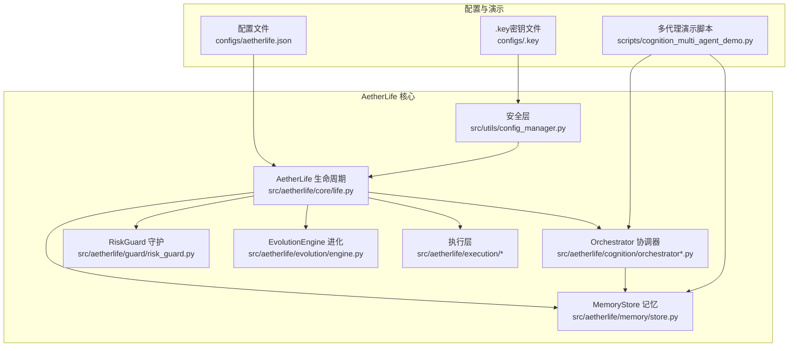
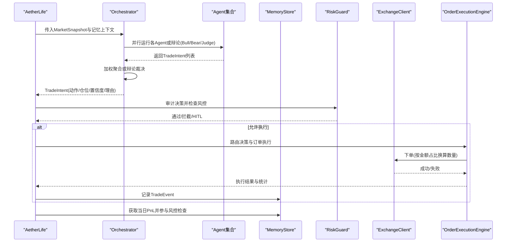
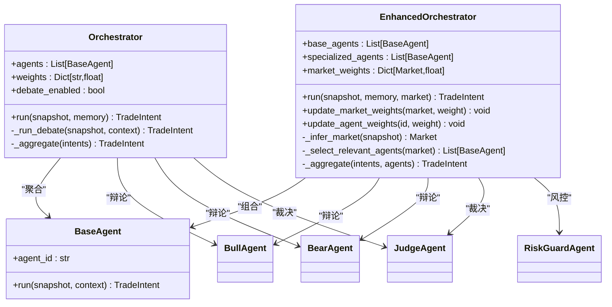
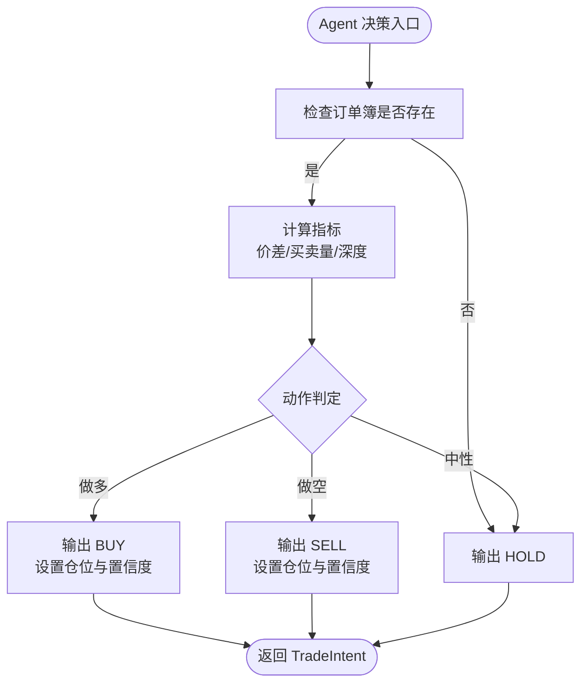
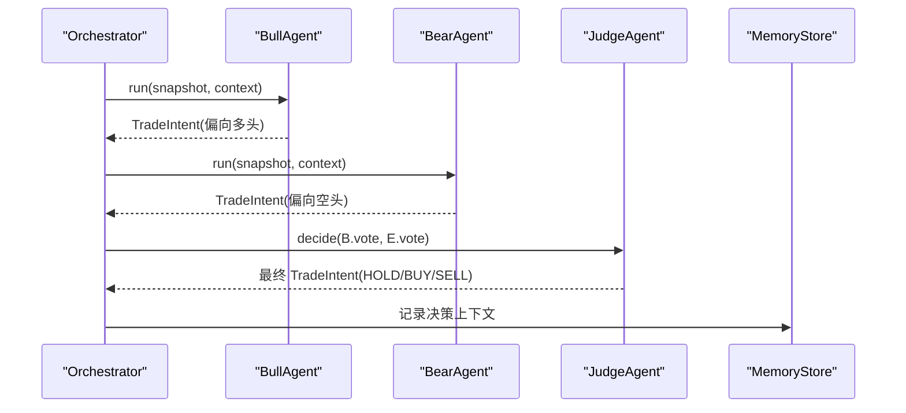
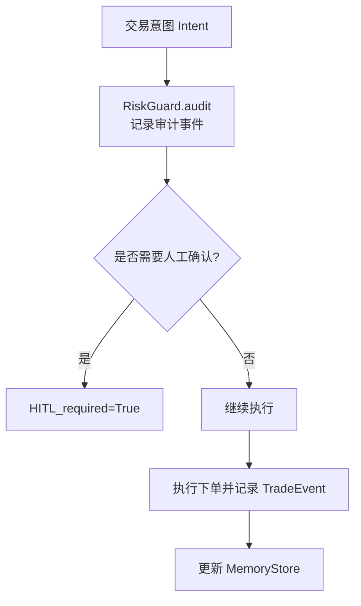
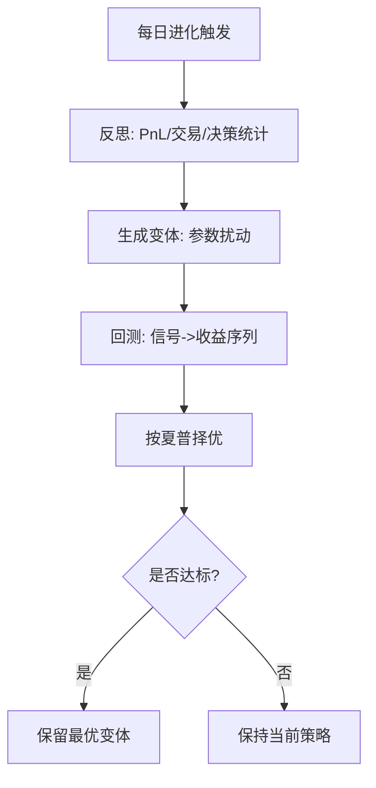
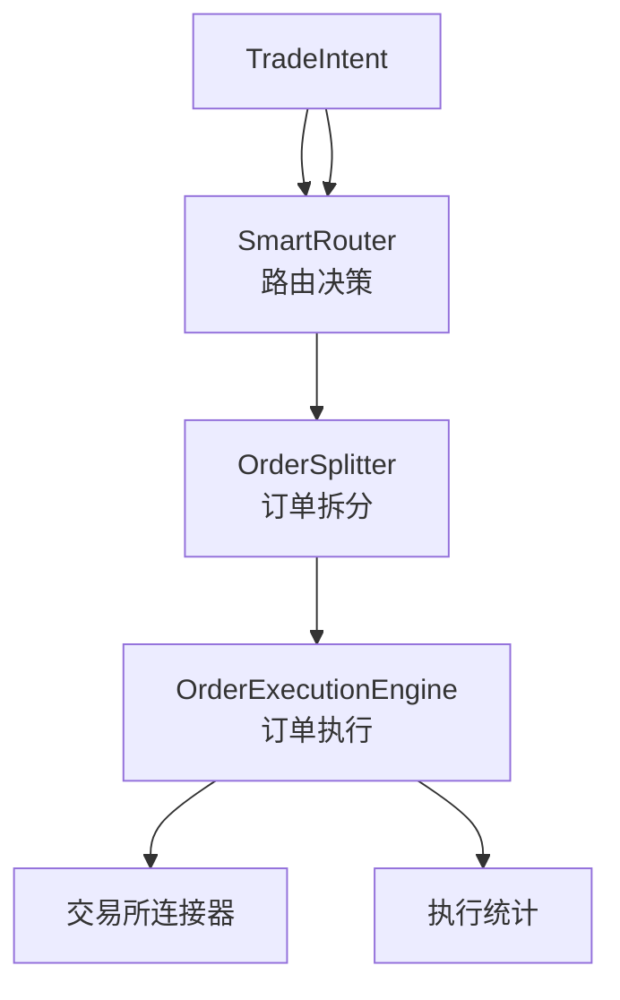
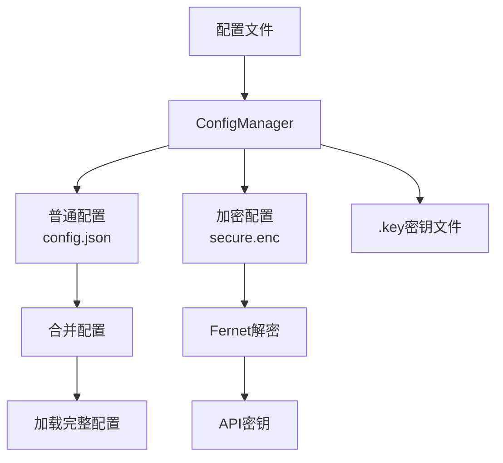
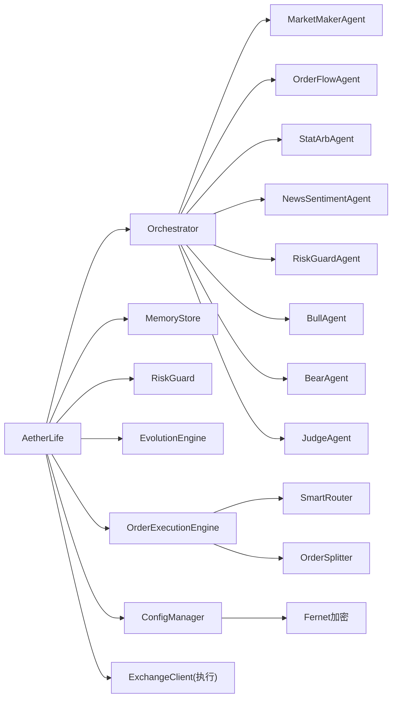

# AetherLife AI增强系统

<cite>
**本文引用的文件**
- [src/aetherlife/__init__.py](file://src/aetherlife/__init__.py)
- [src/aetherlife/core/life.py](file://src/aetherlife/core/life.py)
- [src/aetherlife/cognition/orchestrator.py](file://src/aetherlife/cognition/orchestrator.py)
- [src/aetherlife/cognition/orchestrator_enhanced.py](file://src/aetherlife/cognition/orchestrator_enhanced.py)
- [src/aetherlife/cognition/agents.py](file://src/aetherlife/cognition/agents.py)
- [src/aetherlife/cognition/debate.py](file://src/aetherlife/cognition/debate.py)
- [src/aetherlife/cognition/schemas.py](file://src/aetherlife/cognition/schemas.py)
- [src/aetherlife/memory/store.py](file://src/aetherlife/memory/store.py)
- [src/aetherlife/guard/risk_guard.py](file://src/aetherlife/guard/risk_guard.py)
- [src/aetherlife/evolution/engine.py](file://src/aetherlife/evolution/engine.py)
- [src/aetherlife/execution/order_executor.py](file://src/aetherlife/execution/order_executor.py)
- [src/aetherlife/execution/order_splitter.py](file://src/aetherlife/execution/order_splitter.py)
- [src/aetherlife/execution/smart_router.py](file://src/aetherlife/execution/smart_router.py)
- [src/utils/config_manager.py](file://src/utils/config_manager.py)
- [src/aetherlife/config.py](file://src/aetherlife/config.py)
- [configs/aetherlife.json](file://configs/aetherlife.json)
- [configs/.key](file://configs/.key)
- [scripts/cognition_multi_agent_demo.py](file://scripts/cognition_multi_agent_demo.py)
</cite>

## 更新摘要
**变更内容**
- 新增统一订单管理系统，包含订单执行、拆分和智能路由
- 新增加密配置存储功能，支持敏感信息的安全管理
- 增强多代理协调系统，支持多市场专业化Agent协作
- 新增高级风险管理功能，包括熔断机制和风险分散
- 完善系统架构图，反映新的执行层和安全层

## 目录
1. [简介](#简介)
2. [项目结构](#项目结构)
3. [核心组件](#核心组件)
4. [架构总览](#架构总览)
5. [详细组件分析](#详细组件分析)
6. [依赖关系分析](#依赖关系分析)
7. [性能考量](#性能考量)
8. [故障排查指南](#故障排查指南)
9. [结论](#结论)
10. [附录](#附录)

## 简介
AetherLife AI增强系统是一个面向复杂交易环境的"会交易的数字生命"。系统采用分层架构：感知 → 记忆 → 认知（多代理）→ 决策 → 守护 → 执行 → 进化。其核心能力包括：
- 多代理决策架构：基础Agent与专业化Agent协同，支持辩论机制（多方/空方/法官）与加权聚合。
- 智能协作机制：基于市场类型自动选择相关Agent，动态调整权重，实现跨市场适配。
- 跨市场分析能力：内置多市场识别与专业化Agent组合，覆盖加密、A股、美股、外汇、期货等。
- 自我进化功能：每日反思、参数变体生成、回测与择优，形成策略迭代闭环。
- **新增** 统一订单管理：完整的订单执行、拆分和路由系统，支持多交易所统一管理。
- **新增** 加密配置存储：安全的配置文件加密存储，保护敏感信息。
- **新增** 高级风险管理：熔断机制、风险分散、动态杠杆调整等高级风控功能。

## 项目结构
系统采用模块化分层组织，核心模块如下：
- aetherlife：系统主框架与生命周期管理
- cognition：多代理认知与决策
- memory：短期与情景记忆
- guard：风控与审计
- evolution：自我进化引擎
- execution：统一订单管理（新增）
- perception：感知与数据连接（不在本次文档重点）
- scripts：演示与集成脚本
- utils：工具类与配置管理（新增）

**图表来源**
- [src/aetherlife/core/life.py](file://src/aetherlife/core/life.py#L1-L169)
- [src/aetherlife/cognition/orchestrator_enhanced.py](file://src/aetherlife/cognition/orchestrator_enhanced.py#L1-L323)
- [src/aetherlife/memory/store.py](file://src/aetherlife/memory/store.py#L1-L155)
- [src/aetherlife/guard/risk_guard.py](file://src/aetherlife/guard/risk_guard.py#L1-L84)
- [src/aetherlife/evolution/engine.py](file://src/aetherlife/evolution/engine.py#L1-L145)
- [src/aetherlife/execution/order_executor.py](file://src/aetherlife/execution/order_executor.py#L1-L449)
- [src/aetherlife/execution/order_splitter.py](file://src/aetherlife/execution/order_splitter.py#L1-L428)
- [src/aetherlife/execution/smart_router.py](file://src/aetherlife/execution/smart_router.py#L1-L445)
- [src/utils/config_manager.py](file://src/utils/config_manager.py#L1-L242)
- [configs/aetherlife.json](file://configs/aetherlife.json#L1-L17)
- [configs/.key](file://configs/.key#L1-L1)
- [scripts/cognition_multi_agent_demo.py](file://scripts/cognition_multi_agent_demo.py#L1-L265)

**章节来源**
- [src/aetherlife/__init__.py](file://src/aetherlife/__init__.py#L1-L13)
- [configs/aetherlife.json](file://configs/aetherlife.json#L1-L17)
- [configs/.key](file://configs/.key#L1-L1)

## 核心组件
- AetherLife 生命周期：负责感知、认知、决策、守护、执行与进化的主循环。
- Orchestrator 协调器：聚合多个Agent或进行辩论，输出TradeIntent。
- MemoryStore 记忆：短期事件与决策记录，支持Redis持久化。
- RiskGuard 守护：电路断路器、日损上限、HITL与审计。
- EvolutionEngine 进化：每日反思、参数变体生成、回测与择优。
- **新增** OrderExecutionEngine：统一订单执行引擎，支持多交易所。
- **新增** OrderSplitter：智能订单拆分器，支持多种拆分策略。
- **新增** SmartRouter：智能路由决策系统，自动选择最优执行路径。
- **新增** ConfigManager：加密配置管理器，保护敏感信息。

**章节来源**
- [src/aetherlife/core/life.py](file://src/aetherlife/core/life.py#L1-L169)
- [src/aetherlife/cognition/orchestrator.py](file://src/aetherlife/cognition/orchestrator.py#L1-L93)
- [src/aetherlife/cognition/orchestrator_enhanced.py](file://src/aetherlife/cognition/orchestrator_enhanced.py#L1-L323)
- [src/aetherlife/memory/store.py](file://src/aetherlife/memory/store.py#L1-L155)
- [src/aetherlife/guard/risk_guard.py](file://src/aetherlife/guard/risk_guard.py#L1-L84)
- [src/aetherlife/evolution/engine.py](file://src/aetherlife/evolution/engine.py#L1-L145)
- [src/aetherlife/execution/order_executor.py](file://src/aetherlife/execution/order_executor.py#L1-L449)
- [src/aetherlife/execution/order_splitter.py](file://src/aetherlife/execution/order_splitter.py#L1-L428)
- [src/aetherlife/execution/smart_router.py](file://src/aetherlife/execution/smart_router.py#L1-L445)
- [src/utils/config_manager.py](file://src/utils/config_manager.py#L1-L242)

## 架构总览
AetherLife采用"感知-记忆-认知-决策-守护-执行-进化"的闭环架构。每轮生命周期：
1. 感知：通过DataFabric获取市场快照。
2. 认知：Orchestrator协调Agent并生成TradeIntent。
3. 审计：RiskGuard记录审计事件。
4. 守护：检查电路断路器与日损上限，必要时HITL。
5. 执行：按意图下单并记录交易事件。
6. 进化：每日凌晨触发进化引擎，反思并择优。

**图表来源**
- [src/aetherlife/core/life.py](file://src/aetherlife/core/life.py#L59-L122)
- [src/aetherlife/cognition/orchestrator.py](file://src/aetherlife/cognition/orchestrator.py#L38-L53)
- [src/aetherlife/cognition/orchestrator_enhanced.py](file://src/aetherlife/cognition/orchestrator_enhanced.py#L84-L151)
- [src/aetherlife/guard/risk_guard.py](file://src/aetherlife/guard/risk_guard.py#L48-L68)
- [src/aetherlife/memory/store.py](file://src/aetherlife/memory/store.py#L64-L90)
- [src/aetherlife/execution/order_executor.py](file://src/aetherlife/execution/order_executor.py#L129-L165)

## 详细组件分析

### Orchestrator 协调器
- 职责：聚合多个Agent的决策，或启用辩论（多方/空方/法官）；最终输出TradeIntent。
- 机制：
  - 并行执行Agent，过滤异常，按动作分组加权平均quantity_pct与confidence。
  - 辩论路径：Bull/Bear并行产生投票，Judge依据置信度裁决。
  - 风控Agent一票否决：若Intent置信度过低或日损超限则转为HOLD。
- 增强版特性：支持多市场专业化Agent、自动市场类型推断、动态权重调整、LangGraph预留接口。

**图表来源**
- [src/aetherlife/cognition/orchestrator.py](file://src/aetherlife/cognition/orchestrator.py#L16-L93)
- [src/aetherlife/cognition/orchestrator_enhanced.py](file://src/aetherlife/cognition/orchestrator_enhanced.py#L21-L323)
- [src/aetherlife/cognition/agents.py](file://src/aetherlife/cognition/agents.py#L13-L109)
- [src/aetherlife/cognition/debate.py](file://src/aetherlife/cognition/debate.py#L15-L100)

**章节来源**
- [src/aetherlife/cognition/orchestrator.py](file://src/aetherlife/cognition/orchestrator.py#L1-L93)
- [src/aetherlife/cognition/orchestrator_enhanced.py](file://src/aetherlife/cognition/orchestrator_enhanced.py#L1-L323)
- [src/aetherlife/cognition/debate.py](file://src/aetherlife/cognition/debate.py#L1-L100)
- [src/aetherlife/cognition/agents.py](file://src/aetherlife/cognition/agents.py#L1-L109)

### Agent代理分类与职责
- MarketMakerAgent：基于订单簿深度与价差判断，偏向中性或轻仓。
- OrderFlowAgent：基于买卖盘量比较，识别短期资金流向。
- StatArbAgent：单品种暂不适用，先HOLD。
- NewsSentimentAgent：情绪模块预留，暂HOLD。
- RiskGuardAgent：仅否决，不发起交易。
- 增强版专业化Agent（演示脚本可见）：A股、美股、加密、跨市场领先-滞后、外汇微结构、期货微结构、情绪分析等。

**图表来源**
- [src/aetherlife/cognition/agents.py](file://src/aetherlife/cognition/agents.py#L25-L109)

**章节来源**
- [src/aetherlife/cognition/agents.py](file://src/aetherlife/cognition/agents.py#L1-L109)

### 辩论机制设计思想
- 设计目标：通过多方/空方视角对比，结合法官裁决，提升决策稳健性。
- 实现要点：Bull/Bear分别对基础Agent输出进行"偏向解读"，Judge依据置信度阈值裁决，分歧时转为HOLD。
- 适用场景：高波动或分歧明显的市场，避免单一Agent误判。

**图表来源**
- [src/aetherlife/cognition/debate.py](file://src/aetherlife/cognition/debate.py#L23-L99)
- [src/aetherlife/cognition/orchestrator.py](file://src/aetherlife/cognition/orchestrator.py#L55-L63)

**章节来源**
- [src/aetherlife/cognition/debate.py](file://src/aetherlife/cognition/debate.py#L1-L100)
- [src/aetherlife/cognition/orchestrator.py](file://src/aetherlife/cognition/orchestrator.py#L45-L63)

### 记忆与审计
- MemoryStore：短期事件与决策记录，支持Redis持久化；提供LLM上下文摘要与当日PnL查询。
- RiskGuard：执行前审计，支持文件与回调审计；具备电路断路器与HITL阈值控制。

**图表来源**
- [src/aetherlife/guard/risk_guard.py](file://src/aetherlife/guard/risk_guard.py#L70-L84)
- [src/aetherlife/memory/store.py](file://src/aetherlife/memory/store.py#L64-L90)
- [src/aetherlife/core/life.py](file://src/aetherlife/core/life.py#L89-L122)

**章节来源**
- [src/aetherlife/memory/store.py](file://src/aetherlife/memory/store.py#L1-L155)
- [src/aetherlife/guard/risk_guard.py](file://src/aetherlife/guard/risk_guard.py#L1-L84)

### 自我进化流程
- 反思：汇总当日PnL、交易与决策数量，生成反思文本。
- 变体：生成策略参数变体（如突破、RSI），限制每轮数量。
- 回测：拉取历史K线，生成信号并计算总收益与夏普比率。
- 择优：按夏普择优，达到阈值则保留，否则保持现状。

**图表来源**
- [src/aetherlife/evolution/engine.py](file://src/aetherlife/evolution/engine.py#L45-L145)

**章节来源**
- [src/aetherlife/evolution/engine.py](file://src/aetherlife/evolution/engine.py#L1-L145)

### 统一订单管理系统
**新增功能** AetherLife引入了完整的统一订单管理系统，提供端到端的订单生命周期管理：

- **OrderExecutionEngine**：统一封装多交易所的订单执行接口，支持IBKR、Binance、Bybit、OKX，自动重试和错误处理，订单状态跟踪，执行结果报告。
- **OrderSplitter**：智能订单拆分器，支持TWAP、VWAP、Iceberg、自适应等多种拆分策略，减少市场冲击，优化执行成本。
- **SmartRouter**：智能路由决策系统，根据交易意图自动选择最优交易所和订单类型，评估流动性，估算滑点和手续费。

**图表来源**
- [src/aetherlife/execution/smart_router.py](file://src/aetherlife/execution/smart_router.py#L98-L159)
- [src/aetherlife/execution/order_splitter.py](file://src/aetherlife/execution/order_splitter.py#L73-L144)
- [src/aetherlife/execution/order_executor.py](file://src/aetherlife/execution/order_executor.py#L129-L165)

**章节来源**
- [src/aetherlife/execution/order_executor.py](file://src/aetherlife/execution/order_executor.py#L1-L449)
- [src/aetherlife/execution/order_splitter.py](file://src/aetherlife/execution/order_splitter.py#L1-L428)
- [src/aetherlife/execution/smart_router.py](file://src/aetherlife/execution/smart_router.py#L1-L445)

### 加密配置存储系统
**新增功能** AetherLife引入了安全的配置管理功能，保护敏感信息：

- **ConfigManager**：配置管理器，负责配置文件的加密存储、读取和验证。
- **Fernet对称加密**：使用Fernet对称加密算法保护API密钥等敏感信息。
- **分离存储**：普通配置与敏感信息分离存储，支持导出时不包含敏感信息。
- **密钥管理**：自动生成和管理加密密钥，设置适当的文件权限。

**图表来源**
- [src/utils/config_manager.py](file://src/utils/config_manager.py#L48-L100)

**章节来源**
- [src/utils/config_manager.py](file://src/utils/config_manager.py#L1-L242)
- [configs/.key](file://configs/.key#L1-L1)

### 多代理演示脚本使用与配置
- 运行方式：直接执行演示脚本，自动导入src路径并运行。
- 功能覆盖：
  - 单Agent演示：A股、加密、美股、情绪分析Agent的独立决策。
  - Orchestrator协作：自动选择相关Agent，聚合输出最终Intent。
  - 权重调整：动态提高/降低Agent权重与市场权重，观察对决策的影响。
- 配置建议：
  - 在配置文件中开启认知层辩论与审计日志，便于调试与审计。
  - 根据实盘风险参数调整电路断路器与HITL阈值。

**章节来源**
- [scripts/cognition_multi_agent_demo.py](file://scripts/cognition_multi_agent_demo.py#L1-L265)
- [configs/aetherlife.json](file://configs/aetherlife.json#L1-L17)

## 依赖关系分析
- 组件耦合：
  - AetherLife依赖Orchestrator、MemoryStore、RiskGuard、EvolutionEngine。
  - Orchestrator依赖Agent集合与MemoryStore上下文。
  - RiskGuard依赖TradeIntent与PnL统计。
  - EvolutionEngine依赖MemoryStore与数据源。
  - **新增** OrderExecutionEngine依赖SmartRouter和OrderSplitter。
  - **新增** ConfigManager依赖加密库和文件系统。
- 外部依赖：
  - Redis（可选）用于记忆持久化。
  - 交易所客户端（在AetherLife执行阶段对接）。
  - **新增** Fernet加密库用于配置文件加密。
  - **新增** 多种交易所API客户端。

**图表来源**
- [src/aetherlife/core/life.py](file://src/aetherlife/core/life.py#L20-L46)
- [src/aetherlife/cognition/orchestrator.py](file://src/aetherlife/cognition/orchestrator.py#L16-L36)
- [src/aetherlife/cognition/orchestrator_enhanced.py](file://src/aetherlife/cognition/orchestrator_enhanced.py#L21-L73)
- [src/aetherlife/execution/order_executor.py](file://src/aetherlife/execution/order_executor.py#L113-L127)
- [src/utils/config_manager.py](file://src/utils/config_manager.py#L31-L46)

**章节来源**
- [src/aetherlife/core/life.py](file://src/aetherlife/core/life.py#L1-L169)
- [src/aetherlife/cognition/orchestrator.py](file://src/aetherlife/cognition/orchestrator.py#L1-L93)
- [src/aetherlife/cognition/orchestrator_enhanced.py](file://src/aetherlife/cognition/orchestrator_enhanced.py#L1-L323)
- [src/aetherlife/execution/order_executor.py](file://src/aetherlife/execution/order_executor.py#L1-L449)
- [src/utils/config_manager.py](file://src/utils/config_manager.py#L1-L242)

## 性能考量
- 并行执行：Agent并行运行与回测，显著缩短决策与评估周期。
- 内存与Redis：MemoryStore支持Redis持久化，注意队列长度与序列化开销。
- 权重与剪枝：通过市场权重与Agent权重动态调整，减少无效决策分支。
- 风控前置：RiskGuard在执行前拦截，避免无效交易放大损失。
- **新增** 订单执行优化：智能路由和订单拆分减少市场冲击，提高执行效率。
- **新增** 加密性能：Fernet加密在保证安全性的同时，尽量减少性能开销。

## 故障排查指南
- 配置校验失败：检查配置文件字段与环境变量，确保API密钥与交易所参数正确。
- 记忆加载/持久化失败：确认Redis地址可用，权限正确；若不可用，系统将降级为内存模式。
- 执行失败：检查账户余额、最小下单量精度与杠杆设置；查看日志异常堆栈。
- 进化回测失败：确认数据源可用与K线长度足够；检查策略工厂创建与信号列存在性。
- 审计日志：确认审计文件路径可写，或提供回调函数处理审计事件。
- **新增** 订单执行问题：检查交易所连接器配置、网络连接和API密钥有效性。
- **新增** 加密配置问题：确认.key文件权限正确，密钥文件存在且可读。

**章节来源**
- [src/aetherlife/memory/store.py](file://src/aetherlife/memory/store.py#L90-L126)
- [src/aetherlife/guard/risk_guard.py](file://src/aetherlife/guard/risk_guard.py#L70-L84)
- [src/aetherlife/evolution/engine.py](file://src/aetherlife/evolution/engine.py#L90-L120)
- [src/aetherlife/execution/order_executor.py](file://src/aetherlife/execution/order_executor.py#L223-L260)
- [src/utils/config_manager.py](file://src/utils/config_manager.py#L102-L115)

## 结论
AetherLife通过"多代理+辩论+风控+进化+统一执行+安全配置"的完整闭环设计，在复杂交易环境中实现了稳健的智能决策与持续优化。其模块化架构便于扩展与演进，既可满足当前MVP需求，也为后续LangGraph、LLM与强化学习集成预留了清晰接口。新增的统一订单管理和加密配置功能进一步提升了系统的实用性和安全性。

## 附录
- 多代理演示脚本提供了快速验证与参数调优的途径，建议在测试网络上充分验证后再迁移至实盘。
- 配置文件支持开启认知层辩论与审计日志，有助于系统上线后的可观测性与合规审计。
- **新增** 加密配置功能建议在生产环境中启用，确保敏感信息的安全存储。
- **新增** 统一订单管理功能提供了完整的执行层解决方案，可根据实际需求调整执行策略和参数。