# 多策略交易系统

<cite>
**本文引用的文件**
- [src/trading_bot.py](file://src/trading_bot.py)
- [src/strategies/__init__.py](file://src/strategies/__init__.py)
- [src/strategies/base.py](file://src/strategies/base.py)
- [src/strategies/factory.py](file://src/strategies/factory.py)
- [src/strategies/breakout.py](file://src/strategies/breakout.py)
- [src/strategies/grid.py](file://src/strategies/grid.py)
- [src/strategies/macd.py](file://src/strategies/macd.py)
- [src/strategies/rsi.py](file://src/strategies/rsi.py)
- [src/strategies/volume.py](file://src/strategies/volume.py)
- [src/strategies/multi.py](file://src/strategies/multi.py)
- [src/utils/risk_manager.py](file://src/utils/risk_manager.py)
- [src/utils/config.py](file://src/utils/config.py)
- [src/data/data_fetcher.py](file://src/data/data_fetcher.py)
- [src/execution/exchange_client.py](file://src/execution/exchange_client.py)
- [configs/config.json](file://configs/config.json)
</cite>

## 目录
1. [简介](#简介)
2. [项目结构](#项目结构)
3. [核心组件](#核心组件)
4. [架构总览](#架构总览)
5. [详细组件分析](#详细组件分析)
6. [依赖关系分析](#依赖关系分析)
7. [性能考虑](#性能考虑)
8. [故障排查指南](#故障排查指南)
9. [结论](#结论)
10. [附录](#附录)

## 简介
本系统是一个基于 Python 的多策略合约交易机器人，支持多种交易策略（突破、网格、均线交叉、RSI、成交量、多策略组合），并通过工厂模式统一创建与调度；内置风控与仓位管理模块，支持测试网对接 Binance 合约，具备回测与实盘能力的基础框架。本文档面向开发者与量化研究人员，系统性阐述策略数学原理、技术指标计算、入场出场条件与风险管理机制，并给出策略工厂设计思想、参数配置、性能优化与回测验证方法。

## 项目结构
系统采用分层架构：顶层为交易主程序，下层包含策略层、数据层、执行层与风控层，配置与日志贯穿全局。

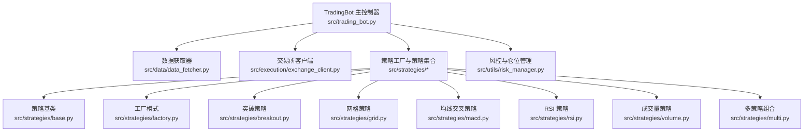

图表来源
- [src/trading_bot.py](file://src/trading_bot.py#L27-L298)
- [src/data/data_fetcher.py](file://src/data/data_fetcher.py#L17-L71)
- [src/execution/exchange_client.py](file://src/execution/exchange_client.py#L20-L85)
- [src/strategies/__init__.py](file://src/strategies/__init__.py#L2-L20)
- [src/strategies/base.py](file://src/strategies/base.py#L6-L31)
- [src/strategies/factory.py](file://src/strategies/factory.py#L10-L36)
- [src/strategies/breakout.py](file://src/strategies/breakout.py#L6-L79)
- [src/strategies/grid.py](file://src/strategies/grid.py#L5-L63)
- [src/strategies/macd.py](file://src/strategies/macd.py#L5-L40)
- [src/strategies/rsi.py](file://src/strategies/rsi.py#L6-L42)
- [src/strategies/volume.py](file://src/strategies/volume.py#L6-L44)
- [src/strategies/multi.py](file://src/strategies/multi.py#L6-L38)
- [src/utils/risk_manager.py](file://src/utils/risk_manager.py#L12-L242)

章节来源
- [src/trading_bot.py](file://src/trading_bot.py#L13-L91)
- [src/strategies/__init__.py](file://src/strategies/__init__.py#L1-L21)

## 核心组件
- 交易主控制器：负责初始化、数据拉取、策略分析、信号执行、风控检查与仓位管理、循环控制与统计输出。
- 策略层：抽象基类定义统一接口，具体策略实现各自指标与信号生成逻辑，工厂模式按名称创建策略或组合策略。
- 数据层：异步获取 OHLCV 与行情，支持 Binance 与 OKX，提供 WebSocket 订阅接口。
- 执行层：封装交易所 API，支持下单、撤单、杠杆设置、账户与仓位查询。
- 风控层：统一风控参数、仓位计算、止损止盈、熔断与日限检查、交易记录与统计。

章节来源
- [src/trading_bot.py](file://src/trading_bot.py#L27-L298)
- [src/strategies/base.py](file://src/strategies/base.py#L6-L31)
- [src/strategies/factory.py](file://src/strategies/factory.py#L10-L36)
- [src/data/data_fetcher.py](file://src/data/data_fetcher.py#L17-L71)
- [src/execution/exchange_client.py](file://src/execution/exchange_client.py#L20-L85)
- [src/utils/risk_manager.py](file://src/utils/risk_manager.py#L12-L242)

## 架构总览
系统以 TradingBot 为核心，通过工厂创建策略实例，策略分析生成信号，风控与仓位管理决定是否下单与如何平仓，数据与执行模块分别负责数据获取与下单执行。

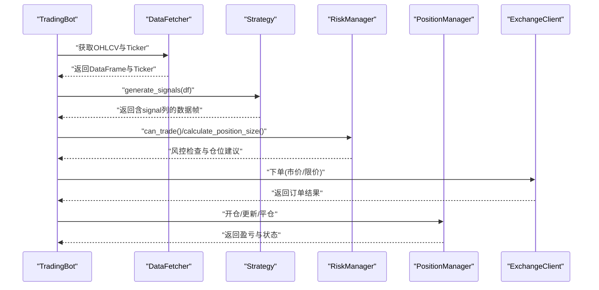

图表来源
- [src/trading_bot.py](file://src/trading_bot.py#L92-L205)
- [src/strategies/base.py](file://src/strategies/base.py#L14-L22)
- [src/utils/risk_manager.py](file://src/utils/risk_manager.py#L62-L194)
- [src/execution/exchange_client.py](file://src/execution/exchange_client.py#L226-L275)

## 详细组件分析

### 策略工厂模式与策略注册
- 工厂函数根据策略名称映射到具体策略类，支持“multi”组合策略，组合策略内部递归创建子策略并加权汇总信号。
- 策略注册集中于导出模块，便于扩展新策略。

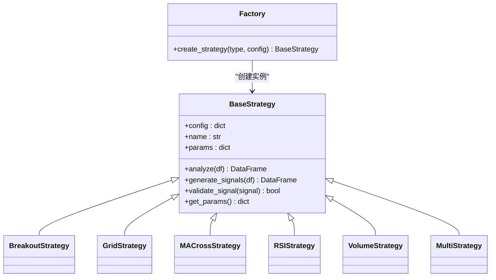

图表来源
- [src/strategies/base.py](file://src/strategies/base.py#L6-L31)
- [src/strategies/factory.py](file://src/strategies/factory.py#L10-L36)
- [src/strategies/breakout.py](file://src/strategies/breakout.py#L6-L79)
- [src/strategies/grid.py](file://src/strategies/grid.py#L5-L63)
- [src/strategies/macd.py](file://src/strategies/macd.py#L5-L40)
- [src/strategies/rsi.py](file://src/strategies/rsi.py#L6-L42)
- [src/strategies/volume.py](file://src/strategies/volume.py#L6-L44)
- [src/strategies/multi.py](file://src/strategies/multi.py#L6-L38)

章节来源
- [src/strategies/__init__.py](file://src/strategies/__init__.py#L2-L20)
- [src/strategies/factory.py](file://src/strategies/factory.py#L10-L36)

### 突破策略（趋势策略）
- 指标计算
  - 移动平均线：短期与中期均线用于趋势过滤。
  - 最高价/最低价窗口：用于判断突破信号。
  - ATR：衡量波动率，辅助过滤噪音。
  - 布林带：识别超买超卖区域。
  - MACD 与 RSI：辅助确认趋势与超买超卖。
- 入场出场
  - 多头：收盘价上穿前 N 周期最高价 × (1+阈值) 且 RSI 不在超买区。
  - 空头：收盘价下穿前 N 周期最低价 × (1-阈值) 且 RSI 不在超卖区。
- 参数
  - lookback_period：突破观察窗口
  - threshold：突破阈值
  - atr_multiplier：ATR 波动过滤倍数
  - 可选：布林带与 MACD/RSI 参数

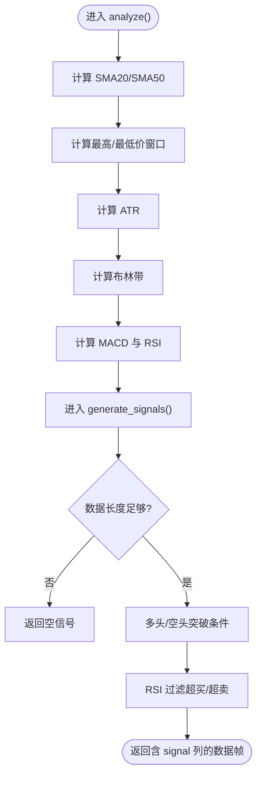

图表来源
- [src/strategies/breakout.py](file://src/strategies/breakout.py#L21-L79)

章节来源
- [src/strategies/breakout.py](file://src/strategies/breakout.py#L6-L79)

### 网格策略（震荡策略）
- 指标计算
  - 以基准价为中心，按网格间距生成上下网格线，当前价格归属最近网格。
- 入场出场
  - 当价格接近某网格且出现方向性突破时，按网格方向发出信号（多/空）。
- 参数
  - grid_count：网格数量（上下各若干档）
  - grid_size：网格间距（百分比）
  - base_price：基准价（未指定时取最新收盘价）

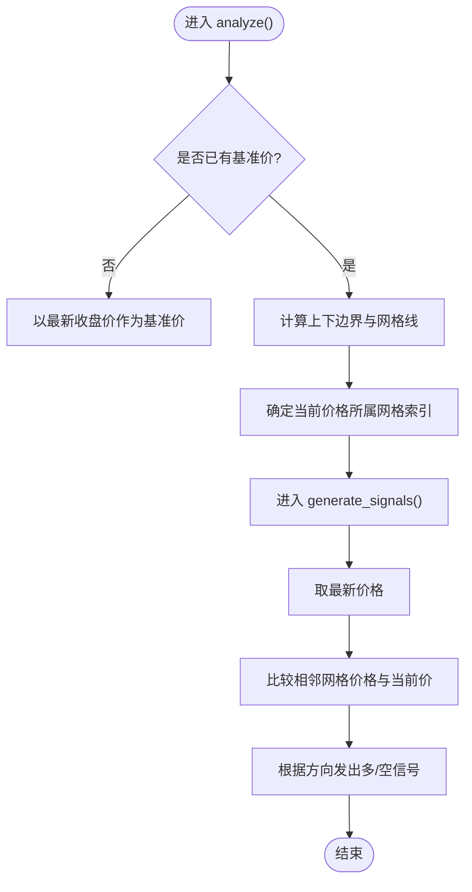

图表来源
- [src/strategies/grid.py](file://src/strategies/grid.py#L20-L63)

章节来源
- [src/strategies/grid.py](file://src/strategies/grid.py#L5-L63)

### 均线交叉策略（趋势跟踪）
- 指标计算
  - 快慢均线差值与前一周期差值，用于识别金叉/死叉。
- 入场出场
  - 金叉（快线上穿慢线）做多；死叉做空。
- 参数
  - fast_ma：快速均线周期
  - slow_ma：慢速均线周期

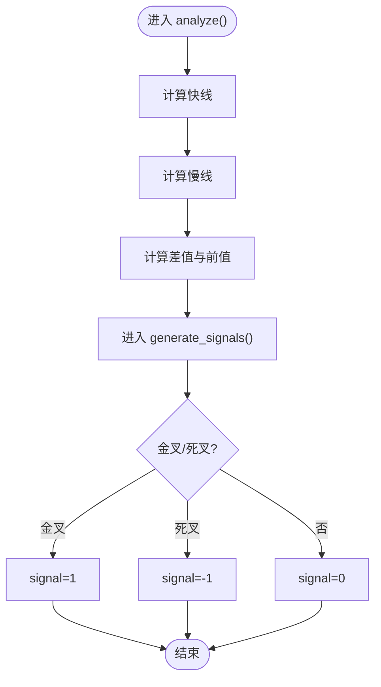

图表来源
- [src/strategies/macd.py](file://src/strategies/macd.py#L18-L40)

章节来源
- [src/strategies/macd.py](file://src/strategies/macd.py#L5-L40)

### RSI 策略（超买超卖）
- 指标计算
  - 基于涨跌平均值计算 RSI。
- 入场出场
  - RSI 下穿超卖线做多；上穿超买线做空。
- 参数
  - rsi_period：RSI 周期
  - oversold：超卖阈值
  - overbought：超买阈值

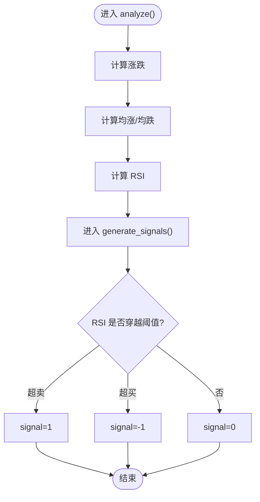

图表来源
- [src/strategies/rsi.py](file://src/strategies/rsi.py#L21-L42)

章节来源
- [src/strategies/rsi.py](file://src/strategies/rsi.py#L6-L42)

### 成交量策略（放量突破）
- 指标计算
  - 成交量均线与成交量放大倍数；价格涨跌幅绝对值。
- 入场出场
  - 放量上涨做多；放量下跌做空。
- 参数
  - volume_ma_period：成交量均线周期
  - volume_threshold：放量阈值

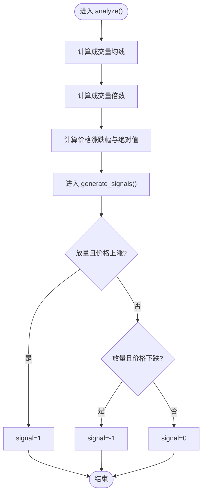

图表来源
- [src/strategies/volume.py](file://src/strategies/volume.py#L19-L44)

章节来源
- [src/strategies/volume.py](file://src/strategies/volume.py#L6-L44)

### 多策略组合（加权融合）
- 设计思想
  - 对多个子策略分别生成信号，按权重加权求和，再归一化到 -1/0/1。
- 参数
  - strategies：子策略配置列表
  - weights：权重向量（未提供时等权）

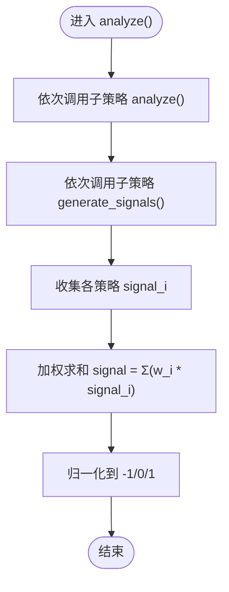

图表来源
- [src/strategies/multi.py](file://src/strategies/multi.py#L16-L38)

章节来源
- [src/strategies/multi.py](file://src/strategies/multi.py#L6-L38)

### 风控与仓位管理
- 仓位计算：基于账户最大风险敞口比例与信号强度，结合最小/最大仓位限制。
- 止损止盈：按开仓价与当前价计算盈亏百分比，触发即平仓。
- 熔断与日限：单日最大亏损比例、最大交易次数、连续亏损次数限制；达到阈值触发熔断冷却。
- 交易记录：累计每日盈亏、胜/负次数、连续亏损次数，支持恢复交易。

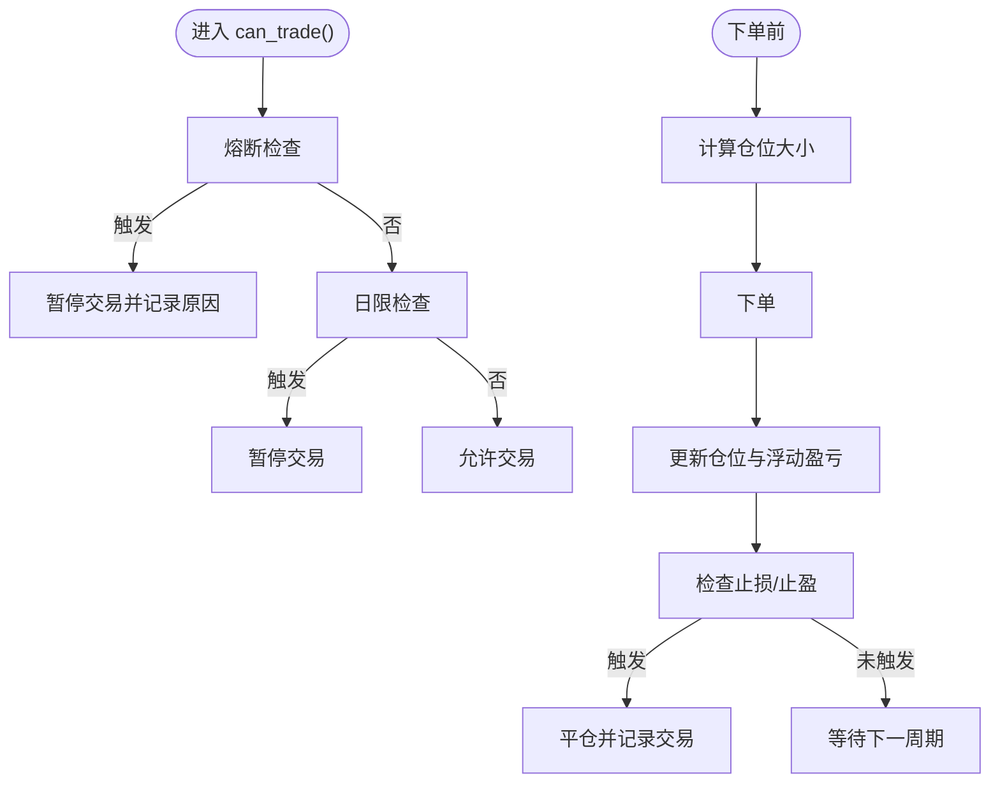

图表来源
- [src/utils/risk_manager.py](file://src/utils/risk_manager.py#L62-L242)

章节来源
- [src/utils/risk_manager.py](file://src/utils/risk_manager.py#L12-L388)

### 数据与执行层
- 数据层
  - 异步获取 K 线、24 小时行情、订单簿、资金费率等；支持 WebSocket 实时订阅。
  - 提供 Binance 与 OKX 适配器。
- 执行层
  - 统一封装下单、撤单、杠杆设置、账户与仓位查询；Binance 客户端支持签名与精度处理。

章节来源
- [src/data/data_fetcher.py](file://src/data/data_fetcher.py#L17-L434)
- [src/execution/exchange_client.py](file://src/execution/exchange_client.py#L20-L432)

## 依赖关系分析
- 策略层依赖 pandas 进行指标计算与信号生成。
- 工厂模式解耦策略创建与调用，便于扩展新策略。
- 风控与执行模块与策略层松耦合，通过 TradingBot 协调。
- 配置校验确保策略、交易所与风控参数合法。

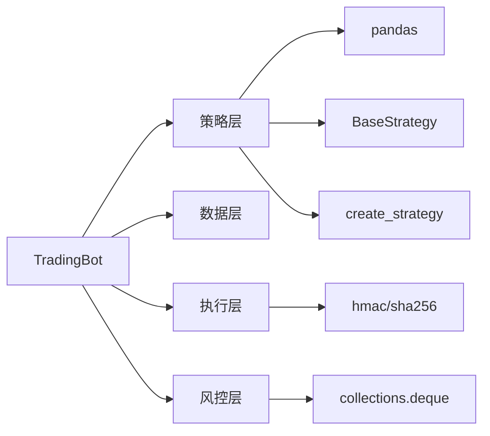

图表来源
- [src/trading_bot.py](file://src/trading_bot.py#L14-L22)
- [src/strategies/base.py](file://src/strategies/base.py#L3-L4)
- [src/strategies/factory.py](file://src/strategies/factory.py#L2-L8)
- [src/utils/risk_manager.py](file://src/utils/risk_manager.py#L8-L10)
- [src/execution/exchange_client.py](file://src/execution/exchange_client.py#L8-L14)

章节来源
- [src/utils/config.py](file://src/utils/config.py#L15-L37)

## 性能考虑
- 异步 I/O：数据获取与下单均采用异步，减少阻塞。
- 并行请求：主循环中并行获取 OHLCV 与 Ticker，缩短单轮耗时。
- 指标计算：优先使用向量化操作（rolling、ewm、where 等），避免显式循环。
- 精度与约束：下单前按交易所步进与精度调整数量，避免无效订单。
- 缓存与复用：会话与 WebSocket 连接复用，降低连接成本。
- 回测建议：可将策略 analyze/generate_signals 抽离为纯函数，输入固定历史数据进行批量回测，评估不同参数组合下的收益与风险。

## 故障排查指南
- 配置校验失败
  - 检查 exchange/symbols/strategy/risk 配置项是否符合要求。
- API 错误
  - 数据层与执行层均对第三方返回错误进行捕获与抛出，查看异常堆栈定位问题。
- 仓位为 0 或负数
  - 检查账户余额、最大仓位比例与价格是否合理，确认风控计算逻辑。
- 熔断与暂停
  - 查看风控统计中的暂停原因与剩余冷却时间，等待熔断冷却后恢复。
- WebSocket 订阅
  - 确认回调函数非空，网络与心跳设置正常。

章节来源
- [src/utils/config.py](file://src/utils/config.py#L15-L37)
- [src/data/data_fetcher.py](file://src/data/data_fetcher.py#L95-L100)
- [src/execution/exchange_client.py](file://src/execution/exchange_client.py#L165-L170)
- [src/utils/risk_manager.py](file://src/utils/risk_manager.py#L129-L153)

## 结论
该系统以工厂模式组织策略，通过统一接口实现多策略并行与组合，配合完善的风控与仓位管理，形成可扩展、可验证的交易框架。建议在实盘前充分进行参数寻优与回测验证，并持续监控风控阈值与熔断机制，确保系统稳健运行。

## 附录

### 策略参数配置清单
- 突破策略
  - lookback_period：突破观察窗口
  - threshold：突破阈值
  - atr_multiplier：ATR 波动过滤倍数
- 网格策略
  - grid_count：网格数量
  - grid_size：网格间距（百分比）
  - base_price：基准价（可省略）
- 均线交叉策略
  - fast_ma：快速均线周期
  - slow_ma：慢速均线周期
- RSI 策略
  - rsi_period：RSI 周期
  - oversold：超卖阈值
  - overbought：超买阈值
- 成交量策略
  - volume_ma_period：成交量均线周期
  - volume_threshold：放量阈值
- 多策略组合
  - strategies：子策略配置列表
  - weights：权重向量（可省略，等权）

章节来源
- [src/strategies/breakout.py](file://src/strategies/breakout.py#L9-L19)
- [src/strategies/grid.py](file://src/strategies/grid.py#L8-L18)
- [src/strategies/macd.py](file://src/strategies/macd.py#L8-L16)
- [src/strategies/rsi.py](file://src/strategies/rsi.py#L9-L19)
- [src/strategies/volume.py](file://src/strategies/volume.py#L9-L17)
- [src/strategies/multi.py](file://src/strategies/multi.py#L9-L14)

### 使用指南（步骤）
- 准备配置文件：参考默认配置与示例配置，设置交易所、交易对、时间周期、策略与风控参数。
- 启动主程序：加载配置并初始化各模块，进入主循环。
- 观察日志：关注信号变化、下单结果与风控统计。
- 调参与回测：在策略层独立运行策略分析函数，对历史数据进行回测评估。

章节来源
- [configs/config.json](file://configs/config.json#L1-L28)
- [src/trading_bot.py](file://src/trading_bot.py#L323-L346)