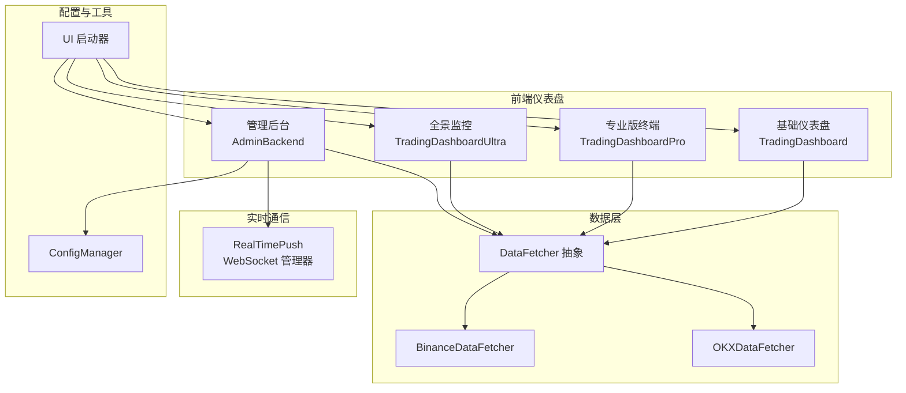
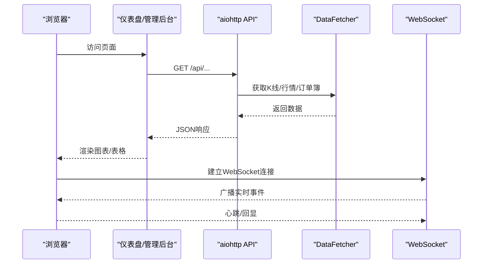
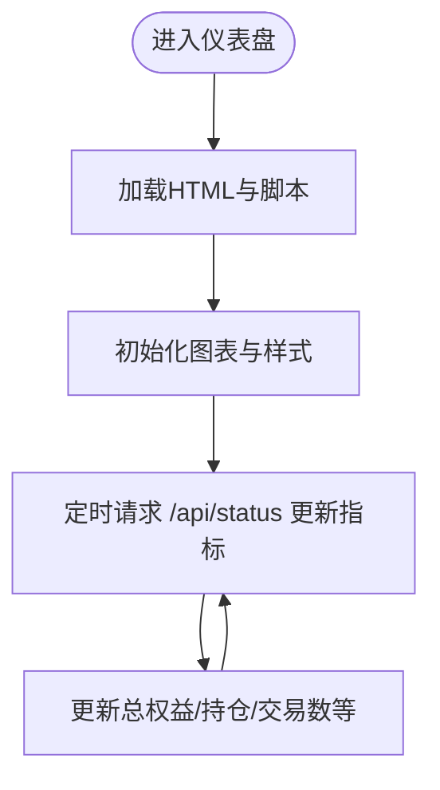
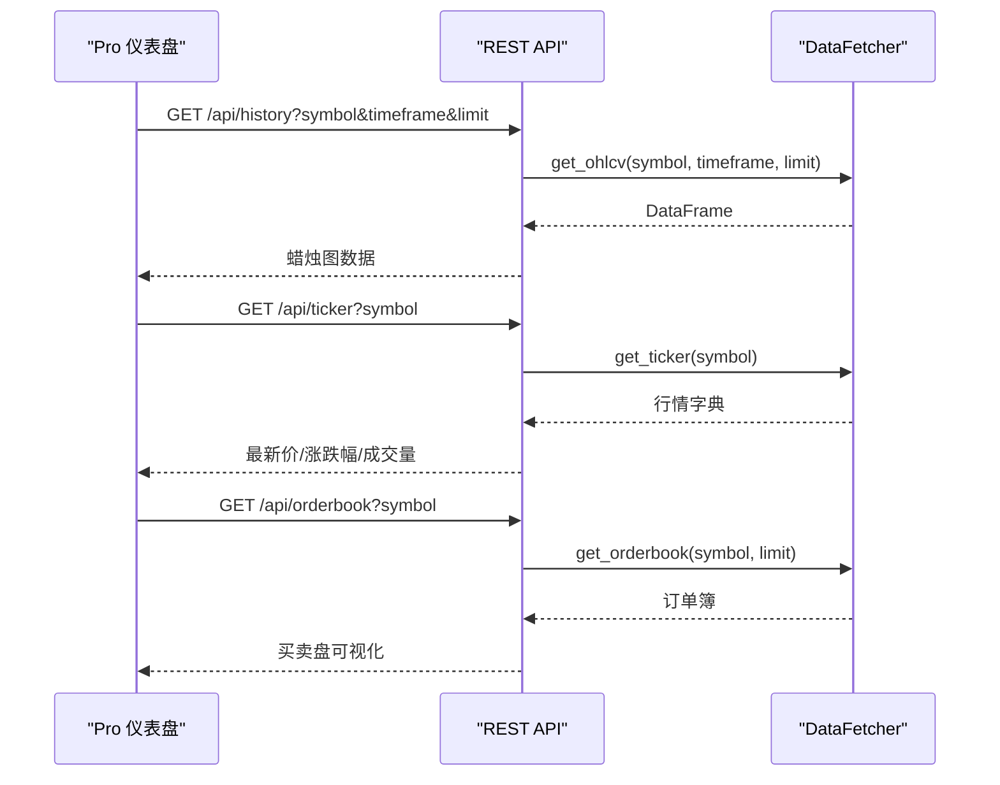
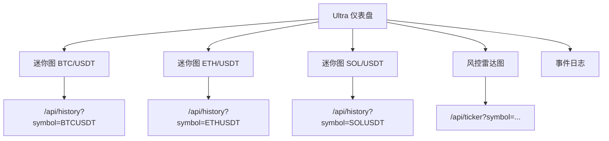
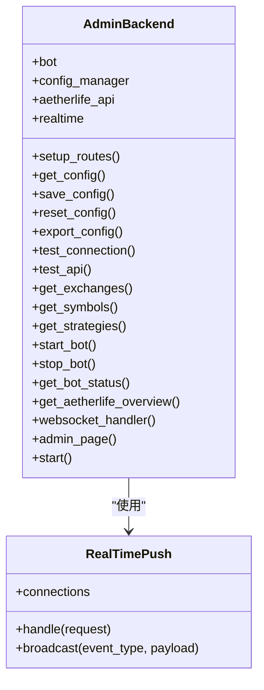
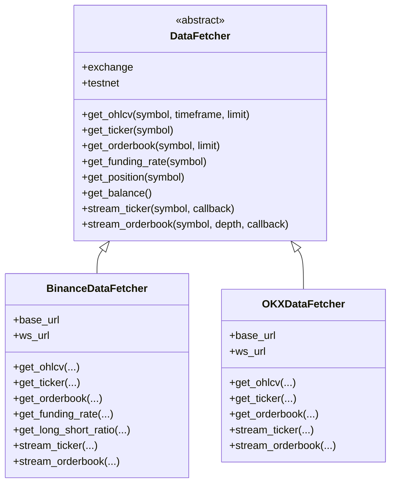
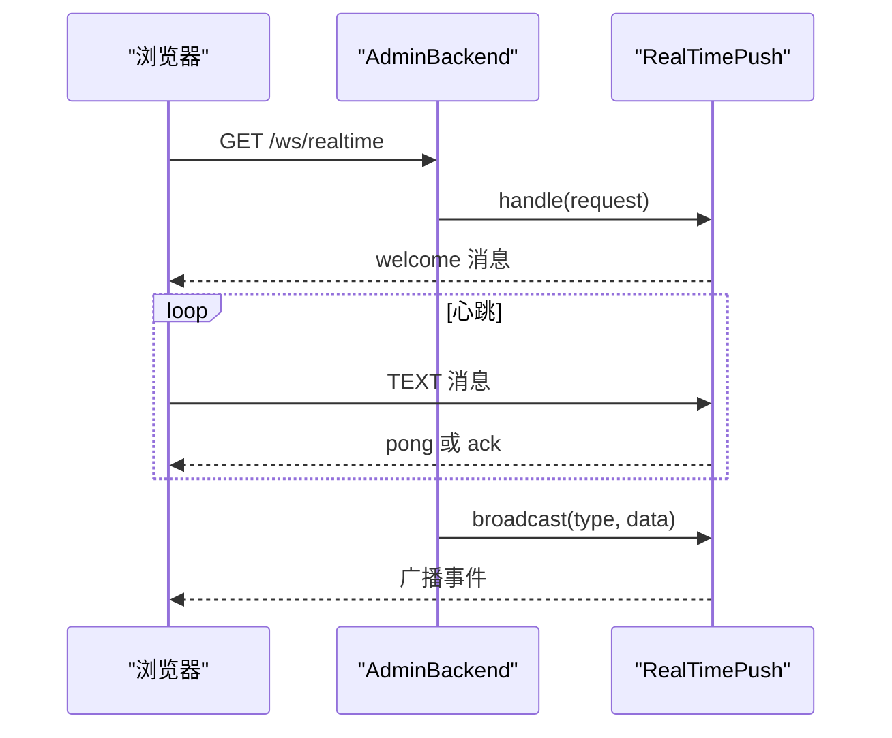
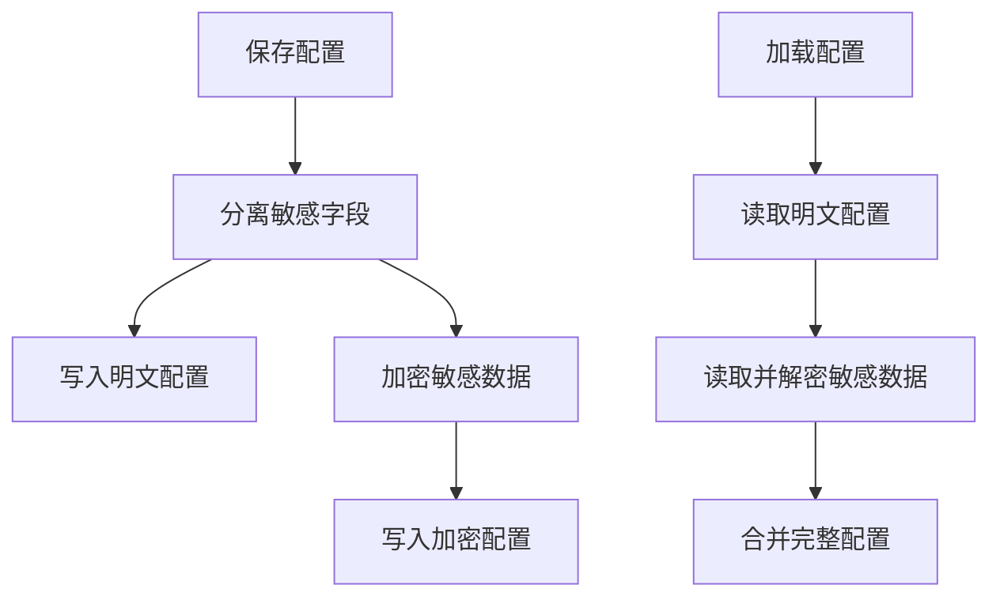
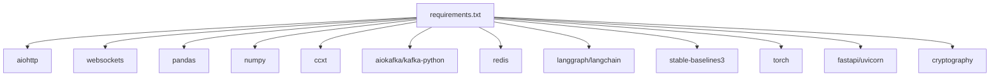

# 实时监控与可视化

<cite>
**本文档引用的文件**
- [src/ui/dashboard.py](file://src/ui/dashboard.py)
- [src/ui/dashboard_pro.py](file://src/ui/dashboard_pro.py)
- [src/ui/dashboard_ultra.py](file://src/ui/dashboard_ultra.py)
- [src/ui/admin_backend.py](file://src/ui/admin_backend.py)
- [src/ui/websocket/realtime_push.py](file://src/ui/websocket/realtime_push.py)
- [src/data/data_fetcher.py](file://src/data/data_fetcher.py)
- [src/ui/run.py](file://src/ui/run.py)
- [src/utils/config_manager.py](file://src/utils/config_manager.py)
- [scripts/ws_realtime_demo.py](file://scripts/ws_realtime_demo.py)
- [src/ui/admin_page.html](file://src/ui/admin_page.html)
- [requirements.txt](file://requirements.txt)
</cite>

## 目录
1. [简介](#简介)
2. [项目结构](#项目结构)
3. [核心组件](#核心组件)
4. [架构总览](#架构总览)
5. [详细组件分析](#详细组件分析)
6. [依赖关系分析](#依赖关系分析)
7. [性能考虑](#性能考虑)
8. [故障排除指南](#故障排除指南)
9. [结论](#结论)
10. [附录](#附录)

## 简介
本文件面向实时监控与可视化功能的技术文档，聚焦于Web仪表盘的设计架构、实时数据展示机制、用户交互界面与管理后台功能。内容涵盖数据可视化组件、WebSocket实时通信、状态同步机制与用户权限管理；同时给出监控指标定义、图表组件配置、报警通知机制与性能优化策略，并提供仪表盘配置指南、自定义报表创建与监控告警设置的实用示例。

## 项目结构
该系统采用模块化分层组织，前端仪表盘通过aiohttp提供静态页面与REST API，数据层通过统一的数据获取器对接多个交易所，WebSocket用于实时推送，管理后台提供配置与监控能力。

**图表来源**
- [src/ui/dashboard.py](file://src/ui/dashboard.py#L13-L385)
- [src/ui/dashboard_pro.py](file://src/ui/dashboard_pro.py#L10-L580)
- [src/ui/dashboard_ultra.py](file://src/ui/dashboard_ultra.py#L9-L434)
- [src/ui/admin_backend.py](file://src/ui/admin_backend.py#L28-L349)
- [src/data/data_fetcher.py](file://src/data/data_fetcher.py#L17-L434)
- [src/ui/websocket/realtime_push.py](file://src/ui/websocket/realtime_push.py#L9-L47)
- [src/ui/run.py](file://src/ui/run.py#L34-L95)
- [src/utils/config_manager.py](file://src/utils/config_manager.py#L14-L212)

**章节来源**
- [src/ui/run.py](file://src/ui/run.py#L34-L95)

## 核心组件
- 仪表盘组件：提供不同粒度的可视化界面，包括基础监控、专业交易终端与全景监控。
- 数据获取器：抽象统一的K线、行情、订单簿与资金费率等数据接口，支持Binance与OKX。
- WebSocket推送：管理实时连接、心跳与广播消息。
- 管理后台：提供配置管理、策略管理、Bot控制与AetherLife扩展接口。
- 配置管理：安全存储与验证API密钥，支持默认配置与导出。

**章节来源**
- [src/ui/dashboard.py](file://src/ui/dashboard.py#L13-L385)
- [src/ui/dashboard_pro.py](file://src/ui/dashboard_pro.py#L10-L580)
- [src/ui/dashboard_ultra.py](file://src/ui/dashboard_ultra.py#L9-L434)
- [src/ui/admin_backend.py](file://src/ui/admin_backend.py#L28-L349)
- [src/data/data_fetcher.py](file://src/data/data_fetcher.py#L17-L434)
- [src/ui/websocket/realtime_push.py](file://src/ui/websocket/realtime_push.py#L9-L47)
- [src/utils/config_manager.py](file://src/utils/config_manager.py#L14-L212)

## 架构总览
系统采用前后端分离的Web架构，后端以aiohttp提供REST API与WebSocket，前端通过JavaScript与图表库实现可视化与交互。数据层通过统一接口访问多个交易所，管理后台提供配置与控制能力。

**图表来源**
- [src/ui/dashboard_pro.py](file://src/ui/dashboard_pro.py#L29-L76)
- [src/ui/admin_backend.py](file://src/ui/admin_backend.py#L306-L307)
- [src/ui/websocket/realtime_push.py](file://src/ui/websocket/realtime_push.py#L15-L33)
- [src/data/data_fetcher.py](file://src/data/data_fetcher.py#L40-L70)

## 详细组件分析

### 基础仪表盘 TradingDashboard
- 功能：提供基本的K线图表、实时指标与手动下单入口。
- 数据：通过REST API返回模拟或占位数据，前端定时轮询更新。
- 图表：使用Lightweight Charts绘制蜡烛图与指标线。
- 交互：支持交易对切换、时间窗口选择与快速买卖按钮。

**图表来源**
- [src/ui/dashboard.py](file://src/ui/dashboard.py#L31-L336)
- [src/ui/dashboard.py](file://src/ui/dashboard.py#L338-L374)

**章节来源**
- [src/ui/dashboard.py](file://src/ui/dashboard.py#L13-L385)

### 专业版终端 TradingDashboardPro
- 功能：多市场、多时间窗口、订单簿与实时图表联动。
- 数据：通过REST API获取K线、行情与订单簿，前端定时轮询。
- 图表：Lightweight Charts蜡烛图叠加MA指标，订单簿可视化。
- 交互：支持交易对切换、时间窗口切换、指标开关与快速交易面板。

**图表来源**
- [src/ui/dashboard_pro.py](file://src/ui/dashboard_pro.py#L29-L76)
- [src/data/data_fetcher.py](file://src/data/data_fetcher.py#L85-L157)

**章节来源**
- [src/ui/dashboard_pro.py](file://src/ui/dashboard_pro.py#L10-L580)
- [src/data/data_fetcher.py](file://src/data/data_fetcher.py#L73-L396)

### 全景监控 TradingDashboardUltra
- 功能：多资产热力图、AI信号面板、风控雷达与事件日志。
- 数据：迷你图展示多币种资金曲线，定时轮询更新。
- 图表：Lightweight Charts区域图与Chart.js雷达图。
- 交互：自动滚动日志、定时刷新与趋势颜色切换。

**图表来源**
- [src/ui/dashboard_ultra.py](file://src/ui/dashboard_ultra.py#L28-L58)
- [src/ui/dashboard_ultra.py](file://src/ui/dashboard_ultra.py#L367-L409)

**章节来源**
- [src/ui/dashboard_ultra.py](file://src/ui/dashboard_ultra.py#L9-L434)

### 管理后台 AdminBackend
- 功能：配置管理、策略管理、Bot控制、AetherLife扩展接口与WebSocket实时推送。
- 接口：提供配置读写、API连通性测试、交易所/策略查询、Bot启停与状态查询。
- 实时：WebSocket路由 /ws/realtime，支持心跳与广播。

**图表来源**
- [src/ui/admin_backend.py](file://src/ui/admin_backend.py#L28-L349)
- [src/ui/websocket/realtime_push.py](file://src/ui/websocket/realtime_push.py#L9-L47)

**章节来源**
- [src/ui/admin_backend.py](file://src/ui/admin_backend.py#L28-L349)
- [src/ui/websocket/realtime_push.py](file://src/ui/websocket/realtime_push.py#L9-L47)

### 数据获取器 DataFetcher
- 功能：抽象统一接口，实现Binance与OKX的K线、行情、订单簿与资金费率获取。
- 实时：支持WebSocket订阅行情与订单簿，回调驱动更新。
- 错误处理：对API返回进行校验与异常抛出。

**图表来源**
- [src/data/data_fetcher.py](file://src/data/data_fetcher.py#L17-L434)

**章节来源**
- [src/data/data_fetcher.py](file://src/data/data_fetcher.py#L17-L434)

### WebSocket 实时推送
- 功能：维护WebSocket连接集合，处理心跳与回显，广播事件给所有连接。
- 使用：管理后台提供 /ws/realtime 路由，前端通过该路由接收实时事件。

**图表来源**
- [src/ui/admin_backend.py](file://src/ui/admin_backend.py#L306-L307)
- [src/ui/websocket/realtime_push.py](file://src/ui/websocket/realtime_push.py#L15-L33)

**章节来源**
- [src/ui/websocket/realtime_push.py](file://src/ui/websocket/realtime_push.py#L9-L47)

### 配置管理 ConfigManager
- 功能：配置文件的加密存储、读取与验证；分离敏感信息；默认配置与导出。
- 安全：使用Fernet对敏感字段进行加密存储，密钥文件权限严格控制。

**图表来源**
- [src/utils/config_manager.py](file://src/utils/config_manager.py#L48-L116)

**章节来源**
- [src/utils/config_manager.py](file://src/utils/config_manager.py#L14-L212)

### 启动器 UI 启动器
- 功能：根据模式选择仪表盘或管理后台，自动分配端口，初始化数据获取器并启动服务。
- 支持：basic/pro/ultra/admin 模式，可指定主机、端口与交易所。

**章节来源**
- [src/ui/run.py](file://src/ui/run.py#L34-L95)

## 依赖关系分析
系统依赖以异步为主，前端通过JavaScript与图表库协作，后端基于aiohttp与WebSocket实现高并发。

**图表来源**
- [requirements.txt](file://requirements.txt#L1-L92)

**章节来源**
- [requirements.txt](file://requirements.txt#L1-L92)

## 性能考虑
- 前端轮询策略：专业版与全景版采用定时轮询，建议根据业务需求调整轮询间隔，避免过度请求。
- 图表渲染：使用Lightweight Charts与Chart.js，注意大数据量时的渲染优化与内存释放。
- WebSocket：心跳与回显机制降低连接中断风险，广播时注意清理无效连接。
- 数据获取：统一接口减少重复请求，缓存热点数据，合理设置超时与重试。
- 后端并发：aiohttp异步I/O适合高并发场景，注意限流与熔断策略。

[本节为通用指导，无需特定文件引用]

## 故障排除指南
- WebSocket连接失败：检查路由 /ws/realtime 是否正确映射，确认心跳与回显逻辑。
- API返回异常：查看数据获取器对API返回的校验与异常抛出，定位具体接口问题。
- 配置加载失败：确认配置文件与加密文件存在且权限正确，检查密钥文件读取流程。
- 启动端口冲突：通过启动器参数指定端口，避免与其他服务冲突。
- 依赖缺失：根据 requirements.txt 安装缺失的Python包，特别是ccxt、aiokafka、redis等。

**章节来源**
- [src/ui/websocket/realtime_push.py](file://src/ui/websocket/realtime_push.py#L15-L33)
- [src/data/data_fetcher.py](file://src/data/data_fetcher.py#L95-L98)
- [src/utils/config_manager.py](file://src/utils/config_manager.py#L102-L115)
- [src/ui/run.py](file://src/ui/run.py#L34-L43)
- [requirements.txt](file://requirements.txt#L1-L92)

## 结论
本系统通过模块化的前端仪表盘、统一的数据获取层与WebSocket实时推送，构建了完整的实时监控与可视化体系。管理后台提供了完善的配置与控制能力，结合安全的配置管理与异步后端，能够满足多市场、多策略的监控与管理需求。建议在生产环境中进一步完善实时数据通道、报警机制与权限控制，并持续优化前端渲染与后端并发处理能力。

[本节为总结性内容，无需特定文件引用]

## 附录

### 仪表盘配置指南
- 选择模式：通过启动器参数选择 basic/pro/ultra/admin 模式。
- 端口与主机：可通过参数指定主机与端口，默认端口见启动器映射。
- 交易所与测试网：支持Binance与OKX，可切换测试网模式。
- 浏览器自动打开：默认自动打开浏览器，可通过参数关闭。

**章节来源**
- [src/ui/run.py](file://src/ui/run.py#L24-L32)
- [src/ui/run.py](file://src/ui/run.py#L34-L71)

### 自定义报表创建
- 专业版终端：通过 /api/history 与 /api/ticker 获取K线与行情，前端渲染图表。
- 全景监控：通过 /api/history 与 /api/ticker 获取迷你图数据，前端渲染区域图。
- 管理后台：通过 /api/aetherlife/* 接口获取AetherLife相关数据，前端渲染图表与表格。

**章节来源**
- [src/ui/dashboard_pro.py](file://src/ui/dashboard_pro.py#L29-L76)
- [src/ui/dashboard_ultra.py](file://src/ui/dashboard_ultra.py#L28-L58)
- [src/ui/admin_backend.py](file://src/ui/admin_backend.py#L256-L301)

### 监控告警设置
- WebSocket广播：管理后台通过 RealTimePush 广播事件，前端建立连接接收实时消息。
- 心跳与回显：WebSocket心跳机制保障连接稳定，前端收到消息后更新UI。
- 日志与状态：全景监控的日志面板支持自动滚动，便于观察系统状态。

**章节来源**
- [src/ui/websocket/realtime_push.py](file://src/ui/websocket/realtime_push.py#L15-L33)
- [src/ui/admin_page.html](file://src/ui/admin_page.html#L450-L453)
- [src/ui/dashboard_ultra.py](file://src/ui/dashboard_ultra.py#L411-L423)

### 实时数据演示
- 脚本示例：scripts/ws_realtime_demo.py 展示如何订阅Binance与OKX的实时行情与订单簿。
- 参数说明：支持交易所选择、交易对、订阅类型、深度与测试网选项。

**章节来源**
- [scripts/ws_realtime_demo.py](file://scripts/ws_realtime_demo.py#L20-L27)
- [scripts/ws_realtime_demo.py](file://scripts/ws_realtime_demo.py#L30-L57)