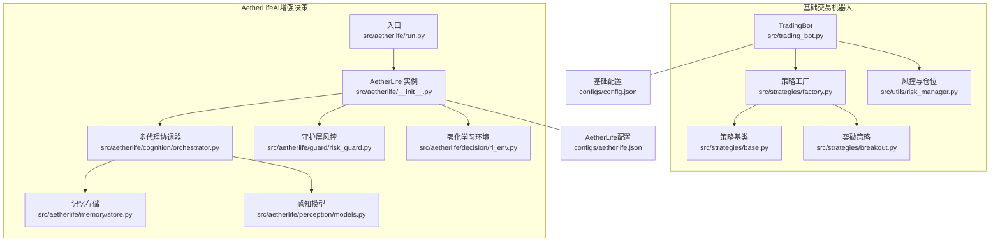
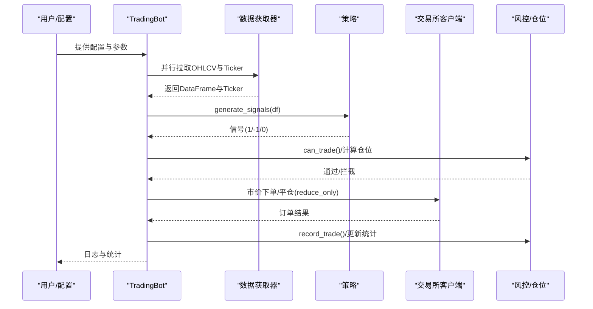
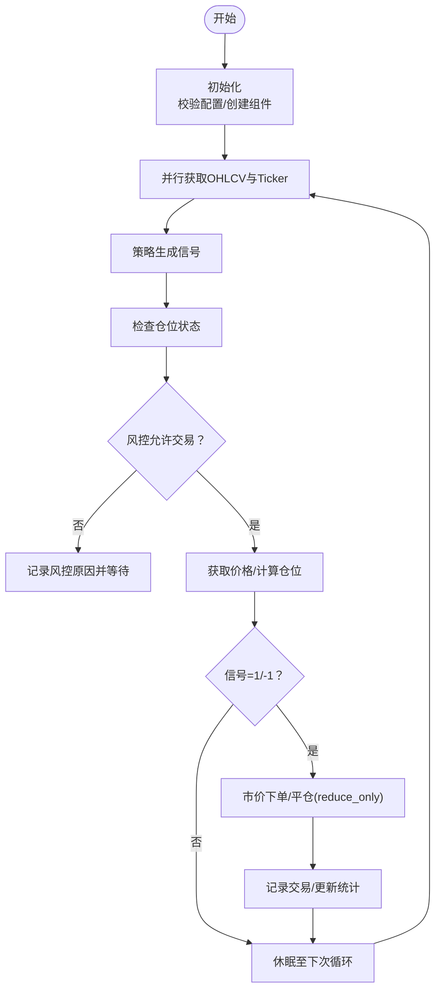
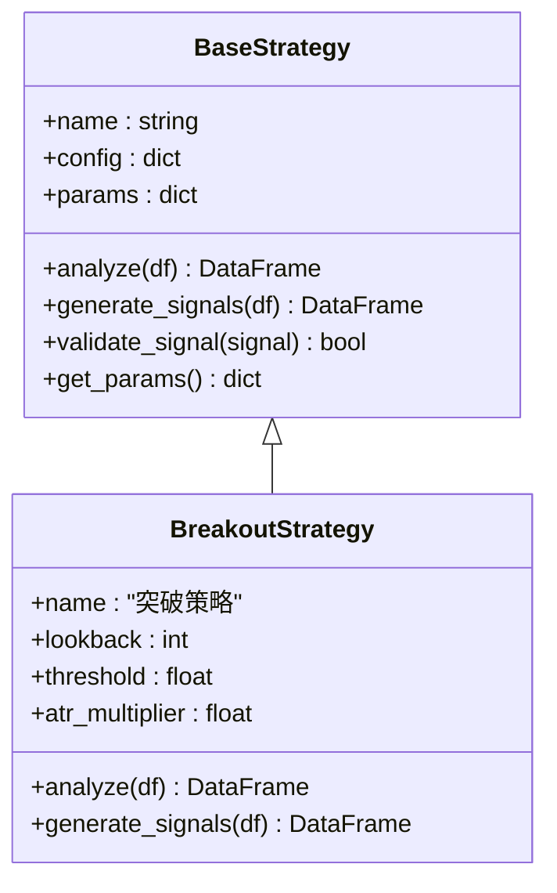
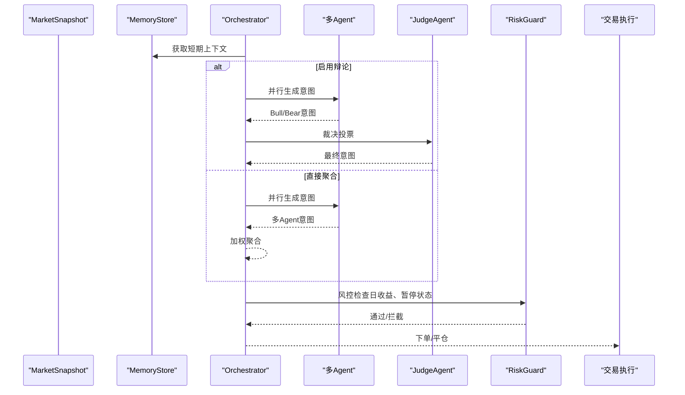
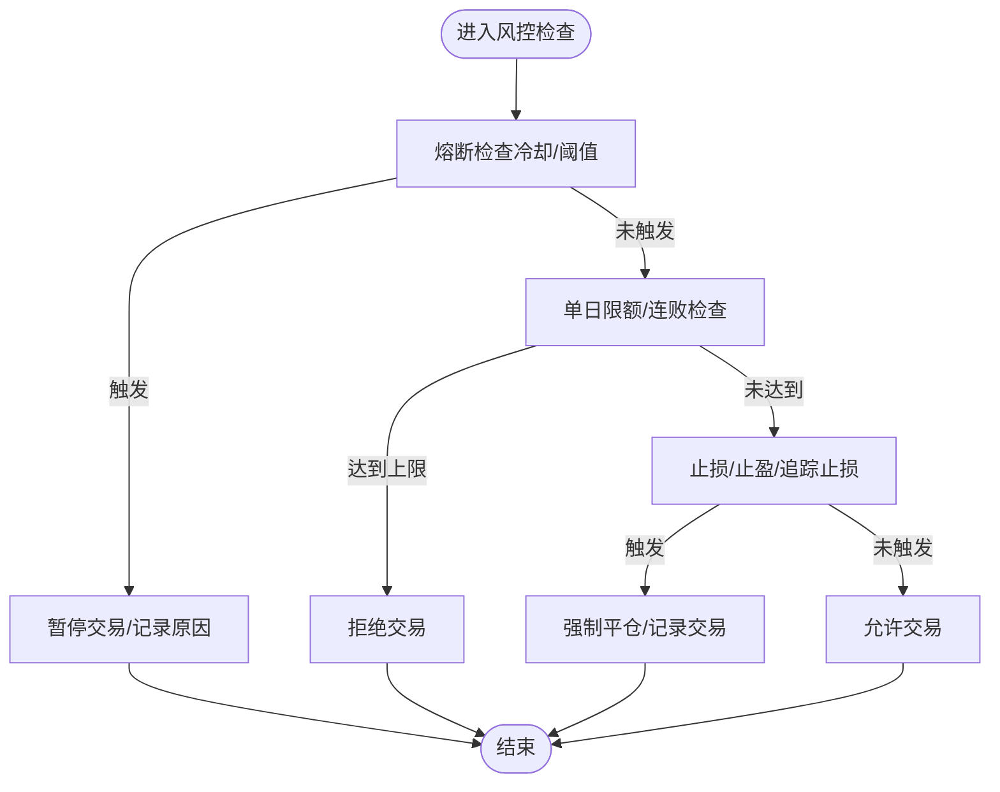
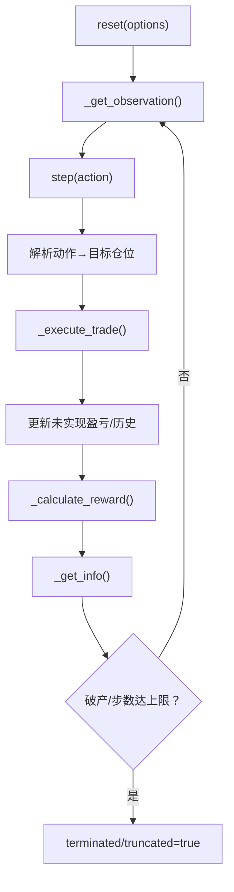
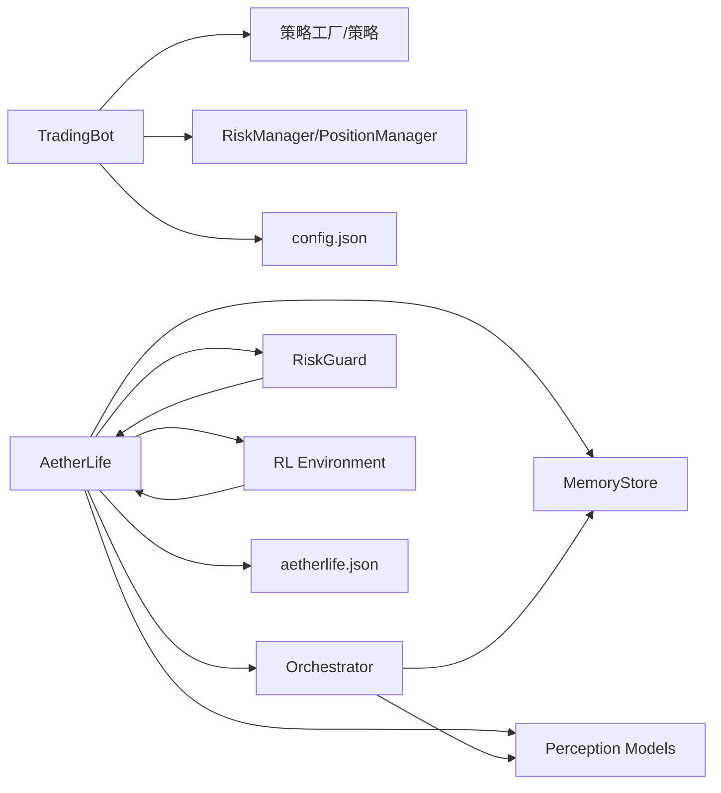

# 核心特性

<cite>
**本文引用的文件**
- [src/trading_bot.py](file://src/trading_bot.py)
- [src/strategies/base.py](file://src/strategies/base.py)
- [src/strategies/breakout.py](file://src/strategies/breakout.py)
- [src/strategies/factory.py](file://src/strategies/factory.py)
- [src/utils/risk_manager.py](file://src/utils/risk_manager.py)
- [src/aetherlife/__init__.py](file://src/aetherlife/__init__.py)
- [src/aetherlife/run.py](file://src/aetherlife/run.py)
- [src/aetherlife/cognition/orchestrator.py](file://src/aetherlife/cognition/orchestrator.py)
- [src/aetherlife/guard/risk_guard.py](file://src/aetherlife/guard/risk_guard.py)
- [src/aetherlife/decision/rl_env.py](file://src/aetherlife/decision/rl_env.py)
- [src/aetherlife/memory/store.py](file://src/aetherlife/memory/store.py)
- [src/aetherlife/perception/models.py](file://src/aetherlife/perception/models.py)
- [configs/config.json](file://configs/config.json)
- [configs/aetherlife.json](file://configs/aetherlife.json)
</cite>

## 目录
1. [引言](#引言)
2. [项目结构](#项目结构)
3. [核心组件](#核心组件)
4. [架构总览](#架构总览)
5. [详细组件分析](#详细组件分析)
6. [依赖关系分析](#依赖关系分析)
7. [性能考量](#性能考量)
8. [故障排查指南](#故障排查指南)
9. [结论](#结论)
10. [附录](#附录)

## 引言
本文件聚焦于量化交易机器人系统的核心特性，围绕自动化交易机器人、多策略交易系统、AI增强决策（AetherLife）、风险管理、实时监控等模块进行深入解析。内容涵盖实现原理、技术优势、使用场景、关键流程图与序列图，并提供可操作的使用建议与效果预期，帮助用户快速理解并落地应用。

## 项目结构
系统采用分层架构：数据层（行情与连接器）、策略层（多种交易策略与工厂）、执行层（交易所客户端与订单处理）、风控层（风险与仓位管理）、以及面向未来的AI增强决策层（感知→记忆→认知→决策→执行→守护→进化）。同时提供基础交易机器人与AetherLife双入口，满足从简单自动化到复杂智能体编排的需求。

图表来源
- [src/trading_bot.py](file://src/trading_bot.py#L27-L346)
- [src/strategies/factory.py](file://src/strategies/factory.py#L10-L36)
- [src/strategies/base.py](file://src/strategies/base.py#L6-L31)
- [src/strategies/breakout.py](file://src/strategies/breakout.py#L6-L79)
- [src/utils/risk_manager.py](file://src/utils/risk_manager.py#L12-L388)
- [src/aetherlife/run.py](file://src/aetherlife/run.py#L52-L71)
- [src/aetherlife/__init__.py](file://src/aetherlife/__init__.py#L10-L13)
- [src/aetherlife/cognition/orchestrator.py](file://src/aetherlife/cognition/orchestrator.py#L16-L93)
- [src/aetherlife/guard/risk_guard.py](file://src/aetherlife/guard/risk_guard.py#L23-L84)
- [src/aetherlife/memory/store.py](file://src/aetherlife/memory/store.py#L43-L155)
- [src/aetherlife/perception/models.py](file://src/aetherlife/perception/models.py#L15-L64)
- [src/aetherlife/decision/rl_env.py](file://src/aetherlife/decision/rl_env.py#L26-L423)
- [configs/config.json](file://configs/config.json#L1-L28)
- [configs/aetherlife.json](file://configs/aetherlife.json#L1-L17)

章节来源
- [src/trading_bot.py](file://src/trading_bot.py#L1-L346)
- [src/aetherlife/run.py](file://src/aetherlife/run.py#L1-L71)

## 核心组件
- 自动化交易机器人（TradingBot）
  - 职责：初始化数据源与客户端、拉取市场数据、调用策略生成信号、执行下单与平仓、风控检查与仓位管理、日志与统计输出。
  - 关键点：支持多交易对、多时间周期、杠杆参数；内置循环间隔控制；异常保护与优雅停止。
- 多策略交易系统
  - 职责：策略工厂动态创建策略实例；支持单一策略与组合策略（MultiStrategy）；策略参数可配置。
  - 关键点：策略基类抽象统一接口；具体策略（突破、网格、均线交叉、RSI、成交量、多策略组合）覆盖不同市场风格。
- AI增强决策（AetherLife）
  - 职责：多代理协同（市场、订单流、统计套利、新闻情绪等），可选辩论（多空观点与裁判裁决），结合记忆与守护层进行最终决策。
  - 关键点：记忆存储短期事件与决策摘要；守护层执行风控拦截与审计；强化学习环境用于策略训练。
- 风险管理
  - 职责：仓位规模计算、止损止盈、追踪止损、熔断机制、单日限额、暂停/恢复、交易统计。
  - 关键点：PositionManager维护浮动盈亏与平仓结算；RiskManager集中管控。
- 实时监控
  - 职责：日志输出、统计汇总、审计日志落盘、可选回调；AetherLife提供记忆上下文与每日收益汇总。
  - 关键点：TradingBot主循环输出关键指标；AetherLife守护层审计事件。

章节来源
- [src/trading_bot.py](file://src/trading_bot.py#L27-L346)
- [src/strategies/factory.py](file://src/strategies/factory.py#L10-L36)
- [src/strategies/base.py](file://src/strategies/base.py#L6-L31)
- [src/utils/risk_manager.py](file://src/utils/risk_manager.py#L12-L388)
- [src/aetherlife/cognition/orchestrator.py](file://src/aetherlife/cognition/orchestrator.py#L16-L93)
- [src/aetherlife/guard/risk_guard.py](file://src/aetherlife/guard/risk_guard.py#L23-L84)
- [src/aetherlife/memory/store.py](file://src/aetherlife/memory/store.py#L43-L155)

## 架构总览
系统分为两条主线：
- 基础自动化交易主线：数据获取 → 策略分析 → 信号生成 → 执行下单/平仓 → 风控检查 → 统计输出。
- AI增强决策主线：感知模型 → 记忆存储 → 多代理/辩论 → 守护层 → 决策执行 → 进化与审计。

图表来源
- [src/trading_bot.py](file://src/trading_bot.py#L92-L282)
- [src/utils/risk_manager.py](file://src/utils/risk_manager.py#L175-L241)

章节来源
- [src/trading_bot.py](file://src/trading_bot.py#L256-L282)

## 详细组件分析

### 自动化交易机器人（TradingBot）
- 设计要点
  - 初始化阶段校验配置、创建数据获取器与客户端、策略工厂实例化策略。
  - 主循环：并行获取OHLCV与Ticker → 策略生成信号 → 检查仓位与风控 → 执行下单/平仓 → 更新日志与统计。
  - 支持多交易对与时间周期切换，杠杆参数贯穿下单。
- 关键流程（主循环）

- 使用建议
  - 配置文件优先级：默认配置 → config.json → 项目根/源码同级config.json。
  - 风险参数建议：根据回测结果调整最大仓位、止损止盈、单日限额与熔断阈值。
  - 24/7无人值守：配合系统服务与异常告警，确保网络与API密钥稳定。

图表来源
- [src/trading_bot.py](file://src/trading_bot.py#L63-L282)
- [configs/config.json](file://configs/config.json#L1-L28)

章节来源
- [src/trading_bot.py](file://src/trading_bot.py#L27-L346)
- [configs/config.json](file://configs/config.json#L1-L28)

### 多策略交易系统
- 策略工厂
  - 支持按类型创建策略实例；当策略类型为“multi”时，解析子策略列表与权重，构建组合策略。
- 策略基类
  - 统一接口：analyze（计算指标）、generate_signals（生成信号）、validate_signal（信号校验）、get_params（导出参数）。
- 典型策略（节选）
  - 突破策略：基于滚动高/低点与ATR、布林带、MACD、RSI生成信号，避免超买超卖区间直接开仓。
- 使用建议
  - 不同市场周期与波动率下调整lookback与阈值；
  - 多策略组合通过权重聚合，注意避免多头/空头信号相互抵消。

图表来源
- [src/strategies/base.py](file://src/strategies/base.py#L6-L31)
- [src/strategies/breakout.py](file://src/strategies/breakout.py#L6-L79)

章节来源
- [src/strategies/factory.py](file://src/strategies/factory.py#L10-L36)
- [src/strategies/base.py](file://src/strategies/base.py#L6-L31)
- [src/strategies/breakout.py](file://src/strategies/breakout.py#L6-L79)

### AI增强决策（AetherLife）
- 分层架构
  - 感知：统一市场快照模型（订单簿、K线、Ticker等）。
  - 记忆：短期事件与决策摘要，支持可选Redis持久化。
  - 认知：多代理（市场、订单流、统计套利、新闻情绪）并行评估，可选辩论（多空观点与裁判裁决），最终聚合。
  - 决策：TradeIntent（方向、数量占比、置信度、理由）。
  - 执行：对接交易客户端。
  - 守护：风控拦截、大额人工确认、审计日志。
  - 进化：策略变体评估与部署阈值。
- 关键流程（多代理协调）

图表来源
- [src/aetherlife/cognition/orchestrator.py](file://src/aetherlife/cognition/orchestrator.py#L38-L93)
- [src/aetherlife/guard/risk_guard.py](file://src/aetherlife/guard/risk_guard.py#L48-L68)
- [src/aetherlife/memory/store.py](file://src/aetherlife/memory/store.py#L134-L145)
- [src/aetherlife/perception/models.py](file://src/aetherlife/perception/models.py#L55-L64)

章节来源
- [src/aetherlife/__init__.py](file://src/aetherlife/__init__.py#L1-L13)
- [src/aetherlife/run.py](file://src/aetherlife/run.py#L32-L71)
- [src/aetherlife/cognition/orchestrator.py](file://src/aetherlife/cognition/orchestrator.py#L16-L93)
- [src/aetherlife/guard/risk_guard.py](file://src/aetherlife/guard/risk_guard.py#L23-L84)
- [src/aetherlife/memory/store.py](file://src/aetherlife/memory/store.py#L43-L155)
- [src/aetherlife/perception/models.py](file://src/aetherlife/perception/models.py#L15-L64)
- [configs/aetherlife.json](file://configs/aetherlife.json#L1-L17)

### 风险管理
- 风控管理器（RiskManager）
  - 仓位：最大/最小仓位占比、信号强度、价格与余额约束；
  - 止损止盈：固定百分比与追踪止损；
  - 熔断：单日最大亏损、连败限制、冷却期；
  - 统计：日累计PnL、胜/负次数、暂停状态。
- 仓位管理器（PositionManager）
  - 开仓/平仓/更新浮动盈亏；
  - 记录开仓/平仓时间、持有时长、盈亏与盈亏率。
- 使用建议
  - 结合回测优化止损止盈与仓位比例；
  - 在极端行情启用熔断与暂停，避免连续爆仓；
  - 将风控统计接入监控看板，及时发现异常。

图表来源
- [src/utils/risk_manager.py](file://src/utils/risk_manager.py#L129-L194)

章节来源
- [src/utils/risk_manager.py](file://src/utils/risk_manager.py#L12-L388)

### 强化学习（RL）环境
- 环境定义
  - 观察空间：价格、成交量、买卖价差、持仓、未实现盈亏、历史回报、技术指标等；
  - 动作空间：连续（目标仓位）或离散（HOLD/BUY/SELL）；
  - 奖励函数：PnL变化、交易成本惩罚、回撤惩罚、Sharpe Ratio奖励。
- 使用建议
  - 适配gymnasium/PPO/SAC等算法进行策略训练；
  - 注意滑点与手续费对策略稳定性的影响；
  - 将训练得到的策略封装为策略类接入策略工厂。

图表来源
- [src/aetherlife/decision/rl_env.py](file://src/aetherlife/decision/rl_env.py#L119-L223)
- [src/aetherlife/decision/rl_env.py](file://src/aetherlife/decision/rl_env.py#L276-L312)
- [src/aetherlife/decision/rl_env.py](file://src/aetherlife/decision/rl_env.py#L314-L387)

章节来源
- [src/aetherlife/decision/rl_env.py](file://src/aetherlife/decision/rl_env.py#L26-L423)

### 实时监控与审计
- TradingBot
  - 循环内输出时间戳、交易对、最新价格、涨跌幅、信号；
  - 停止时输出交易统计（总次数、日次数、盈亏次数、日PnL）。
- AetherLife
  - 守护层审计：日志输出、可选文件落盘、可选回调；
  - 记忆存储：短期事件与决策摘要，支持Redis持久化；
  - 日收益汇总：用于风控拦截判断。
- 使用建议
  - 将审计日志接入集中化日志系统；
  - 配置告警阈值（如单日最大亏损、连败次数）。

章节来源
- [src/trading_bot.py](file://src/trading_bot.py#L284-L296)
- [src/aetherlife/guard/risk_guard.py](file://src/aetherlife/guard/risk_guard.py#L70-L84)
- [src/aetherlife/memory/store.py](file://src/aetherlife/memory/store.py#L134-L145)

## 依赖关系分析
- 组件耦合
  - TradingBot与策略层、风控层松耦合，通过工厂与接口解耦；
  - AetherLife内部模块高内聚：感知→记忆→认知→守护→执行→进化。
- 外部依赖
  - AetherLife强化学习环境依赖gymnasium；
  - 记忆存储可选Redis持久化；
  - 配置文件支持多位置合并与环境变量覆盖。

图表来源
- [src/trading_bot.py](file://src/trading_bot.py#L14-L22)
- [src/strategies/factory.py](file://src/strategies/factory.py#L10-L36)
- [src/utils/risk_manager.py](file://src/utils/risk_manager.py#L12-L52)
- [src/aetherlife/cognition/orchestrator.py](file://src/aetherlife/cognition/orchestrator.py#L16-L36)
- [src/aetherlife/guard/risk_guard.py](file://src/aetherlife/guard/risk_guard.py#L23-L41)
- [src/aetherlife/memory/store.py](file://src/aetherlife/memory/store.py#L50-L63)
- [src/aetherlife/decision/rl_env.py](file://src/aetherlife/decision/rl_env.py#L11-L18)
- [configs/config.json](file://configs/config.json#L1-L28)
- [configs/aetherlife.json](file://configs/aetherlife.json#L1-L17)

章节来源
- [src/trading_bot.py](file://src/trading_bot.py#L14-L22)
- [src/aetherlife/run.py](file://src/aetherlife/run.py#L32-L49)

## 性能考量
- 并行化
  - TradingBot在数据获取阶段并行拉取OHLCV与Ticker，降低主循环等待时间。
- 计算复杂度
  - 策略指标计算（滚动窗口、EMA、ATR、RSI）为O(n)，适合高频数据；
  - 多代理并行评估与加权聚合为O(k)，k为代理数量。
- I/O与网络
  - 交易所客户端与数据获取器应具备重试与限流策略，避免被风控或阻断；
  - Redis持久化仅作为可选增强，需评估延迟与可靠性。
- 内存与存储
  - 记忆存储使用双端队列，容量可控；生产环境建议配置Redis以提升可用性。

## 故障排查指南
- 常见问题
  - 配置校验失败：检查配置项与必填字段，查看初始化日志中的错误提示。
  - 无法下单：检查风控拦截原因（熔断/日限额/暂停）、账户余额与最小下单量精度。
  - 信号无效：确认策略数据长度满足最小要求，检查指标计算是否产生NaN。
  - AetherLife审计失败：检查审计日志路径权限与回调函数。
- 建议措施
  - 启用详细日志级别，定位异常堆栈；
  - 对外发请求增加超时与重试；
  - 使用回放/模拟盘验证策略与风控参数。

章节来源
- [src/trading_bot.py](file://src/trading_bot.py#L65-L70)
- [src/utils/risk_manager.py](file://src/utils/risk_manager.py#L175-L194)
- [src/aetherlife/guard/risk_guard.py](file://src/aetherlife/guard/risk_guard.py#L70-L84)

## 结论
该系统在保证稳健风控的前提下，提供了从基础自动化到AI增强决策的完整能力谱系。通过策略工厂与多策略组合，满足不同市场风格；通过强化学习环境，支撑策略迭代与部署；通过多代理协同与守护层，实现更安全、可审计的交易决策。配合完善的监控与审计体系，可实现24/7无人值守的稳定运行。

## 附录
- 使用案例与效果建议
  - 突破策略：震荡市谨慎使用，建议叠加RSI过滤；回测验证阈值与ATR倍数。
  - 多策略组合：在不同周期（如1m与5m）分别生成信号，再加权融合，提高稳定性。
  - AetherLife：开启辩论模式可提升决策鲁棒性；结合记忆与审计形成闭环反思。
  - 风控：先以保守参数运行，逐步放宽；熔断与暂停机制在极端行情中尤为关键。
- 部署建议
  - 基础机器人：容器化部署，健康检查与自动重启；
  - AetherLife：独立进程或服务化，配置审计与告警通道。