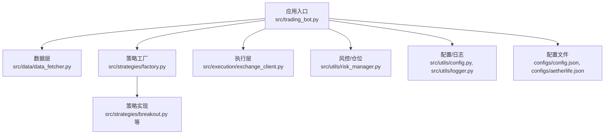
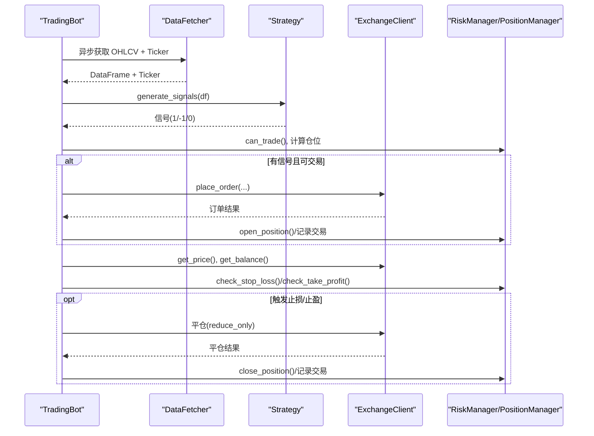
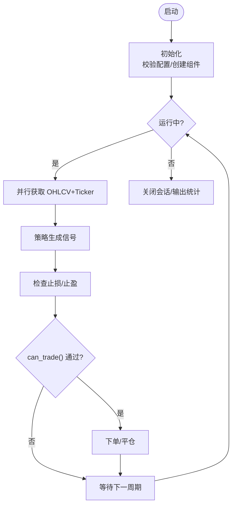
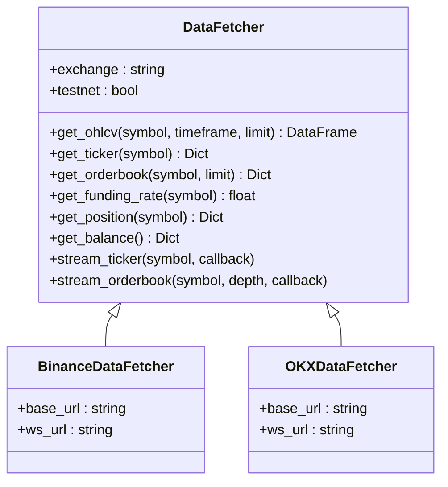
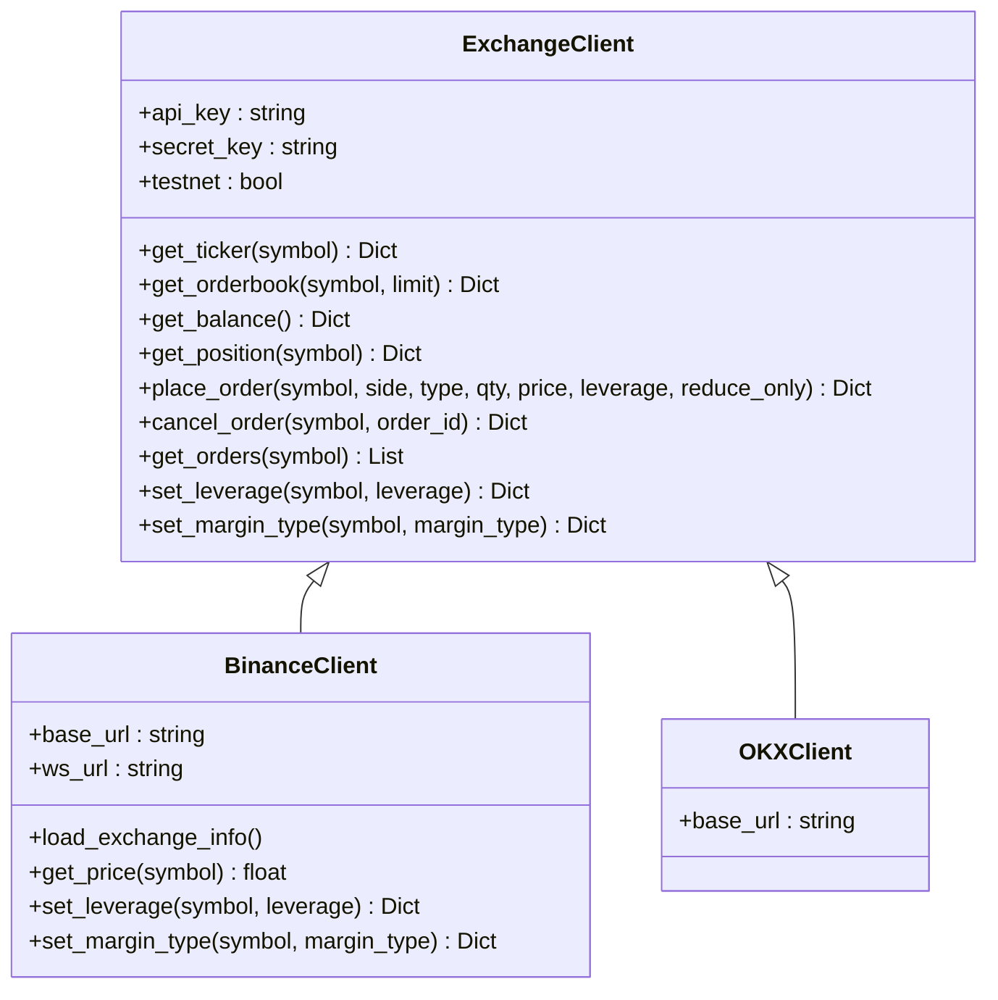
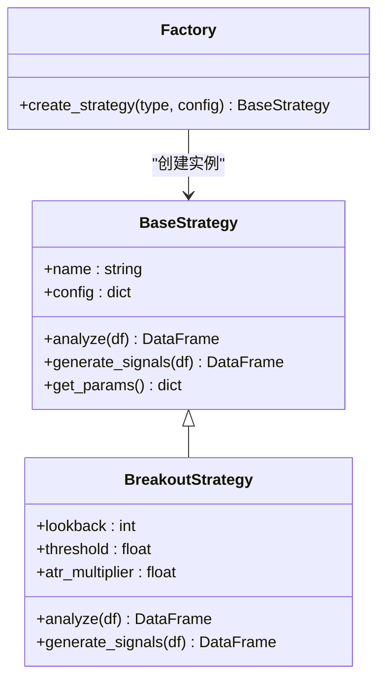
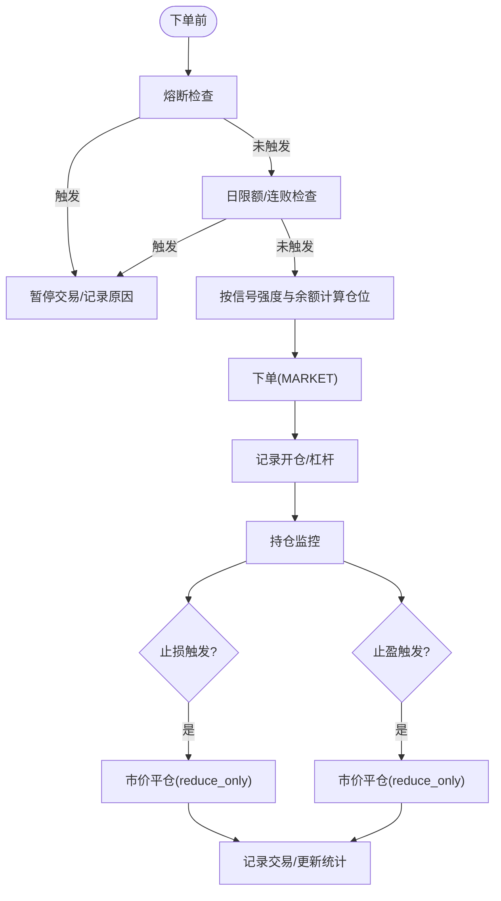
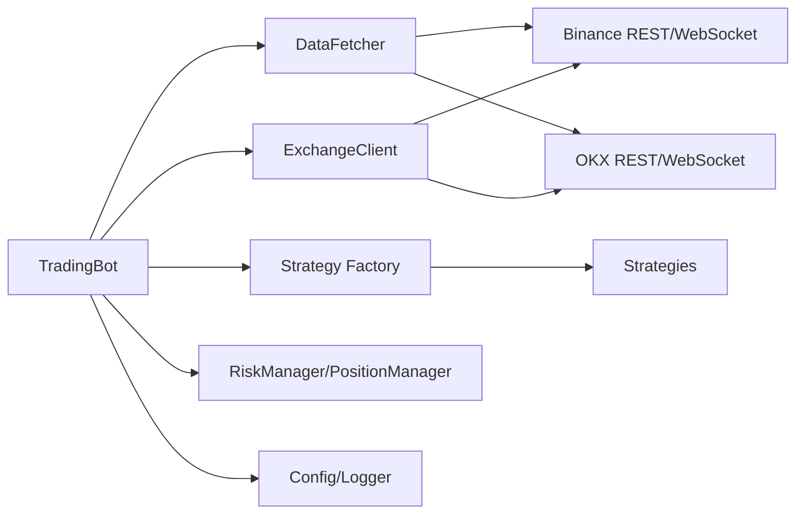

# 自动化交易机器人

<cite>
**本文引用的文件**
- [src/trading_bot.py](file://src/trading_bot.py)
- [configs/config.json](file://configs/config.json)
- [configs/aetherlife.json](file://configs/aetherlife.json)
- [src/execution/exchange_client.py](file://src/execution/exchange_client.py)
- [src/execution/order.py](file://src/execution/order.py)
- [src/execution/retry.py](file://src/execution/retry.py)
- [src/utils/risk_manager.py](file://src/utils/risk_manager.py)
- [src/strategies/base.py](file://src/strategies/base.py)
- [src/strategies/breakout.py](file://src/strategies/breakout.py)
- [src/strategies/factory.py](file://src/strategies/factory.py)
- [src/data/data_fetcher.py](file://src/data/data_fetcher.py)
- [src/utils/config.py](file://src/utils/config.py)
- [src/utils/logger.py](file://src/utils/logger.py)
</cite>

## 目录
1. [简介](#简介)
2. [项目结构](#项目结构)
3. [核心组件](#核心组件)
4. [架构总览](#架构总览)
5. [详细组件分析](#详细组件分析)
6. [依赖关系分析](#依赖关系分析)
7. [性能与并发特性](#性能与并发特性)
8. [配置与使用指南](#配置与使用指南)
9. [故障排查](#故障排查)
10. [结论](#结论)

## 简介
本文件面向“自动化交易机器人”功能，系统性阐述 TradingBot 的核心架构设计、交易循环机制、异步处理能力与 24/7 无人值守交易实现。重点覆盖以下方面：
- 与交易所 API 的交互方式与订单执行流程
- 仓位管理与实时风控（止损/止盈/熔断/日限额）
- 数据获取与策略生成的异步流水线
- 配置管理、错误处理与重试机制
- 典型使用场景与最佳实践

## 项目结构
该仓库采用按职责分层的组织方式：
- 应用入口与主循环：src/trading_bot.py
- 执行层：src/execution/*（交易所客户端、订单与重试）
- 风控与仓位：src/utils/risk_manager.py
- 策略层：src/strategies/*（工厂、基类、具体策略）
- 数据层：src/data/data_fetcher.py（Binance/OKX）
- 工具与配置：src/utils/config.py、src/utils/logger.py
- 配置文件：configs/config.json、configs/aetherlife.json

图表来源
- [src/trading_bot.py](file://src/trading_bot.py#L27-L346)
- [src/data/data_fetcher.py](file://src/data/data_fetcher.py#L17-L434)
- [src/strategies/factory.py](file://src/strategies/factory.py#L10-L36)
- [src/strategies/breakout.py](file://src/strategies/breakout.py#L6-L79)
- [src/execution/exchange_client.py](file://src/execution/exchange_client.py#L20-L432)
- [src/utils/risk_manager.py](file://src/utils/risk_manager.py#L12-L388)
- [src/utils/config.py](file://src/utils/config.py#L15-L49)
- [src/utils/logger.py](file://src/utils/logger.py#L12-L34)
- [configs/config.json](file://configs/config.json#L1-L28)
- [configs/aetherlife.json](file://configs/aetherlife.json#L1-L17)

章节来源
- [src/trading_bot.py](file://src/trading_bot.py#L1-L346)
- [src/data/data_fetcher.py](file://src/data/data_fetcher.py#L1-L434)
- [src/strategies/factory.py](file://src/strategies/factory.py#L1-L36)
- [src/execution/exchange_client.py](file://src/execution/exchange_client.py#L1-L432)
- [src/utils/risk_manager.py](file://src/utils/risk_manager.py#L1-L388)
- [src/utils/config.py](file://src/utils/config.py#L1-L49)
- [src/utils/logger.py](file://src/utils/logger.py#L1-L34)
- [configs/config.json](file://configs/config.json#L1-L28)
- [configs/aetherlife.json](file://configs/aetherlife.json#L1-L17)

## 核心组件
- TradingBot 主控制器：负责初始化、数据拉取、策略分析、信号执行、仓位检查与风控统计
- DataFetcher：异步获取 OHLCV、Ticker、Orderbook，并支持 WebSocket 实时流
- ExchangeClient：抽象交易所客户端，提供下单、撤单、查询、杠杆/保证金模式设置等
- RiskManager/PositionManager：风控与仓位管理，包含止损止盈、熔断、日限额、连败限制与统计
- Strategy 工厂与策略实现：支持多种策略（突破、网格、均线交叉、RSI、成交量等）
- 配置与日志：配置校验、默认配置合并、统一日志输出

章节来源
- [src/trading_bot.py](file://src/trading_bot.py#L27-L346)
- [src/data/data_fetcher.py](file://src/data/data_fetcher.py#L17-L434)
- [src/execution/exchange_client.py](file://src/execution/exchange_client.py#L20-L432)
- [src/utils/risk_manager.py](file://src/utils/risk_manager.py#L12-L388)
- [src/strategies/factory.py](file://src/strategies/factory.py#L10-L36)
- [src/strategies/breakout.py](file://src/strategies/breakout.py#L6-L79)
- [src/utils/config.py](file://src/utils/config.py#L15-L49)
- [src/utils/logger.py](file://src/utils/logger.py#L12-L34)

## 架构总览
TradingBot 采用“异步事件驱动 + 分层职责”的架构：
- 主循环以固定间隔轮询，异步并行获取 OHLCV 与 Ticker
- 策略层在内存中生成信号
- 执行层对接交易所 API 完成下单与仓位管理
- 风控层贯穿下单前与持仓期间，确保风险边界可控

图表来源
- [src/trading_bot.py](file://src/trading_bot.py#L92-L282)
- [src/data/data_fetcher.py](file://src/data/data_fetcher.py#L85-L142)
- [src/strategies/breakout.py](file://src/strategies/breakout.py#L64-L79)
- [src/execution/exchange_client.py](file://src/execution/exchange_client.py#L226-L275)
- [src/utils/risk_manager.py](file://src/utils/risk_manager.py#L175-L241)

## 详细组件分析

### TradingBot 主控制器
- 初始化：校验配置、创建 DataFetcher、ExchangeClient、Strategy、RiskManager/PositionManager
- 交易循环：fetch_market_data 并行获取 OHLCV 与 Ticker；analyze 生成信号；check_positions 检查止损止盈；execute_signal 执行下单/平仓
- 统计与退出：stop 输出当日统计

图表来源
- [src/trading_bot.py](file://src/trading_bot.py#L63-L296)

章节来源
- [src/trading_bot.py](file://src/trading_bot.py#L27-L346)

### 数据层：DataFetcher（Binance/OKX）
- 提供同步与异步接口：get_ohlcv/get_ticker/get_orderbook/funding_rate/position/balance
- WebSocket 订阅：stream_ticker/stream_orderbook，回调处理实时行情/订单簿
- 错误处理：对交易所返回错误进行包装抛出

图表来源
- [src/data/data_fetcher.py](file://src/data/data_fetcher.py#L17-L434)

章节来源
- [src/data/data_fetcher.py](file://src/data/data_fetcher.py#L1-L434)

### 执行层：ExchangeClient（Binance/OKX）
- 抽象基类定义统一接口：get_ticker/get_orderbook/get_balance/get_position/place_order/cancel_order/get_orders/set_leverage/set_margin_type
- BinanceClient 实现：签名、请求封装、错误码处理、动态精度与步进校验、杠杆设置
- OKXClient：部分接口占位，便于扩展

图表来源
- [src/execution/exchange_client.py](file://src/execution/exchange_client.py#L20-L432)

章节来源
- [src/execution/exchange_client.py](file://src/execution/exchange_client.py#L1-L432)

### 策略层：策略工厂与突破策略
- 工厂：根据配置创建具体策略，支持组合策略 MultiStrategy
- 突破策略：计算 SMA、布林带、ATR、MACD、RSI，并依据突破阈值生成信号

图表来源
- [src/strategies/base.py](file://src/strategies/base.py#L6-L31)
- [src/strategies/breakout.py](file://src/strategies/breakout.py#L6-L79)
- [src/strategies/factory.py](file://src/strategies/factory.py#L10-L36)

章节来源
- [src/strategies/base.py](file://src/strategies/base.py#L1-L31)
- [src/strategies/breakout.py](file://src/strategies/breakout.py#L1-L79)
- [src/strategies/factory.py](file://src/strategies/factory.py#L1-L36)

### 风控与仓位管理
- RiskManager：最大仓位比例、止损止盈阈值、日限额、连败限制、熔断冷却、交易历史与统计
- PositionManager：开仓/平仓、浮动盈亏更新、查询与状态维护

图表来源
- [src/utils/risk_manager.py](file://src/utils/risk_manager.py#L175-L241)
- [src/utils/risk_manager.py](file://src/utils/risk_manager.py#L244-L339)

章节来源
- [src/utils/risk_manager.py](file://src/utils/risk_manager.py#L1-L388)

### 订单与重试（扩展点）
- 市价单参考实现：位于 order.py，作为未来扩展的参考
- 撤单重试：位于 retry.py，预留扩展点

章节来源
- [src/execution/order.py](file://src/execution/order.py#L1-L26)
- [src/execution/retry.py](file://src/execution/retry.py#L1-L6)

## 依赖关系分析
- TradingBot 依赖 DataFetcher、Strategy 工厂、ExchangeClient、RiskManager/PositionManager
- DataFetcher 与 ExchangeClient 分别对接 Binance/OKX 的 REST/WebSocket
- RiskManager 与 PositionManager 与 ExchangeClient 的下单/查询结果耦合
- 配置与日志为横切关注点，被各模块复用

图表来源
- [src/trading_bot.py](file://src/trading_bot.py#L14-L24)
- [src/data/data_fetcher.py](file://src/data/data_fetcher.py#L73-L397)
- [src/execution/exchange_client.py](file://src/execution/exchange_client.py#L87-L410)
- [src/utils/risk_manager.py](file://src/utils/risk_manager.py#L12-L388)
- [src/utils/config.py](file://src/utils/config.py#L15-L49)
- [src/utils/logger.py](file://src/utils/logger.py#L12-L34)

章节来源
- [src/trading_bot.py](file://src/trading_bot.py#L1-L346)
- [src/data/data_fetcher.py](file://src/data/data_fetcher.py#L1-L434)
- [src/execution/exchange_client.py](file://src/execution/exchange_client.py#L1-L432)
- [src/utils/risk_manager.py](file://src/utils/risk_manager.py#L1-L388)
- [src/utils/config.py](file://src/utils/config.py#L1-L49)
- [src/utils/logger.py](file://src/utils/logger.py#L1-L34)

## 性能与并发特性
- 异步 I/O：DataFetcher 与 ExchangeClient 使用 aiohttp，主循环内并行获取 OHLCV 与 Ticker，降低等待时间
- 低延迟：WebSocket 订阅实时行情/订单簿，减少轮询成本
- 并发下单：下单前严格风控校验，避免无效请求
- 资源管理：统一的会话与连接生命周期管理，退出时关闭会话

章节来源
- [src/trading_bot.py](file://src/trading_bot.py#L92-L113)
- [src/data/data_fetcher.py](file://src/data/data_fetcher.py#L188-L234)
- [src/execution/exchange_client.py](file://src/execution/exchange_client.py#L32-L40)

## 配置与使用指南

### 配置文件说明
- 交易对与时间周期：symbols、timeframe
- 交易所与测试网：exchange、testnet
- 杠杆与循环间隔：leverage、loop_interval
- 策略与参数：strategy、strategy_config（如突破策略的 lookback_period、threshold、atr_multiplier）
- 风控参数：risk（max_position_pct、stop_loss_pct、take_profit_pct、max_daily_loss 等）
- AI 增强开关：ai_enhance（用于更高层的 AetherLife 能力）

章节来源
- [configs/config.json](file://configs/config.json#L1-L28)
- [configs/aetherlife.json](file://configs/aetherlife.json#L1-L17)
- [src/trading_bot.py](file://src/trading_bot.py#L300-L320)

### 默认配置与合并
- DEFAULT_CONFIG 提供基础默认值
- 运行时从 config.json 合并覆盖，保证灵活性

章节来源
- [src/trading_bot.py](file://src/trading_bot.py#L300-L342)
- [src/utils/config.py](file://src/utils/config.py#L40-L49)

### 如何启动与停止
- 启动：调用主函数，自动加载 .env（如存在）、读取配置并运行 TradingBot
- 停止：捕获中断信号，调用 stop 输出统计并关闭会话

章节来源
- [src/trading_bot.py](file://src/trading_bot.py#L323-L346)

### 常见使用场景与最佳实践
- 单币种高频交易：缩短 loop_interval，选择短周期（如 1m），合理设置止损止盈
- 多币种套利：symbols 列表配置多个交易对，注意风控参数与杠杆匹配
- 回测与实盘分离：通过 testnet 切换测试网，先在回测环境验证策略
- 风险优先：严格设置 max_position_pct、stop_loss_pct、take_profit_pct，启用熔断与日限额
- 监控与日志：结合日志输出与 UI（如 dashboard）进行可视化监控

章节来源
- [src/trading_bot.py](file://src/trading_bot.py#L256-L296)
- [src/utils/logger.py](file://src/utils/logger.py#L12-L34)

## 故障排查
- 配置校验失败：validate_config 返回错误列表，检查 exchange/symbols/strategy/risk 参数范围
- 交易所错误：ExchangeClient/DataFetcher 对返回错误进行包装，查看异常日志定位
- 会话与连接：确保会话正确创建与关闭，避免资源泄漏
- 信号异常：若 analyze 返回空或长度不足，检查数据拉取与策略参数

章节来源
- [src/utils/config.py](file://src/utils/config.py#L15-L37)
- [src/execution/exchange_client.py](file://src/execution/exchange_client.py#L165-L170)
- [src/data/data_fetcher.py](file://src/data/data_fetcher.py#L98-L100)
- [src/trading_bot.py](file://src/trading_bot.py#L104-L113)

## 结论
本系统以 TradingBot 为核心，通过异步数据获取、策略生成与风控执行的闭环，实现了合约交易的自动化与 24/7 无人值守运行。其模块化设计便于扩展与维护，配合完善的配置与日志体系，适合在测试网与实盘环境中逐步落地。