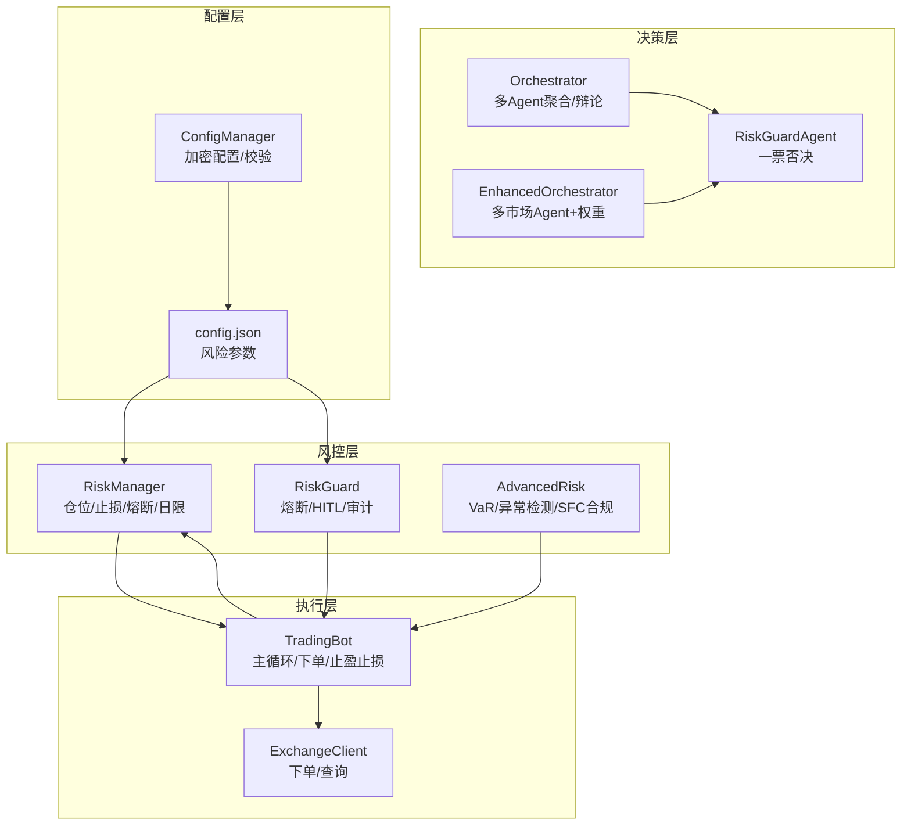
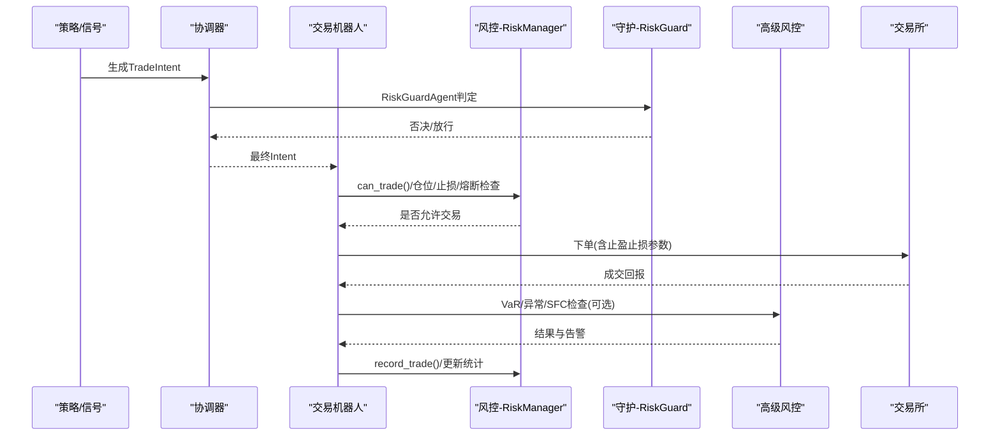
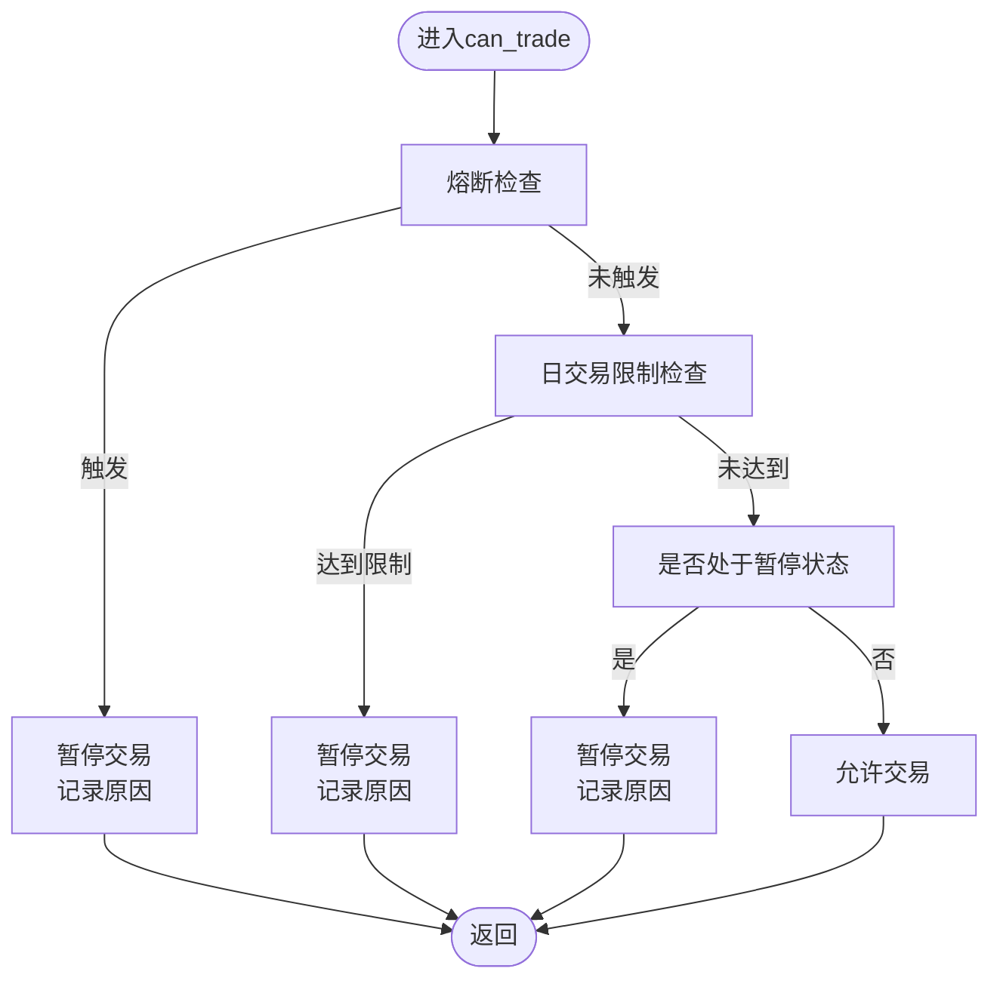
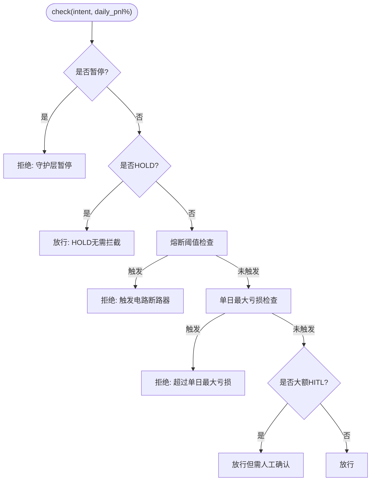
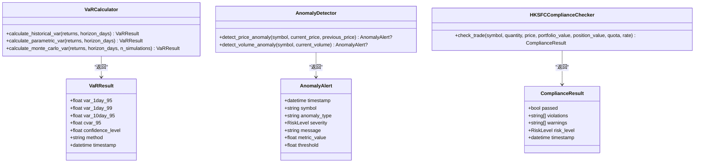
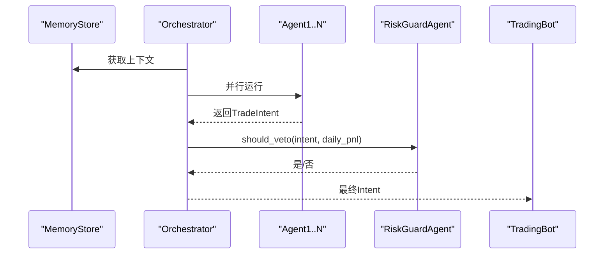
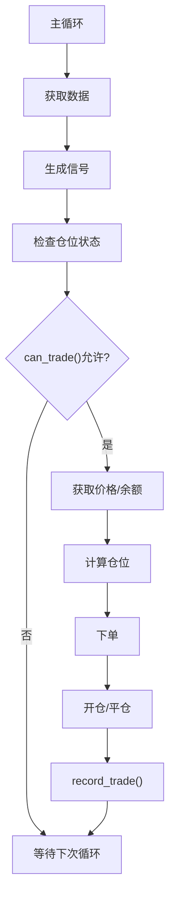
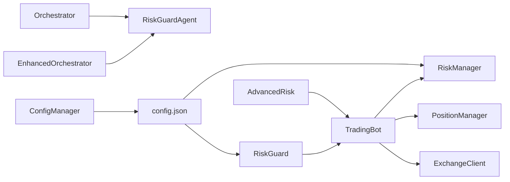

# 风险管理与风控系统

<cite>
**本文档引用的文件**
- [src/aetherlife/guard/risk_guard.py](file://src/aetherlife/guard/risk_guard.py)
- [src/aetherlife/guard/advanced_risk.py](file://src/aetherlife/guard/advanced_risk.py)
- [src/utils/risk_manager.py](file://src/utils/risk_manager.py)
- [src/aetherlife/cognition/orchestrator.py](file://src/aetherlife/cognition/orchestrator.py)
- [src/aetherlife/cognition/orchestrator_enhanced.py](file://src/aetherlife/cognition/orchestrator_enhanced.py)
- [src/aetherlife/cognition/agents.py](file://src/aetherlife/cognition/agents.py)
- [src/aetherlife/cognition/schemas.py](file://src/aetherlife/cognition/schemas.py)
- [src/trading_bot.py](file://src/trading_bot.py)
- [configs/config.json](file://configs/config.json)
- [src/utils/config_manager.py](file://src/utils/config_manager.py)
</cite>

## 目录
1. [引言](#引言)
2. [项目结构](#项目结构)
3. [核心组件](#核心组件)
4. [架构总览](#架构总览)
5. [详细组件分析](#详细组件分析)
6. [依赖关系分析](#依赖关系分析)
7. [性能考量](#性能考量)
8. [故障排查指南](#故障排查指南)
9. [结论](#结论)
10. [附录](#附录)

## 引言
本文件面向风险管理与风控系统，系统性梳理多重风控机制的设计理念与实现方案，覆盖仓位控制、止损止盈、熔断机制、日交易限制等核心功能；深入解释风险指标计算方法、实时监控算法、异常检测机制与应急处理流程；并给出风险参数配置、阈值设置、风险评估模型与合规性要求的说明与最佳实践，帮助用户建立完善的风险管理体系。

## 项目结构
系统采用“策略-执行-风控”三层架构，结合多智能体决策与守护层一票否决机制，形成闭环风控体系。关键模块包括：
- 风控管理层：基础风控（RiskManager）、守护层（RiskGuard）、高级风控（VaR/异常检测/SFC合规）
- 决策层：多 Agent 协调器（Orchestrator/EnhancedOrchestrator）与风控 Agent
- 执行层：交易机器人（TradingBot）与订单执行
- 配置层：配置管理与参数注入

**图表来源**
- [src/aetherlife/cognition/orchestrator.py](file://src/aetherlife/cognition/orchestrator.py#L16-L53)
- [src/aetherlife/cognition/orchestrator_enhanced.py](file://src/aetherlife/cognition/orchestrator_enhanced.py#L21-L151)
- [src/aetherlife/cognition/agents.py](file://src/aetherlife/cognition/agents.py#L50-L68)
- [src/utils/risk_manager.py](file://src/utils/risk_manager.py#L12-L241)
- [src/aetherlife/guard/risk_guard.py](file://src/aetherlife/guard/risk_guard.py#L23-L84)
- [src/aetherlife/guard/advanced_risk.py](file://src/aetherlife/guard/advanced_risk.py#L63-L225)
- [src/trading_bot.py](file://src/trading_bot.py#L27-L296)
- [src/utils/config_manager.py](file://src/utils/config_manager.py#L14-L144)
- [configs/config.json](file://configs/config.json#L15-L20)

**章节来源**
- [src/aetherlife/cognition/orchestrator.py](file://src/aetherlife/cognition/orchestrator.py#L16-L93)
- [src/aetherlife/cognition/orchestrator_enhanced.py](file://src/aetherlife/cognition/orchestrator_enhanced.py#L21-L323)
- [src/aetherlife/cognition/agents.py](file://src/aetherlife/cognition/agents.py#L13-L109)
- [src/utils/risk_manager.py](file://src/utils/risk_manager.py#L12-L388)
- [src/aetherlife/guard/risk_guard.py](file://src/aetherlife/guard/risk_guard.py#L23-L84)
- [src/aetherlife/guard/advanced_risk.py](file://src/aetherlife/guard/advanced_risk.py#L63-L564)
- [src/trading_bot.py](file://src/trading_bot.py#L27-L346)
- [src/utils/config_manager.py](file://src/utils/config_manager.py#L14-L212)
- [configs/config.json](file://configs/config.json#L1-L28)

## 核心组件
- 风控管理层
  - RiskManager：负责仓位规模计算、止损止盈检查、熔断与日交易限制、交易统计与状态管理
  - PositionManager：维护持仓、浮动盈亏、止盈止损设置与平仓
  - RiskGuard：执行前最后一道关卡，熔断阈值、单日最大亏损、大额人工确认（HITL）、审计日志
  - AdvancedRisk：VaR计算（历史模拟/参数法/蒙特卡洛）、异常检测（价格/成交量/波动率）、SFC合规检查
- 决策层
  - Orchestrator/EnhancedOrchestrator：多 Agent 并行聚合或辩论（Bull/Bear/Judge），最终由 RiskGuardAgent 一票否决
  - RiskGuardAgent：仅做否决判断，不发起交易
- 执行层
  - TradingBot：主循环拉取数据、生成信号、风控检查、下单、止盈止损、统计
- 配置层
  - ConfigManager：配置文件加密存储/读取、敏感信息分离、默认配置与校验
  - config.json：风险参数注入（最大仓位、止损止盈、单日最大亏损）

**章节来源**
- [src/utils/risk_manager.py](file://src/utils/risk_manager.py#L12-L241)
- [src/aetherlife/guard/risk_guard.py](file://src/aetherlife/guard/risk_guard.py#L23-L84)
- [src/aetherlife/guard/advanced_risk.py](file://src/aetherlife/guard/advanced_risk.py#L63-L225)
- [src/aetherlife/cognition/orchestrator.py](file://src/aetherlife/cognition/orchestrator.py#L16-L53)
- [src/aetherlife/cognition/orchestrator_enhanced.py](file://src/aetherlife/cognition/orchestrator_enhanced.py#L21-L151)
- [src/aetherlife/cognition/agents.py](file://src/aetherlife/cognition/agents.py#L50-L68)
- [src/trading_bot.py](file://src/trading_bot.py#L27-L296)
- [src/utils/config_manager.py](file://src/utils/config_manager.py#L14-L144)
- [configs/config.json](file://configs/config.json#L15-L20)

## 架构总览
系统在“策略-执行-风控”之间建立强约束闭环：
- 决策层：多 Agent 并行产生 TradeIntent，经聚合/辩论后交由 RiskGuardAgent 判定
- 风控层：RiskManager 在下单前进行仓位/止损/熔断/日限检查；RiskGuard 在执行前进行熔断/HITL/审计
- 执行层：TradingBot 将风控结果与实时行情结合，执行下单与止盈止损
- 监控层：AdvancedRisk 实时计算 VaR、检测异常、进行 SFC 合规检查

**图表来源**
- [src/aetherlife/cognition/orchestrator.py](file://src/aetherlife/cognition/orchestrator.py#L38-L53)
- [src/aetherlife/cognition/agents.py](file://src/aetherlife/cognition/agents.py#L50-L68)
- [src/utils/risk_manager.py](file://src/utils/risk_manager.py#L175-L194)
- [src/aetherlife/guard/risk_guard.py](file://src/aetherlife/guard/risk_guard.py#L48-L68)
- [src/aetherlife/guard/advanced_risk.py](file://src/aetherlife/guard/advanced_risk.py#L63-L225)
- [src/trading_bot.py](file://src/trading_bot.py#L115-L204)

## 详细组件分析

### 组件A：风控管理层（RiskManager + PositionManager）
- 设计要点
  - 以配置驱动的参数化风控：最大仓位、杠杆、止损止盈、单日交易数、连败限制、熔断阈值与冷却
  - 交易统计与状态：日累计盈亏、胜/负次数、连败计数、暂停状态与原因
  - 仓位计算：基于账户余额、信号强度与价格，确保在最小/最大仓位范围内
  - 止损止盈：支持多头/空头方向，返回是否触发与原因
  - 熔断：基于日收益百分比与冷却时间，触发后暂停交易并记录原因
  - 日交易限制：交易次数与连续亏损阈值
- 复杂度与性能
  - 仓位计算与检查均为 O(1)，日统计每日重置，整体开销极低
  - deque 交易历史限制长度，避免内存膨胀
- 错误处理
  - 价格/余额非正值时返回安全边界值，避免异常下单
  - 熔断冷却期内拒绝熔断检查，避免频繁切换

**图表来源**
- [src/utils/risk_manager.py](file://src/utils/risk_manager.py#L175-L194)
- [src/utils/risk_manager.py](file://src/utils/risk_manager.py#L129-L153)
- [src/utils/risk_manager.py](file://src/utils/risk_manager.py#L155-L173)

**章节来源**
- [src/utils/risk_manager.py](file://src/utils/risk_manager.py#L12-L241)
- [src/utils/risk_manager.py](file://src/utils/risk_manager.py#L244-L339)

### 组件B：守护层（RiskGuard）
- 设计要点
  - 执行前最后一道关卡：暂停状态、HOLD 放行、熔断阈值、单日最大亏损、大额人工确认（HITL）
  - 审计日志：统一格式记录事件与负载，支持文件落盘与回调
- 复杂度与性能
  - 仅数值比较，O(1) 复杂度
- 错误处理
  - 暂停状态下直接否决，避免误操作
  - HITL 触发时返回需要人工确认标记，便于接入人工审批流程

**图表来源**
- [src/aetherlife/guard/risk_guard.py](file://src/aetherlife/guard/risk_guard.py#L48-L68)

**章节来源**
- [src/aetherlife/guard/risk_guard.py](file://src/aetherlife/guard/risk_guard.py#L23-L84)

### 组件C：高级风控（VaR/异常检测/SFC合规）
- VaR 计算
  - 历史模拟法、参数法（正态分布）、蒙特卡洛模拟，支持1日/10日置信水平与条件风险（CVaR）
- 异常检测
  - 价格波动（Z-score）、成交量（Z-score）、波动率异常、相关性异常，支持可配置阈值与回溯期
- SFC 合规
  - 单笔订单限额、日内交易次数、持仓集中度、A股交易时段、北向额度检查，输出违规/警告与风险等级

**图表来源**
- [src/aetherlife/guard/advanced_risk.py](file://src/aetherlife/guard/advanced_risk.py#L63-L225)
- [src/aetherlife/guard/advanced_risk.py](file://src/aetherlife/guard/advanced_risk.py#L228-L356)
- [src/aetherlife/guard/advanced_risk.py](file://src/aetherlife/guard/advanced_risk.py#L359-L506)

**章节来源**
- [src/aetherlife/guard/advanced_risk.py](file://src/aetherlife/guard/advanced_risk.py#L63-L564)

### 组件D：决策层（Orchestrator/EnhancedOrchestrator + RiskGuardAgent）
- 设计要点
  - 多 Agent 并行：市场微观结构、订单流、统计套利、新闻情绪等
  - 可选辩论：Bull/Bear 并行输出，Judge 裁决
  - RiskGuardAgent 一票否决：当日收益、置信度等阈值触发否决
- 复杂度与性能
  - 并行执行 Agent，使用 gather 并发，降低延迟
  - 聚合采用加权评分，复杂度 O(n)

**图表来源**
- [src/aetherlife/cognition/orchestrator.py](file://src/aetherlife/cognition/orchestrator.py#L38-L53)
- [src/aetherlife/cognition/orchestrator_enhanced.py](file://src/aetherlife/cognition/orchestrator_enhanced.py#L84-L151)
- [src/aetherlife/cognition/agents.py](file://src/aetherlife/cognition/agents.py#L50-L68)

**章节来源**
- [src/aetherlife/cognition/orchestrator.py](file://src/aetherlife/cognition/orchestrator.py#L16-L93)
- [src/aetherlife/cognition/orchestrator_enhanced.py](file://src/aetherlife/cognition/orchestrator_enhanced.py#L21-L323)
- [src/aetherlife/cognition/agents.py](file://src/aetherlife/cognition/agents.py#L50-L68)

### 组件E：执行层（TradingBot）
- 设计要点
  - 主循环：拉取数据、生成信号、检查仓位、执行下单、止盈止损、记录交易
  - 止损止盈：基于 RiskManager 检查，触发后平仓并记录
  - 统计：累计交易次数、胜负、日收益与收益百分比
- 复杂度与性能
  - 主循环为 O(1) 操作，下单与查询为异步并发
- 错误处理
  - 异常捕获与重试间隔，避免中断

**图表来源**
- [src/trading_bot.py](file://src/trading_bot.py#L92-L204)
- [src/trading_bot.py](file://src/trading_bot.py#L206-L254)

**章节来源**
- [src/trading_bot.py](file://src/trading_bot.py#L27-L346)

### 组件F：配置层（ConfigManager + config.json）
- 设计要点
  - 配置文件与敏感信息分离存储，使用对称加密
  - 默认配置模板与参数校验，支持导出/删除/测试连接
  - 风险参数注入：最大仓位、止损止盈、单日最大亏损等
- 复杂度与性能
  - 加密/解密为一次性开销，运行时读取为 O(1)

**章节来源**
- [src/utils/config_manager.py](file://src/utils/config_manager.py#L14-L212)
- [configs/config.json](file://configs/config.json#L15-L20)

## 依赖关系分析
- 组件耦合
  - TradingBot 依赖 RiskManager/PositionManager，RiskGuard 作为独立守护层
  - Orchestrator/EnhancedOrchestrator 依赖 RiskGuardAgent，RiskGuardAgent 仅做否决
  - AdvancedRisk 作为独立监控模块，可选集成
- 外部依赖
  - ExchangeClient 提供下单/查询能力
  - 配置文件提供风险参数与策略参数

**图表来源**
- [src/trading_bot.py](file://src/trading_bot.py#L27-L52)
- [src/aetherlife/cognition/orchestrator.py](file://src/aetherlife/cognition/orchestrator.py#L19-L36)
- [src/aetherlife/cognition/orchestrator_enhanced.py](file://src/aetherlife/cognition/orchestrator_enhanced.py#L32-L70)
- [src/aetherlife/guard/risk_guard.py](file://src/aetherlife/guard/risk_guard.py#L26-L42)
- [src/aetherlife/guard/advanced_risk.py](file://src/aetherlife/guard/advanced_risk.py#L63-L63)
- [src/utils/config_manager.py](file://src/utils/config_manager.py#L17-L30)
- [configs/config.json](file://configs/config.json#L15-L20)

**章节来源**
- [src/trading_bot.py](file://src/trading_bot.py#L27-L52)
- [src/aetherlife/cognition/orchestrator.py](file://src/aetherlife/cognition/orchestrator.py#L19-L36)
- [src/aetherlife/cognition/orchestrator_enhanced.py](file://src/aetherlife/cognition/orchestrator_enhanced.py#L32-L70)
- [src/aetherlife/guard/risk_guard.py](file://src/aetherlife/guard/risk_guard.py#L26-L42)
- [src/aetherlife/guard/advanced_risk.py](file://src/aetherlife/guard/advanced_risk.py#L63-L63)
- [src/utils/config_manager.py](file://src/utils/config_manager.py#L17-L30)
- [configs/config.json](file://configs/config.json#L15-L20)

## 性能考量
- 并行优化
  - Orchestrator/EnhancedOrchestrator 使用 asyncio.gather 并行执行多个 Agent，减少决策延迟
  - TradingBot 主循环异步获取数据与下单，避免阻塞
- 内存与计算
  - RiskManager 使用 deque 控制交易历史长度，避免内存无限增长
  - VaR/异常检测使用滑动窗口与阈值，计算成本可控
- I/O 与网络
  - 配置文件加密读写为一次性开销；运行时仅读取必要参数

## 故障排查指南
- 熔断与暂停
  - 现象：can_trade 返回 should_stop=True
  - 排查：检查日收益百分比、熔断阈值、冷却时间、暂停原因
  - 处理：等待冷却结束或手动 resume
- 大额 HITL
  - 现象：放行但 hitl_required=True
  - 排查：检查 position_value_usd 与阈值
  - 处理：接入人工审批流程
- 异常检测告警
  - 现象：出现价格/成交量/波动率异常告警
  - 排查：查看严重级别与阈值，核对历史窗口
  - 处理：降低仓位、暂停交易或调整阈值
- SFC 合规告警/违规
  - 现象：订单被拒或警告
  - 排查：单笔订单限额、日内次数、持仓集中度、A股交易时段、北向额度
  - 处理：调整下单规模与频率，遵守额度与时段限制

**章节来源**
- [src/utils/risk_manager.py](file://src/utils/risk_manager.py#L129-L153)
- [src/aetherlife/guard/risk_guard.py](file://src/aetherlife/guard/risk_guard.py#L48-L68)
- [src/aetherlife/guard/advanced_risk.py](file://src/aetherlife/guard/advanced_risk.py#L228-L356)
- [src/aetherlife/guard/advanced_risk.py](file://src/aetherlife/guard/advanced_risk.py#L359-L506)

## 结论
本系统通过“多 Agent 决策 + 风控一票否决 + 多层次风控”的设计，实现了对仓位、止损止盈、熔断与日交易限制的全面控制，并辅以 VaR、异常检测与 SFC 合规检查，形成闭环风险管理体系。建议在生产环境中：
- 严格校准风险参数，结合历史回测与压力测试
- 对熔断与 HITL 建立自动化与人工审批联动机制
- 持续监控异常检测与合规检查结果，动态调整阈值
- 通过配置管理实现参数版本化与审计追踪

## 附录

### 风险参数配置与最佳实践
- 风险参数（来自配置文件）
  - 最大仓位比例：决定单笔最大暴露
  - 止损/止盈比例：控制单笔最大回撤与目标收益
  - 单日最大亏损：触发熔断的阈值
  - 单日最大交易次数与连续亏损：防止过度交易
- 配置示例路径
  - [configs/config.json](file://configs/config.json#L15-L20)
  - [src/utils/config_manager.py](file://src/utils/config_manager.py#L117-L144)
- 最佳实践
  - 将止损设置为合理回撤容忍度，止盈为目标收益的 2–3 倍止损
  - 熔断阈值建议为年化波动的 2–3 倍，冷却时间与交易频率匹配
  - 日交易次数与连败限制应与策略胜率与波动率相匹配
  - 对大额订单启用 HITL，建立审批流程与审计日志

**章节来源**
- [configs/config.json](file://configs/config.json#L15-L20)
- [src/utils/config_manager.py](file://src/utils/config_manager.py#L117-L144)
- [src/utils/risk_manager.py](file://src/utils/risk_manager.py#L15-L33)