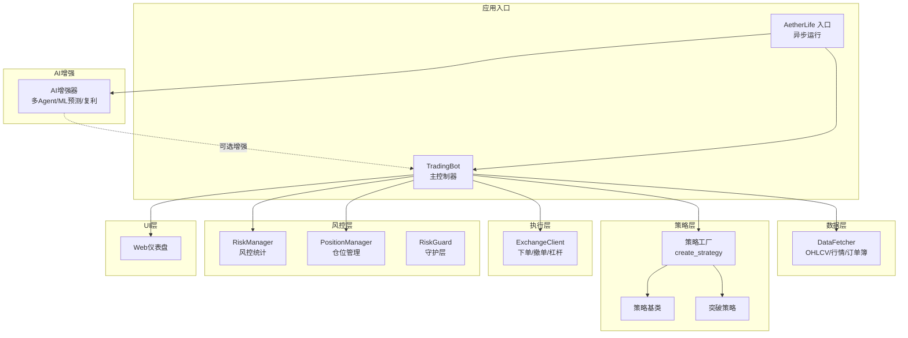
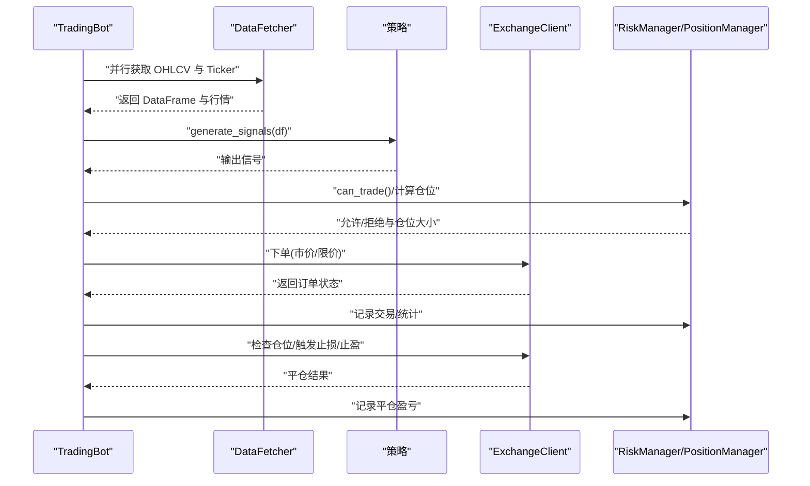
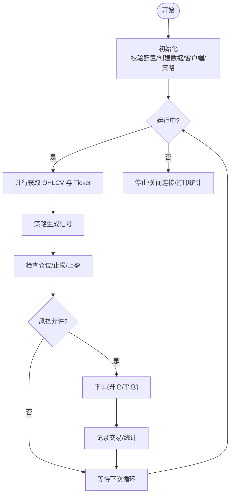
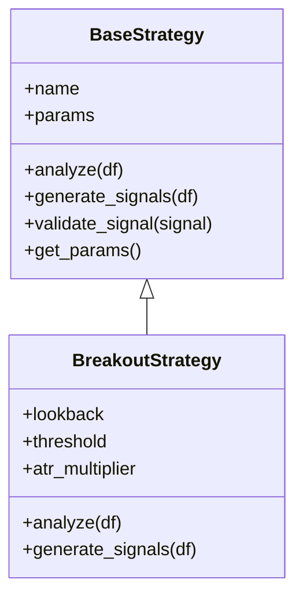
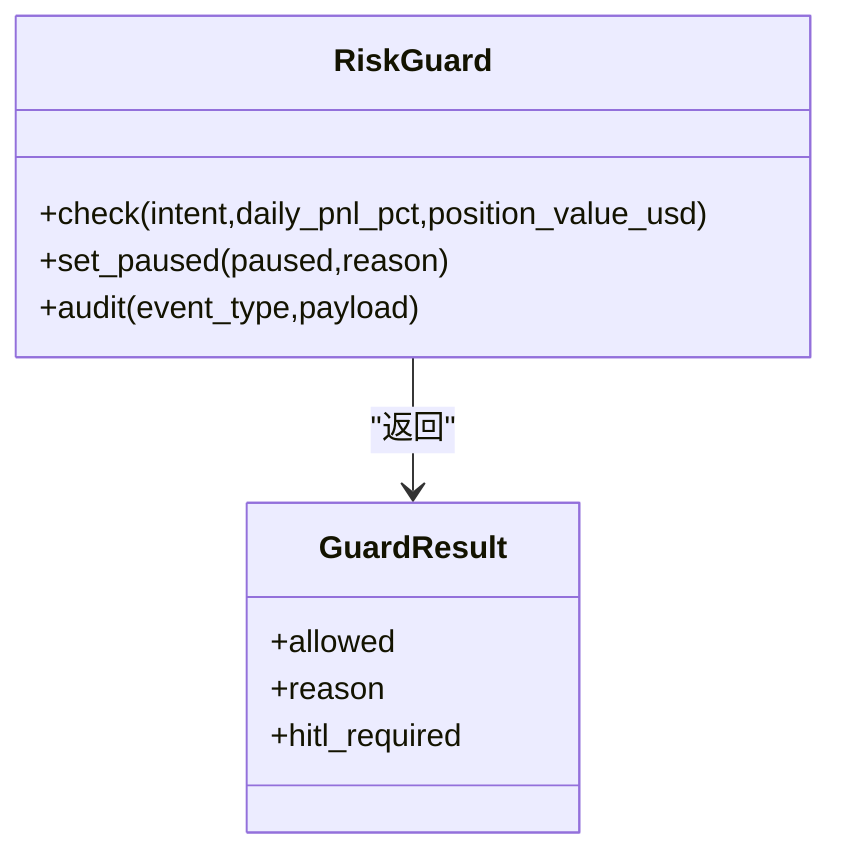
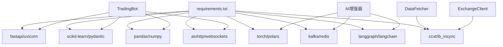

# 系统简介

<cite>
**本文引用的文件**   
- [src/trading_bot.py](file://src/trading_bot.py)
- [src/aetherlife/run.py](file://src/aetherlife/run.py)
- [src/aetherlife/__init__.py](file://src/aetherlife/__init__.py)
- [src/aetherlife/cognition/orchestrator.py](file://src/aetherlife/cognition/orchestrator.py)
- [src/aetherlife/guard/risk_guard.py](file://src/aetherlife/guard/risk_guard.py)
- [src/strategies/factory.py](file://src/strategies/factory.py)
- [src/strategies/base.py](file://src/strategies/base.py)
- [src/strategies/breakout.py](file://src/strategies/breakout.py)
- [src/utils/ai_enhancer.py](file://src/utils/ai_enhancer.py)
- [src/data/data_fetcher.py](file://src/data/data_fetcher.py)
- [src/execution/exchange_client.py](file://src/execution/exchange_client.py)
- [src/ui/dashboard.py](file://src/ui/dashboard.py)
- [configs/config.json](file://configs/config.json)
- [requirements.txt](file://requirements.txt)
</cite>

## 目录
1. [引言](#引言)
2. [项目结构](#项目结构)
3. [核心组件](#核心组件)
4. [架构总览](#架构总览)
5. [详细组件分析](#详细组件分析)
6. [依赖关系分析](#依赖关系分析)
7. [性能考虑](#性能考虑)
8. [故障排查指南](#故障排查指南)
9. [结论](#结论)
10. [附录](#附录)

## 引言
本量化交易机器人系统旨在实现“24/7无人值守”的自动化合约交易，覆盖多策略体系、AI增强决策、风险控制与执行一体化。系统既适合初学者快速上手，也为有经验的开发者提供了可扩展的多Agent认知架构与强化学习、机器学习增强能力。通过统一的数据层、策略工厂、执行层与风控层，系统能够稳定地在币安等主流合约交易所进行实盘或模拟交易。

系统的主要业务价值包括：
- 降低人工值守成本，实现全天候交易
- 通过多策略组合与AI增强提升决策质量
- 以风控为核心保障资产安全，防止重大回撤
- 提供可视化监控面板，便于运营与策略优化

## 项目结构
项目采用模块化分层组织，核心分为数据层、策略层、执行层、风控层、UI层与AetherLife认知增强层。下图展示主要模块及其职责：

图表来源
- [src/trading_bot.py](file://src/trading_bot.py#L27-L346)
- [src/aetherlife/run.py](file://src/aetherlife/run.py#L52-L71)
- [src/data/data_fetcher.py](file://src/data/data_fetcher.py#L17-L434)
- [src/strategies/factory.py](file://src/strategies/factory.py#L10-L36)
- [src/strategies/base.py](file://src/strategies/base.py#L6-L31)
- [src/strategies/breakout.py](file://src/strategies/breakout.py#L6-L79)
- [src/execution/exchange_client.py](file://src/execution/exchange_client.py#L20-L432)
- [src/utils/ai_enhancer.py](file://src/utils/ai_enhancer.py#L15-L360)
- [src/ui/dashboard.py](file://src/ui/dashboard.py#L13-L385)

章节来源
- [src/trading_bot.py](file://src/trading_bot.py#L1-L346)
- [src/aetherlife/run.py](file://src/aetherlife/run.py#L1-L71)
- [src/aetherlife/__init__.py](file://src/aetherlife/__init__.py#L1-L13)
- [src/data/data_fetcher.py](file://src/data/data_fetcher.py#L1-L434)
- [src/strategies/factory.py](file://src/strategies/factory.py#L1-L36)
- [src/strategies/base.py](file://src/strategies/base.py#L1-L31)
- [src/strategies/breakout.py](file://src/strategies/breakout.py#L1-L79)
- [src/execution/exchange_client.py](file://src/execution/exchange_client.py#L1-L432)
- [src/utils/ai_enhancer.py](file://src/utils/ai_enhancer.py#L1-L360)
- [src/ui/dashboard.py](file://src/ui/dashboard.py#L1-L385)

## 核心组件
- 主控制器 TradingBot：负责初始化、数据拉取、策略分析、信号执行、仓位检查与风控统计，形成完整的交易闭环。
- 数据获取 DataFetcher：统一抽象不同交易所的K线、行情、订单簿与资金费率等数据接口，支持并发拉取。
- 策略工厂与策略：提供多种经典策略（突破、网格、MACD、RSI、成交量等），并支持多策略组合。
- 执行客户端 ExchangeClient：封装Binance等交易所的下单、撤单、杠杆设置等操作，处理精度与签名。
- 风控与仓位管理：内置风控统计、止损止盈、连续亏损限制与每日交易上限；仓位管理记录开仓与平仓盈亏。
- AI增强器：提供多Agent协调、机器学习预测、情绪分析与自动复利管理等增强能力。
- Web仪表盘：提供实时监控、手动交易、策略状态与历史活动查看。

章节来源
- [src/trading_bot.py](file://src/trading_bot.py#L27-L346)
- [src/data/data_fetcher.py](file://src/data/data_fetcher.py#L17-L434)
- [src/strategies/factory.py](file://src/strategies/factory.py#L10-L36)
- [src/strategies/base.py](file://src/strategies/base.py#L6-L31)
- [src/strategies/breakout.py](file://src/strategies/breakout.py#L6-L79)
- [src/execution/exchange_client.py](file://src/execution/exchange_client.py#L20-L432)
- [src/utils/ai_enhancer.py](file://src/utils/ai_enhancer.py#L15-L360)
- [src/ui/dashboard.py](file://src/ui/dashboard.py#L13-L385)

## 架构总览
系统采用“事件驱动 + 异步IO”的架构，主循环按固定间隔拉取数据、生成信号、执行交易与检查仓位，同时支持WebSocket订阅实时行情与订单簿。AetherLife模块提供多Agent认知与守护层，作为可插拔增强模块集成到主流程中。

图表来源
- [src/trading_bot.py](file://src/trading_bot.py#L92-L282)
- [src/data/data_fetcher.py](file://src/data/data_fetcher.py#L40-L71)
- [src/strategies/breakout.py](file://src/strategies/breakout.py#L64-L79)
- [src/execution/exchange_client.py](file://src/execution/exchange_client.py#L226-L275)
- [src/utils/ai_enhancer.py](file://src/utils/ai_enhancer.py#L270-L318)

## 详细组件分析

### 主控制器 TradingBot
- 职责：初始化配置与连接、并发拉取市场数据、调用策略生成信号、风控与仓位检查、执行下单与平仓、记录统计。
- 关键流程：fetch_market_data 并行获取 OHLCV 与 Ticker；analyze 生成信号；execute_signal 根据信号与风控下单；check_positions 触发止损/止盈。
- 风控：can_trade 限制单日交易次数、连续亏损、最大仓位占比；止损止盈基于入场价与方向判断；平仓后记录盈亏并更新统计。

图表来源
- [src/trading_bot.py](file://src/trading_bot.py#L63-L296)

章节来源
- [src/trading_bot.py](file://src/trading_bot.py#L27-L346)

### 数据获取 DataFetcher
- 支持 Binance 与 OKX 的 K线、24小时行情、订单簿与资金费率等数据；提供 WebSocket 实时行情与订单簿订阅。
- 设计要点：统一接口、错误处理、超时控制、会话复用；测试网与正式网地址分离。

章节来源
- [src/data/data_fetcher.py](file://src/data/data_fetcher.py#L17-L434)

### 策略工厂与策略
- 策略工厂：根据配置动态创建策略实例，支持多策略组合（MultiStrategy）。
- 突破策略：结合移动平均、布林带、ATR、MACD、RSI等指标生成信号，避免超买超卖误导。

图表来源
- [src/strategies/base.py](file://src/strategies/base.py#L6-L31)
- [src/strategies/breakout.py](file://src/strategies/breakout.py#L6-L79)

章节来源
- [src/strategies/factory.py](file://src/strategies/factory.py#L10-L36)
- [src/strategies/base.py](file://src/strategies/base.py#L6-L31)
- [src/strategies/breakout.py](file://src/strategies/breakout.py#L6-L79)

### 执行客户端 ExchangeClient
- 封装下单、撤单、杠杆设置、持仓查询等接口；Binance 客户端支持签名与精度处理，确保下单合规。
- 设计要点：统一请求方法、错误码解析、会话与超时管理、WebSocket 订阅（由数据层负责）。

章节来源
- [src/execution/exchange_client.py](file://src/execution/exchange_client.py#L20-L432)

### 风控与守护层
- RiskManager：统计交易次数、胜率、日盈亏、连续亏损与最大回撤等指标。
- PositionManager：记录开仓/平仓、更新未实现盈亏、计算已实现盈亏。
- RiskGuard（AetherLife）：提供电路断路器、单日最大亏损限制、大额交易人工确认（HITL）与审计日志。

图表来源
- [src/aetherlife/guard/risk_guard.py](file://src/aetherlife/guard/risk_guard.py#L16-L84)

章节来源
- [src/aetherlife/guard/risk_guard.py](file://src/aetherlife/guard/risk_guard.py#L16-L84)

### AI增强器与多Agent协调
- 多Agent协调器：整合订单簿、技术分析、基本面、情绪、链上与新闻等多维度信号，按权重聚合得到综合信号。
- 机器学习预测器：基于特征工程（RSI、MACD、布林带位置、成交量比率、ATR等）训练分类模型，输出置信度。
- 自动复利管理器：根据利润比例与阈值决定是否复投，提升长期增长潜力。

章节来源
- [src/utils/ai_enhancer.py](file://src/utils/ai_enhancer.py#L15-L360)

### Web仪表盘
- 提供总权益、持仓、当日交易、胜率等关键指标；支持选择交易对与时间周期；提供买入/卖出快捷交易按钮；通过API与后端交互。

章节来源
- [src/ui/dashboard.py](file://src/ui/dashboard.py#L13-L385)

### AetherLife 入口与运行
- 提供独立入口，支持从环境变量与配置文件加载参数，运行 AetherLife 生命体并在指定间隔内持续执行。

章节来源
- [src/aetherlife/run.py](file://src/aetherlife/run.py#L32-L71)
- [src/aetherlife/__init__.py](file://src/aetherlife/__init__.py#L1-L13)

## 依赖关系分析
系统依赖以异步HTTP、数据处理、机器学习与多Agent框架为主，支持Binance/OKX等交易所接口与WebSocket数据流。

图表来源
- [requirements.txt](file://requirements.txt#L1-L70)
- [src/trading_bot.py](file://src/trading_bot.py#L14-L22)
- [src/utils/ai_enhancer.py](file://src/utils/ai_enhancer.py#L1-L360)
- [src/data/data_fetcher.py](file://src/data/data_fetcher.py#L1-L434)
- [src/execution/exchange_client.py](file://src/execution/exchange_client.py#L1-L432)

章节来源
- [requirements.txt](file://requirements.txt#L1-L70)

## 性能考虑
- 异步并发：数据拉取与策略分析并行执行，减少主循环等待时间。
- 精度与批处理：下单数量按交易所步进与精度处理，避免无效订单。
- 超时与重试：统一的请求超时与异常捕获，保证系统稳定性。
- WebSocket：实时行情与订单簿订阅降低延迟，提高响应速度。
- 可选AI增强：在资源允许的前提下启用多Agent与ML预测，平衡性能与效果。

## 故障排查指南
- 配置校验失败：检查配置文件与环境变量，确保交易所、API密钥、策略参数正确。
- API错误：关注交易所返回的错误码与消息，确认签名、时间戳与权限。
- 下单失败：核对数量精度、最小下单量与步进；检查杠杆设置与保证金。
- 风控拦截：关注风控统计与限制原因，调整仓位或策略参数。
- 实时数据异常：检查WebSocket连接状态与回调逻辑，必要时切换HTTP轮询。

章节来源
- [src/trading_bot.py](file://src/trading_bot.py#L65-L69)
- [src/execution/exchange_client.py](file://src/execution/exchange_client.py#L165-L170)
- [src/data/data_fetcher.py](file://src/data/data_fetcher.py#L95-L98)

## 结论
本系统以模块化与可插拔为核心设计思想，既能满足初学者快速部署与验证策略的需求，又为有经验用户提供AI增强、多Agent认知与强化学习扩展空间。通过完善的风控与可视化监控，系统在追求收益的同时兼顾安全性与可观测性，适用于个人投资者、量化团队与交易机构的多样化场景。

## 附录
- 快速开始建议
  - 准备交易所API密钥与测试网账号
  - 在配置文件中设置交易对、时间周期与策略参数
  - 启动主程序或AetherLife入口，打开仪表盘观察运行状态
- 应用场景
  - 个人投资者：自动化跟踪与执行，降低盯盘成本
  - 量化基金：多策略组合与回测优化，提升策略稳定性
  - 交易机构：风控与审计一体化，满足合规要求

章节来源
- [configs/config.json](file://configs/config.json#L1-L28)
- [src/trading_bot.py](file://src/trading_bot.py#L323-L346)
- [src/aetherlife/run.py](file://src/aetherlife/run.py#L52-L71)