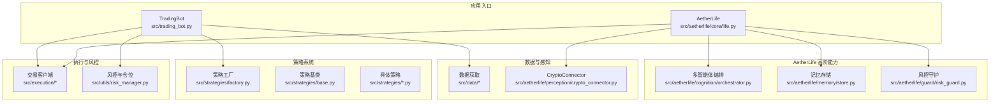
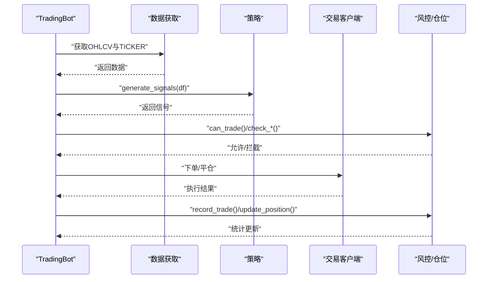
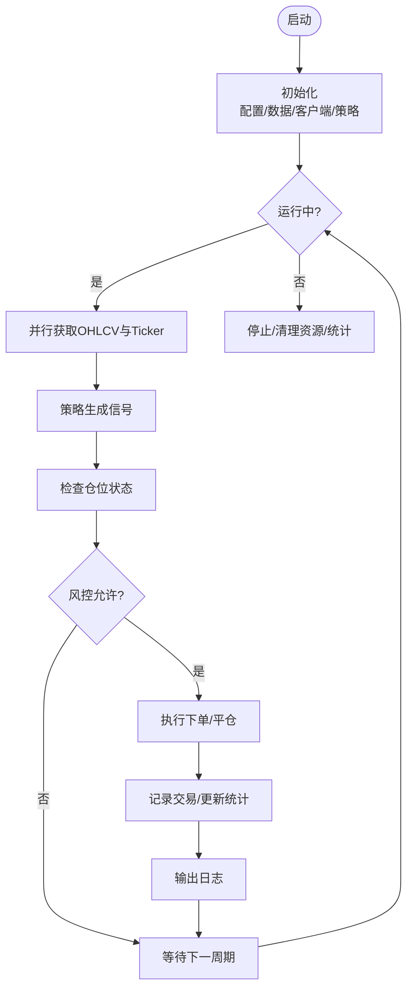
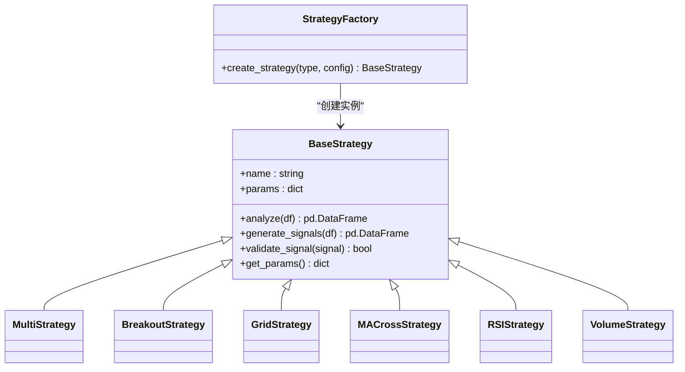
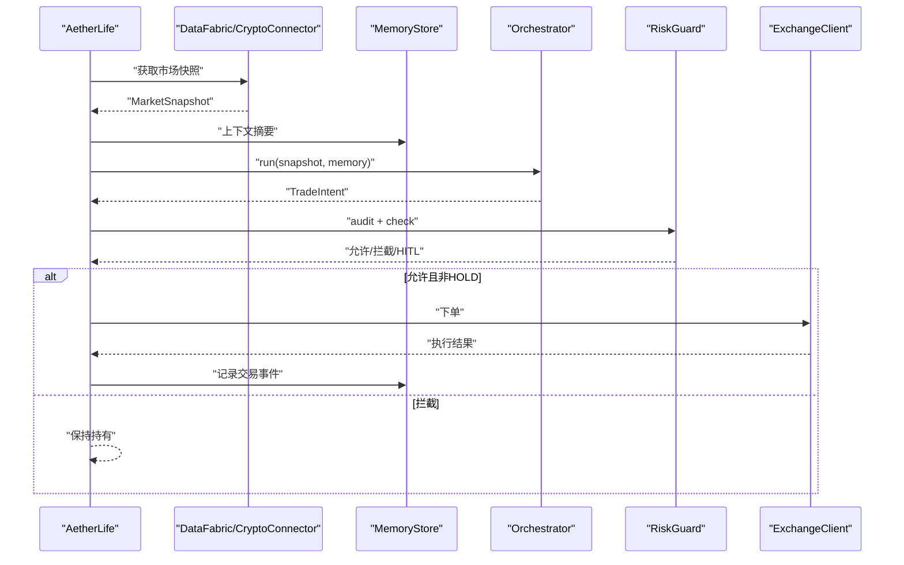
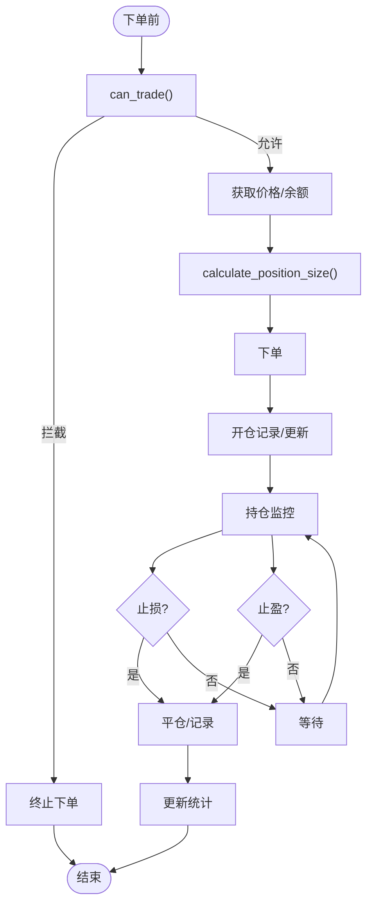
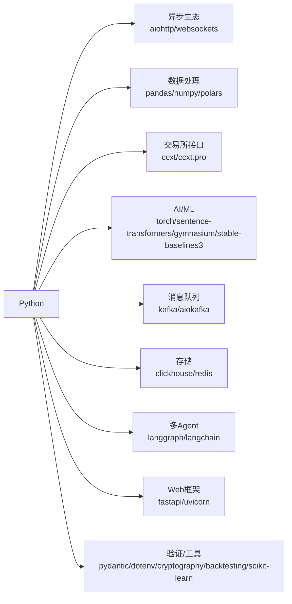

# 项目概述

<cite>
**本文引用的文件**
- [src/trading_bot.py](file://src/trading_bot.py)
- [configs/config.json](file://configs/config.json)
- [requirements.txt](file://requirements.txt)
- [src/aetherlife/core/life.py](file://src/aetherlife/core/life.py)
- [src/aetherlife/cognition/orchestrator.py](file://src/aetherlife/cognition/orchestrator.py)
- [src/aetherlife/perception/crypto_connector.py](file://src/aetherlife/perception/crypto_connector.py)
- [src/aetherlife/memory/store.py](file://src/aetherlife/memory/store.py)
- [src/aetherlife/guard/risk_guard.py](file://src/aetherlife/guard/risk_guard.py)
- [src/strategies/base.py](file://src/strategies/base.py)
- [src/strategies/factory.py](file://src/strategies/factory.py)
- [src/utils/risk_manager.py](file://src/utils/risk_manager.py)
</cite>

## 目录
1. [简介](#简介)
2. [项目结构](#项目结构)
3. [核心组件](#核心组件)
4. [架构总览](#架构总览)
5. [详细组件分析](#详细组件分析)
6. [依赖关系分析](#依赖关系分析)
7. [性能考虑](#性能考虑)
8. [故障排查指南](#故障排查指南)
9. [结论](#结论)
10. [附录](#附录)

## 简介
本项目是一个面向合约市场的量化交易机器人系统，具备以下核心目标与特性：
- 自动化合约交易：通过异步数据采集、策略分析与执行闭环实现自动下单与风控。
- 多策略系统：内置多种经典策略（突破、网格、均线交叉、RSI、成交量），并支持多策略组合与工厂化创建。
- AI增强决策：在“以太生命体”（AetherLife）分层架构下，引入多智能体认知、辩论与记忆审计，结合风控守护与强化学习能力，形成可演化的智能交易实体。
- 技术栈覆盖：Python 异步生态（aiohttp、websockets）、高性能数据处理（pandas、polars）、AI/ML（sentence-transformers、torch、gymnasium、stable-baselines3）、消息队列（kafka/aiokafka）、时序数据库（ClickHouse）、缓存与向量存储（Redis）、多Agent框架（langgraph/langchain）。

业务价值与应用场景：
- 降低人工干预，提升交易效率与一致性；
- 通过多策略与AI增强，提高在不同市场环境下的适应性；
- 以风控为核心，保障资金安全与合规运营；
- 为后续强化学习与策略自进化奠定基础。

## 项目结构
项目采用模块化分层组织，围绕“数据 → 策略 → 执行 → 风控”的主线，同时在更高阶的“以太生命体”架构中引入感知、记忆、认知、守护与进化能力。

图表来源
- [src/trading_bot.py](file://src/trading_bot.py#L27-L298)
- [src/aetherlife/core/life.py](file://src/aetherlife/core/life.py#L20-L164)
- [src/aetherlife/perception/crypto_connector.py](file://src/aetherlife/perception/crypto_connector.py#L23-L370)
- [src/aetherlife/cognition/orchestrator.py](file://src/aetherlife/cognition/orchestrator.py#L16-L93)
- [src/aetherlife/memory/store.py](file://src/aetherlife/memory/store.py#L43-L155)
- [src/aetherlife/guard/risk_guard.py](file://src/aetherlife/guard/risk_guard.py#L23-L84)
- [src/strategies/factory.py](file://src/strategies/factory.py#L10-L36)
- [src/utils/risk_manager.py](file://src/utils/risk_manager.py#L12-L388)

章节来源
- [src/trading_bot.py](file://src/trading_bot.py#L1-L346)
- [src/aetherlife/core/life.py](file://src/aetherlife/core/life.py#L1-L164)

## 核心组件
- 交易机器人（TradingBot）
  - 负责初始化、数据拉取、策略分析、信号执行、仓位与风控检查、日志与统计。
  - 支持多交易对、多时间周期、杠杆参数与循环间隔配置。
- 策略系统
  - 策略基类定义统一接口；工厂负责创建具体策略，支持多策略组合。
  - 内置策略类型：突破、网格、均线交叉、RSI、成交量、多策略组合。
- 执行与风控
  - 交易客户端封装交易所API；风控模块负责仓位、止损止盈、熔断与日限。
  - 仓位管理器跟踪开仓、平仓、浮动盈亏与历史记录。
- AetherLife 分层架构
  - 感知：统一的加密货币连接器（WebSocket）与市场快照。
  - 记忆：短期事件与决策记录，支持可选 Redis 持久化。
  - 认知：多智能体编排与可选辩论（多Agent聚合/裁决）。
  - 守护：电路断路器、日限与大额人工确认（HITL）。
  - 进化：每日策略自进化引擎（预留）。

章节来源
- [src/trading_bot.py](file://src/trading_bot.py#L27-L298)
- [src/strategies/base.py](file://src/strategies/base.py#L6-L31)
- [src/strategies/factory.py](file://src/strategies/factory.py#L10-L36)
- [src/utils/risk_manager.py](file://src/utils/risk_manager.py#L12-L388)
- [src/aetherlife/core/life.py](file://src/aetherlife/core/life.py#L20-L164)
- [src/aetherlife/perception/crypto_connector.py](file://src/aetherlife/perception/crypto_connector.py#L23-L370)
- [src/aetherlife/memory/store.py](file://src/aetherlife/memory/store.py#L43-L155)
- [src/aetherlife/cognition/orchestrator.py](file://src/aetherlife/cognition/orchestrator.py#L16-L93)
- [src/aetherlife/guard/risk_guard.py](file://src/aetherlife/guard/risk_guard.py#L23-L84)

## 架构总览
系统分为两条主线：
- 快速可用主线（TradingBot）：面向合约交易的“数据-策略-执行-风控”闭环。
- AetherLife 高阶主线：在感知、记忆、认知、守护、执行之外，增加“进化”能力，形成可自我迭代的智能体。

图表来源
- [src/trading_bot.py](file://src/trading_bot.py#L92-L205)
- [src/utils/risk_manager.py](file://src/utils/risk_manager.py#L175-L241)

章节来源
- [src/trading_bot.py](file://src/trading_bot.py#L256-L297)

## 详细组件分析

### TradingBot：交易主循环与执行链路
- 初始化阶段：校验配置、创建数据获取器、交易客户端与策略实例。
- 主循环：并行获取OHLCV与Ticker，分析生成信号，检查仓位与风控，执行下单或平仓，输出日志与统计。
- 风控集成：在下单前进行风控拦截与熔断检查，平仓后记录交易并更新统计。

图表来源
- [src/trading_bot.py](file://src/trading_bot.py#L63-L297)

章节来源
- [src/trading_bot.py](file://src/trading_bot.py#L27-L298)

### 策略系统：基类、工厂与多策略组合
- BaseStrategy：定义 analyze 与 generate_signals 接口，便于扩展新策略。
- Factory：根据配置动态创建策略实例，支持多策略组合（MultiStrategy）。

图表来源
- [src/strategies/base.py](file://src/strategies/base.py#L6-L31)
- [src/strategies/factory.py](file://src/strategies/factory.py#L10-L36)

章节来源
- [src/strategies/base.py](file://src/strategies/base.py#L6-L31)
- [src/strategies/factory.py](file://src/strategies/factory.py#L10-L36)

### AetherLife：多智能体认知与守护
- Orchestrator：可选辩论（多Agent并行→裁决）或并行聚合，最终经风控守卫审核。
- MemoryStore：短期事件与决策记录，支持可选 Redis 持久化，提供 LLM 上下文摘要。
- RiskGuard：电路断路器、日限与大额人工确认（HITL）。
- Core Life：单周期感知→认知→决策→审计→守护→执行（可选），并支持每日进化。

图表来源
- [src/aetherlife/core/life.py](file://src/aetherlife/core/life.py#L59-L149)
- [src/aetherlife/cognition/orchestrator.py](file://src/aetherlife/cognition/orchestrator.py#L38-L53)
- [src/aetherlife/memory/store.py](file://src/aetherlife/memory/store.py#L134-L145)
- [src/aetherlife/guard/risk_guard.py](file://src/aetherlife/guard/risk_guard.py#L48-L68)
- [src/aetherlife/perception/crypto_connector.py](file://src/aetherlife/perception/crypto_connector.py#L278-L329)

章节来源
- [src/aetherlife/core/life.py](file://src/aetherlife/core/life.py#L20-L164)
- [src/aetherlife/cognition/orchestrator.py](file://src/aetherlife/cognition/orchestrator.py#L16-L93)
- [src/aetherlife/memory/store.py](file://src/aetherlife/memory/store.py#L43-L155)
- [src/aetherlife/guard/risk_guard.py](file://src/aetherlife/guard/risk_guard.py#L23-L84)
- [src/aetherlife/perception/crypto_connector.py](file://src/aetherlife/perception/crypto_connector.py#L23-L370)

### 风控与仓位管理：位置、止损止盈与熔断
- RiskManager：计算仓位、检查止损/止盈/追踪止损、熔断与日限、记录交易并统计。
- PositionManager：开仓、平仓、更新浮动盈亏、查询与管理仓位。

图表来源
- [src/utils/risk_manager.py](file://src/utils/risk_manager.py#L175-L241)
- [src/utils/risk_manager.py](file://src/utils/risk_manager.py#L62-L127)
- [src/utils/risk_manager.py](file://src/utils/risk_manager.py#L244-L339)

章节来源
- [src/utils/risk_manager.py](file://src/utils/risk_manager.py#L12-L388)

## 依赖关系分析
- Python 异步：aiohttp、websockets 提供网络与WebSocket支持。
- 数据处理：pandas、numpy、polars 用于高性能数据处理。
- 交易所与行情：ccxt（含ccxt.pro）提供统一WebSocket与REST接口。
- AI/ML：sentence-transformers、torch、gymnasium、stable-baselines3 支持向量化与强化学习。
- 消息与存储：kafka-python/aiokafka、clickhouse-driver、redis[hiredis]。
- 多Agent：langgraph、langchain、langchain-community。
- Web框架：fastapi、uvicorn。
- 验证与工具：pydantic、python-dotenv、cryptography、backtracking、scikit-learn。

图表来源
- [requirements.txt](file://requirements.txt#L1-L70)

章节来源
- [requirements.txt](file://requirements.txt#L1-L70)

## 性能考虑
- 异步并行：数据获取与策略分析采用 asyncio.gather 并行执行，缩短主循环周期。
- 低延迟数据源：优先使用 ccxt.pro WebSocket 订阅 Ticker/OrderBook/Trades，减少轮询开销。
- 高效数据结构：使用 polars/pandas 进行向量化计算，策略输出信号列驱动执行。
- 缓存与持久化：Redis 作为短期事件与决策的高速缓存，必要时持久化至 ClickHouse。
- 风控前置：在下单前进行风控检查，避免无效请求与潜在损失。
- 可扩展性：策略工厂与多Agent编排支持按需扩展与组合，便于A/B测试与自进化。

## 故障排查指南
- 配置校验失败
  - 现象：初始化时报错，提示配置校验失败。
  - 排查：检查配置文件键值、交易所与测试网设置、API密钥与风险参数。
  - 参考：[src/trading_bot.py](file://src/trading_bot.py#L65-L69)
- WebSocket连接异常
  - 现象：Ticker/OrderBook/Trades订阅失败或断连。
  - 排查：确认 ccxt.pro 安装、网络连通性、测试网URL配置、API密钥权限。
  - 参考：[src/aetherlife/perception/crypto_connector.py](file://src/aetherlife/perception/crypto_connector.py#L50-L85)
- 下单失败或数量为0
  - 现象：下单返回失败或计算仓位为0。
  - 排查：检查价格有效性、账户余额、最小下单量、精度与风控限制。
  - 参考：[src/trading_bot.py](file://src/trading_bot.py#L134-L142)
- 触发风控/熔断
  - 现象：系统暂停交易或拦截大额下单。
  - 排查：查看日亏损比例、日交易次数、连续亏损次数与熔断冷却。
  - 参考：[src/utils/risk_manager.py](file://src/utils/risk_manager.py#L175-L194)
- 多Agent决策冲突
  - 现象：辩论或聚合后仍出现分歧。
  - 排查：调整权重、开启/关闭辩论模式、检查记忆上下文与LLM摘要。
  - 参考：[src/aetherlife/cognition/orchestrator.py](file://src/aetherlife/cognition/orchestrator.py#L45-L53)

章节来源
- [src/trading_bot.py](file://src/trading_bot.py#L63-L297)
- [src/aetherlife/perception/crypto_connector.py](file://src/aetherlife/perception/crypto_connector.py#L50-L85)
- [src/utils/risk_manager.py](file://src/utils/risk_manager.py#L175-L241)
- [src/aetherlife/cognition/orchestrator.py](file://src/aetherlife/cognition/orchestrator.py#L45-L53)

## 结论
本项目以“快速可用 + AI增强”双线并行的方式，构建了可扩展、可演化的量化交易系统。TradingBot 提供稳定高效的自动化交易闭环，AetherLife 则在感知、记忆、认知、守护与进化层面引入高级AI能力，为未来强化学习与策略自进化打下坚实基础。通过完善的风控体系与多Agent协作，系统能够在复杂市场环境中稳健运行并持续优化。

## 附录

### 快速开始指南
- 安装依赖
  - 使用提供的依赖清单安装所需包。
  - 参考：[requirements.txt](file://requirements.txt#L1-L70)
- 准备配置
  - 在配置文件中设置交易所、测试网、交易对、时间周期、策略与风控参数。
  - 参考：[configs/config.json](file://configs/config.json#L1-L28)
- 运行交易机器人
  - 启动主程序，系统将加载配置、初始化各模块并进入主循环。
  - 参考：[src/trading_bot.py](file://src/trading_bot.py#L323-L346)
- 运行 AetherLife
  - 启动以太生命体主循环，系统将按周期执行感知-认知-决策-审计-守护-执行。
  - 参考：[src/aetherlife/core/life.py](file://src/aetherlife/core/life.py#L123-L149)