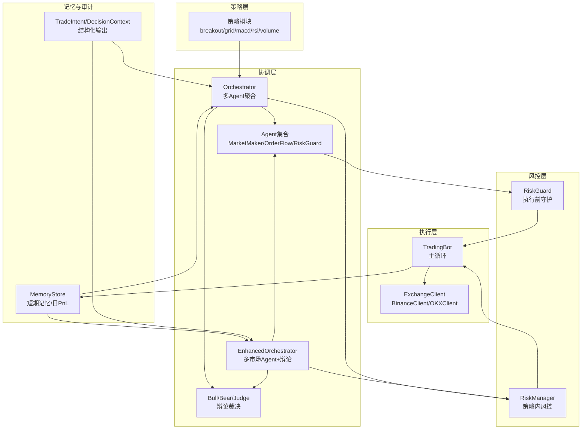
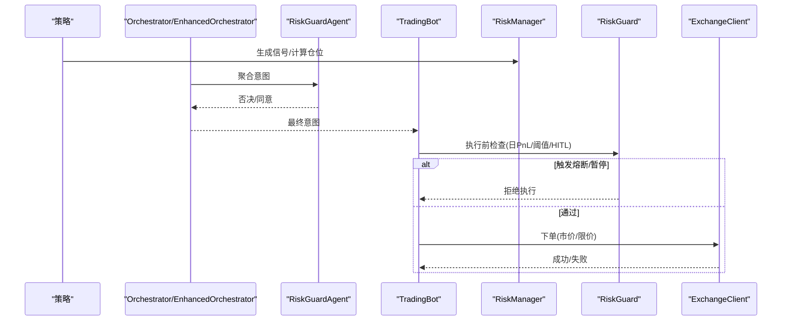
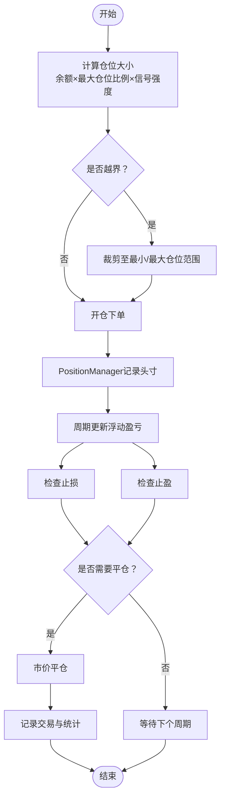
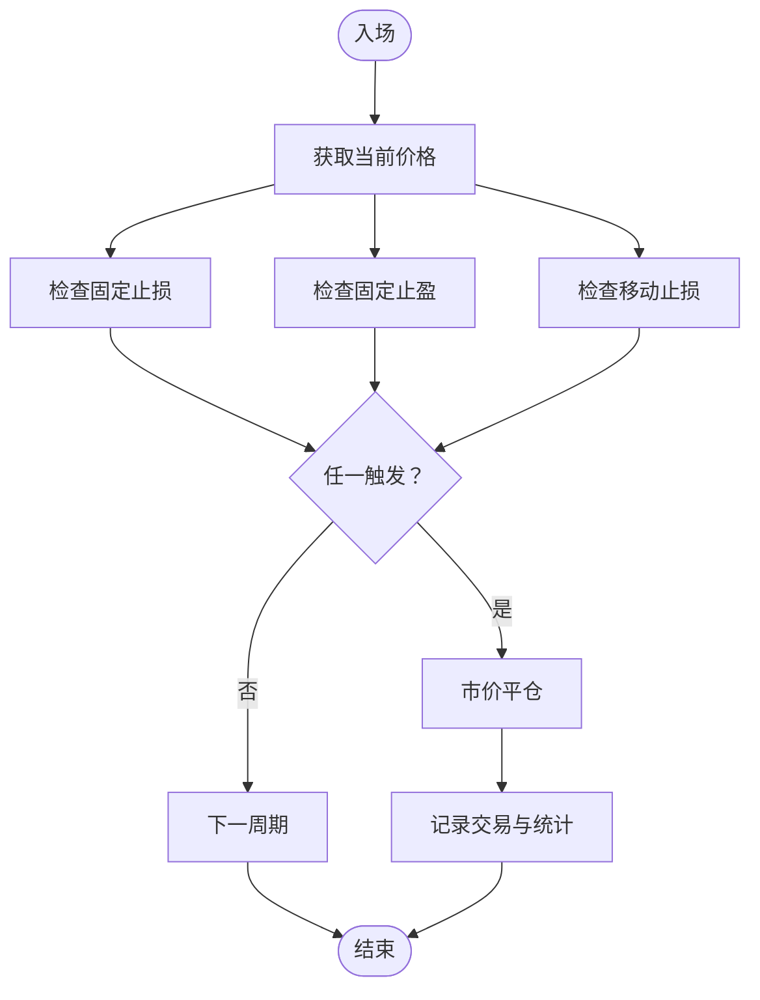
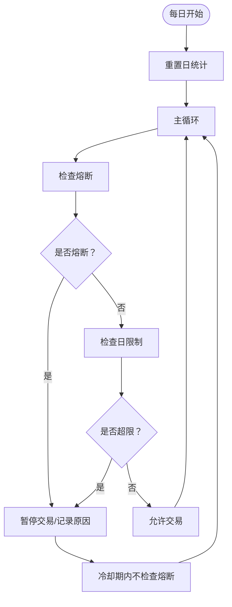
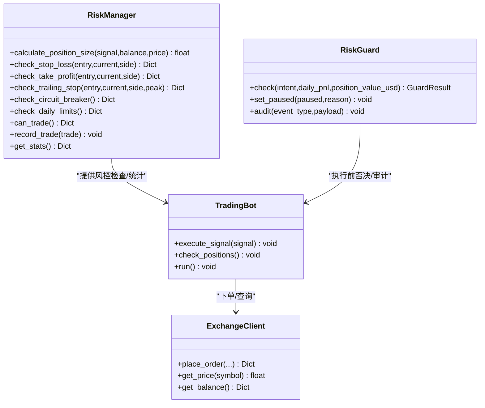
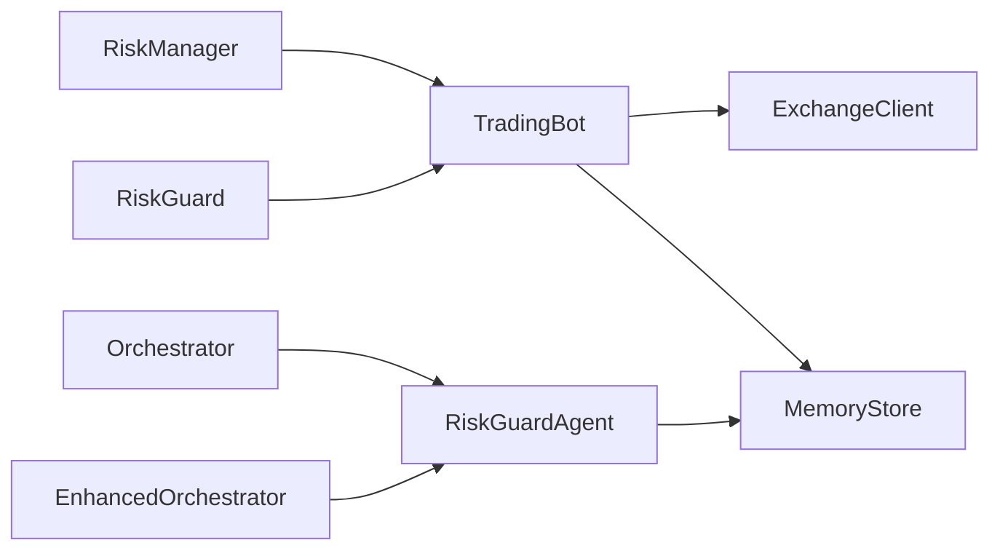

# 风险管理系统

<cite>
**本文引用的文件**
- [src/utils/risk_manager.py](file://src/utils/risk_manager.py)
- [src/aetherlife/guard/risk_guard.py](file://src/aetherlife/guard/risk_guard.py)
- [src/aetherlife/cognition/orchestrator.py](file://src/aetherlife/cognition/orchestrator.py)
- [src/aetherlife/cognition/orchestrator_enhanced.py](file://src/aetherlife/cognition/orchestrator_enhanced.py)
- [src/aetherlife/cognition/agents.py](file://src/aetherlife/cognition/agents.py)
- [src/aetherlife/cognition/debate.py](file://src/aetherlife/cognition/debate.py)
- [src/aetherlife/cognition/schemas.py](file://src/aetherlife/cognition/schemas.py)
- [src/aetherlife/memory/store.py](file://src/aetherlife/memory/store.py)
- [src/trading_bot.py](file://src/trading_bot.py)
- [configs/config.json](file://configs/config.json)
- [src/execution/exchange_client.py](file://src/execution/exchange_client.py)
</cite>

## 目录
1. [引言](#引言)
2. [项目结构](#项目结构)
3. [核心组件](#核心组件)
4. [架构总览](#架构总览)
5. [详细组件分析](#详细组件分析)
6. [依赖关系分析](#依赖关系分析)
7. [性能考量](#性能考量)
8. [故障排查指南](#故障排查指南)
9. [结论](#结论)
10. [附录](#附录)

## 引言
本文件面向量化交易系统的风险管理系统，系统采用“策略-风控-执行”三层架构，结合多层次风险控制与实时监控，确保在高频交易场景下的安全与稳健。风控体系覆盖仓位控制、止损止盈、熔断与日交易限制，并提供与交易策略的集成与优先级处理机制，便于开发者进行扩展与定制。

## 项目结构
系统围绕“策略层、风控层、执行层、记忆与审计层”组织代码，关键文件分布如下：
- 风控层：RiskManager（策略内风控）、RiskGuard（执行前守护）
- 协调层：Orchestrator/EnhancedOrchestrator（多智能体聚合与风控否决）
- 执行层：ExchangeClient（交易所对接）、TradingBot（主循环与风控集成）
- 记忆与审计：MemoryStore（短期记忆与日度PnL）

图表来源
- [src/aetherlife/cognition/orchestrator.py](file://src/aetherlife/cognition/orchestrator.py#L16-L93)
- [src/aetherlife/cognition/orchestrator_enhanced.py](file://src/aetherlife/cognition/orchestrator_enhanced.py#L21-L323)
- [src/aetherlife/cognition/agents.py](file://src/aetherlife/cognition/agents.py#L13-L109)
- [src/aetherlife/cognition/debate.py](file://src/aetherlife/cognition/debate.py#L15-L100)
- [src/aetherlife/cognition/schemas.py](file://src/aetherlife/cognition/schemas.py#L32-L125)
- [src/utils/risk_manager.py](file://src/utils/risk_manager.py#L12-L388)
- [src/aetherlife/guard/risk_guard.py](file://src/aetherlife/guard/risk_guard.py#L23-L84)
- [src/trading_bot.py](file://src/trading_bot.py#L27-L346)
- [src/execution/exchange_client.py](file://src/execution/exchange_client.py#L20-L432)
- [src/aetherlife/memory/store.py](file://src/aetherlife/memory/store.py#L43-L155)

章节来源
- [src/aetherlife/cognition/orchestrator.py](file://src/aetherlife/cognition/orchestrator.py#L16-L93)
- [src/aetherlife/cognition/orchestrator_enhanced.py](file://src/aetherlife/cognition/orchestrator_enhanced.py#L21-L323)
- [src/aetherlife/cognition/agents.py](file://src/aetherlife/cognition/agents.py#L13-L109)
- [src/aetherlife/cognition/debate.py](file://src/aetherlife/cognition/debate.py#L15-L100)
- [src/aetherlife/cognition/schemas.py](file://src/aetherlife/cognition/schemas.py#L32-L125)
- [src/utils/risk_manager.py](file://src/utils/risk_manager.py#L12-L388)
- [src/aetherlife/guard/risk_guard.py](file://src/aetherlife/guard/risk_guard.py#L23-L84)
- [src/trading_bot.py](file://src/trading_bot.py#L27-L346)
- [src/execution/exchange_client.py](file://src/execution/exchange_client.py#L20-L432)
- [src/aetherlife/memory/store.py](file://src/aetherlife/memory/store.py#L43-L155)

## 核心组件
- RiskManager（策略内风控）：负责仓位计算、止损止盈检查、熔断与日交易限制、统计与暂停/恢复。
- RiskGuard（执行前守护）：基于日度PnL与阈值进行一票否决，支持暂停与审计。
- Orchestrator/EnhancedOrchestrator：多Agent并行或辩论裁决，聚合后由风控Agent进行否决判断。
- TradingBot：主循环，串联数据、策略、风控与执行，周期性检查仓位与风控条件。
- MemoryStore：短期记忆与日PnL提供，支撑风控否决与审计。

章节来源
- [src/utils/risk_manager.py](file://src/utils/risk_manager.py#L12-L388)
- [src/aetherlife/guard/risk_guard.py](file://src/aetherlife/guard/risk_guard.py#L23-L84)
- [src/aetherlife/cognition/orchestrator.py](file://src/aetherlife/cognition/orchestrator.py#L16-L93)
- [src/aetherlife/cognition/orchestrator_enhanced.py](file://src/aetherlife/cognition/orchestrator_enhanced.py#L21-L323)
- [src/aetherlife/cognition/agents.py](file://src/aetherlife/cognition/agents.py#L50-L69)
- [src/trading_bot.py](file://src/trading_bot.py#L27-L346)
- [src/aetherlife/memory/store.py](file://src/aetherlife/memory/store.py#L43-L155)

## 架构总览
系统采用“策略-风控-执行”分层，风控贯穿策略生成信号与执行下单两个阶段：
- 策略阶段：RiskManager提供仓位计算与基础风控检查（熔断、日限制）。
- 协调阶段：Orchestrator/EnhancedOrchestrator聚合多Agent决策，RiskGuard对意图进行否决。
- 执行阶段：RiskGuard进一步拦截高风险意图，TradingBot在下单前再次校验。

图表来源
- [src/aetherlife/cognition/orchestrator.py](file://src/aetherlife/cognition/orchestrator.py#L38-L53)
- [src/aetherlife/cognition/orchestrator_enhanced.py](file://src/aetherlife/cognition/orchestrator_enhanced.py#L84-L151)
- [src/aetherlife/cognition/agents.py](file://src/aetherlife/cognition/agents.py#L50-L69)
- [src/aetherlife/guard/risk_guard.py](file://src/aetherlife/guard/risk_guard.py#L48-L68)
- [src/trading_bot.py](file://src/trading_bot.py#L115-L205)
- [src/execution/exchange_client.py](file://src/execution/exchange_client.py#L226-L275)

## 详细组件分析

### 仓位控制机制
- 最大仓位限制：RiskManager依据账户余额与最大仓位比例计算单笔最大头寸，同时考虑最小/最大仓位边界。
- 动态调整：PositionManager维护当前头寸，支持开仓、更新浮动盈亏、设置止损止盈、平仓。
- 风险敞口管理：通过杠杆设置与头寸规模控制整体风险暴露；执行层在下单时应用交易所精度与步进约束。

图表来源
- [src/utils/risk_manager.py](file://src/utils/risk_manager.py#L62-L71)
- [src/utils/risk_manager.py](file://src/utils/risk_manager.py#L244-L339)
- [src/trading_bot.py](file://src/trading_bot.py#L115-L205)
- [src/execution/exchange_client.py](file://src/execution/exchange_client.py#L226-L275)

章节来源
- [src/utils/risk_manager.py](file://src/utils/risk_manager.py#L12-L388)
- [src/utils/risk_manager.py](file://src/utils/risk_manager.py#L244-L339)
- [src/trading_bot.py](file://src/trading_bot.py#L115-L205)
- [src/execution/exchange_client.py](file://src/execution/exchange_client.py#L226-L275)

### 止损止盈系统
- 固定止损/止盈：按入场价与方向计算收益/损失百分比，达到阈值即触发。
- 移动止损：以“峰值回撤”或“跟踪线”形式实现，仅在盈利超过一定阈值后启动。
- 触发逻辑：TradingBot在每个周期读取当前价格，调用RiskManager检查并决定是否平仓。

图表来源
- [src/utils/risk_manager.py](file://src/utils/risk_manager.py#L73-L127)
- [src/trading_bot.py](file://src/trading_bot.py#L206-L254)

章节来源
- [src/utils/risk_manager.py](file://src/utils/risk_manager.py#L73-L127)
- [src/trading_bot.py](file://src/trading_bot.py#L206-L254)

### 熔断机制与日交易限制
- 熔断：当日度PnL百分比回撤超过设定阈值，系统进入冷却期并暂停交易，冷却时间可配置。
- 日交易限制：限制单日交易次数与连续亏损次数，超过阈值暂停交易。
- 触发与恢复：RiskManager内部状态记录日统计与暂停原因，支持手动resume恢复。

图表来源
- [src/utils/risk_manager.py](file://src/utils/risk_manager.py#L53-L61)
- [src/utils/risk_manager.py](file://src/utils/risk_manager.py#L129-L153)
- [src/utils/risk_manager.py](file://src/utils/risk_manager.py#L155-L173)
- [src/utils/risk_manager.py](file://src/utils/risk_manager.py#L217-L226)

章节来源
- [src/utils/risk_manager.py](file://src/utils/risk_manager.py#L129-L173)
- [src/utils/risk_manager.py](file://src/utils/risk_manager.py#L217-L226)

### 风控参数配置与调优
- 配置项（RiskManager）：最大仓位比例、最大杠杆、最小/最大仓位、止损止盈阈值、日交易上限、连续亏损上限、熔断阈值与冷却时间。
- 配置项（RiskGuard）：熔断阈值、单日最大亏损、HITL开关与阈值、审计回调与日志路径。
- 配置来源：默认配置与用户配置合并，策略配置与风险配置分离。

章节来源
- [src/utils/risk_manager.py](file://src/utils/risk_manager.py#L15-L34)
- [src/aetherlife/guard/risk_guard.py](file://src/aetherlife/guard/risk_guard.py#L26-L42)
- [configs/config.json](file://configs/config.json#L15-L20)
- [src/trading_bot.py](file://src/trading_bot.py#L299-L320)

### 与交易策略的集成与优先级
- 策略侧：RiskManager在生成信号后计算仓位并进行基础风控检查（熔断/日限制）。
- 协调侧：Orchestrator/EnhancedOrchestrator聚合多Agent决策，RiskGuardAgent对意图进行否决（如日PnL过低、置信度过低）。
- 执行侧：RiskGuard在下单前再次检查（熔断、暂停、HITL），TradingBot在下单前后记录交易与统计。

图表来源
- [src/utils/risk_manager.py](file://src/utils/risk_manager.py#L12-L388)
- [src/aetherlife/guard/risk_guard.py](file://src/aetherlife/guard/risk_guard.py#L23-L84)
- [src/trading_bot.py](file://src/trading_bot.py#L115-L205)
- [src/execution/exchange_client.py](file://src/execution/exchange_client.py#L226-L275)

章节来源
- [src/aetherlife/cognition/orchestrator.py](file://src/aetherlife/cognition/orchestrator.py#L38-L53)
- [src/aetherlife/cognition/orchestrator_enhanced.py](file://src/aetherlife/cognition/orchestrator_enhanced.py#L84-L151)
- [src/aetherlife/cognition/agents.py](file://src/aetherlife/cognition/agents.py#L50-L69)
- [src/aetherlife/memory/store.py](file://src/aetherlife/memory/store.py#L140-L145)

### 风险指标监控与审计
- 日度PnL与统计：MemoryStore提供当日PnL汇总，供风控否决与UI展示。
- 审计日志：RiskGuard支持日志器输出、文件落盘与异步回调，便于合规与回溯。
- UI雷达图：仪表盘提供波动、流动性、点差、情绪、动量等维度的可视化（概念示意）。

章节来源
- [src/aetherlife/memory/store.py](file://src/aetherlife/memory/store.py#L140-L145)
- [src/aetherlife/guard/risk_guard.py](file://src/aetherlife/guard/risk_guard.py#L70-L84)
- [src/ui/dashboard_ultra.py](file://src/ui/dashboard_ultra.py#L303-L334)

## 依赖关系分析
- 组件耦合：
  - RiskManager与TradingBot强耦合（风控检查与下单流程）。
  - RiskGuard与TradingBot弱耦合（执行前拦截）。
  - Orchestrator/EnhancedOrchestrator与RiskGuardAgent弱耦合（否决逻辑）。
- 外部依赖：
  - 交易所API（BinanceClient/OKXClient）提供价格、下单、杠杆设置等能力。
  - MemoryStore提供短期记忆与日PnL，支撑风控与审计。

图表来源
- [src/utils/risk_manager.py](file://src/utils/risk_manager.py#L12-L388)
- [src/aetherlife/guard/risk_guard.py](file://src/aetherlife/guard/risk_guard.py#L23-L84)
- [src/aetherlife/cognition/orchestrator.py](file://src/aetherlife/cognition/orchestrator.py#L16-L93)
- [src/aetherlife/cognition/orchestrator_enhanced.py](file://src/aetherlife/cognition/orchestrator_enhanced.py#L21-L323)
- [src/aetherlife/cognition/agents.py](file://src/aetherlife/cognition/agents.py#L50-L69)
- [src/trading_bot.py](file://src/trading_bot.py#L27-L346)
- [src/execution/exchange_client.py](file://src/execution/exchange_client.py#L20-L432)
- [src/aetherlife/memory/store.py](file://src/aetherlife/memory/store.py#L43-L155)

章节来源
- [src/utils/risk_manager.py](file://src/utils/risk_manager.py#L12-L388)
- [src/aetherlife/guard/risk_guard.py](file://src/aetherlife/guard/risk_guard.py#L23-L84)
- [src/aetherlife/cognition/orchestrator.py](file://src/aetherlife/cognition/orchestrator.py#L16-L93)
- [src/aetherlife/cognition/orchestrator_enhanced.py](file://src/aetherlife/cognition/orchestrator_enhanced.py#L21-L323)
- [src/aetherlife/cognition/agents.py](file://src/aetherlife/cognition/agents.py#L50-L69)
- [src/trading_bot.py](file://src/trading_bot.py#L27-L346)
- [src/execution/exchange_client.py](file://src/execution/exchange_client.py#L20-L432)
- [src/aetherlife/memory/store.py](file://src/aetherlife/memory/store.py#L43-L155)

## 性能考量
- 并行执行：Orchestrator/EnhancedOrchestrator支持多Agent并行，降低决策延迟。
- 状态复用：RiskManager内部缓存日统计与暂停状态，减少重复计算。
- 精度与步进：执行层严格遵循交易所数量精度与步进，避免下单失败。
- I/O优化：MemoryStore短期队列与可选Redis持久化，平衡内存占用与可靠性。

## 故障排查指南
- 风控拦截：
  - 检查RiskManager返回的can_trade.reason与RiskGuard的check.reason。
  - 确认日PnL是否触发熔断阈值，或是否处于冷却期。
- 下单失败：
  - 核对ExchangeClient的错误码与返回消息，检查精度与步进是否正确。
  - 确认账户余额与可用资金是否充足。
- 审计与日志：
  - 检查RiskGuard审计日志文件路径与回调是否正常。
  - 在MemoryStore中核对当日PnL与交易事件。

章节来源
- [src/utils/risk_manager.py](file://src/utils/risk_manager.py#L175-L194)
- [src/aetherlife/guard/risk_guard.py](file://src/aetherlife/guard/risk_guard.py#L48-L68)
- [src/execution/exchange_client.py](file://src/execution/exchange_client.py#L165-L170)
- [src/aetherlife/memory/store.py](file://src/aetherlife/memory/store.py#L140-L145)

## 结论
该风险管理系统通过“策略内风控+执行前守护+多Agent协调”的组合，实现了多层次、可配置、可审计的风险控制。系统具备熔断、日交易限制、止损止盈与仓位控制等核心能力，并与交易策略与执行层紧密集成，适合在高频与复杂市场环境下稳定运行。开发者可基于现有接口扩展新的风控规则与监控指标。

## 附录
- 风控参数建议调优路径：
  - 从保守策略起步（较小max_position_pct、较严stop_loss_pct），逐步提高以提升收益。
  - 结合历史回测与压力测试，动态调整熔断阈值与冷却时间。
  - 对于高波动市场，适当收紧止损与止盈，增加移动止损的跟踪幅度。
- 风险控制扩展点：
  - 新增风控规则：在RiskManager中扩展检查函数并在TradingBot中调用。
  - 新增风控Agent：在Orchestrator/EnhancedOrchestrator中注册并参与否决。
  - 新增审计通道：在RiskGuard中扩展audit回调或文件落盘逻辑。